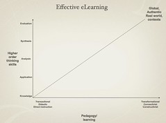

---
categories:
- eded20456
- teaching
date: 2011-03-31 10:06:48+10:00
next:
  text: '"Pedagogical Content Knowledge: Weeks 5/6"'
  url: /blog/2011/03/31/pedagogical-content-knowledge-weeks-56/
previous:
  text: The next step for the LMS?
  url: /blog/2011/03/31/the-next-step-for-the-lms/
title: '"Pedagogical Content Knowledge: Week 4"'
type: post
template: blog-post.html
---
So, only two weeks to catch up on this course.

### Curriculum frameworks

This week appears to focus primarily on the curriculum we'll be teaching to within the state of Queensland: Key Learning Areas (KLAs) and Essential Learnings. Some or much of which will change next year with the introduction of the Australian national curriculum.

#### Queensland Curriculum, Assessment and Reporting (QCAR) Framework

Aligning curriculum, assessment and reporting. Contain (amongst other things) essential learnings that incorporate national statements. Ahh, the problem of teachers "subverting" curriculum. Interesting language, not talented teachers adapting problematic curriculum.

[Queensland School Reform Longitudinal Study (QSRLS)](http://education.qld.gov.au/public_media/reports/curriculum-framework/qsrls/) study of what happens in courses: findings:

- alignment needed - most teachers did not see good assessment as integral to good classroomp ractice
- effective teachers assert much control and are willing to subvert curriculum learning to gaps
- Need for PD in assessment and moderation
- supportive classroom environment - done well, high frequency
- intellectual quality - ok in some, infrequent, low level
- recognition of difference - limited, done poorly
- relevance - infrequent, limited, done poorly
- efficient school management important, but school leaders must focus on curriculum and pedagogical leadership.

Literature futures, a government benchmark which is no longer easily discoverable online

- close correlation between socio-economic background and low achievement.
- Qld has 20% of Oz 0-15 years, but 49% of 0-15 in lowest decile of CSE
- Traditional intervention models not working for these students.

And now research by [Schmoker](http://mikeschmoker.com/index.html) ([2006](http://eric.ed.gov/ERICWebPortal/search/detailmini.jsp?_nfpb=true&_&ERICExtSearch_SearchValue_0=ED494304&ERICExtSearch_SearchType_0=no&accno=ED494304) I think). 1500 classrooms studied. Lots of "busy" work with no connection to syllabus, assessment, standards, poorly planned lessons, irrelevant worksheets, inequitable classroom practices, little assessment, no feedback.....But why is this? Is it simply that a class with lots of low SOE students is hard to teach and teachers in these contexts are deprived of support, creating a circle of poor practice?

A [post here](http://teachers.net/mentors/profreading/topic6332/2.09.11.12.28.35.html) talking about Schmoker's later work points out the importance of checking for understanding and a classroom with lots of advanced/authentic reading/writing. And suggests avoiding all fads.

QCAR and the four Cs: consistency, continuity, comparability of standards, creating space for deeper learning.

Five elements of QCAR

1. Essential learnings - what to teach.  
    Seen as an agreed core, not the whole curriculum. Common basis for planning. COvers KLAs and key juncture points - 3, 5, 7, 9.
    
    Three components:
    
    1. Learning and assessment focus.
    2. Ways of working.
    3. Knowledge and understanding.
2. Standards - common language to describe achievement  
    Link to the assessable elements within the Essential learnings for each KLA, in particular in the learning and assessment focus part.
3. Assessment bank - quality assessment and resources.
4. QCATs - Qld Comparable Assessment Tasks (4, 6, 9) - demonstrate what students know...and support consistency of teacher judgements.
5. Guidelines for reporting - consistency.

Intent is to ensure commonality in what is taught but diversity in how it is taught. Is big on the alignment between: what is taught (essential learnings), what is assessed (Assessment and QCATS), and what is reported (Standards and guidelines for reporting).

#### Descriptors of quality

Find it interesting that the standards are accompanied by the following table that sets out the appropriate words to use as descriptors of quality.

| A | B | C | D | E |
| --- | --- | --- | --- | --- |
| Comprehensive   Insightful   Proficient   Discerning   Well-reasoned   Clear   Perceptive   Controlled   Skilful   Accurate   Significant   Well-justified | Thorough   Thoughtful   Logical   Coherent   Effective   Logical   Purposeful   Informed   Accurate   Proficient | Satisfactory   Suitable   Competent   Relevant   Credible   Sound   Appropriate   Functional | Narrow   Variable   Disjointed   Superficial | Rudimentary   Minimal   Unclear   Cursory   Vague |

#### ICTs as cross-curricular

Oh dear, there are powerpoint slides that examine the ICT KLA, which is positioned as cross-curricula. A copy follows, I really dislike this sort of quasi-quantitative camouflaging of fuzzy, often incorrect ideas. I really dislike the automatic assumption that direct instruction cannot develop higher order skills.

### National curriculum

Of course the really interesting thing is that within a year or two all of the above might be somewhat less than important. Mainly due to the rise of the national curriculum.

