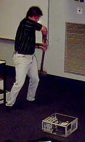

---
categories:
- coursesites
- elearning
date: 2011-04-01 12:17:41+10:00
next:
  text: Making and using an OPML feed of student blogs
  url: /blog2/2011/04/04/making-and-using-an-opml-feed-of-student-blogs/
previous:
  text: Two new laws for ERA/NAPLAN etc
  url: /blog2/2011/04/01/two-new-laws-for-eranaplan-etc/
title: Reflections on a 12 year-old course site - It would be harder now
type: post
template: blog-post.html
---
For a variety of reasons, mostly due to some current study, I've retrieved from the rubbish tip of history a [course website](http://dl.dropbox.com/u/14025788/85349/index.html) I helped design and teach back in 1999. What follows here are some reflections on what has and hasn't changed since 1999. At the end there is a bit of speculation that the current context within universities would make it harder to generate this type of course site.

### What's changed or not

#### Bleeding edge is now standard?

This course site was designed/implemented with a couple of unusual undergraduate project students. Unusual in the sense that they were mature age students starting their second careers. One of them had been a multimedia designer in their previous career. Which is why the look of the site is so unusual, it's based on the cover of the textbook.

The course design included:

- An [integrated study guide](http://dl.dropbox.com/u/14025788/85349/Resources/Study_Guide/index.html).
- [Online lectures](http://dl.dropbox.com/u/14025788/85349/Resources/Lectures/index.html).  
    These were mostly recorded from a previous offering or recorded before term for distance education students. The [on-campus lectures](http://dl.dropbox.com/u/14025788/85349/Resources/Face_to_Face_Lectures/index.html) were modified based on the availability of the online lectures (not necessarily a welcome move).
- [Animations](http://dl.dropbox.com/u/14025788/85349/Resources/Animations/index.html).  
    Produced to help distance education students "get" some of the complex dynamic concepts from the course.
- [Course barometer.](http://dl.dropbox.com/u/14025788/85349/Communication/Barometer/index.html)
- Use of a [concurrency programming environment](http://dl.dropbox.com/u/14025788/85349/Resources/BACI/index.html).

There weren't very many other course websites in 1999 within this institution, or elsewhere that approached this level of use of the web.

But since then universities have spent significantly greater funds on implementing "enterprise" level e-learning systems and process.. After all that money has been spent surely there must have been a significant increase in the number of course sites that are approaching what this course site did 12 years ago? Surely all that money has led to the development of systems and processes that actually automate, or at least significantly reduce the effort required to achieve, these tasks.

Well, let's look at the four courses I'm studying this year. Even if I focus on the fairly simple task of having a well-integrated electronic version of the study guide, none of my current courses match this 12 year-old course. Two of them have a [study guide page](http://dl.dropbox.com/u/14025788/85349/Resources/Study_Guide/index.html), but it remains separate from the study schedule. i.e. the [study schedule](http://dl.dropbox.com/u/14025788/85349/Schedule/index.html) doesn't have links to the appropriate PDF. The other two had used ad hoc approaches with either Word documents or Moodle HTML resources.

And that's without looking for good instructional design or attempts to modify standard practice to match the capabilities of the new technologies.

#### Barriers to sharing

This course was implemented using Webfuse, the system that formed the basis of [my thesis](/blog2/research/phd-thesis/). Webfuse course sites, including this one, were completely open by default. The only password protected area on this course site was the Staff section which we used to hare assignment solutions and discuss some issues. In addition, Webfuse was a web publishing system. i.e. it generated static web pages. Mainly to minimise load on under-strength servers.

Even with it producing unprotected web pages, it isn't a straight forward process to share/repurpose this course site. Webfuse had various assumptions that meant its web pages aren't straight web pages. In order to share this course site, I had to manually update the pages to make them usable outside of Webfuse.

I didn't complete this process on all of the pages in the course site. If you come across a page with broken images or a "This is a old course site" message, you've entered areas that haven't been fixed up.

Using a system, any system, reduces in someway the ease with which the content can be re-used. Even using standards limit reuse to contexts which support those standards.

Some of these course sites were once available via the [Wayback Machine](http://waybackmachine.org/), but at some stage in the last 5 years, the robots.txt file was changed on the server and this meant that the Wayback machine stopped making the sites available. An earlier iteration of this site is [available on the wayback machine](http://replay.waybackmachine.org/19980210233804/http://mc.cqu.edu.au/subjects/85349/index.html).

#### LMS enforced "quality through consistency"

This course site design would not be possible at the host institution, because it is now using Moodle. Moodle simply couldn't support this design.

Moodle (like most LMS) are generally used by institutions to achieve quality by making everything look the same. At a minimum the look and feel for this course, which connects directly to the textbook and looks okay (especially in 1999), would have to be sacrificed to fit within the ugly constraints of the institutional Moodle template.

While "quality through consistency" helps bring those from below up to some minimal standard, it also constrains those who want to move beyond back to some minimal standard. Let alone the question of responding to the diversity inherent in teaching.

Beyond that, a structure and interface that moves beyond just a study schedule would all have to be lost (or at least significantly modified) to fit within the constraints of Moodle.

As would the open nature of the course and the content. As implemented by the institution, the Moodle course site would be available only to students enrolled in the course. As a consequence the value of the course and its resources doesn't get known. A bit of a Google search can find a range of folk using the animations/lectures produced as part of this course: by [William Stallings](http://williamstallings.com/OS/Animation/Animations.html) one of the authors of the \*standard\* OS texts; [one of the lectures](http://www.edugrid.in/webfolder/OpSystems/1_IntroductionI/SC_Atlanta/Computer%20system%20structure.htm) not sure of this context; good recommendation of the animations [in the comments of this post](http://newitsc1405.blogspot.com/2006/02/readers-and-writers.html) etc.

#### External factors on teaching

If I were responsible for this course today, there is no chance in this era of [ERA](https://www.arc.gov.au/era/) that I would be investing the time necessary to implement a course like this.

#### Space, bandwidth and dropbox

Back in 1999 we were concerned with bandwidth. So, only audio for online lectures and we also produced a CD-ROM mirror of the website. The site is no longer available via the institution that offered the course for various reasons, including saving space.

The site is now hosted on my free dropbox account with which I get 2Gb. The site is about 300Mb in size.

And this is just one simple indication of just how much better the technology has gotten in 12 years. Not to mention how online learning has gone from a novelty to be feared to an expectation.

### Conclusions

If I had to teach this course today, in the current university context, I would be hamstrung by institutional e-learning policies and technologies as well as the focus on research. I would have to spend far more of my time trying to work-around limiting institutional factors, far more than I had to 12 years ago.

And that's despite online technology being more broadly available, widely accepted and of a significantly better quality than it was 12 years ago.

Now, it is possible to describe this course as an example of a ["lone ranger"/fred-in-the-shed](http://www.atypon-link.com/INT/doi/abs/10.1386/jots.3.3.251_1?cookieSet=1&journalCode=jots) doing his thing and an approach that doesn't fit well with institutional systems and approaches. But it is also fair to say (I think) that for the majority of courses, the institutional systems and approaches are failing to provide something approach a minimal acceptable standard (which is what they claim to do).

Lone ranger doing his thing 

