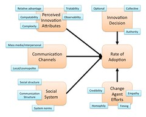

---
categories:
- eded20491
- elearning
- teaching
date: 2011-04-04 15:07:36+10:00
next:
  text: Building a collaborative CV09 podcast
  url: /blog/2011/04/06/building-a-collaborative-cv09-podcast/
previous:
  text: Making and using an OPML feed of student blogs
  url: /blog/2011/04/04/making-and-using-an-opml-feed-of-student-blogs/
title: How do you analyse and select an educational technology
type: post
template: blog-post.html
comments:
    []
    
pingbacks:
    - approved: '1'
      author: Selecting an Educational Technology
      author_email: null
      author_ip: 74.220.219.145
      author_url: http://www.edutechfan.com/2011/10/selecting-an-educational-technology/
      content: '[...] I was just reading a blog post on How do you analyse and select
        an educational technology. [...]'
      date: '2011-10-19 00:37:52'
      date_gmt: '2011-10-18 14:37:52'
      id: '43'
      parent: '0'
      type: pingback
      user_id: '0'
    
---
The ICTs for Learning Design course I'm taking has at least four weeks structured around looking at 4 different groups of technologies where each group is made up of multiple examples. For example, the first group is "Online spaces" and includes blogs, wikis and "websites" (e.g. [Weebly](http://weebly.com/)). We are meant to explore and experiment with these technologies and then select one to analyse. The analysis is intended to

> contextualise theoretical knowledge into individual teaching areas/subjects.

The examples of analyses given include [SWOT (strengths, weaknesses, opportunities and threats)](http://en.wikipedia.org/wiki/SWOT_analysis) and [PMI (plus, minus, interesting)](http://www.mindtools.com/pages/article/newTED_05.htm) analysis.

### A tweet-sourced insight on analysis

Last Friday, I was thinking about this assignment and it got me thinking. Given the huge number of online tools and services out there, how could I "rationally" analyse and select a tool that's right for my class. I tweeted the following

http://twitter.com/#!/djplaner/status/53698939962146816

I got a couple of responses from this

@marksmithers identified perhaps the most common analysis technique, I'll call it "Keeping up with the Joneses"

http://twitter.com/marksmithers/status/53700547710169089

@s\_palm identified this area as a hole

http://twitter.com/s\_palm/status/53744996171517952

And @sthcrft identified what I think most people use, and what I use in most cases

http://twitter.com/sthcrft/status/53699708375408640

I know this approach sounds like a bit of a joke, especially to the uber-"rationals" in IT departments, but it strikes me as the one we all use. We use our understandings of the technology and the task to evaluate how well there is a fit. The problem is that our understandings are universally accepted, the perspective of others will differ. So we have to have some sort of "rational" written down analysis to show we're being logical and objective.

### You can't analyse just the technology

It also highlights how you just can't analyse the technology. You need to know/specify the task. A wiki might be ok for one task and Google docs might be better for another.

### The problem with this analysis

For my situation, I'm analysing how well a technology is going to work in a high-school context, either IT or mathematics. One of the big problems I have is that I have no first-hand experience of that context. I don't really know the task, beyond assumptions and prejudices. Hence, any analysis, regardless of the rigour will be flawed. Any analysis I do know is going to be significantly different from one I'll perform in 6 months time.

### And here's one I prepared earlier

As it happens, I actually did [prepare one earlier](/blog/publications/a-model-for-evaluating-potential-web-based-education-innovations/) (Jones, Jamieson and Clark, 2003). It made such an impression, I only remembered it this morning.

Here's the abstract

> Due to the constantly evolving nature of Web-based Education (WBE) it is often difficult for educators to understand the issues, challenges, impact, and effort required to introduce WBE innovations. This lack of knowledge can contribute to the limited adoption and less than successful implementation of WBE innovations. This paper draws on an aspect of innovation diffusion theory to propose a model through which educators can evaluate potential WBE innovations. It is proposed that this model can aid educators increase their awareness of potential implementation issues, estimate the likelihood of reinvention, and predict the amount and type of effort required to achieve successful implementation of specific WBE innovations. The worth of the model is demonstrated by drawing on past experience.

The model is essentially a re-structure of some of the insights from Roger's diffusion theory. A slightly rejigged version is shown below. The basic idea is that if you evaluate the technology, the context and the problem within the ideas of diffusion theory you can get some idea of the types of problems you will get (e.g. an authority based decision in a social system which values freedom will lead to fairly rapid adoption with high levels of reinvention), some idea of how hard you have to work and what types of work to get adoption, and some suggestion of how fast adoption might be.

It was meant to be used in more of a sense-making role than plug in correct answers. It has some problems, not the least of which is some limitations or problems with Rogers' work as seen by some. For example, people do not form one-off pictures of technologies, they evolve over time.

That said, I found it a particular useful way of weighing up different technologies within a university context. A school setting will be a little different.

Will I use it? Might be overkill.

### References

Jones, D., Jamieson, K., & Clark, D. (2003). A model for evaluating potential Web-based education innovations. Hawaii International Conference on System Sciences (pp. 154-161). Hawaii: IEEE. Retrieved from /blog/publications/a-model-for-evaluating-potential-web-based-education-innovations/.