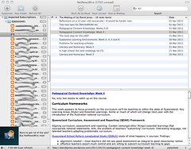
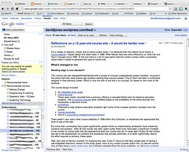

---
categories:
- eded20491
- teaching
date: 2011-04-04 11:00:56+10:00
next:
  text: How do you analyse and select an educational technology
  url: /blog/2011/04/04/how-do-you-analyse-and-select-an-educational-technology/
previous:
  text: Reflections on a 12 year-old course site - It would be harder now
  url: /blog/2011/04/01/reflections-on-a-12-year-old-course-site-it-would-be-harder-now/
title: Making and using an OPML feed of student blogs
type: post
template: blog-post.html
comments:
    - approved: '1'
      author: cloudpollen
      author_email: cloudpollen@gmail.com
      author_ip: 212.166.167.83
      author_url: http://www.cloudpollen.com
      content: I did something very similar with WordPress, I used the multi user functionality
        to create all the student blogs. They simply signed up which made it easier, then
        I gathered the feeds and displayed them all on one page, worked very well. 2 years
        later and its still going strong.
      date: '2011-04-04 17:06:21'
      date_gmt: '2011-04-04 07:06:21'
      id: '41'
      parent: '0'
      type: comment
      user_id: '0'
    - approved: '1'
      author: davidtjones
      author_email: davidthomjones@gmail.com
      author_ip: 138.77.2.133
      author_url: https://djon.es/blog/
      content: 'G''day Neil,
    
    
        I''m a Perl programmer from way back, so <a href="http://en.wikipedia.org/wiki/There''s_more_than_one_way_to_do_it"
        rel="nofollow">TIMTOWDI</a> is important to me.  Always good to see alternatives,
        sure there are many more.
    
    
        In my case, I couldn''t expect my fellow students sign up once again with their
        blogs.
    
    
        David.'
      date: '2011-04-05 09:42:13'
      date_gmt: '2011-04-04 23:42:13'
      id: '42'
      parent: '41'
      type: comment
      user_id: '1'
    
pingbacks:
    []
    
---
The ICTs for Learning Design course requires each student to create a blog. The blog is then a key part of the assessment, it's actually how we're meant to submit assignments. The public nature of the blogs has caused some concern, but we are now being encouraged to read and comment on our peer's blogs.

With the number of students approaching 100, this is not simple. Especially given that the main method of sharing blogs is via a Moodle wiki page. Most other students have used Blogger's/Blogspot's "follow" button (Blogger is the recommended platform), but I use Wordpress and like RSS/newsreaders. So the following documents the setting up of an OPML file with all the students' blogs and a brief bit about using it.

The plan is to let the other students in the course know about this and see if any make use of it. Given time constraints, the apparently novelty of RSS/newsreaders, and the fact that we're about to start our placements, I imagine uptake might be limited.

### What is this RSS/OPML thing and why?

The folk at [Commoncraft](http://www.commoncraft.com/rss_plain_english) have a good video that gives the idea of RSS. The Youtube version is embedded below

\[youtube=http://www.youtube.com/watch?v=0klgLsSxGsU\]

[OPML](http://en.wikipedia.org/wiki/OPML) is a way of gathering a large collection of feeds into one place. It's just a text file with a special format.

But when you import an OPML file into a news reader, you get a single place to observe and track what is going on. The following image shows the OPML file generated here imported into my news reader (a Mac application called [NetNewsWire](http://netnewswireapp.com/)). Click on the image to see it larger. The smudged areas represent where I've applied a bit of privacy to the blog URLs for other students.

I find this a useful way to keep track of who is posting what. I'm guessing that most of the other students in the course will probably use [Google reader](http://www.google.com/reader/view/) as their news reader.

So, now to generate the OPML file.

### Generate the OPML file

I could have generated the OPML file by hand, but that would have been painful. A quick Google and I found [OPML Builder](http://reader.feedshow.com/goodies/opml/OPMLBuilder-create-opml-from-rss-list.php). You give it a list of URLs for RSS feeds and it generates the OPML file for you.

So, the process was

- Copy and paste the student blog URLs from the Moodle Wiki.
- Remove all the extra content.
- Modify the blog URLs so they point to RSS/Atom feeds.
- Feed it into OPML Builder.

One of the blog URLs was password protected, so I've removed it from the final feed. I'll share a copy of the file on the course Moodle site.

Of course, if the course had been designed so that students used [BIM](/blog/research/bam-blog-aggregation-management/) to register their blogs, the academic staff could have just shared the OPML file that BIM generates.

### Use the OPML file

To use the OPML file you have to import it into your news reader. This means your newsreader will examine the OPML file, extract all the URLs for blog feeds, retrieve them and analyse them to see what's been posted. The results of that analysis shows up the news reader interface.

There [are some instructions](http://www.google.com/support/reader/bin/answer.py?hl=en&answer=69982) for importing an OPML file into Google reader. If I follow those instructions I get an image like the following.

### Further possibilities

Feeds provide a standardised way of sharing information. Using them simply to keep track of people posting to a bunch of different blogs is only a start to what can be done.

For example, Google reader allows people to share items they think are interesting in someway. The shared items are available, to some, as an RSS feed. One application of this would be for all the EDED20491 students to share all the posts (by other students) that they find interesting or good. A collection of all the students "shared" feeds could then be gathered. One way to see what is interesting.

The Google sharing also allows the adding of comments and tags, so explanations about why it is interesting or good etc could be added.

And that's only scratching the surface.