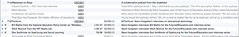

See also: [[blog-home | Home]]

Another task related to the ICTs for Learning Design assignment is in examining podcasts. Rather than access existing podcasts, I'm going to reuse an idea first generated for a "Web 2.0 course site" and which I've reused a couple of times in [MOOCs](http://mooc.ca/). The use of social-bookmarking and a feed aggregator to enable the creation of a collaborative podcast.

### The original task

The course is presenting various technologies and asking us to experiment with them and then analyse them in terms of use in our future learning and teaching. A part of the description from the course content is

> Search for podcasts that you believe are relevant to your teaching context. Analyse them in your blog, creating links. How will you use them for great learning?

### Going a bit further

Well, first of all constructivist learning theory is a heavy emphasis in this course. But, this one-way consumption of a podcast isn't as "constructivist" as it could be. We are expected to find an existing podcast and consume it and perhaps share it. We are being asked to "construct our understanding" about how we'd use podcasts in our practice, but we're not really being shown how podcasts could be used in a really [constructionist way](http://en.wikipedia.org/wiki/Constructionism_\(learning_theory\)). i.e. the learners creating their own podcast.

You can do this by recording your own episodes, but I think a more interesting approach is creating a podcast by having learners find interesting audio/video files on the Web and add them to the podcast. I think this takes a few steps further along the constructionist spectrum.

It also shows that the really interesting learning possibilities arise not from a single technology, but through innovative combinations or mashups of technology. This example is not in the same league as some of the cool stuff being done in [ds106](http://ds106.us/). It does, however, show that the real power in this technology stuff comes from the ability to be able to combine technologies in less than expected ways.

### The end product

The end product of all this is what I'm currently called the ["cv09podcast"](http://feeds.feedburner.com/gdlt). If you click on that link you should see a podcast you can subscribe to using your favourite tool (e.g. iTunes). The podcast is intended to include audio (and perhaps video) that is of interest to students in my universities Graduate Diploma in Learning and Teaching (GDLT). I've pre-populated it with a couple of audio presentations I think might be interesting.

The intent is that other students in the GDLT, or in fact anyone, can add audio/video to this podcast by using the following process.

### Contributing to the podcast

#### Pre-requisite

In order to contribute to the podcast you have to

1. Create a diigo account.  
    [Diigo](http://diigo.com/) is a social bookmarking tool (and a bit more). Essentially it is a way that many people can bookmark resources on the web and share them with lots of other people. The [Social Bookmarking in Plain English](http://www.commoncraft.com/bookmarking-plain-english) video gives a good overview of social bookmarking. They use del.icio.us as the bookmarking tool, but the idea is essentially the same with Diigo.
    
    Diigo is the tool you will use to add resources to the podcast.
    
2. Install a diigo tool in your browser.  
    For Diigo to work well, it helps to have a Diigo tool installed on your browser. This provides you with a "button" you can press when you are viewing a resource you want to bookmark. [The Diigo tools page](http://www.diigo.com/tools/) is the place to find the right tool for your browser.
3. Know the **cv09podcast** tag.  
    To add a resource to the podcast you have to bookmark it with Diigo and tag it with the tag **cv09podcast** (cv09 is the course code for the GDLT). This is how we know the resource is intended for the podcast.

#### Add something to the podcast

Once you've taken care of the pre-requisites, feel free to add resources to the podcast. In summary, you can bookmark any audio or video file into Diigo with the **cv09podcast** tag.

_Hint:_ Just take care to bookmark the actual audio/video file and not the web page that has the link to the audio/video file.

#### An example

Earlier this week I listened to an episode of Australia Talks Back from Radio National. The topic was "e-education" and was talking about the increase in online learning and universities and schools. It's probably of some interest, so I'll use it as an example.

**1\. Find the audio file**

I don't know where the audio file came from, so a quick Google "australia talks back e-education".

This brings me to [this page](http://www.abc.net.au/rn/australiatalks/stories/2011/3169303.htm). This is the page that gives some background to the episode including some links to the audio - see the "DOWNLOAD AUDIO" link.

_IMPORTANT:_ Don't bookmark the web page.

**2\. Bookmark the audio file**

The process I've been using is simply to play the audio file (in this case click on the "DOWNLOAD AUDIO" link) in my browser and then click on the Diigo tool in my browser to bookmark it. The following image is what it looks like (click on it to see a bigger version).

As you can see from the image I haven't filled in the description yet. Mainly because the original description is on the previous page and I can't see it. I need to go back and update this to give appropriate attribution.

I also note that I've called the program "Australia Talks Back", when it's actually "Australia Talks". Something else to fix.

**3\. Update the description**

To update the description and fix other aspects of my new bookmark, I go to my Diigo home page. This shows a list of all my bookmarks, with the most recent at the top. It provides links via which I can delete, share and most importantly, edit the bookmark.

The following image shows the edit interface as I'm updating the description

You can see some of the other entries in the podcast - "Howard Gardner", "Mitch Resnick" - in the background.

**4\. Check it was added to the podcast**

You don't need to do this step, the process seems to be working so far, however, you may want to. One way to do this is to visit the [podcast home page](http://feeds.feedburner.com/gdlt) which is shown in the following image.

You may note that the "e-education" episode isn't appearing yet. This is one of the drawbacks of this approach, delay. The podcast combines two different services to produce the podcast, each of those services are used by a lot of people, there is some caching involved....which essentially means that there is a bit of a delay between when you bookmark something and it appears in the podcast.

**5\. Listen to the podcast**

The real value in a podcast for me is that I regularly use iTunes and my mp3 player to listen to podcasts. So I've added this podcast to my iTunes. At this stage I can choose to listen to the podcast. The following image shows the podcast in my iTunes podcast list.

No, I haven't downloaded any of the audio files from the CV09 podcast as I've actually listened to them in other podcasts I've subscribed to. You can see in the above image that the "Mitch Resnick" episode from the CV09 podcast is already included in the "EdTechLive" podcast directly under the CV09 podcast.

### How it works

In summary, this all works as follows

- Podcast episodes are all bookmarked with Diigo using the pre-defined tag **cv09podcast**.  
    An important step in setting this up is finding a tag that isn't going to be used by someone else. The cv09 course code is hopefully a good choice.
- Get the RSS feed produced by Diigo for all "cv09podcast" tagged links.  
    [This page](http://www.diigo.com/tag/cv09podcast?tab=153) shows all bookmarks with the cv09podcast tag. There is a RSS icon on the right hand side that produces this [RSS file](http://www.diigo.com/rss/tag/cv09podcast?tab=153).
- Run the RSS feed through [Feedburner](http://feedburner.com/).  
    Feedburner provides some services to "enhance" the RSS feed and "turn it into a podcast".

### Future extensions

One possible flaw is how well Diigo's rss feeds work. How quickly they are updated and how many links/episodes they will show. This might need some future improvements.

Diigo does support the idea of groups/networks. At the moment, anyone anywhere can add something to this podcast by using the "cv09podcast" tag. Theoretically, this could get nasty. Setting up a group for cv09 students could be one way to prevent this. At least initially, I'd prefer to be inclusive.

At the moment the podcast is simply created from the list of bookmarked links. There is no filtering or manipulation. This is an area where some more work could be done. For example, having a way through which students could "vote" for the best episodes and show those.

The other potential is that more than one person might bookmark a particular episode. The question is whether this would mean the episode would appear many times or would the process pick this up?