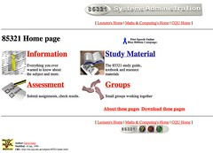
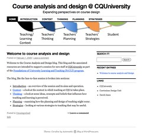

---
categories:
- eded20491
- teaching
date: 2011-04-06 11:45:29+10:00
next:
  text: BIM on the back burner
  url: /blog/2011/04/07/bim-on-the-back-burner/
previous:
  text: Building a collaborative CV09 podcast
  url: /blog/2011/04/06/building-a-collaborative-cv09-podcast/
title: '"Group 1 Technologies: Blogs, Wikis and Websites"'
type: post
template: blog-post.html
---
As part of assignment 2 for ICTs for Learning Design we're meant to examine/play with examples of four different groups of technologies. Choose one each week to analyse in a little more detail and use that as the basis for the assignment. This post is my reflection on group 1. A group that contains blogs, wikis and websites.

Given I've done a fair bit of work in the past with these technologies, I'm going to reflect on what I've done, rather than engage in new play.

### Websites

I'm going to start with websites, rather than end with them, as I see "websites" as being a more primitive example of this group of technologies. At least they were when I started with websites for teaching back in late 1994 and then implemented my first totally online course in 1996. The following image is a screen shot of the home page. It's taken from Wayback Machine's [archive of the course](http://replay.waybackmachine.org/19980210233455/http://mc.cqu.edu.au/subjects/85321/index.html), I thought I'd lost it.

 home page by David T Jones, on Flickr")

This website was created using only a text editor and was only really possible due to a couple of years playing around with using the web for learning and teaching. It was this prior experience that taught the importance of consistency of navigation etc within the site. It also became obvious, however, during the implementation of this site that doing this with some form of automated support was difficult and time-consuming. For example, this comment comes from Jones (1996)

> When completed the 85321 hypermedia textbook included over 900 individual WWW pages. Producing and maintaining a large collection of WWW pages that also exhibit the above characteristics is extremely difficult and time consuming.

As a result a "tool" was written to semi-automate the process. The result can be [seen here](http://replay.waybackmachine.org/19980211002145/http://mc.cqu.edu.au/subjects/85321/study-guide/index.html) or you can view the Table of Contents for [Chapter 1](http://replay.waybackmachine.org/19980223082304/http://mc.cqu.edu.au/subjects/85321/study-guide/chap1/index.html). (That's cool, the audio files still work, at least on my setup).

From all of this experience arises the (somewhat obvious) reflection that creating a website by editing HTML files as text files is a low-level, laborious process that is only possible for those that are technically proficient, very motivated and pay close attention to detail. This is why it wasn't long before GUI-based web page editor/design applications arose and not long after that systems like Learning Management Systems such as Moodle. Each of these tools raise the abstraction layer, they do more for the author, making it easier to produce websites that are good quality.

[Weebly](http://www.weebly.com/), the contemporary website authoring tool we were asked to experiment with as part of the weekly activities, strikes me as the result of the on-going evolutionary development of these website editing/design applications. It's a totally online tool that provides a range of widgets/templates etc to create websites and reduce the need for the author to know a great deal about good web-design.

But that said, it still leaves a fair bit of flexibility in structuring a site. This is not a problem if you have 2 or 3 pages, but get beyond 30 or so pages and structure becomes important and difficult to get right. Also, to some extent Weebly retains the focus on creating a web page(s). i.e. the web page isn't necessarily generated as a consequence of user activity.

Which was one of the outcomes when we played with the design of a ["Web 2.0 course site"](/blog/2007/06/12/cqus-first-web-20-course-site/) back in 2007. The content for two or three of the major sections of the course website was generated by student activity. The website served as a central place to bring together the results of the students interacting with Web 2.0 tools like a blog, eportfolio and social bookmarking. A bit of an introduction/overview is [available in this video](http://video.google.com/videoplay?docid=5799792204530908881#20m00s).

In short, I'm wondering whether the days of a "website" - defined as a place where you upload information - are somewhat numbered. This is a nebulous conclusion mainly because of the problem with defining what a website is, after all, blogs and wikis produce websites. But in terms of tools like Weebly, a single tool that provides all that you need. I have a sense that they are numbered, or at least are going to be replaced by other tools with different abstractions.

Or to put it more personally (and perhaps correctly), I don't currently see much of a need for me to use a tool like Weebly anymore. I make do with services like Wordpress, flickr, vimeo and dropbox.

### Blogs

As an example, when I needed to create a "website" for a training session I was running, I didn't use a service like Weebly. I used Wordpress.com to create [this site](http://coursedesign.wordpress.com/). The following image is a screendump of the home page for this site (click on it for a larger version). It has much in common with a standard website, especially in terms of being divided into 5 or so main sections focusing on a particular topic.

This experience showed that a blog can be used to create something that acts as a website, but retains some of the advantages of a blog. But the approach used in this course was still primarily content distribution. While a bit of interaction was used, the site was mainly aimed at providing access to content I'd developed.

Not a very constructivist approach and not, to my mind, the most valuable application of blogs to learning. Using a blog as an individual, student-owned writing environment seems the most valuable. Having each student have their own area where their thinking is made visible, where they are encouraged to reflect on their learning, seems much more valuable. Not only is there value for learning in the students having a personal space in which to reflect, through the use of RSS feeds and aggregation it is possible to share those reflections with other students and teaching staff. When shared with teachers, blogs and student writing/reflection provide a greater level of insight into student progress than possible in a face-to-face class.

This was the rationale behind the use of blogs I designed for a 2006 course which informed the development of BIM. The approach is explained in detail two publications (Jones, 2006; Jones and Luck, 2009). But the primary aim was to increase the visibility of student progress to increase the ability to provide formative feedback. It wasn't a great success, mostly because the institutional constraints did not readily enable an increase in feedback and consequently many students did not experience the benefit. I think this approach would work much better within a classroom setting.

#### Analysing a technology

Which brings me to a few qualms about the "analysis" we're meant to perform. The following picks up on some thoughts expressed in [this blog post](/blog/2011/04/04/how-do-you-analyse-and-select-an-educational-technology/).

Any form of analysis of a technology - SWOT, PMI etc. - strikes me as little limited. Some of the limitations I see, include:

- It's not about a _single_ technology, but how the technology fits within the ecosystem you and your students have access to.  
    In terms of blogs, a blog by itself is fairly useful for the author. But when individual blogs are combined with aggregation and filtering technologies - e.g. news readers, social bookmarking, BIM etc - that's when the fun really happens. The [collaborative podcast](/blog/2011/04/06/building-a-collaborative-cv09-podcast/) is another example of where it takes more than one technology.
    
    From another perspective, I think how well the technology fits within the students context is another essential aspect. If they don't see the tool as relevant, or see it as duplicating (badly) something they already use, then there are going to be problems with engagement. And lets not get into the question of whether the technology fits within the constrained technology ecosystem of the school.
    
- It's not just about the technology, but how you will use it.  
    I've heard of people using group blogs, where a class contributes to a single blog. I'm not such a big fan of that approach, I prefer each student to have their own blog, their individual space. Analysing a blog as a technology for learning and teaching, has to include consideration of the use.
    
    Would you sit down and evaluate a hammer, without thinking about what you're planning to use it for? A hammer used as a floatation device isn't going to be very effective. How I would use a technology in a maths class is likely to differ from how a history teacher might use it
    
- There is no single perspective of technologies.  
    An analysis of a technology application to learning and teaching by a single person is inherently limited. For example, given my background with technology my analysis is likely to be very different than my 15yo daughter or her peers. It's also likely to be very different from the IT support person and/or the headmaster of a school. Any analysis that is worthwhile should involve those people in someway.
- We're not rational decision makers.  
    The idea of this type of analysis is that human-beings are rational decision makers. I think this is a myth, and based on some evidence, think that analysis routines like SWOT/PMI are more likely to be useful for helping us develop justifications for our initial impressions, rather than encourage deep and objective analysis.
- Analysis requires significant knowledge and experience.  
    While this exercise requires us to experiment with technologies, it is not until you've gathered some deep experiences that you really understand the implications of a technology. For example, I was a twitter skeptic. When it first came out I "analysed" it as a technology and concluded there would be no value. It was only later - when it was decided if we were encouraging staff to engage with Web 2.0 that we better engage first - when I used Twitter that I started to see its value. I am now a regular user.
    
    This is one reason why there is almost no point in asking people what they want, there are a [whole range of reasons](http://www.cognitive-edge.com/blogs/dave/2008/10/rendering_knowledge.php) why the majority of people can't answer that question effectively.
    
- Ateleological versus teleological processes, emergent approaches.  
    Which brings me to a pet hate, an ignorance of the value of ateleological or emergent processes. [This blog post](/blog/2009/05/25/teleological-and-ateleological-processes/) explains that there are two types of processes: teleological (plan-driven) and ateleological (emergent). The type of analysis requested here is a regular part of a plan-driven approach and generally makes assumptions about rationality etc. Emergent processes strike me as having a much stronger resonance with constructivism, of allow meaning to emerge out of the experience. Given what I've written in my thesis I believe there is a place for emergent processes in technology and learning.

### Wikis

I have to admit that I am not a big fan of Wikis for learning and teaching. I have, however, had some experience with using a Wiki in a work setting. A couple of years ago I worked with a unit that used Mediawiki (the software used to run Wikipedia) to host our [organisational website](http://cddu.cqu.edu.au/index.php/Main_Page). The idea was that we wanted anyone, both within the unit and outside, to be able to modify any of the pages they wanted to. At the time, the organisation's practice was that only a designated person in each unit could modify the website. We wanted to avoid this bottleneck, but also wanted to experiment with Wikis as interest in using them in learning teaching was growing.

On reflection it was fairly successfully, though not completely. Few, if any, folk from outside the unit modified the wiki but a number of folk within the unit did. But that perhaps says more about the unit and the people within it. There is a belief that only a very limited percentage of people contribution to a Wiki. The [90-9-1 theory](http://www.wikipatterns.com/display/wikipatterns/90-9-1+Theory) is one description of this observation and suggests that 90% of visitors to a Wiki are lurkers (i.e. they don't contribution), 9% contribute from time to time, and the remaining 1% are the active contributors.

With Wikipedia being read by millions of people, 1% can be quite large. But with an organisational or course Wiki where the possible readers are limited to 20 or 30, 1% is a very small number.

In terms of collaborative authoring of documents, I think services like [Google docs](http://docs.google.com/) offer a more user-friendly environment for one-off or small groups of documents. Wiki's seem best suited for websites where the information have a long life-span and needs to be maintained and improved throughout that life (e.g. Wikipedia or an organisational website).

One application of "Wikis" for learning that I am interested in is where students are [tasked with creating or updating a page on Wikipedia](http://en.wikipedia.org/wiki/Wikipedia:School_and_university_projects). Such as this example of a project from a [US high school biology class](http://en.wikipedia.org/wiki/Wikipedia:WikiProject_AP_Biology_2008). There have been examples of where schools create their own online textbook or wiki site, however, I think doing it on Wikipedia has significant advantages. It strikes me as a very constructionist approach.

### Analysis of blogs

Within this group of technologies, I have chosen to analyse blogs using a SWOT analysis. I've made some attempt to address some of my concerns about this type of analysis. For example, the analysis is based on my significant experience with the use of blogs, both personally and in a learning and teaching context. I've included in the SWOT likely responses from various archetypes within a school setting. That I've tried to imagine/empathise with the analysis of those archetypes is a weakness of the analysis. In fact, the archetypes may well be stereotypes. I have also just realised that I've left parents out of the mix.

In terms of the application of the technology, I am doing the following analysis of the following approach to using blogs

- Each student has their own blog on their choice of blog engine.  
    The blog has to be open to the world and generate a feed.
- Their blog will be used for their own reflection and purposes on class tasks, but also to present their contributions to some set tasks.
- Some of these tasks will be aimed at addressing authentic problems or creating artifacts of potential use to people outside the class.
- The tasks may require the students to engage with a specific online community around the authentic problem.
- All student blogs will be aggregated into a single feed that is shared with classmates.
- Students will be expected to comment (appropriately) on the posts of other students, both of their own volition but also in response to certain set tasks.
- At times and through means to be determine, some of the student blog posts will be promoted both online and throughout the school as useful resources.
- All this will occur in either a high-school IT or mathematics class.

Must remember that the distinction between Weakness and Threat is internal/external.

| Analysis | Me (Teacher) | High school student(s) | High school establishment |
| --- | --- | --- | --- |
| Strengths | It is the students own place, a place for their voice to emerge, a place they own and control.   Aggregation and sharing amongst students enables collaboration.   The openness of the blogs combined with a focus on authentic tasks and engagement in an existing community increases the "constructionist" aspect. Students are producing real artifacts for people outside of school. Hopefully motivation and engagement will increase.   The quality of the free, public blog engines is high and getting better. Much better than similar tools embedded in the LMS and other institutional tools. |  | We don't have to purchase any software. |
| Weaknesses | Writing mathematics electronically is a real weakness of blogs, but online tools in general. This might limit what can be done or simply make it that much harder.   Aggregating and tracking comments on blogs is difficult.   Following all student posts might be a significant workload, for both teacher and students. | You want everyone to see what I'm doing?   I don't have a computer at home, will I be disadvantaged? | What will be the bandwidth usage/cost implications? |
| Opportunities | Having useful/interesting content on student blogs may increase the involvement of the external community in the students' learning. Hopefully including the parents. |  | If this works, it might form the basis for some cross-curricula collaboration |
| Threats | The "difference" between this approach and more common approaches to learning within schools will create some dissonance in terms of policies, workloads and staff/student/parent expectations.   It becomes too hard for the teacher, the students etc.   Students aren't appropriately prepared/scaffolded for writing blogs.   Are blogs seen as "old school" by high school students?   The best blog engines or the community websites are "filtered" out of the schools view of the Internet.   Will there be problems from "helicopter parents"? | What happens when other students steal my ideas? (Aside: I did a quick google search which pointed me to [this post](http://jodiuniwork.blogspot.com/2011/03/swot-analysis-on-blogs.html) from a fellow student) | The blogs are going to be public? What happens when the students swear or post naughty pictures? What will the parents say?   What about cyber-bullying? |

### References

Jones, D. (1996). [Solving Some Problems of University Education: A Case Study](/blog/publications/solving-some-problems-of-university-education-a-case-study/). In R. Debreceny & A. Ellis (Eds.), (pp. 243-252). Gold Coast, QLD: Southern Cross University Press.

Jones, D. (2006). Blogs, reflective journals and aggregation: An initial experiment. Retrieved April 4, 2011, from [/blog/publications/blogs-reflective-journals-and-aggregation-an-initial-experiment/](/blog/publications/blogs-reflective-journals-and-aggregation-an-initial-experiment/).

Jones, D., & Luck, J. (2009). Blog Aggregation Management: Reducing the Aggravation of Managing Student Blogging. AACE. Retrieved from http://www.editlib.org/p/31530.