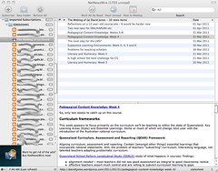

See also: [[blog-home | Home]]

Following on from the last post, this one reports on the experimentation with a collection of technologies that fall under the category of Group 2. We're meant to play with these technologies and then select one to analyse in a little more detail. This builds on the [analysis of group 1 technologies](/blog2/2011/04/06/group-1-technologies-blogs-wikis-and-websites/).

### Digital images

This is basically an experiment with Flickr and image manipulation tools, including [Picnik](http://www.picnik.com/).

As it happens, I've been using Flickr since [August 2005](http://www.flickr.com/people/david_jones/) - bugger, that's almost 6 years - and have over 1600 photos/images in my Flickr account. These include personal, study and work related images. If you look to the right of this post (and perhaps scroll up/down a bit) you should see some examples of images from my Flickr library and also images that I've favourited. Most of the images I include in my blog posts are from my Flick library.

In terms of images I have favourited (you can see the full list of favourites [here](http://www.flickr.com/photos/david_jones/favorites/)), most of these are images I've used in presentations I've given. Over the years I've adopted a style for presentation slides that results in huge numbers of slides. For example, this [60 minute presentation](http://www.slideshare.net/davidj/an-information-systems-design-theory-for-elearning) has 129 slides. But, each slide only encompasses a single idea, usually with a minimum of text and a relevant image. All of these images have been found via the [Creative Common image search facility](http://search.creativecommons.org/).

Other images arise from screen shots of various technologies, and have often included sensitive information that needs to be blurred out. For example, the following image that was part of a description of creating an OPML feed for the ICTs course. The names/URLs for individual student blogs were "blurred" out as I didn't have permission to release these. This was done in a free Mac image manipulation application called [Seashore](http://seashore.sourceforge.net/The_Seashore_Project/About.html) which is based on the GIMP, but brought into the Mac interface a bit more.

Flickr is much more than a place to store photos. It has good features to support groups and interactions, many of which are used for set tasks. These could be adopted for assignments. There is also a range of tools that have been built on top of the Flickr API (application programming interface). One example is [Mosaickr](http://mosaickr.com/), which takes a large number of images and puts them together into a mosaic that resembles another master image.

Though, I have to admit that an attempt to make a mosaic image of the course banner image didn't work real well. The predominance of the dark background colour doesn't work well with photos.

In terms of using in education, the [Tell a story in 5 frames](http://www.flickr.com/groups/visualstory/discuss/72157616354645885/) approach has been used in a variety of ways. There are some additional ideas within the [Flickr section](http://cogdogroo.wikispaces.com/StoryTools#The Fifty Tools-Flickr Tools / Ideas-37. Flickr Tell a Story in 5 Frames) of the [50 tools to tell a story](http://cogdogroo.wikispaces.com/StoryTools) page.

### Podcasts

Yesterday, I created a "collaborative CV09 podcast" using diigo and feedburner. [This post](/blog2/2011/04/06/building-a-collaborative-cv09-podcast/) explains in more detail what was done, why and how. The [podcast is available](http://feeds.feedburner.com/gdlt) and currently has 3 subscribers, including me.

This approach provides the basic structure for putting a collaborative podcast together. This "structure" could then be used to implement a range of different pedagogies. One example might be in a media studies course. The students could be required to look for audio/video online about a particular news event from different media sources. Then have them (or another group) examine the podcast for differences, similarities etc.

Another alternative might be for the teacher (or previous class) develop the podcast and then expect another group of students to engage in a thinking routine around it. For example, the [reporter's notebook](http://www.pz.harvard.edu/vt/visibleThinking_html_files/03_ThinkingRoutines/03e_FairnessRoutines/ReportersNotebook/ReportersNotebook_Routine.html).

### Digital video

At the moment, I have [11 videos](http://vimeo.com/user2734192/videos) on [. Most are either videos of presentations or](http://vimeo.com/) [screencasts](http://en.wikipedia.org/wiki/Screencast) showing how to use a particular technology.

I also have [a "show"](http://www.ustream.tv/channel/e-learning-and-innovation-research) on [ustream.tv](http://ustream.tv/) as part of an experiment in using live streaming. It's of a presentation where we were experimenting with alternative technologies for lectures and the LMS. More information about the experiment is [available on this blog page](/blog2/2009/10/05/lectures-and-the-lms-alternatives-and-experiments/). The presentation was streamed live onto the net and user participation was encouraged through the use of Twitter and a mobile phone-based response system (Votapedia).

The only other use of video I have made in teaching is as a resource to encourage thinking or to prove a point. A video I've used a lot in recent years has been the Bear/Gorilla video that is [discussed in this blog post](http://nudges.wordpress.com/watch-out-for-cyclists/). There is an interesting, not really extended, discussion on the question of copying between the bear and gorilla camps.

### What could I do with video?

I haven't actually produced a video specifically for learning, so I'm thinking I might use this as the technology to analyse from this group. So what will I do?

One of the applications of digital video to teaching mathematics which I'm interested in is called [What can you do with this?](http://blog.mrmeyer.com/?category_name=what-can-you-do-with-this). It's an idea from [Dan Meyer](http://blog.mrmeyer.com/).

_Aside:_ In googling the "What can you do with this" site, I came across the following video (language warning) called "Can you do this?". In the video the presenter shows off her "double jointed" party tricks. Towards the end she asks people to respond to her video and show their strange party tricks. It looks like there are [333 responses](http://www.youtube.com/video_response_view_all?v=Rma-ijjipWI). It's a fairly extreme example, but it is perhaps one application that could be used in a class to break the ice and/or highlight the diversity/hidden talents in the class. Might also be a good "real" task for the students to use to get familiar with shooting, manipulating, and uploading digital video.

\[youtube=http://www.youtube.com/watch?v=Rma-ijjipWI\]

If I were to do mine, it would be [touching my nose with my tounge](http://www.wikihow.com/Touch-Your-Nose-With-Your-Tongue). Of course, my sense of dignity will likely prevent me from doing it, which is probably one of the drawbacks of using this in a class setting.

Returning to "What can you do with this?" (WCYDWT), it's a design strategy that seeks to draw on multimedia to set up a problem and guide students through some inquiry-based learning related to mathematics. At least initially it was mathematics, various forms of science have picked it up. You can watch an [Elluminate recording of Dan Meyer](http://mathfuture.wikispaces.com/WCYDWT+-+A+New+Vision+for+Math+Curriculum+Development) explaining the idea and giving examples.

It works on the assumption that you want to pose to the students a real problem, one illustrated by a video or some other multimedia resource. In [this example](http://blogs.triplealearning.com/2011/02/diploma/dp-maths/geogebra/) the students take the video themselves using their phones. The following is an example of how a commercial from Subaru can be used.

\[youtube=http://www.youtube.com/watch?v=zR3X9hJpbDo\]

The students are then asked what questions they have about the video/multimedia.

In this [blog post](http://blog.mrmeyer.com/?p=8743) from Dan Meyer there are comments from people that end up with "How fast was the car going" and "How many frames were on the wall".

Once you've focused on a question, get the students to guess. How fast was the car going? Then try and generate a ball park, i.e. get them to guess upper and lower limits for speeds that they know the car wasn't travelling at.

Then ask them to identify what extra information they are going to need to figure out an answer. All this can be done with the students working in groups and perhaps scaffolded by other methods.

### Analysis - WCYDWT

The aim is to stick with the SWOT analysis to use a common analysis technique across all 4 groups of technologies. Perhaps by the end I might have gotten the hang of it.

For this analysis I'm going to try a slight modification. SWOT analysis has for components. Two of which are meant to be internal (Strength and Weaknesses) and two that are external (Opportunities and Threats). For this analysis, I'm going to limit "internal" to the technology - digital video, both production and consumption - and the external components will include the use of the technology (pedagogy - WCYDWT) and also the broader contextual factors.

| Analysis | Me (Teacher) | High school student(s) | High school establishment |
| --- | --- | --- | --- |
| Strengths   (Digital Video) | Allows students to view experiences etc that they would never normally be able. | We actually get to use our phones to take video.   We have something we can show other people. | It is a good example of how we can embed 21st Century Literacies into the curriculum. |
| Weaknesses   (Digital video) | Are the school's technical resources (network connection, computers, software, cameras) powerful enough to allow students and staff to view, retrieve, take and manipulate video in a timely manner? | I don't have a phone that can take video. | Your allowing students to take video with their phones?   Is there any issue with bandwidth usage?   People outside the school are seeing the students' videos, is that ethical? |
| Opportunities   (WCYDWT) | Creates a more authentic, collaborative, and engaging context within which to learn and practice mathematics. | It's fun |  |
| Threats | The WCWYDT approach (like much PBL/inquiry learning) can be a bit threatening in terms of its open-ended nature. Requires a teacher with more expertise.   It consumes a fair bit of time in terms of preparation. | I liked the old style maths, I could show what **I** know. | Is this group work going to improve the school's NAPLAN results?   It looks fun, but are they learning? |

### The easter egg

If you got this far, consider the following video proof that I can touch my nose with my tongue as your reward.

http://vimeo.com/22064575

The process for the video, on the Mac laptop

- Shoot "portraits" with Photobooth.
- Crop them with Autocrop to cut out the nasty bits.
- Import back into iPhoto.
- Set up a iPhoto slideshow.
- Export it as a movie.
- Upload into vimeo.