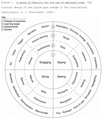

---
categories:
- eded20491
- teaching
date: 2011-04-07 11:31:14+10:00
next:
  text: '"Group 2 Technologies: Images, Audio and Video"'
  url: /blog2/2011/04/07/group-2-technologies-images-audio-and-video/
previous:
  text: BIM on the back burner
  url: /blog2/2011/04/07/bim-on-the-back-burner/
title: '"ICTs for learning design: Group 2 Technologies - The readings"'
type: post
template: blog-post.html
---
Another week, another group of technologies for the ICTs for learning design course. Group 2 is focused on images, video and audio tools. This post focuses on the readings, the next on the activities.

### A global imperative

But first, let's take a read of [The Global Imperative](http://archive.nmc.org/pdf/Global_Imperative.pdf) which is apparently a report on the 21st Century Literacy Summit from the New Media Consortium (NMC).

So a report on a 2005 summit focused on the concept of new literacies. Some of it echoes what was presented in the Literacy and Numeracy course. Liteacy is no longer just textual. While textual literacy remains an important component, literacy is now multi-modal.

And there's the net gen/Prensky quote, yep 2005 was before the Prensky-backlash really kicked in. Ahh, a working definition of 21st century literacy

> 21st century literacy is the set of abilities and skills where aural, visual and digital literacy overlap. These include the ability to understand the power of images and sounds, to recognize and use that power, to manipulate and transform digital media, to distribute them pervasively, and to easily adapt them to new forms

And some characteristics of 21st century literacy

1. It's multimodal.
2. Includes creative fluency and interpretive facility.
3. Means learning a new grammar with its own rules of construction.
4. Lends itself to interactive communication.
5. implies the ability to use media to evoke emotional responses.
6. Has the potential to transform the way we learn.

Am thinking I might well use components of this quote in the assignment

> The leaders that gathered in San Jose recognized that we must seize that opportunity, first by understanding this new literacy, then by encouraging, stimulating, modeling, and using 21st century literacy skills and methods. We must find ways to more fully engage young people in schools and universities worldwide, and use their natural talents to help them to be better and more effective communicators. That is our imperative, and it is global in its implications.

What first strikes me is the question of "modeling" and wondering about what I see in terms of modeling from teachers I know, other student teachers and the staff teaching us.

Participants were asked to describe "What does a world that values 21st century literacy look like?". Some excerpts have interesting implications for schooling, e.g.

> Education is optimized for multi-tasking and tailored to each learner.  
> Teachers entering the workforce have grown up with easy access to computers, powerful creative tools, and the Internet. They epitomize the concept of the “digital native” and are comfortable both with the new forms of expression that are emerging and with the tools that make them accessible. These new teachers model the new language forms for the next generation simply because that is how they already communicate..  
> Assessment methods focus on performance and use blended modes that take into account the various facets of the skills imbedded in 21st century literacy.  
> Funding for schools to acquire the necessary tools is available through government grants and partnerships with industry, and students around the world have access to the materials they need to explore, experiment and learn with the new language.

The summit also tried to describe enablers and barriers. THey found 7 which are a mix of both

1. Intellectual property & business practices (seen as potentially both barrier and enabler.
2. Tools, standards, licensing and pricing (also both).
3. Policy changes (could be enabler).
4. Systemic barriers to change.  
    This is one to come back to in the assignment
    
    > There are many levels of systemic barriers that permeate government, school systems, curriculum, and bureaucracy of all kinds
    
5. Digital natives  
    Seen as an enabler, but I wonder if the subsequent questioning of how consistent the "nativeness" of students impacts on this.
6. Erosion of art in schools.  
    This has become even stronger since 2005, the focus is increasingly on numeracy and textual literacy.
7. The Internet.

And now some strategic priorities

1. Develop a strategic research agenda.
2. Raise awareness and visibility of the field.
3. Empower teachers with 21st century literacy skills.
4. Make tools for creating and experiencing new media broadly available.
5. Work as a community.

Each of these have some action items described in the document. And if I really had the time, there's always the [list of readings](http://archive.nmc.org/summit/readings.pdf) sent to participants prior to the summit. Including a couple directly connected to IT.

### Using images in e-learning

Somewhat confused by this

> Please be aware that any images of people need permissions to be uploaded online, this includes your children. And please remember that your children should not be identified online, and their images should be held in secure environments

Does "your children" refer to my sons and daughter or to students in classes I teach? If the former, I see the advice (unreferenced) as somewhat out of line. If learners, then perhaps some references to why this is the case would be appreciated. I agree it should be the case, but justification/references would seem appropriate.

Pointer to [an introduction to visual literacy](http://www.learnnc.org/lp/pages/675) which points [to this page](http://www.learnnc.org/lp/pages/678) that has some nice resources/ideas for using images in teaching. Not to mention a [much broader collection](http://www.learnnc.org/search?tag=visual+literacy).

And yet more [thinking/class routines](http://www.pz.harvard.edu/vt/visibleThinking_html_files/03_ThinkingRoutines/03e_FairnessRoutines/TugOfWar/TugOfWar_Routine.html)

Basically a quick summary of different pedagogical approaches that can harness images.

### Podcasting

Quick overview of how and why.

### Digital video

Another overview, now pointing to [this paper](http://aaalab.stanford.edu/papers/Designed_Video_for_Learning.pdf) - "It is not television anymore: Designing digital video for learning and assessment ". Which includes the following interesting figure.

### References

Schwartz, D. L., & Hartman, K. (2007). It is not television anymore: Designing digital video for learning and assessment. Video research in the learning sciences, 335-348. Retrieved April 7, 2011, from http://aaalab.stanford.edu/papers/Designed\_Video\_for\_Learning.pdf.