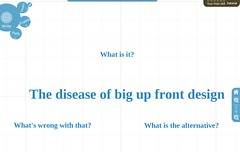
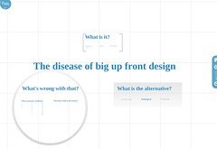

---
categories:
- eded20491
- teaching
date: 2011-04-08 14:56:23+10:00
next:
  text: Mathematics and the net generation - not in textbook exercises
  url: /blog/2011/04/08/mathematics-and-the-net-generation-not-in-textbook-exercises/
previous:
  text: Why are we analysing ICTs for learning?
  url: /blog/2011/04/07/why-are-we-analysing-icts-for-learning/
title: Group 3 Technologies - The readings
type: post
template: blog-post.html
comments:
    - approved: '1'
      author: kwilco
      author_email: kevin.wilcoxon@unlv.edu
      author_ip: 131.216.14.1
      author_url: null
      content: 'Wow, David.  Thanks for turning me onto "It is not television anymore:
    
        Designing digital video for learning and assessment"  What a great tool!
    
    
        Kevin'
      date: '2011-04-09 03:49:38'
      date_gmt: '2011-04-08 17:49:38'
      id: '54'
      parent: '0'
      type: comment
      user_id: '0'
    
pingbacks:
    []
    
---
So, these are tools to "present learning or information". The chosen representatives are Powerpoint, Prezi and Glogster. Am thinking I'm might try a quick search for some alternatives, time permitting.

Have to admit that I'm interested in having an excuse to play with Prezi a bit. To now I have failed to see the point, Prezi is just as capable of being used to give crap presentations as Powerpoint.

### Powerpoint

Positioned as more than just an application to support oral presentations, but a platform in its own right. We're encourage to "consider multiple uses and think beyond the tired presentation". My initial reaction is, if this was the case I'd probably be using a different tool. Some examples given [on this page](http://www.online.tusc.k12.al.us/tutorials/pptclass/pptclass.htm). Yes, Powerpoint can do those things, but there are other tools that could do them, often better.

And [over here](http://www.microsoft.com/multipoint/mouse-mischief/en-us/default.aspx) is Mouse Mischief, which looks like an audience response system integrated into Powerpoint. Though the drawing aspects seem a little more expanded. It does appear to be limited to Windows though.

I remain unsure just how much I'd be using Powerpoint, or any presentation software, in a school classroom. But then I've yet to have an experience within that context, so that's a somewhat ill-informed perspective. I am interested to see what the much vaunted Interactive White Boards can provide in terms of integrating Powerpoint with other activities/tasks.

In terms of playing with Powerpoint, my [Slideshare account](http://www.slideshare.net/davidj/herding-cats-and-losing-weighthow-to-improve-learning-and-teaching) has a collection of the more recent Powerpoint presentations I've given. The following presentation is just one, if you start at slide 61 you will see an example of "Powerpoint animation".

!!! warning "Outdated content no longer available"

    Presentation from Slideshare no long available

### Prezi

Oh, it's billed as a "zooming" presentation too in the notes. It's strong advantage is that it isn't linear. We are directed to [this Prezi](http://prezi.com/rfsnedhqmhqa/thoughts-on-using-prezi-as-a-teaching-tool/) to hear some thoughts on using Prezi as a teaching tool. Actually, the Prezi page has a comment that [links to this post](http://digitalmigrant.blogspot.com/2009/11/prezi-powerpoint-multimodality-and.html) which has an interesting perspective on Powerpoint and Prezi. In particular the description that Prezi is a tool for creating presentations in space.

Almost straight away the zooming is seen as a positive because it allows you to focus on specific sections of long text. Two responses to that: it doesn't stike me as a great application for a presentation; and, a "zoom" can be achieved in Powerpoint with a bit of manipulation.

Perhaps this can be the theme of my analysis, using Powerpoint to do everything that Prezi offers?

Okay, onto the zooming into text showing off how the dot on an i was actually a lady bug. Neat, but not sure it's tremendously pedagogical useful in a broad collection of areas.

Now showing the zooming in and out on images and concepts, oh dear it's using the old DIKW hierarchy as an example.

Okay, onto the non-linear part. The presentation recognises that other presentation tools (signified by a set of images of bog standard Powerpoint slides) can do this but argues that the affordances of the tool encourage linearity. One response might be to argue that the affordances of Prezi encourages people to engage in "flying navigation" that encourage motion sickness.

Back to the notes, it is argued that Prezi's "zooming" allows students to present, "but also to justify, explain, illustrate, give examples etc. So where you are asking students to make their thinking and ratinale visible without adding detail in ways that confuses the big picture."

I'd argue that the same can be achieved using Powerpoint (or Keynote etc) through engaging the students in reflecting on effective uses of Powerpoint for the purposes they are trying to achieve. This would provide an opportunity to talk about how technologies have affordances which make certain actions easier, but that those actions aren't always what you want. This might be more useful than getting them to learn yet another presentation tool. i.e. there might be more value in developing deep skills in one technology, than shallow skills in a couple.

But I perhaps should play a bit, and that's what we've been asked to do.

Create the account and checking out [this prezi showing](http://prezi.com/4jrranugjj6p/turn-a-powerpoint-to-prezi-prometisdesigncom/) a conversion from Powerpoint to Prezi. It's not a fair comparison and frankly, the zooming and rotating transitions used encourage a bit of motion sickness. Am also finding that while I can click on parts of the presentation to break out of the linear presentation, once I've clicked I'm stick with the back and forth arrows. No way to zoom out again and continue my non-linear exploration. Is there a way? Yes, you can use the two finger drag on the Mac laptop to move in and out. Now that's an advantage that hasn't been mentioned yet.

### Designing a Prezi

So, here are the steps I'm hoping/assuming I'll use. This won't be a complete presentation, that would take much longer than I have.

#### Choose a Topic - The disease of big up front design

This is pet peeve of mine and has formed the basis of a number of [presentations](http://www.slideshare.net/davidj/its-the-process-stupid) and publications (e.g. [Jones et al, 2005](/blog/publications/the-teleological-brake-on-icts-in-open-and-distance-learning/)).

#### Get some sort of structure

The aim here, for me at least, is to tell a story. Which will be linear. However, with Prezi folk should be able to navigate non-linearly.

Apparently Prezi is good for including the justification but not letting it get in the way, so some depth would be good. Also want some neat multimedia resources to within it. [This prezi](http://prezi.com/recyyolzxm3e/how-to-create-a-great-prezi/) on how to create a Prezi suggests "thowing it in". So, some brainstorming in Prezi might be the way to go.

So, here's the high level structure in the following screenshot of Prezi.

This defines the high level frames. The idea now is to expand each of the frames into its sub-components. So, zoom in and work on each frame in turn. In order to experiment, I might go overboard a bit with the frames related capabilities.

So, here's it all a bit fleshed out. I could probably lay it out better, but this is just an experiment, don't want to waste too much time.

#### Polish up the content

Here's where the multimedia polish usually goes. In this case, will see what I can do with some of Prezi's "zoom and rotate" features.

I plan to reuse a bunch of multimedia I already have/know about

- Dave Snowden's [organising a child's birthday party story](http://www.youtube.com/watch?v=Miwb92eZaJg)
- The [EDS herding cats commercial](http://www.youtube.com/watch?v=Pk7yqlTMvp8).
- A [movie of a Powerpoint animation](http://vimeo.com/22105742) of herding cats I used in a presentation once.  
    This is simply a gratuitous overuse of an existing resource to include and also show I can produce movies from Powerpoint. Actually, I've just uploaded that to vimeo, not youtube. Will be interesting to see if Prezi handles that. Apparently it won't, so there is now a [YouTube version](http://www.youtube.com/watch?v=ZhJENpTgB1M)
- This [from XKCD](http://xkcd.com/613/).
- A variety of creative commons licensed images from Flickr.

And done, probably spent too much time on it. The image below shows it in action. Use [this link](http://prezi.com/d8abiwl_0sw_/the-disease-of-big-up-front-design/) to see it in action (embedding Prezis in a Wordpress.com blog is not straight forward).

It's by no means complete. The spacing, sizes and rotations of the different components could be improved. There are also some content issues and there are sections which are very "powerpoint".

### Glogster

And now onto [Glogster](http://www.glogster.com/), which from the [education version of glogster](http://edu.glogster.com/what-is-glogster-edu/) is

> the leading global education platform for the creative expression of knowledge and skills in the classroom and beyond. We empower educators and students with the technology to create GLOGS - online multimedia posters - with text, photos, videos, graphics, sounds, drawings, data attachments and more.

[This gives](http://g00nsta.edu.glogster.com/-the-wonderful-wizard-of-oz-by-the-goon/) an example of what it can do. Could be useful as a medium, but the basic skills look pretty much the same, really don't think I'd learn much from putting one together.

Will leave it there for now.

### References

Jones, D., Luck, J., McConachie, J., & Danaher, P. A. (2005). [The teleological brake on ICTs in open and distance learning](/blog/publications/the-teleological-brake-on-icts-in-open-and-distance-learning/). Adelaide.