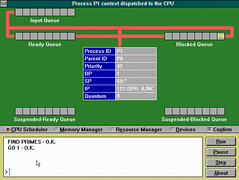

---
categories:
- eded20491
- teaching
date: 2011-04-12 15:16:56+10:00
next:
  text: Exploring minecraft
  url: /blog/2011/04/12/exploring-minecraft/
previous:
  text: What shapes how we think?
  url: /blog/2011/04/12/what-shapes-how-we-think/
title: Group 4 Technologies - Activities
type: post
template: blog-post.html
---
And so the final group of technologies to play with prior to the assignment. This is an open-ended group and includes: animations and simulations; Google earth; Google Maps; and Google docs. The "historical" recap of what I've done associated with these technologies is part of the assessment - showing that I've "played" with the technologies.

### Animations and simulations

I have a bit of experience with using and helping create (usually in a fairly minimal role) animations and simulations as evidenced in some publications ([Chernich and Jones, 1994](/blog/publications/the-design-and-construction-of-a-simulated-operating-system/); [Chernich, Jamieson and Jones, 1995](/blog/publications/rcos-yet-another-teaching-operating-system/); Jones and Newman, [2001](https://djon.es/Publications/rcos.pdf); [2002](https://djon.es/Publications/rcos1.pdf)). All of those publications were about various versions of Ron Chernich's Operating System (RCOS). RCOS was a simulated operating system in that it actually ran programs and managed I/O devices etc. But it also showed animations of the internal algorithms and data structures that the operating system used to perform these tasks.

The following images show the same basic view. First in RCOS, the MS-DOS version of from the early 1990s.

Second from RCOS.java, the Java version from the late 1990s.

Interest in RCOS arose because I was given the task of teaching a course on operating systems, which was described as (Chernich and Jones, 1994)

> An advanced level computing subject covering the theoretical concepts of operating systems is an essential part of any computing degree (Denning, 1989). The study of computing has three essential paradigms: theory, abstraction and design (Denning 89). An operating systems subject is very heavy on the theory. In such a subject providing the abstraction and design paradigms to enable students to fully understand the theoretical principles involved is difficult (Hartley, 1992. Withers and Bilodeau, 1992. Goh, 1992. Christopher et al, 1993). The provision of these paradigms to distance students is considerably more difficult.

Essentially, the concepts within the course are difficult and heavily theoretical. Most people struggle to get them when taught face-to-face and accompanied by lots of physical demonstrations. The majority of the students in the course I was teaching were distance education students, i.e. they never saw my physical demonstrations. Initially an existing animated operating system tool - PRMS - was used but it had some difficulties. One of the students who experienced that difficulty - Ron Chernich - liked the idea, but thought he could solve many of the problems. He did, very well.

But by the late 1990s, the MS-DOS platform was not really state of the art. So with the release of Java a decision was made to port RCOS to the Java platform. RCOS.java was the result and much of the work ended up being done by another student Andrew Newman. As it happens [RCOS.java](http://rcosjava.sourceforge.net/index.html) website is still up and provides access to the code and some of the background to the project.

RCOS.java was never used at CQU, but has been used at a number of other universities around the world. For example, [this project report](http://translate.google.com.au/translate?hl=en&sl=pt&u=http://www.cin.ufpe.br/~tg/2002-1/dksc.doc&ei=NZijTYzhA5PSuwOnkvH-BA&sa=X&oi=translate&ct=result&resnum=10&ved=0CFUQ7gEwCTgK&prev=/search%3Fq%3Drcos.java%2Boperating%2Bsystem%26start%3D10%26hl%3Den%26safe%3Doff%26sa%3DN%26prmd%3Divns) from a Brazilian university student.

Simulations, especially as complex as RCOS, take a lot of effort and resources to implement effectively. Hence that option tends to fall out of the realm of most people. There has been significant improvements in the tools that can be used to implement simulations, but if you are attempting to simulate something that is complex, it is still going to be complex. RCOS and RCOS.java were possible because of the benefit of having talented project students who were able to develop these simulations as part of project work.

In addition, really complex simulations can be a barrier for student use which implies significantly more work on the part of the teacher to effectively scaffold student use of the simulations. This is one of the reasons why RCOS.java was never used at the host institution. Other people were taking the course, they didn't see the benefit from investing the necessary time to scaffold effective student use. The quality (perceived or otherwise) of RCOS.java probably played a part in that.

Which is one of the reasons why by the late 1990s the focus had turned to producing ["canned" animations of operating systems concepts](http://dl.dropbox.com/u/14025788/85349/Resources/Animations/index.html). I am somewhat amazed that these 12+ year old Flash animations are still working. Which does raise the other problem with these type of approaches, obsolescence. As technology progresses the significant resources invested in a particular application may have to be thrown away. e.g. it would be very difficult to get RCOS up and going again these days.

All of which points to the idea that K-12 teachers are more often than not going to be consumers of simulations (and to a lesser extent animations) produced by others than producers in their own right. There are tools and approaches, especially for animations, that do lower the entry level especially for animation (e.g. Animoto, Powerpoint, stop-motion video etc) and in some cases enable students to be more engaged in the production of animations.

Picking up on that point, the activities page for this group of technologies starts the animations and simulations section with the following quote

> Animations and Simulations offer substantial advantages over print based material when it comes to complex interactions and abstract concepts.

And that certainly was one of the major driving forces behind the above work. There was, however, a more important finding or reflection from this work.

> Student construction/manipulation of animations/simulations provide an even stronger learning experience

The two project students that helped design and implement the animations reported this. The task of designing correct and pedagogical effective animations taught them more about the operating systems concepts than they had learned taking the course the previous term (and they were amongst the best in the class). In addition, the real benefit from RCOS arose because as a simulation, students could create programs that RCOS would run. They could also change algorithms used by the operating system. Both of these changed how RCOS operated and they could observe these changes. This ability to experiment significantly helped learning.

#### Learning objects

The difficulty and cost of producing animations/simulations brings up the idea of Learning Objects. We're pointed to [this article](http://technologysource.org/article/preparing_teachers_to_use_learning_objects/) (Bratina, Hayes and Blumsack, 2002) on "Preparing teachers to use learning objects". I have to admit to always being a bit of a skeptic of learning objects, especially in terms of the large-scale, centralised warehouse projects that were all the rage. i.e. to help people use learning objects we have to have them all stored, categorised and described within this single index. As if by doing so you would solve all the problems that were preventing teachers from using learning objects. Which I thought was just wrong.

One reason why I think this comes back to the observation that most people, there are always exceptions, don't want abstracted, formal, packaged recommendations of useful tips and tools. Most people get their tips and tools from people they trust. If Fred in the class next to me found animation X useful and his kids were in raptures about it, then I might use it. Average Joe Teacher isn't going to get enthused and adopt learning objects from centralised repository because he doesn't use the repository as a regular part of his everyday life and somewhat relatedly doesn't really trust the repository. Average Joe Teacher does, however, know and interact regularly with Fred. From this perspective encouraging the building and maintenance of PLNs (why is it I feel a little dirty when I use that buzzword) would seem a better approach to spreading the use of PLNs.

From my experience (not entirely bias free) I've used more "learning objects" that have come over my PLN than from any repository. For example, I really want to trawl through the [collection of resources](http://groups.diigo.com/group/wcydwt) put together by the WCYDWT group on Diigo. Here's a group of learning objects I think I would use.

How's this for a learning object that just came across my PLN (click on it to see a bigger version). It shows a series of dance moves based on arranging arms to match the results of graphing various formula. How's this for an activity for kinesthetic learners? Given a piece of music, create a dance limited only to these dance moves. Which has me wondering how games like Dance Central and the Kinnect could be harnessed as part of this.

The [article](http://technologysource.org/article/preparing_teachers_to_use_learning_objects/) offers the following advice about how to "motivate teachers to use learning objects"

1. Help teachers to find and develop useful learning objects.
2. Have new learning object users determine lesson objectives.
3. Urge novices to begin gradually and play with purpose.
4. Motivate novices to conduct a "dry run" and seek critiques of their work.
5. Stress the use of research-based, interesting and connected learning objects to beginners.
6. Support teachers' work on learning objects.

Is it just me, or does this have a preachy tone to it? For example this quote from the paper

> We must help teachers recognize that determining objectives is a requirement for all lesson plans.

Are there really any teachers who don't really know this? I think some of my biases about this sort of work apparently have a deficit model of teachers practice. i.e. the teachers are missing something by not doing X - in this case using learning objects - so we have to help them overcome their deficit. In this case, by helping them start with lesson objectives and use a research basis.

#### Explore Learning and Gizmos

One example we're given is [ExploreLearning](http://www.explorelearning.com/index.cfm) and its collection of Gizmos. First problem, need the Shockwave plugin, download that. Second problem, they cost money. Which isn't necessarily a bad thing, but depending on context, might be a limiting factor. Back to this later.

Actually, no. The Shockwave installer has worked, but the Gizmo is still giving me an error message, an unhelpful one at that. It's a commercial application that has problems, so I'll ignore it. What I suspect I would have seen is well designed "applets" showing off particular aspects of content all integrated into a nice package, including lessons plans.

### Google earth and google maps

Ahh, google earth the old standby example for "cool technology" presentations, like [this one](http://www.slideshare.net/davidj/what-is-web-20-for-k12) I gave at Glenmore High 4 years ago. A presentation that included a section on Google earth which was demonstrated using the following movie (wasn't sure I'd have Internet access at the school). The video briefly shows off [the Travels of Odysseus in Google Earth](http://www.gearthblog.com/blog/archives/2006/08/travels_of_odys.html).

Oops, vimeo doesn't like the format of the video and I'm not going to waste the time to do the conversion. It essentially showed an image of Google Earth first focusing on the school and then zooming out and across to the Mediterranean and showing the placemarkers for the travels of Odysseus.

Was interested to [see a link to Real World Math](http://www.realworldmath.org/Real_World_Math/RealWorldMath.org.html). It's a pity that the website is having problems. Though [the related blog](http://realworldmathcommunity.blogspot.com/) seems operational. Ahh, this is what I wanted to see, a [collection of lesson plans](http://www.realworldmath.org/Real_World_Math/Lessons.html). This [lesson](http://www.realworldmath.org/Real_World_Math/Estimating_Distance.html) around estimating distance using landmarks familiar to the students looks like having some benefits. It connects them to their real world/context and lets them see it in different ways (both through Google earth but also through mathematics). A related example is Dan Meyer's [Speeding in Compton](http://blog.mrmeyer.com/?p=9174).

And to pick up again on the argument for PLNs being the best mechanism for disseminating learning objects, take a [look at this post](http://fnoschese.wordpress.com/2010/10/18/speeding-problem/). It details how someone else has taken the Meyer idea and applied it in their context.

Interesting to see Google Earth and Google Maps put into different categories, I always treated them as essentially the same technology using a different interface. Each interface having its relevant strengths and weaknesses based on the context.

In a previous life, we used Google Maps on the [group's website](http://cddu.cqu.edu.au/) to show people where we were located on the campus. The map has changed a bit since then - organisational restructures are great - but it's essentially the same.

\[googlemaps http://maps.google.com/maps/ms?hl=en&ie=UTF8&t=h&msa=0&msid=212248888162434400625.00048e0e51ed495eaad80&ll=-23.328474,150.518108&spn=0.002217,0.003396&output=embed&w=425&h=350\]

### Google docs for collaboration

Personally, I think many of the Wiki activities used in the early weeks of this course would have been better done using Google docs. Especially given that most of those tasks were based around collaborative authoring of a single document. In my experience, Google docs offer a much easier to use, familiar approach to collaborative authoring than Wikis. Wikis work better, in my experience, for entire websites or collections of web pages.

I haven't had the experience to use Google docs in learning and teaching but I have used it to co-author papers and also in managing processes used to produce study guides for a University. Traditionally the process had been done using a Microsoft Excel spreadsheet that was controlled by a single person. This created all sorts of problems, mostly around that person being the only person who could contact authors. To make the process more distributed we moved and adapted the spreadsheet into Google docs.

### Online concept mapping

We're pointed to [bubbl.us](http://bubbl.us) and [Text2Mindmap](http://www.text2mindmap.com/) as examples of online concept mapping. As it happens I came across [this presentation](https://docs.google.com/present/edit?id=0AclS3lrlFkCIZGhuMnZjdjVfMjM4ZGp4bWJmaGQ&hl=en_GB) on Google Docs (via my PLN) which outlines "15 Interesting ways to use Prezi in the Classroom" (It is interesting that it is a presentation about using Prezi, that isn't done in Prezi). #7 is "Use Prezi as a mind map". It in turn points to the following video of a Prezi mindmap

http://www.youtube.com/watch?v=TENwsD0h9Rw

I think I'm tempted to use Prezi for mind/concept mapping, more so than other tools. I must admit that I have rarely used concept mapping myself. The other challenge is being able to achieve the task

> Develop a mind map that presents an overview of this week's topic. This will be used to support your analysis of tools for Assignment 2.

My first response is exactly what was the content/purpose of this week's topic?

The stated topic title was "Digital tools and pedagogies 3". The overview basically mentions presentation tools and "favourite" tools. The readings essentially summarise the tools and point to some extra readings (e.g. the learning objects article mentioned above). Mmm, am thinking this doesn't interest me much, instead I'll go for something aimed more at assignment 2. In particular, the concept of "effective and efficient digital pedagogies to enhance student learning".

And [here it is](http://prezi.com/avzy-vyjwpnl/concept-map-of-effective-and-efficient-digital-pedagogies-to-enhance-student-learning/) with an image of it below. It is still very incomplete. Mainly because the affordances of the Prezi authoring functionality isn't that well matched to concept mapping. i.e. the authoring functionality is more low level and doesn't know anything about concept maps. Which means the author has to combine the lower level Prezi functionality to achieve the concept map effects he/she wants. On the plus side, the visualisation is, at least to me, a big plus. The zooming nature of Prezi lends itself to this sort of thing. A Prezi concept mapping overlay would work well.

### Other tools

It's suggested that we also looking at Dipity - a online timeline tool - and Zooburst - an interactive digital storybook - I'm going to ignore both of those. They are just essentially more tools for information distribution. A very different emphasis than other tools but I'm confident I could learn how to use them quite quickly and I can see applications for them. Intead, I'm going to focus on the other aspect of this group and look at a tool that I choose.

Which begs the question as to what tool to choose. Some of the possibilities I have considered over recent weeks include:

- [Minecraft](http://www.minecraft.net/) - a construction game which is being [used in teaching](http://minecraftteacher.tumblr.com/) and getting some [positive feedback](http://deangroom.wordpress.com/2011/04/01/how-to-teach-with-minecraft-in-an-hour/).  
    This connects somewhat with the simulation category this week, but goes beyond that. It does lead me to thinking about the role of games in education which is becoming increasingly prevalent.
- [Scratch](http://scratch.mit.edu/), [Alice](http://alice.org/) or some other introductory programming language.  
    This is really getting into Papert/constructionist territory. A programming language would normally be seen as something restricted to IT courses, but there's an argument to be made that programming should be something everyone learns (e.g. [Ruskhoff's program or be programmed argument](/blog/2011/01/06/a-command-for-organisations-program-or-be-programmed/)).
- Python or some other "real" programming language.  
    For example, [the idea of programming in math/sciences](http://brokenairplane.blogspot.com/p/programming-resources.html).
- [ManyEyes](http://www-958.ibm.com/software/data/cognos/manyeyes/) or similar data visualisation tool. Especially when used in connection with some of the [open data repositories](http://oad.simmons.edu/oadwiki/Data_repositories) and the ideas associated with quantitative literacies. Or, alternatively, just with data provided by the students.
- Some mathematics related software such as GeoGebra.  
    As described by Stols and Kriek (2011)
    
    > This software allows learners to discover patterns, to explore and to test conjectures by constructing their own sketches. Dynamic mathematics software is a powerful teaching and learning medium and it has been reported to (a) enhance mathematics teaching; (b) help with conceptual development; (c) enrich visualisation of geometry; (d) lay a foundation for analysis and deductive proof; and (e) create opportunities for creative thinking (Sanders 1998). School students can improve their understanding using software because the dynamic environment improves visualisation skills and ability to focus on interrelationships of the parts of geometric shapes (Clements, Sarama, Yelland & Glass, 2008).
    

In the end the decision most comes down to time. All of the above are interesting to me for various reasons. But it is Minecraft that I have already put a bit of time into having a look at, so that's the one I'll focus on. That focus will be done in another post.

### References

Bratina, T. A., Hayes, D., & Blumsack, S. L. (2002). Preparing teachers to use learning objects. The Technology Source, 2. Retrieved April 12, 2011, from http://depd.wisc.edu/html/TSarticles/Preparing\_Teachers.htm.

Chernich, R., & Jones, D. (1994). The design and construction of a simulated operating system. Brisbane.

Chernich, R., Jamieson, B., & Jones, D. (1995). RCOS: Yet another teaching operating system. Sydney: ACM.

Jones, D., & Newman, A. (2001). RCOS.java: A simulated operating system with animations. In G. Chapman (Ed.), (p. section C4). Brno, The Czech Republic.

Jones, D., & Newman, A. (2002). A constructivist-based tool for operating systems education. World Conference on Educational Multimedia, Hypermedia and Telecommunications (pp. 882-883). Denver, Colorado.

Stols, G., & Kriek, J. (2011). Why don't all maths teachers use dynamic geometry software in their classrooms. Australasian Journal of Educational Technology, 27(1), 137-151. Retrieved from http://www.ascilite.org.au/ajet/ajet27/stols.html.