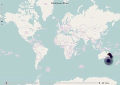
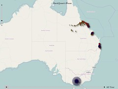

---
categories:
- teaching
date: 2011-04-21 10:15:19+10:00
next:
  text: '"ICTs for Learning Design: Week 7"'
  url: /blog2/2011/04/21/icts-for-learning-design-week-7/
previous:
  text: Starting on a &quot;student diversity report&quot;
  url: /blog2/2011/04/16/starting-on-a-student-diversity-report/
title: iPhone tracking as a teaching tool
type: post
template: blog-post.html
---
[Via George Siemens](http://www.elearnspace.org/blog/2011/04/20/iphone-tracking-so-not-an-issue/) I learn about my iPhone tracking where I've been, [a nifty app](http://petewarden.github.com/iPhoneTracker/) that can visualise that data, some useful resources to implement this sort of visualisation, and some detail about the file format. The obligatory visualisations of my movements - significantly less a world traveler than George - follow (click on an images to see it larger).

I particularly liked how it captured the trip I took with the boys to look at fossils in Western Queensland. Though that probably wouldn't work now as my new provider doesn't get much reception in that area.

### As a teaching tool

My initial thought was how could this be used in a teaching context. Here are some initial rough ideas.

It would be a fairly concrete way to raise questions about just what all the cool tools people use are actually doing. Did students know about this tracking? Does it worry them? How can they be sure it's not being shared? What about online services like Facebook? Link it in with a discussion of the [story about police downloading phone data](http://www.businessinsider.com/scary-cops-who-pull-you-over-and-download-all-your-phone-data-2011-4).

Then there are potential applications in a more advanced IT class. Can we develop tools to aggregate this data from all classmates? What implications and safe-guards would such a tool need to consider?

I need to think a bit more about mathematics applications. Wondering about the possibilities that might arise within the study of Space that might involve students mapping out distances/locations etc and then testing these by walking around with iPhones or similar devices. Needs much more thought.

I feel that there's much more that could potentially be done here. Any good ideas?