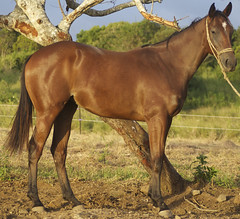

---
categories:
- mathematics
- teaching
- wcydwt
date: 2011-05-07 18:11:17+10:00
next:
  text: Looking for "learning objects" measurement, perimeter etc.
  url: /blog/2011/05/08/looking-for-learning-objects-measurement-perimeter-etc/
previous:
  text: Sir, when are we going to use this?
  url: /blog/2011/05/03/sir-when-are-we-going-to-use-this/
title: Real life, mathematics, partial proportion and race horses
type: post
template: blog-post.html
comments:
    - approved: '1'
      author: VRBones
      author_email: vrbones@hotmail.com
      author_ip: 118.208.43.177
      author_url: http://www.vrbones.com
      content: "<blockquote>The proper WCYDWT is to leave it to the students to come up\
        \ with the questions from the story/prompt.</blockquote>\nThere may be a related\
        \ issue in that even after giving them the story, they will most likely have no\
        \ idea of the industry itself and may not even know where to get started in asking\
        \ the right questions.\n\nIdeally you wouldn't need to proffer info like \"they\
        \ need to be broken in\", before they get into the exploration side of things,\
        \ and if you give them that info then you're well on the way to solving the main\
        \ question for them.\n\nThat said I do like the idea of getting buy-in by dripping\
        \ the story with a bit of personal anguish. It might be a big ask to get students\
        \ into empathising with a teacher, but it's probably worth a shot for the huge\
        \ upside if it does work. If it falls flat then it's just a glorified example\
        \ from the textbook, so no real harm done.\n\nSeems like some extension questions\
        \ could touch on probability without really hitting the gambling issue:\n - If\
        \ everyone spent the same amount of money on their horse as I do, is there enough\
        \ prizemoney to justify everyone's expenditure?\n - How much better or worse than\
        \ average does my horse have to be to justify the expense if I assume everyone\
        \ spends the same amount?\n - Some may not have grazing land already and will\
        \ need to pay to have their horse held somewhere. How much extra would adjistment\
        \ be?\n - If 1/2 the people needed to use adjistment, does that improve or decrease\
        \ my chances of winning?\n - If I knew that another horse at the same sale had\
        \ a 10% better chance of winning, but sold for $7000 more, would it be worth it?"
      date: '2011-05-16 00:33:44'
      date_gmt: '2011-05-15 14:33:44'
      id: '68'
      parent: '0'
      type: comment
      user_id: '0'
    
pingbacks:
    []
    
---
The following post brings together two recent events in my life into an attempt at a [WCYDWT](http://blog.mrmeyer.com/?p=6870) question for mathematics. It's not a perfect fit for WCWYDT, but close.

### What can you do with this?

The following is a photo of "Credit Muncher" just one of the race horses that has arisen out of my wife's latest hobby, breeding race horses.

She's called "Credit Muncher" because I am somewhat worried about the potential for this hobby to consume vast amounts of money. I was, however, a little happy that we were breeding race horses, not racing them.

Racing a horse involves a continual outlay of money. First, there's the expense of purchasing a yearling and then breaking it. At which stage you pause for a while before the horse is sent off to a trainer. This is when the real money starts being spent. Paying for someone to train the horse can cost upwards of $3,000 a month and the chances of winning are pretty slim. This has always seemed like a mug's game to me. A good way to burn money. Thankfully, we were only breeding horses to sell to others.

That changed last night. My wife and mother-in-law went to the local thoroughbred sales. "Only to look", said the wife. "I left my wallet at home by mistake", was the cry on the day of the sales. So, I felt safe. Then last night, to my great surprise and chagrin, I find that both my wife and mother-in-law have purchased a yearling each. With the grand plan of breaking them, training them, and entering them in the Capricornia Sales race this time next year. The race has a total price purse of around $150,000 and all horses sold through a specific brand of sales is qualified (59 from this sale alone).

What questions spring to mind?

### Improvements

As of yet, I haven't seen the new horse. We've already spent some money for it to go to a professional for breaking. A video or photo of the specific horse would be an improvement. Perhaps a bit more context of horse racing as well.

The story could do with some work. I do, however, think that the pain in my voice as I explain the story is likely to be the secret ingredient to motivate the students.

Working in some more detail about the prize money (1st, 2nd, 3rd etc) and other potential races might help.

Of course, the big potential problem is that the topic is horse racing and I hear gambling can be a bit of a no go topic in schools.

There's also the problem that this problem doesn't leave a lot of room for exploration, or at least I don't see it.

### My questions

The proper WCYDWT is to leave it to the students to come up with the questions from the story/prompt.

This idea comes about from the fact that I have a driving question. How much is this going to cost us? And an extension, how much is this going to cost me as the months roll on?

The idea for this post came from the fact that one of the first mathematics classes I was in during EPL (embedded professional learning i.e. prac teaching) covered partial proportion. And the students just didn't see the application. This class was one of those that contributed to [an earlier post](/blog/2011/05/03/sir-when-are-we-going-to-use-this/) about the relevance of mathematics.

### Partial proportion

The basic formula for partial proportion is

> y = kx + c

In this case, y is the total cost of the horse. The total cost is partially proportional to the monthly cost of training plus the initial cost of purchasing and breaking the horse. Using some round about figures, that gives

> y = $3000\*x + $5000

Given there is about 6 months of training to occur before the sales race

> y = $3000\*6 + $5000 y = $23,000

Ouch!

If we race the horse for 12 months

> y = $3000 \* 12 + $5000 y = $41,000

2 years

> y = $3000 \* 24 + $5000 y = $77,000