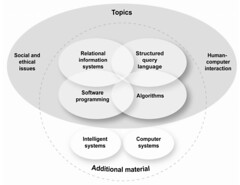
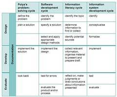

---
categories:
- eded20491
- ipt
- teaching
date: 2011-06-05 22:24:40+10:00
next:
  text: Design Rationale - ICTs for E-Learning A3
  url: /blog/2011/06/05/design-rationale-icts-for-e-learning-a3-part-2/
previous:
  text: A profile of learners in an IPT class
  url: /blog/2011/06/02/a-profile-of-learners-in-an-ipt-class/
title: Learner profile - ICTs for E-Learning A3 - Part 1
type: post
template: blog-post.html
---
### Introduction

The following learner profile aims to provide a generic profile of Year 11 Queensland students enrolling in a senior course in Information and Processing Technology (IPT). While informed by observations of students gained during Embedded Professional Learning (EPL) it does not draw specifically on profiling activities of those students. Instead the profile draws on what is known about these students from the broader literature. The main reason for using a more general learner profile is that any limited profile of a single IPT class generated through activities organised by a student teacher is not likely to be as representative as drawing on an array of literature and supplementing this with classroom observation.

### What does the learner already know?

As a senior course, students entering the course will have completed schooling up to Year 10. This may or may not have included formal study of Information Technology (IT). Where formal study of IT does occur in junior years of high school it is likely to focus on learning how to use various computer applications and general computer literacy. Some schools may offer courses in junior years that cover multi-media and programming/games development. It is also increasingly expected that the National Secondary School Computer Fund’s (DET, 2010) aim of a 1:1 computer to student ratio by 31 December 2011 will further impact students experience of computers in school-based learning. Not only should the students have ready access to computers and networks, they will increasingly have experience of using computers as part of school studies.

It is also expected that most students will have an increasing level of informal experience with the use of Information and Communications Technologies (ICTs) in the form of either computers or mobile devices. Table 1 is a summary of how American teens (12-17) are using technology based on a survey of 800 teenagers in September 2009 by the Pew Research Centre (Lenhart, 2011). While based on usage by American teens these figures are broadly comparable to 2007 research on Australian children (ACMA, 2007) in showing that Internet, computer, and mobile phone usage have almost become ubiquitous.

Based on this increasing access, t has been suggested that people born since around 1980 – having been immersed in the use of ICTs for most of their lives – are somehow different in terms of skills and interests and that this has significant implications for education (Prensky, 2001; Tapscott, 1998). Bennet, Maton, and Kervin (2008, p. 776), however, suggest that these poorly evidenced claims have created a type of “moral panic” that has restricted critical and rational debate. Jones, Ramanau et al (2010, p. 772) through their examination of first year undergraduates at five English Universities found that

> the generation is not homogenous in its use and appreciation of new technologies and that there are significant variations amongst students that lie within the Net generation age band

_Table 1_. ICT use reported by USA teenagers.

| Statistic | Percentage |
| --- | --- |
| Online | 93% |
| No computer | 8% |
| Own a cell phone | 75% |
| Online with cell phone | 21% |
| Own a game console | 80% |
| Own a portable gaming device | 51% |
| On a social networking service | 73% |
| Write a blog | 14% |

Hargittai (2010) found that there is significant variation in Internet know-how amongst young adults and that those from more privileged backgrounds use the Internet in a larger number of activities and in more informed ways. It appears that while potential IPT students may be more prepared to use IPT for learning, there remain questions about the depth and spread of that preparation.

It is also likely that most potential IPT students will have little nuanced insights into the impact of IPT on society and the practices and processes of an IPT professional. Computer science – a disciplinary cousin of IPT – has long tried to dissuade people of the narrow and misleading image of computer science as programming (Fletcher & Lu, 2009). Stereotyping of computing and the people who do computing continues to limit the diversity of people studying to become computing professionals (Klawe, Whitney, & Simard, 2009). For example, Cooper (2006, p. 331) argues existing gender stereotypes around computing and subsequent social influences increase the level of computer anxiety felt by girls. Kaarst-Brown and Guzman (2010), however, argue that this focus on the characteristics of gender-based, or other, groupings is insufficient to explain individual attraction to a Science Technology Engineering and Mathematics (STEM) career. Instead, they argue that a new cultural perspective – one of which they provide – is necessary to generate renewed thinking about attracting students to IT studies (Kaarst-Brown & Guzman, 2010).

### Where does the learner need or want to be?

The 2010 Queensland Senior Syllabus (QSA, 2010) for Information and Processing Technology (IPT) Syllabus describes IPT as

> an intellectual discipline that involves a study of information systems, algorithms, software programming, human–computer interaction, and the social and ethical issues associated with the use of information technology.

The general objectives of the syllabus are divided into four dimensions: knowledge and application; analysis and synthesis; evaluation and communication; and, attitudes and values. Course content is drawn from 8 topic areas. Figure 1 is a representation of the structure of these topic areas. Two of the eight topics – intelligent systems and computer systems – provide optional material to supplement the six core topics. Two of the core topics – social and ethical issues, and human-computer interaction – are intended to be embedded within the other topic areas. Table 2 provides an overview of each topic area.

_Figure 1._ The topic structure for a senior IPT course. Adapted from "Information Processing and Technology (IPT): Senior Syllabus 2010" by QSA, 2010, p. 5. 

_Table 2_. Summary of IPT topic areas  
\* not a stand alone topic, should be embedded in other topics.

| Topic | Description |
| --- | --- |
| Algorithms | Students are introduced to the notion of algorithm design, including at least one formal representational system. |
| Relational information systems | Examines formal models for describing the architecture of information systems, presents methods for developing these systems, and allows students to implement these to produce working information systems |
| Software programming | Study the development of software and provide students with some experience and skills in the design, development, and evaluation of computer programs to address practical problems or meet particular needs. |
| Structured query language | The use of SQL to manipulate data within a database. |
| Social and ethical issues \* | Develop an appreciation and understanding of the impact of IPT on individuals and communities across the world. Including an appreciation of the social and ethical issues that arise from other sections. |
| Human-computer interaction \* | Understanding the interaction between humans and technology to inform better design and improve user interfaces. |
|   Intelligent systems | Introduces a formal model to describe the architecture of intelligent systems, methods for the development of these systems, and allows students to implement these. |
| Computer systems | How are computers and computer systems organised, designed, and implemented? |

Fundamental to the presentation of the subject is the notion of the design-develop-evaluate (DDE) cycle Table 3 and one that should be embedded throughout IPT learning experiences. It is through the application of this cycle in a variety of learning experiences that an IPT class should aim to promote the teamwork, communication, and problem solving skills of students through the development of products (QSA, 2010). Learning experiences in an IPT class can include, but are not limited to: using information technology; solving problems in a variety of domains; extended writing including appropriate use of information sources, analysis and evaluation; presentation and communication of proposed solutions; and, collaboration within teams.

_Table 3._ The DDE cycle and other process cycles. Adapted from "Information Processing and Technology (IPT): Senior Syllabus 2010" by QSA, 2010, p. 20. (Click on table to see large version). 

### How does the learner best learn?

For some there is an expectation that the question of learning styles will in some way be included as a response to this question. Pashler, McDaniel, and Bjork (2008) argue that while there is evidence of learning preferences there is little research that suggests a positive connection between learning outcomes and differentiation of learning based on those preferences. There is, however, evidence that teaching and learning strategies that support the learning style preferences students can increase the motivation of students to learn (Feldgen & Clua, 2004). Platsidou and Metallidou (2009) offer another perspective, suggesting that learning styles inventories are more useful as a tool to encourage self-development of individual students, rather than as a mechanism to categorise and group students. The preceding mixed messages along with the difficulty involved in effectively pre-designing teaching and learning strategies based on assumptions around the mix of potential learning styles of students limit the attraction of this approach. It does appear more effective to make students aware of their learning preferences, the existence of other learning styles, adopt a course design that allows students to adopt and adapt their own learning strategies, and embed into that design approaches that encourage students to reflect and modify their strategies.

In addition, the research literature around diversity within the computer-science related disciplines (e.g. Cooper, 2006; Kaarst-Brown & Guzman, 2010; Klawe et al., 2009) identify a range of strategies intended to aid non-traditional learners studying within these disciplines. A small sample of these include:

- Allow female students to use computers in same sex groups or alone (Cooper, 2006).
- Work with female students on how the attribute success and failure (Cooper, 2006).
- Incorporate opportunities to see non-traditional role models (Cooper, 2006).
- Engage students actively in their conceptions of the IT culture and demonstrate alternatives (Kaarst-Brown and Guzman, 2010).

The book “How People Learn” (Bransford, Brown, & Cocking, 2000, p. 14-19) presents three key findings related to learning that have a good research based and implications for teaching. These three findings are:

1. Students come to the classroom with preconceptions about how the world works. If their initial understanding is not engaged, they may fail to grasp the new concepts and information that are taught, or they may learn them for purposes of a test but revert to their preconceptions outside the classroom.
2. To develop competence in an area of inquiry, students must: (a) have a deep foundation of factual knowledge, (b) understand facts and ideas in the context of a conceptual framework, and (c) organize knowledge in ways that facilitate retrieval and application.
3. A “metacognitive” approach to instruction can help students learn to take control of their own learning by defining learning goals and monitoring their progress in achieving them.

As mentioned in previous work for this course (Jones, 2011)

> Too many IT courses rely on simple and narrow problems in order to focus on the principles. The readings on constructivism, connectivism, and Engagement Theory (Kearsley & Shneiderman, 1998) have reinforced the learning and motivational advantages of engaging students in authentic problems.

There is a body of literature around the teaching of computer science and related fields that reports on work seeking to build on these types of conclusions. For example, Maloney et al (2008) and McDougall and Boyle (2004) report on approaches where with appropriate scaffolding students are helped to learn via bricolage with much of the learning initiated by the student and help arising mostly from peers and mentors, rather than the teacher. The computer clubhouse model (Kafai, Peppler, & Chapman, 2009), an after-school learning environment, is based on four core principles: support learning through design experiences, help youth build on their own interests, cultivate an “emergent community”, and create and environment of respect and trust. Tagney et al (2010) build on the clubhouse model with a system where teams of students adopt a project-oriented approach working to meet set objectives with hard deadlines. The work of Tagney et al (2010), and some of the other work described here, is based on one or both of Vygotsky’s version of social constructivism and Papert’s constructionism (1993).

The position on learning being adopted in this work is based on connectivism (Downes, 2009). While there remains some discussion about the relationship beween connectivism, social constructivism, and connectionism (Kop & Hill, 2008), the position adopted here is pragmatic in terms of taking principles and practices from any source as long as it effectively connects with ideas of Downes’ (2007) basic theory of teaching and learning

> to teach is to model and demonstrate, to learn is to practice and reflect

That is, the design here is based on the assumption that students learn best when they are actively engaged in the authentic practice of being an IPT professional and reflecting on that practice. This is especially so, if the students are able to observe and regularly interact with a range of people – including their teacher –actively modelling and demonstrating effective performance of those practices. The intent is to marry this with Bruner’s idea of a spiral curriculum that Harden and Stamper (1999, p. 141) describes as having the following features:

1. Topics are revisited multiple times.
2. There are increasing levels of difficulty.
3. New learning is related to previous learning.
4. The competence of the students increases.

In the context of an IPT course the adoption of a spiral curriculum not only generates the value associated with the idea, it can also be used to illustrate the important IPT concept of stepwise refinement. As a consequence, it is thought that the best learning context for a Senior IPT course is one in which the students are working with a real information system. Especially when the chosen information system has a large, active, and open community of developers and users with which the students are able to actively engage. It is through this process that the students will aim to make a contribution to the community that is valued and used by others. It is through making this contribution that the students will best learn about the topic areas and objectives of the IPT course.

### References

ACMA. (2007). _Media and Communications in Australian Families 2007_. _Communications_. Canberra, ACT, Australia. Retrieved from http://www.acma.gov.au/webwr/\_assets/main/lib101058/maciaf2007\_overview.pdf.

Bennett, S., Maton, K., & Kervin, L. (2008). The Òdigital nativesÓ debate: A critical review of the evidence. _British Journal of Educational Technology_, _39_(5), 775-786. doi: 10.1111/j.1467-8535.2007.00793.x.

Bransford, J., Brown, A., & Cocking, R. (2000). _How people learn: brain, mind, experience, and school_. Washington, D.C. National Academy Press.

Cooper, J. (2006). The digital divide: The special case of gender. _Journal of Computer Assisted Learning_, _22_(5), 320–334. Wiley Online Library. doi: 10.1111/j.1365-2729.2006.00185.x.

DET. (2010). _National Secondary School Computer Fund Queensland State Schools Guidelines Contents_. Brisbane, Queensland, Australia. Retrieved from http://education.qld.gov.au/smartclassrooms/pdf/nsscf-guidelines.pdf.

Downes, S. (2007). What connectivism is. Retrieved June 5, 2011, from http://halfanhour.blogspot.com/2007/02/what-connectivism-is.html.

Downes, S. (2009). Learning networks and connective knowledge. In H. H. Yang & S. C.-Y. Yuen (Eds.), _Collective intelligence and elearning 2.0: Implications of web-based communities and networking_ (pp. 1-22). IGI Global.

Feldgen, M., & Clua, O. (2004). Games as a motivation for freshman students to learn programming. _Frontiers in Education_ (Vol. 3, p. S1H/11-S1H/16). Savannah, GA: IEEE.

Fletcher, G. H. L., & Lu, J. J. (2009). Human computing skills: Rethinking the K-12 experience. _Communications of the ACM_, _52_(2), 23. doi: 10.1145/1461928.1461938.

Harden, R., & Stamper, N. (1999). What Is a Spiral Curriculum?. _Medical Teacher_, _21_(2), 141–43. doi: 10.1080/01421599979752.

Hargittai, E. (2010). Digital Na(t)ives? Variation in Internet Skills and Uses among Members of the ÒNet Generation.Ó _Sociological Inquiry_, _80_(1), 92-113. doi: 10.1111/j.1475-682X.2009.00317.x.

Jones, C., Ramanau, R., Cross, S., & Healing, G. (2010). Net generation or Digital Natives: Is there a distinct new generation entering university? _Computers & Education_, _54_(3), 722-732. Elsevier Ltd. doi: 10.1016/j.compedu.2009.09.022.

Jones, D. (2011). Reflection and conclusions: Learning brief. Retrieved March 18, 2011, from https://djon.es/blog/2011/03/15/reflection-and-conclusions-learning-brief/.

Kaarst-Brown, M. L., & Guzman, I. R. (2010). A cultural perspective on individual choices of STEM education and subsequent occupations. _Proceedings of the 2010 Special Interest Group on Management Information Systemʼs 48th annual conference on Computer personnel research on Computer personnel research - SIGMIS-CPR Õ10_ (p. 55). New York, New York, USA: ACM Press. doi: 10.1145/1796900.1796926.

Kafai, Yasmin, Peppler, K., & Chapman, R. (2009). _The Computer Clubhouse: Constructionism and creativity in youth communities_ (p. 162). New York: Teachers College Press.

Kearsley, G., & Shneiderman, B. (1998). Engagement Theory: A framework for technology-based teaching and learning. _Educational Technology_, _38_(5), 20-23.

Klawe, M., Whitney, T., & Simard, C. (2009). Women in computing—take 2. _Communications of the ACM_, _52_(2), 68–76. ACM. Retrieved June 1, 2011, from http://portal.acm.org/citation.cfm?id=1461947.

Kop, R., & Hill, A. (2008). Connectivism Learning theory of the future or vestige of the past. _The International Review of Research in Open and Distance Learning_, _9_(3). Retrieved February 28, 2011, from http://www.irrodl.org/index.php/irrodl/article/viewArticle/523/1103%22.

Lenhart, A. (2011). ÒHow do \[they\] even do that?Ó Myths and facts about the impact of technology on the lives of American teens. Retrieved May 30, 2011, from http://pewinternet.org/Presentations/2011/Apr/From-Texting-to-Twitter.aspx.

Maloney, J. H., Peppler, K., Kafai, Y., Resnick, M., & Rusk, N. (2008). Programming by choice: urban youth learning programming with scratch. _ACM SIGCSE Bulletin_, _40_(1), 367–371. ACM. Retrieved June 1, 2011, from http://portal.acm.org/citation.cfm?id=1352322.1352260.

McDougall, A., & Boyle, M. (2004). Student Strategies for Learning Computer Programming: Implications for Pedagogy in Informatics. _Education and Information Technologies_, _9_(2), 109–116. Springer. Retrieved June 1, 2011, from http://www.springerlink.com/index/H221286T0727KQ50.pdf.

Pashler, H., McDaniel, M., Rohrer, D., & Bjork, R. (2008). Learning styles: Concepts and evidence. _Psychological Science in the Public Interest_, _9_(3), 105–119. Wiley-Blackwell. Retrieved May 29, 2011, from http://www.ingentaconnect.com/content/bpl/pspi/2008/00000009/00000003/art00002.

Platsidou, M., & Metallidou, P. (2009). Validity and Reliability Issues of Two Learning Style Inventories in a Greek Sample : Kolb Õ s Learning Style Inventory and Felder & Soloman Õ s Index of Learning Styles. _International Journal of Teaching and Learning in Higher Education_, _20_(3), 324-335.

Prensky, M. (2001). Digital natives, digital immigrants. _On the Horizon_, _9_(5), 1-6.

QSA. (2010). _Information Processing and Technology (IPT): Senior Syllabus 2010_. _Assessment_. Spring Hill, QLD, Australia. Retrieved from http://www.qsa.qld.edu.au/downloads/senior/snr\_ipt\_10\_syll.pdf.

Tangney, B., Oldham, E., Conneely, C., Barrett, S., & Lawlor, J. (2010). Pedagogy and Processes for a Computer Programming Outreach Workshop—The Bridge to College Model. _Education, IEEE Transactions on_, _53_(1), 53–60. IEEE. doi: 10.1109/TE.2009.2023210.

Tapscott, D. (1998). _Growing up digital: The rise of the Net Generation_. New York: McGraw-Hill.