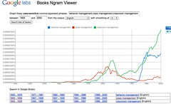
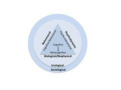

---
categories:
- eded20455
- teaching
date: 2011-06-16 21:24:30+10:00
next:
  text: A new term dawns
  url: /blog/2011/06/20/a-new-term-dawns/
previous:
  text: Design Rationale - ICTs for E-Learning A3
  url: /blog/2011/06/05/design-rationale-icts-for-e-learning-a3-part-2/
title: A simple class management plan for beginning teachers
type: post
template: blog-post.html
comments:
    []
    
pingbacks:
    []
    
---
The following is part of an assignment for my study to become a teacher through [CQU](http://www.cqu.edu.au/). It's written as a letter/report/web page, an odd mix of genre.

### The letter

Dear First Year Teacher,

Having traipsed through the foothills of early teacher education I have been tasked by the Principal to prepare a simple plan for you and your fellow beginning teachers around the topic of behaviour management. My first step is to redefine the problem and prepare a simple plan about class management. The point of this change is touched on below.

So, why should you read this plan? Well, if you are anything like the beginning teachers that participated in the 100 research studies reviewed by Veenman (1984), then class management and discipline are amongst your greatest concerns about teaching. Almost thirty years later Kratochwill (2011) found that this level of concern remained for new teachers. Stroiber (Stoiber, 1991) suggests that for many new teachers, effective class management is seen as the key to success. More broadly, Rose and Gallup (2006) report of surveys over a number of years where the general public list class management and student discipline amongst their major concerns about schools.

Beyond these concerns, is the impact class management has on students. A review of the literature by Wang, Haertel, and Walberg (1993) found that class management has the largest effect on student achievement from a list of 228 variables. Similarly, Sugai and Horner (2008) argue that the link between academic outcomes and behaviour is clear. Failed class management negatively impacts upon students. Gregory & Ripski (2008) draw on insights from a number of researchers to show that students who are suspended are more likely to have low achievement, receive future suspensions, experience dissatisfaction and alienation, drop out, become involved in the juvenile justice system, and later spend time in jail.

Given class management is so important, then how can a novice teacher provide assistance? For a definitive answer you will have to ask the Principal. My answer is that the following simple plan is not a case of you being provided with “the” simple answer to class management. This plan is simple only in that it has only five steps. Five steps designed to scaffold you in the act of developing your own answers to the challenge of class management.

This approach directly recognises the inherent complexity of class management. A complexity which means that there is no magical silver bullet, no universal panacea for class management. I cannot give you the solution. What works for me, in the classes I teach, at the school I teach at, on the days and times during which I teach, will almost certainly not be appropriate for you. In fact, it is unlikely that I can even give you a solution. Instead you need to develop a solution that recognises the inherent complexity and nature of you, your students, and your context. This approach resonates with the perspective seen in Stroiber (1991) that teaching is more than simply the implementation of effective procedures but is instead an on-going process of complex decision-making. This simple plan is intended to help you make a start and continue improving at this complex decision-making process. Each of the five steps in the simple plan is described in more detail in the following sections. In summary, the five steps are:

1. Define class management.  
    How you define class management will directly influence what you see as being included in and excluded from class management and how you perform it.
2. Know yourself, your students and context.  
    The effectiveness of class management techniques depends entirely on who you are, who your students are, and the nature of the learning context.
3. Bring the learning.  
    Appropriate and effective learning and teaching are a central component of any class management plan. For good class management you need to create a good learning experience.
4. Adopt some techniques.  
    Based on the above, you need to select from the numerous sets of class management techniques those that work for you and your context.
5. Reflect and return to step X.  
    Throughout your teaching career you need to continuously reflect on what is happening in class, why is it happening, and what might help improve the experience. The outcomes of this reflection should then be used to revisit any of the previous steps and try again.

### Define class management

Interest in class management (and related terms) is not recent. Figure 1 (click on the figure to see it larger) shows that rate of mention of related terms in a collection of books archived by Google Books. Class management begins being mentioned in the 1850s and is defined in a number of different ways. For example, [Holbrook (1872, p. 133)](http://bit.ly/jK4KKc) offers this

> In these lectures on School Management, as accomplished chiefly in Class Management, I have endeavored, by presenting the real aims and ends of school training, the formation and fixation of correct habits,

 _Figure 1. Incidence of class management and related terms from [Ngrams](http://ngrams.googlelabs.com/graph?content=behavior+management,+class+management,+classroom+management&year_start=1800&year_end=2000&corpus=0&smoothing=3)_

Since then many different perspectives on class management have been taken. Powell and Todd (2004, p. 2) identify perhaps the most common perception when they suggest that for many teachers (and the popular media) behaviour or class management is “solely concerned with establishing control over disruptive students”. McCaslin and Good (1998) offer a related perspective when they descibe how class management is typically seen as ensuring students respond quickly to the demands and goals of the teacher. Many authors, including Evertson and Weinstein (2006) identify the apparent contradiction between this “teacher as controller” perspective of class management and modern views of learning that encourage student independence, understanding, problem solving, and active participation. As an alternative to the discipline or control definition of class management, Evertson and Weinstein (2006, p. 4) offer this definition

> We define classroom management as the actions teachers take to create an environment that supports and facilitates both academic and social-emotional learning. In other words, classroom management has two distinct purposes: It not only seeks to establish and sustain an orderly environment so students can engage in meaningful academic learning, it also aims to enhance students’ social and moral growth

This is the origin of the word class management, rather than behaviour management. In addition to this change, I have changed “classroom” to “class” to remove from the teaching context the notion of a particular, physical room.

Beyond offering a more inclusive perspective of the task. Class management also suggests a move away from a focus on authoritarian or disciplinarian views of the task. This is particular important due to the potential, negative outcomes of a displinary focus. Sugai and Horner (2008) cite a number of authors to show that when punishment becomes the primary approach, negative side effects can include: increases in antisocial behaviour, more coercive interactions among adults and students, and a decrease in academic achievement and social behaviour. Evertson and Weinstein (2006, p. 4) argue that the question is not only whether or not you have achieved order within a class, but it also as important to consider how you achieved that order.

Beyond a simple scale between the disciplinary/control and environmental perspectives of class management, there are numerous different theoretical and conceptual perspectives on class management and related issues. Table 1 and Figure 2 provide overview of two different collections of perspectives. Whatever the model, perspective, or definition of class management you adopt, it is important to understand that your adopted view may well have limitations and that there are alternatives. Gregory & Ripski (2008) describe how teachers vary in the philosophies and perspectives they have about how best to exercise authority and maintain classroom order. Being aware of examining different perspectives may provide useful insight. This is especially important for novice teachers who, as argued by Martin (2004) use their prior and somewhat limited knowledge as the initial scaffold for understanding what role they can play in class management and how they interpret the behaviour of students.

Table 1 is used by Powell and Tod (2004) to provide a summary of the variety of different theoretical perspectives that have been applied to understand and respond to off-task behaviour. It clearly shows how the perspective taken can reveal (or hide) different insights and possibilities.

Table 1. How off-task behaviour might be explained and addressed.
| Frequent behaviour | Theory | Explanation examples | Action |
| --- | --- | --- | --- |
| Off-task | Behavioural | Child is getting more attention by being off-task | Reward on-task behaviour |
| Off-task | Cognitive | Child things he is unable to do the task | Encourage child to reappraise task, identify what parts of the task he can do, etc. |
| Off-task | Affective | Child fears failure. | Circle time to build self-esteem; offer increased adult or peer support |
| Off-task | Biological | Perhaps the child as ADHD? | Refer for medical assessment |
| Off-task | Developmental | Child is not ready to work independently | Allocate learning support assistant and set a more suitable learning challenge. |

_Adapted from “A systematic review of how theories explain learning behaviour in school contexts”, by S. Powell, J. Tod, 2004, Research Evidence in Education Library, p. 16._

Figure 2 (click on the figure to see a larger version) offers another perspective on the various models that have been used to view and understand behaviour. In presenting the diagram in Figure 2, Conway (2009, pp. 130-132) offers a brief description of each of the different models. Conway (2009) does describe the behavioural model – with its focus observing behaviour and then responding without examining underlying causes - as previously the most relevant approach to education. With the ecological and sociological taker a broader, more eclectic approach drawing on the other models.

 _Figure 2. Conceptual models of behaviour. Adapted from “Behaviour and support management”, by R. Conway, 2009, in Education for Inclusion and Diversity, A. Ashman, J. Elkins (eds), p. 131._

#### It's complex

Another perspective of behaviour management, one that informs the ecological and sociological models from Figure 2, is that of complex adaptive systems (CAS). This perspective challenges the current dominant approaches to organisational theory and practice that assume a certain level of predictability and order (Snowden & Boone, 2007). Kim and Kaplan (2006, p. 37) describe complex systems as being

> comprised of populations of interacting entities where the overall system behaviour is not predefined but rather emerges through the interactions of its entities.

Powell and Todd (2004, p. 17) echo this perspective when they describe learning behaviour as “complex, diverse, based on interactional processes and has multiple valid outcomes”. The observation by Schon (1984) that the rigid application of principles or theories is not sufficient since each teaching situation is unique mirrors the perspective provided by CAS. It seems likely that insights from CAS would prove useful in thinking about class management. The following video from uses a children’s birthday party to describe the differences between a CAS approach and two alternative approaches.

http://www.youtube.com/watch?v=Miwb92eZaJg

### Know yourself, your students and context

Having clearly identified how you view class management, the next step is to generate insight into yourself, your students, and the context within which your class operates. It is this knowledge that will guide the subsequent decisions you make with this plan.

#### Yourself

The type of person you are, your abilities, knowledge, strengths, and weaknesses are form part of the toolbox you have to draw upon for class management. They also help define the boundaries within which you can operate. As a beginning teacher your specific knowledge of class management may be limited, hopefully a problem that this plan is helping to address. But you should be aware that there are some common consequences of this. Martin (2004) suggests that a novice teacher is more likely to adopt existing norms in an attempt to “fit in”. Fogarty, Wang, and Creek (Fogarty et al., 1983) suggest that beginning teachers are more sensitive to student behaviours that disrupt teacher plans, rather than being able to identify and respond to cues from the whole class.

While you may be limited in experience, what you do bring to the classroom are your existing strengths, weaknesses, and character. Being aware of these and the impact they have on class management is important. Instruments evaluating learning styles or personality types may be useful. Keeping in mind that these instruments have some weaknesses, but do retain some value. For example, Platsidou and Metallidou (2009, p. 324) identify validity and reliability problems with two learning style tests, but still suggest that they remain useful for encouraging self-development. Are you an introvert? An extrovert? An auditory or spatial learner? Your answers may betray a preference that influences both your learning and your approach to class management. Your answers should also encourage on-going self-development to both build on your strengths and improve your weaknesses.

#### Students

For many authors (Jones & Jones, 2001) the primary purpose of class management is being able to encourage deep learning by responding to the specific needs of both individual students and the class as a group. Marzano and Marzano (2003) found that the quality of the relationship between teacher and student is the keystone of class management. With high quality relationships reducing discipline problems by 31%. Laupa, Turiel, and Cowan (1999) argue that decisions made by adolescents to obey commands are dependent upon the quality of their relationship with the source of the command.

Being able to respond to student needs and developing high quality teacher-student relationships both require you getting to know both your students and how they interact as a group. Strategies for getting to know your students range from viewing academic transcripts, class observation, in class activities, and talking directly with students, their parents, friends, and other teachers. The better you know the students, the better you can respond to their needs and build effective teacher-student relationships.

#### Your context

As a formal learning site, all schools are likely to have an established set of assumptions, expectations and routines. This is particularly the case around issues of class management and discipline. As a teacher at a school you are expected to meet those expectations, so being aware of them is key. At this school these expectations are outlined in the staff manual available from the staff network drive. A few important points include:

- There are four levels of inappropriate behaviour with specific examples at each level.
- The first level remains the responsibility of the classroom teacher, the second involves the appropriate House or Academic Dean, the third the Assistant to the Principal – Students, and the last level the Principal or Deputy Principal.
- Escalation to higher levels occurs due to either the severity of the misbehaviour or through repetition.
- Where possible teachers are expected to deal with behavioural problems within their class and where possible help students make better behaviour choices and when possible determine the consequences of their actions.

Beyond these, the staff manual offers a range of recommendations for action and explicit specification of acceptable and unacceptable behaviour.

### Bring the learning

For many people teachers, due to their role, are authority figures. Figures to be respected and taken note of. From this perspective students are expected to see teachers as legitimate authority figures and follow their directions. Gregory and Ripski (2008) cite numerous authors who suggest that this assumption no longer holds, if ever it did. They draw on insights from sociologists to argue that the legitimacy of authority is negotiated within the context of social relationships. From this perspective, whatever authority students cede to you will arise from their perceptions of you, the school, and the learning experiences you create for them.

Arising from this is the argument that an essential component of your class management plan must be to create effective and appropriate learning experiences for your students. The advice from this plan is that creating these exciting, effective, and appropriate learning experiences should perhaps by your prime aim. It is why the five steps of the plan could serve just as well as a simple plan for learning design or personal development of a teacher. Class management, learning design, and personal development are not seen as separate tasks.

### Use some techniques

It is not uncommon to see discussions of class management focus on the sharing of techniques. An indicator of this tendency is the prevalence of lists of such techniques amongst the results of Google searches on topics such as “class management” and “behaviour management”. Rather than create another such list, the following is a list of lists (some of which are in turn lists of lists) of class management techniques. It will probably date fairly quickly, but that’s no problem. By this stage I’m sure your teacher education studies has taught you how to use Google as effectively as I can.

Some initial pointers include:

- [The Teacher’s Guide page on classroom management](http://www.theteachersguide.com/ClassManagement.htm).  
    A list of links to other site on a wide variety of class management techniques and issues.
- [A contributed and voted upon list of techniques](http://www.supersubstituteteachers.com/classmgt.htm) from substitute teachers.
- [Top ten tips](http://712educators.about.com/od/discipline/tp/disciplinetips.htm) for classroom discipline and management

The following are worthy of special mention:

- [Classroom Management](http://www.4faculty.org/includes/108r2.jsp).  
    A website aimed at University staff, but which still provides value for staff at the primary and secondary level. Some explanation to accompany the techniques.
- [A 55 minute video](http://www.youtube.com/watch?v=WySS1tsyjm0) of a workshop on class management techniques.
- [A website](http://justforteachers.yolasite.com/) put together by a CQUni student that gives a good introduction to the topic of behaviour management.

The assumptions behind this simple plan agree with the observation by Powell and Tod (2004) that having a collection of techniques is a necessary part of a teacher’s toolkit, but it is not sufficient. Having identified and prepared a collection of techniques that match with your perspectives on class management and your teaching context is an important first step. But it is necessary to keep reflecting.

### Reflect and return to step X

Some of the techniques you’ve adopted will not work, some will work at different times. It is important that you continue reflecting on what has happened and making changes to your perspectives of class management, yourself, your students, and your teaching context. The purpose of this step is to encourage you to do this. Reflect upon what happened as your tried your techniques and use that insight to revisit the earlier steps, change your mind, and try again. This plan argues that on-going reflection is an essential component of not only class management, but also your development as a teacher.

Gratch (1998) suggests that experienced teachers do not simply master teaching skills, but instead continue to learn about teaching through continued reflection and improvement of practice. Stoiber (1991) found that reflective practitioners were better able to analyse problems and had more positive attitudes to solving class management problems than a group taught prescriptive principles. On the other hand Marcos, Sanchez, and Tillema (2008) find numerous problems with reflection, including a significant distance between what is said and done and questions about exactly what reflection is, however, they also find that it is reasonable and desirable. Finding the time and energy to reflect while teaching can be difficult, but effective reflection and subsequent change in practice is essential.

Another essential component of this step is communication. Gratch (1998, p. 220) draws on numerous authors on teacher socialisation to describe teachers as working in isolation, rarely requesting assistance, unlikely to feel able to tell another teacher to do something different, and avoiding discussion of pedagogical practice. Given the complexity of class management, reflection in isolation is liable to narrow future possibilities. Instead, it is important to communicate with your peers. Talk with teachers, both within and outside your school, and talk with a range of people from outside the profession. Perhaps more importantly, listen to a broad array of perspectives and be prepared to use those perspectives to modify your perspective and practice.

### In conclusion

The design of this simple plan in class management has helped me develop some personal insights and reinforce the indivisibility of good teaching and class management. It has reinforced for me the importance of an on-going process of reflective practice to change, and hopefully improve, my teaching. I hope you have gotten some value out of it.

Good luck with your career in teaching.

David.

### References

Conway, R. (2009). Behaviour and support management. In A. Ashman & J. Elkins (Eds.), _Education for Inclusion and Diversity_ (3rd ed., pp. 123-166). Frenchs Forest, NSW Australia: Pearson Education Australia.

Evertson, C. M., & Weinstein, C. S. (2006). _Handbook of classroom management: research, practice, and contemporary issues_. Lawrence Erlbaum Associates. Retrieved from http://books.google.com.au/books?id=WQGuQxJ5o4EC.

Fogarty, J. L., Wang, Margaret C, Creek, R., Taylor, P., Fogarty, J. L., Wang, Margaret C, et al. (1983). Descriptive Novice Study Teachers - Thoughts of Experienced Interactive and and Instructional. _The Journal of Educational Research_, _77_(1), 22-32.

Gratch, a. (1998). Beginning Teacher and Mentor Relationships. _Journal of Teacher Education_, _49_(3), 220-227. doi: 10.1177/0022487198049003008.

Gregory, A., & Ripski, M. B. (2008). Adolescent trust in teachers: Implications for behaviour in the high school classroom. _School Psychology Review_, _37_(3), 337-353.

Holbrook, A. (1872). _School management_. A. S. Barnes. Retrieved from http://books.google.com/books?id=4JVDAAAAIAAJ.

Jones, V., & Jones, L. (2001). _Comprehensive classroom management: Creating communities of support and solving problems_. _Library_ (Vol. 1968). Boston: Allyn & Bacon.

Kim, R. M., & Kaplan, S. M. (2006). Interpreting socio-technical co-evolution: Applying complex adaptive systems to IS engagement. _Information Tech_, _19_(1), 35-54.

Kratochwill, T. (2011). Classroom management. _American Psychological Association_. Retrieved June 8, 2011, from http://www.apa.org/education/k12/classroom-mgmt.aspx.

Laupa, M., Turiel, E., & Cowan, P. (1999). Obedience to authority in children and adults. In M. Killen & D. Hart (Eds.), _Morality in everyday life: Developmental perspectives_ (pp. 131-165). New York: Cambridge University Press.

Marcos, J. J. M., S‡nchez, E., & Tillema, H. (2008). Teachers reflecting on their work: articulating what is said about what is done. _Teachers and Teaching_, _14_(2), 95-114. doi: 10.1080/13540600801965887.

Martin, S. (2004). Finding balance: impact of classroom management conceptions on developing teacher practice. _Teaching and Teacher Education_, _20_(5), 405-422. doi: 10.1016/j.tate.2004.04.002.

Marzano, R. J., & Marzano, J. S. (2003). The key to classroom management. _Educational Leadership_, _61_(1), 6-13. Wadsworth Pub Co.

McCaslin, M., & Good, T. L. (1998). Moving beyond management as sheer compliance: Helping students to develop goal coordination strategies. _Educational Horizons_, _76_(4), 169-176.

Platsidou, M., & Metallidou, P. (2009). Validity and Reliability Issues of Two Learning Style Inventories in a Greek Sample : Kolb's Learning Style Inventory and Felder & Soloman's Index of Learning Styles. _International Journal of Teaching and Learning in Higher Education_, _20_(3), 324-335.

Powell, S., & Tod, J. (2004). A systematic review of how theories explain learning behaviour in school contexts. _Research Evidence in Education Library_, (August). London. Retrieved June 2, 2011, from http://scholar.google.com/scholar?hl=en&btnG=Search&q=intitle:A+systematic+review+of+how+theories+explain+learning+behaviour+in+school+contexts#0.

Rose, L. C., & Gallup, A. M. (2006). The 38th Annual Phi Delta Kappa/Gallup Poll of the publicʼs attitudes toward the public schools. _Phi Delta Kappan_, _88_(1), 41. PDK International. Retrieved June 7, 2011, from http://www.kappanmagazine.org/content/88/1/41.short.

Schon, D. (1984). _The reflective practitioner: How professionals think in action_. New York: Basic Books.

Snowden, D., & Boone, M. (2007). A leaderʼs framework for decision making. _Harvard Business Review_, _85_(11), 68-76.

Stoiber, K. C. (1991). The Effect of Technical and Reflective Preservice Instruction on Pedagogical Reasoning and Problem Solving. _Journal of Teacher Education_, _42_(2), 131-139. doi: 10.1177/002248719104200206.

Sugai, G., & Horner, R. (2008). What We Know and Need to Know about Preventing Problem Behavior in Schools. _Exceptionality_, _16_(2), 67-77. doi: 10.1080/09362830801981138.

Veenman, S. (1984). Perceived Problems of Beginning Teachers. _Review of Educational Research_, _54_(2), 143-178. doi: 10.3102/00346543054002143.

Wang, M. C., Haertel, G. D., & Walberg, H. J. (1993). Toward a Knowledge Base for School Learning. _Review of Educational Research_, _63_(3), 249-294. doi: 10.3102/00346543063003249.