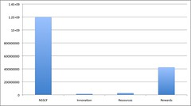

See also: [[blog-home | Home]]

So the Australian Federal Government recognises that there is something going on (DEEWR, 2010)

> Australian students must be prepared for living and working in a highly technological and information rich world that is rapidly changing.

. So much so they have embarked on a [Digital Education Revolution](http://www.digitaleducationrevolution.gov.au) at a cost of at least $2.4 billion dollars. The DER

> aims to contribute sustainable and meaningful change to teaching and learning in Australian schools that will prepare students for further education, training and to live and work in a digital world.

That has to be good news doesn't it? Of course, the devil is in the detail and from what I've been able to find, it doesn't look good.The following graph shows the respective amounts of money allocated by the government to various projects.

Can you guess which of those projects is aimed at providing funds to teachers and teacher educators to develop the skills and practices necessary to "live and work in a digital world"?

The most expensive project (at least $1.2 billion) is for ensuring that there is a 1:1 computer to student ratio in Years 9-12 in all Australian schools by the end of this year. Can you hear those hardware companies licking their lips?

The next most expensive project (at around $425 million) is less than half as expensive as handing out computers. It's actually for the [National Rewards for Great Teachers project](http://www.deewr.gov.au/Schooling/Pages/RewardPaymentsforGreatTeachers.aspx). A project where the top 10% of teachers will receive a bonus of up to 10% of their salary. $50 million of that goes to education departments to "align their current approaches to performance management with the new Australian Teacher Performance Management Principles and Procedures". The last I heard, student performance on national literacy and numeracy tests would be part of the indicators of a great teacher. This sort of thing is certain to encourage teachers to experiment with innovative digital learning approaches.

The next largest budget is for the [Online curriculum resources and digital architecture](http://www.deewr.gov.au/Schooling/DigitalEducationRevolution/Pages/Onlinecurricul
umresourcesanddigitalarchitecture.aspx) project associated with the DER. For $28.6 million the project is developing quality digital resources, interoperable systems and architects, and policies and protocols to support "schools' access to and engagement in quality teaching and learning environments". Yes, the learning objects and repository crowd are still getting some government money.

The smallest budget (of about $16 million) is for the [ICT Innovation Fund](http://www.deewr.gov.au/Schooling/DigitalEducationRevolution/DigitalStrategyforTeachers/Pages/ICTInnovationFund.aspx). This is the project focused on providing teachers with "significant ongoing support to improve student performance and ensure the Digital Education Revolution (DER) initiative is a success". At least half of this budget is for the Teaching Teachers for the Future project. The remaining money is being used to develop: "seven online teaching packages which will show teachers how they can incorporate the use of ICT in everyday learning, with a focus on Phase 1 of the Australian Curriculum" (which probably means if you're not teaching English, Mathematics, Science and History, you miss out); a safe online environment within which teachers and school leaders can evaluate and build on their ICT skills; and, an online portal "through which principals and aspiring school leaders can access expert ICT advice and tools as well as network with other principals and aspiring school leaders".

Have these people not heard of the Internet and building a personal learning network?

And this short discussion doesn't even start to include the amount of money being spent by the Government on standardised testing and other projects. I'm increasingly skeptical about the outcome of this.

### References

DEEWR. (2010). ICT strategic planning guide for Australian schools (p. 16). Canberra, ACT, Australia. Retrieved from http://www.deewr.gov.au/Schooling/DigitalEducationRevolution/DigitalStrategyforTeachers/Documents/ICTStratPlanGuide.pdf.