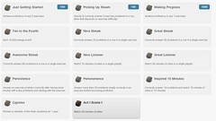

---
categories:
- eded20487
- teaching
date: 2011-08-14 20:27:16+10:00
next:
  text: Is IT a service industry, or is it "eating the world"?
  url: /blog/2011/08/23/is-it-a-service-industry-or-is-it-eating-the-world/
previous:
  text: Gamification by camouflage - fads and higher ed
  url: /blog/2011/08/09/gamification-by-camouflage-fads-and-higher-ed/
title: Khan academy, gamification, the flipped classroom and mathematics
type: post
template: blog-post.html
comments:
    []
    
pingbacks:
    - approved: '1'
      author: Khan academy, gamification, the flipped classro...
      author_email: null
      author_ip: 89.30.105.121
      author_url: http://www.scoop.it/t/math-inquiry-project/p/4000764431/khan-academy-gamification-the-flipped-classroom-and-mathematics
      content: '[...] As the title also suggests, I&#039;m seriously considering writing
        a unit of work based on the assumption of using the Khan Academy videos, its recent
        &ldquo;gamification&rdquo; features, and the notion of the flipped classroom (plus
        ...&nbsp; [...]'
      date: '2013-04-30 02:49:41'
      date_gmt: '2013-04-29 16:49:41'
      id: '121'
      parent: '0'
      type: pingback
      user_id: '0'
    
---
As part of my study to become a high school teacher (Information Technology and Mathematics) I have to develop a unit of work for a senior class (defined here as being in Grades 10-12). As part of this process I'm meant to

- Describe myself as a teacher and learner (500 words max.).
- Describe the learner cohort (1000 words max.).
- Bring it all together (500 words max.).

The idea, I believe, is to show how I can develop some insight into the students I'm teaching and come up with a plan for how to successful engage them in learning.

As the title of this post suggests, the unit of work I do will be based on a Grade 10 Mathematics class. (In this context there are three levels of Grade 10 mathematics courses, the class I'm focusing on is the middle group).

As the title also suggests, I'm seriously considering writing a unit of work based on the assumption of using the Khan Academy videos, its recent "gamification" features, and the notion of the flipped classroom (plus some additional features as necessary).

Anyone got "bingo" on their buzzword bingo cards yet?

The purpose of this post is to encourage me to reflect and share upon why I'm thinking of taking this approach and to act as a rough working diary. If some nice folk provide useful feedback and pointers, so much the better.

It should be noted, that there is no requirement for me to actual implement this unit of work.

### Why?

First, I want to push myself a bit. I could do a fairly standard unit of work and get a pass mark or a bit better. Adopt all the standard practices and assumptions but stick fairly tightly with the ["grammar of school"](/blog/2009/04/24/models-of-growth-responding-to-the-grammar-of-school/).

Second, I don't have the time to push myself too much. This assignment has to be finished in about a week (I've submitted two assignments in the preceding two weeks) and I have prac teaching and a family to consider. I'm aware of the some/many of the limitations of Khan Academy, the idea of "gamification" (e.g. [gamification is bullshit](http://bogost.com/blog/gamification_is_bullshit.shtml)), and the problems faced by flipped classrooms where students just don't do "the homework". And yes there is [the idea](http://venturebeat.com/2011/05/17/the-case-against-khan-academy/) that this type of use of Khan Academy is de-valuing the role of the teacher. i.e. turning them into "facilitators". There's always a chance of this, but in my mind there is still a need to connect this stuff to the real world and engage the learners. This is where I come in. Not delivering the same content and not just providing one-on-one assistance. But engaging the learners in the authentic, exciting stuff that provides the context for the Khan Academy stuff.

Third, I fear that moving beyond these buzzwords toward something like project/problem-based learning would be a step too far outside the "grammar of school". Not to mention the Unit of Work template I have to use. I'm pretty sure it would be a step too far for my naive and limited knowledge of mathematics and high school.

Lastly, while recognising the limits of the "grammar of school", I'm increasingly frustrated by the constraints and limitations I see from this grammar in operation at local high schools. What it is doing to students and teachers is incredibly saddening. Something has to change and while Khan/gamification/flipped classroom are all buzzwords with their detractors I've convinced myself that an appropriate combination might just have some promise.

So, the process of developing this unit of work should give a reality check to this half-baked perception of promise.

### Current problems

The following list of problems is not specific to the class I'm thinking of, but instead is a general list of problems with high school mathematics classes that I've observed and read about in the literature. This will need to be revised for the final assignment, but this is an initial list, in no particular order.

1. The teacher is the bottleneck/kids can't work at their own pace  
    The only source of instruction is the teacher. It is done via the board/worksheet and the teacher waits for all students to be ready/have written down the work. In the current class, the vast majority of the students don't have the textbook. In a previous class I observed, while the students had taken possession of the text, it rarely made it to class.
2. The teacher is only available during class time.  
    Once the lesson on "topic X" is complete, it generally won't be completed. The student can't revise it. They might have a textbook, but that's not really going to help.
3. Students are disempowered.  
    They can't work at their own pace, can't make decisions about what suits them. Have to do the homework tonight, even though they have to go to their part-time job. Having to sit quietly while waiting for the rest of the class catchs up bores the students and then they get in trouble because the process isn't engaging them. Talk about frustrating. Not to mention how the students who are a bit slower than everyone else feels about being continually visible as the one holding up the rest of the class.
4. Collaboration is frowned upon.  
    Talking with your mate is out. You can even get in trouble when trying to help.
5. Student/teacher interaction is heavily weighted toward information distribution of content, with almost no time for providing one-on-one assistance.
6. The lack of connection between the students' world and mathematics.
7. There are some kids that are missing out.  
    There are some students who are obviously rebelling and not learning and that's sad enough. What I really fear (and tend to believe) is that there are many more students who are putting a good face on it, but really aren't getting it.

Now, not all classes have all of these problems. But I'm pretty sure most of the math classes have some of these problems at some stage.

### So what's the vague plan?

I have this vague idea based on on ad hoc observations of bits and pieces that when supplemented with a few additional activities/resources, the Khan Academy functionality might provide some answers to some of these problems.

The basic plan goes something like, after careful preparation the students are given the responsibility of working through the Khan Academy videos and quizzes that match the required curriculum for this unit of work. This is done at times when the students choose and at a pace that suits them. It's their responsibility to complete the work within the allotted time.

It's also their responsibility to figure out how best to access the computing resources necessary to do this. To support those with limited computing resources at home, there would have to be 1-1 school computers available during classes and perhaps for at least 1 or 2 sessions outside class. Preferably the school would have 1-1 computers for students all the time. I wonder what the Khan Academy position is on downloading the videos and placing them on DVD/CD for students without Internet access? They [support it](http://www.khanacademy.org/about/faq#access-content) and several projects are providing it in various ways.

Encouragement/pressure (a fine line to tread) to complete the work is achieved through use of the Khan Academy self-assessment system to allow the teacher to observe progress and also work this into some sort of group-based collaboration. i.e. (very vague here) the students aren't working entirely alone. They are members of small groups - which should probably be self-selected in keeping with the empowerment angle, or perhaps some dating agency software along the lines of [social network stimulation](http://www.cognitive-edge.com/method.php?mid=43) - which are competing towards some sort of goal that depends on the success of all (yea, I do realise this is a bit tenuous and questionable).

Actually, perhaps rather than being too explicit with deadlines, it might be more appropriate to schedule _"Project days"_ at regular intervals. i.e. a day where the lesson is focused on some sort of "fun/interesting" activity that requires application - at least in part - of what the students are meant to have covered by now. The timetable for these days is established well in advance and its up to the students/groups to be prepared or to decide that they don't wish to.

I could bump up my buzzword bingo quota by basing these "Project days" on Dan Meyer's [anyqs/WCWYDT approach](http://blog.mrmeyer.com/?cat=70). Even better would be having the space for the students to develop their own...but I think I may be getting way ahead of myself there.

What is missing from the Khan Academy approach (at least based on what I've seen of the videos) is that real world connection. The KA videos are essentially the same sort of "lecture" approach that I would use. There needs to be something that encourages students to make connections with what the math they are doing and the world around them.

This is where some sort of idea of "Real World Maths" enters the picture. Have a requirement that each student provide some example of a real life connection with math (perhaps not necessarily connected with the current curriculum) in order to "level up" etc. Perhaps tie this to a class blog and require posting to it.

### Downloading the video

Khan Academy have a [offline version](http://www.khanacademy.org/downloads) for Windows computers that includes a server. That might work okay for kids, but I don't have a Windows box and have an aversion to doing anything with it.

The [Khan Academy on a Stick](http://mujica.org/khan/) project looks interesting. All the maths and science videos as of OCt 2010. A 16Gb download on what appears to be a very slow network connection. Mmm, there's not a lot of progress there yet.

It's also on iTunes.

### Some questions

The following is a list of questions I need to answer before this becomes a reality

1. Does KA have the videos to cover the content this unit of work is meant to cover?  
    The UoW has to cover at least half a term, and no more than a full term. Which for the current term is 10 weeks. Going by the work plan I've copied, the first two topics we've covered would make about 6-7 weeks. Sounds good. The topics are:
    - Ratios and rates to solve practical problems.
    - Direct proportion.
    - Inverse proportion.
    - Percentage.
    - Percentage up/down.
    - Business percentage.
    - Simple interest.I've found a long list of videos. Will need to look at each of these in more detail and connect them to the curriculum, identify any holes and see just how long simply watching the videos would take.
2. Is there an easy way to create a Khan Academy playlist?  
    Having identified a possible list of related videos, can I create a playlist of these videos for the students and for me to download? Could do the YouTube playlist thing, but how does that play with Khan Academy's tracking stuff?
3. Would these videos be appropriate for the cohort?
4. What are the KA exercises available for each of these areas?
5. How different is the content from what is expected in the Queensland curriculum and way of doing things?
6. How much video would students theoretically have to watch to complete the required curriculum?
7. How does that time match with the available class time?  
    The class has 4 \* 55 minute lessons each week. If I'm aiming for a 7 week unit, that's a total of 25.6 hours.
8. Is it possible to programatically extract student progress information from KA so I can merge it with other data (e.g. real world maths)?
9. Who else has done something like this?
10. Can I meet the requirements of the assignment with this approach?
11. How do students get access to Khan Academy as a recognised individual?  
    [As a teacher](http://www.khanacademy.org/about/getting-started#teachers) I can create an account on KA and then the students need Google accounts to register and then they need to identify me as their coach.

What else should I be asking?

### What does a user see

Well, I've just logged in with my Google account and here's what I see (click on the image to see a larger version).

The energy is coming about since I've been exploring videos and preparing for a return home and the slow download speeds. i.e. I've opened up all the relevant sounding videos and pressed play and left them downloading in the background. KA thinks I've watched them and has awarded me badges accordingly.

i.e. this is open to corruption, at least in terms of watching videos. Doing the exercises is a little more difficult. Some of the badges available.

They've obviously put some work into this, how well it motivates the students to learn is another question.

Another question/problem is that I'm assuming the badges thing gets broken if you're not using the videos from the KA website. i.e. it assumes your online. Not an assumption you could make in a class setting given current technology limitations.