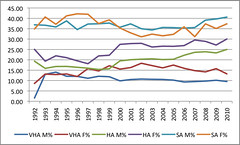

---
categories:
- thesis
date: 2011-08-27 17:56:41+10:00
next:
  text: Push-button schools and zap hats - The future of education
  url: /blog/2011/08/29/push-button-schools-and-zap-hats-the-future-of-education/
previous:
  text: Is IT a service industry, or is it &quot;eating the world&quot;?
  url: /blog/2011/08/23/is-it-a-service-industry-or-is-it-eating-the-world/
title: Some trends with enrolments in IPT
type: post
template: blog-post.html
---
The following graphs are based on [statistical information](http://www.qsa.qld.edu.au/617.html) provided by the Queensland Studies Authority. The intent was to explore what was happening in terms of enrolments in the Senior High School course [Information and Processing Technology (IPT)](http://www.qsa.qld.edu.au/11678.html).

The picture doesn't appear to be that rosy (if you assume doing IPT is good).

### Percentage enrolments

The following graph shows how the percentage of all OP students (OP students are essentially those thinking of trying to get into University. I've used this figure, rather than all students, because recent changes in Queensland schooling has resulted in significantly greater number of overall students) enrolled in IPT. (Click on the graph to see a bigger version).

Not surprisingly the % of boys enrolled in IPT peaks in 2002 at just over 35% of all OP boys at high schools. It's declined since then to under 20% last year.

The % of females enrolled in IPT has never reached 10%. It peaked in the lead up to the dot-com boom and is currently sitting at 2.9%

### Students per school

A similar story can be seen in the following graph, which shows the average number of total students, boys and girls studying IPT at each school that is offering the course IPT.

Dot-com boom increase, followed by fall. Girls have always been falling.

On average, there are less than 10 students in every IPT class in Queensland. That doesn't look very sustainable.

### Results

The following fairly messy graph compares the % of students enrolled in IPT who received the top 3 results (in descending order VHA, HA and SA). The students are divided by gender.

The story is that for the top 2 results (VHA and HA) there is a greater percentage of female students than male. The females are out-performing the males in IPT.