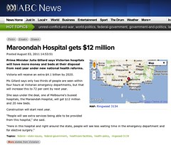

---
categories:
- teaching
date: 2011-09-21 10:54:55+10:00
next:
  text: BIM and BIM2 - Who needs it? What do you need?
  url: /blog/2011/09/22/bim-and-bim2-who-needs-it-what-do-you-need/
previous:
  text: A summary of one perspective on the Digital Education Revolution
  url: /blog/2011/09/19/a-summary-of-one-perspective-on-the-digital-education-revolution/
title: '"The final plan: Khan Academy, gamification and the flipped classroom"'
type: post
template: blog-post.html
comments:
    []
    
pingbacks:
    - approved: '1'
      author: 'HD_Links: Khan Academy | Networked Teaching &amp; Learning'
      author_email: null
      author_ip: 128.206.4.65
      author_url: http://blog.emints.org/?p=1530
      content: "[...] &#8220;The final plan: Khan Academy, gamification and the flipped\_\
        classroom&#8221; (David Jones) [...]"
      date: '2012-01-13 02:25:39'
      date_gmt: '2012-01-12 16:25:39'
      id: '127'
      parent: '0'
      type: pingback
      user_id: '0'
    - approved: '1'
      author: How are they going? | The Weblog of (a) David Jones
      author_email: null
      author_ip: 66.155.8.66
      author_url: https://djon.es/blog/2013/03/04/how-are-they-going/
      content: '[...] taken from here [...]'
      date: '2013-03-04 13:34:02'
      date_gmt: '2013-03-04 03:34:02'
      id: '128'
      parent: '0'
      type: pingback
      user_id: '0'
    - approved: '1'
      author: dy/dan &raquo; Blog Archive &raquo; Hot Links
      author_email: null
      author_ip: 50.23.235.201
      author_url: http://blog.mrmeyer.com/?p=11825
      content: '[&#8230;] McCrea, David T. Jones, Alex Eckert, and Daniel Schneider are
        all on my reading list and they all have a special fondness [&#8230;]'
      date: '2013-07-03 02:04:00'
      date_gmt: '2013-07-02 16:04:00'
      id: '129'
      parent: '0'
      type: pingback
      user_id: '0'
    - approved: '1'
      author: 'The final plan: Khan Academy, gamification and ...'
      author_email: null
      author_ip: 89.30.105.121
      author_url: http://www.scoop.it/t/aprendizaje-invertido/p/4005178110/the-final-plan-khan-academy-gamification-and-the-flipped-classroom
      content: '[&#8230;] Just over a month ago I started planning a Unit of Work (UoW)
        for Year 10 Core Mathematics. i.e. the rationale and design of about 8 or so weeks
        of lessons for such a class. The following gives a d...&nbsp; [&#8230;]'
      date: '2013-07-25 22:22:58'
      date_gmt: '2013-07-25 12:22:58'
      id: '130'
      parent: '0'
      type: pingback
      user_id: '0'
    
---
Just over a month ago I [started planning](/blog/2011/08/14/khan-academy-gamification-the-flipped-classroom-and-mathematics/) a Unit of Work (UoW) for Year 10 Core Mathematics. i.e. the rationale and design of about 8 or so weeks of lessons for such a class. The following gives a description of the final unit of work.

In the end, the UoW makes little use of gamification. There is a plan to use progress bar to track group progress, but not in the sense of badges etc. The UoW does rely heavily on the assumed use of Khan Academy videos and exercises and hence uses the notion of the flipped classroom. The UoW also attempts to use a [Media Watch](http://www.abc.net.au/mediawatch/) like assumption to move toward the approach of Gustein (2003, p. 66) that showed it is possible to help “students begin to read the world with mathematics, develop mathematical power, and change their dispositions toward mathematics through the process”.

To be clear, this is the plan for a unit of work that has not been implemented. It is not likely to be implemented by me.

The constraints of the school environment in which I currently find myself is such that it would take some time and effort to make the sorts of changes embedded in the UoW. As a student teacher I don't have the time nor the trust of the school necessary to make this change.

I start my internship in a couple of weeks. During this 6 weeks the class I designed this for

The following includes

- The Cohort - my take on the students in the class.
- The UoW - a summarised description of the UoW.
- The resources - a sample of the resources used within the UoW, including: an example Math Watch sheet, an IMPACT form, and the identified Khan Academy videos to be used.

## The Cohort

The unit of work (UoW) designed below is intended for delivery at a school at which 55% of the students are drawn from the bottom quarter of Australian students based on the Index of Community Socio-Educational Advantage (ICESA). It also shows that of the students that reach Grade 12 at the school, only 10% go onto tertiary studies. Findings that seem to support the established strong relationship between educational advantage, in terms of the occupations and levels of education of a student's parents, and the student's educational achievement (ACARA, 2011, p. 2). This suggests that many of the school's students do not come from home environments in which academic achievement has been experienced, nor perhaps valued, by the parents.

This UoW is for a Year 10 Core Mathematics (Y10CM) class, and not the more academically inclined Year 10 Advanced mathematics. This suggests that a majority of the student cohort will come from a home situation in which study in general, and mathematics in particular, is neither valued nor seen in a positive light. Many of the students will perceive mathematics as being difficult and fail to see the relevance of mathematics to their futures. It is also likely that many students will have perceptions of low mathematical self-efficacy and have what Dweck (2007) describes as fixed mindsets. Experience teaching this class seems to offer support for these observations.

Of the 27 students in the class, 13 are male and 14 are female. None of the students have an indigenous background. An ad hoc survey of interests conducted during the second week of classes revealed interests in: music, sport (football and netball), and computer games (primarily Call of Duty). Table 2 describes four categories of students in this class and is based on discussion with my mentor teacher and classroom observation. It's a categorisation that matches experience at a previous school. The numbers in each group are a rough estimate with the role of camouflage making categorisation difficult.

None of the students are currently formally identified by the school, or informally identified by the teachers as being high needs. Some of the students do show characteristics that might fit within Marzano and Marzano's (2003) passive, aggressive, and attention problem categories. The three/four students within the "Those who rebel" category do represent an on-going classroom management challenge.

Table 1. Categories of students in one school Year 10 Core Mathematics.
| Category | Members | Description |
| --- | --- | --- |
| Those who get it | 7 | Students who grasp mathematics concepts relatively easily |
| Those who struggle | 3 | Understanding concepts is somewhat of a challenge, but visibly trying, if somewhat ineffectively |
| Those who camouflage | 14 | Appear to engage with expectations, but on closer examination are struggling to a varying extent |
| Those who rebel | 3 | Actively disruptive and not trying |

Diversity in terms of learning styles has not been considered here due to limitations in known tests and what are seen as more fundamental problems. The first is with diversity. Sullivan (2011, p. 40) suggests that

> Mathematics teachers, arguably more than most teachers, find in every lesson that they must address the challenge that some students learn the current content quickly, while others require substantial support

Within this class there are students who have completed an exercise before the teacher has finished explaining it. At the other extreme are those students still struggling for understanding after 20 minutes of on-going explanation. The perspective adopted here is that identifying the source of this diversity, be it learning styles or a combination of other factors, is less important than designing learning experiences that provide students and the teacher with the ability to deal with this diversity.

Goos et al (2007, p. 16) suggest that helping students make sense of mathematics is the second of two significant challenges for mathematics teachers in the 21st Century. Few of these students enjoy or see the importance of mathematics. This is in spite of the majority of students aiming for careers that require a pass in this class. This has implications in terms of student motivation and also contributes to the behaviour issues. It appears that Dweck's (2000) argument, cited by Sullivan (2011, p. 49), applies in this class. That is, that helping these students may be as much about addressing their orientation to learning (and mathematics) as it is addressing cognitive problems.

Based on this analysis of the student cohort, the design of this UoW has been influenced by the following inter-related aims:

- Maximise the ability for students and teacher to respond to student diversity.
- Increase the students' sense of control and agency about learning mathematics.
- Provide students the opportunity to see the sense of mathematics, to see its importance to their lives.
- Encourage the development and practice of meta-cognitive and self-regulation skills amongst students.
- Provide opportunities for students to collaborate and build a sense of community with the class where all students feel they are contributing.
- Make each student's progress transparent in appropriate ways to them, the teacher and other students to enable collaboration, task differentiation, increased levels of feedback and recognition, and limit opportunities for camouflage.

## The Unit of Work

Year level: Year 10 Mathematics A.  
Unit Title: Rates, ratios, proportion, percentage and interest: Finding the lies and misdirections in everyday life.

### Key Question

Everyday mathematics is used by businesses, politicians, and in advertising to mislead, to hide the truth, and to show a situation in a more positive light. Sometimes this is a mistake, but more often it is done on purpose. This unit is going to answer the question

> How can mathematical knowledge of rates, ratios, proportion, percentages and interest be used to identify, expose and explain these lies and misdirections?

### Rationale

As they progress through Year 10 students are increasingly seeing themselves as adults and balk at the limited level of control over their education traditional teaching, especially in mathematics, offers them. This unit takes place in Term 3. During this term students are scheduled to go on work experience and select their senior subjects. Events that further reinforce their perception of themselves as adults. The design of this unit seeks to provide students with a greater sense of control.

At the same time, it is widely recognised that current teaching approaches deal badly with the significant diversity in mathematical ability amongst students. The design of this unit also aims to make this diversity more visible and provide opportunities for both the individual students and the teacher to respond appropriately to that diversity. The design is driven more by student capabilities and experience than a set of pre-planned strategies.

Lastly, the unit seeks to respond to one of the major challenges facing mathematics in the 21st century, helping students see the purpose and relevance of mathematics. The key question of this unit and a major recurring activity seeks to have students actively using their mathematical knowledge to seek out, understand, and correct misapplications of mathematical knowledge used by actors to mislead. As a significant departure from common practice there is significant groundwork to be laid prior to this unit of work. The assumption is that prior units for this class – focused on basic geometry, algebra and functions, fractions and decimals – will have introduced a range of routines and technologies that will be expanded upon in this unit. For example, the use of Khan Academy videos and exercises, co-operative learning, and the development of student skills in meta-cognition and self-regulation.

The aim of the unit is for the students to develop through a range of strategies (e.g. flipped classroom, Khan Academy resources, gamification, analytics, differentiated instruction etc.) an understanding of rates, ratios, proportion, percentage and interest. This development will be largely at a time and pace to suit them (within the constraints of having to complete this unit prior to a mid-semester test). That knowledge will be then applied to understand a range of real-life situations (e.g. pricing, media stories, loans and investments etc) and identify the half-truths and misdirections that are perpetrated using mathematics.

### Syllabus links

This unit is designed to meet the requirements of the Year 10 Guidelines for Mathematics (QSA, 2009). It aims to support the rationale for the Mathematics Learning Area, in particular (QSA, 2009, p. 9)

> Mathematics helps people make meaning of their life experiences through the use of universally true abstractions and, at the same time, to apply these abstract concepts to interpret new situations in the real world…a sound knowledge is essential for informed citizenship. Through enhanced understanding of mathematics, people can become better informed economically, socially and politically in an increasingly mathematically oriented society.

The Knowledge and Understanding focus of the unit arises from the Number organizer. With a specific focus on rates, ratios, direct and inverse proportions, percentage and financial applications such as interest (simple and compound) and taxation.

Ways of working will include:

- interpret, clarify and analyse situations to identify the key mathematical features and conditions, strategies and procedures that may be relevant in the generation of a solution
- communicate thinking, and justify and evaluate reasoning and generalisations, using mathematical language, representations and ICTs
- select and apply mathematical definitions and rules, mental and written computations, estimations, representations, and information and information and communication technologies (ICTs) to generate solutions
- reflect upon, identify and appreciate the power, value and elegance of mathematics, and the contribution of mathematics to their own and other people’s lives and progress

### Unit timetable

It is assumed that the students are placed in groups of 3/4 that work together throughout the UoW.

The UoW is based on a regular weekly routine that consists of three lesson types:

1. Progress, review and introduction (1st lesson each week).  
    From the third week on this lesson will start with a review of the "Math Watch" activity completed during the last lesson of the previous week. It will also include some discussion of the results of the "IMPACT sheet" responses from students. Before moving onto a brief intro of the expectations for the coming week via the Weekly checklist.
2. Student learning. (the 2nd and 3rd lessons for the week)  
    During this process students are expected to work through the weekly checklist using the provided resources to learn and practice the new mathematical concepts and processes. Student progress is recorded using online exercises, Khan Academy logs, in-class tests, and uploads to the class site of complete textbook exercises. The teacher’s task is to respond to any student queries and use the recorded data to identify any potential problems and design appropriate interventions. Students who finish this stage early have the choice of moving onto the next week’s work, doing other school work, or helping others.
3. Reality and revision. (The last lesson of the week, starting 2nd week).  
    The last lesson in each week starts with students completing an IMPACT form and reflecting on their progress. It will also include the collaborative completion of a “Math Watch” task that requires application of concepts covered during the week.

All but the first two weekreview of the progress bar showing each group's progress an

| Week | Monday | Tuesday | Wednesday | Thursday | Friday |
| --- | --- | --- | --- | --- | --- |
| 1 | _Ratios/Rates_ | Lesson 1: Introduction and getting started | Lesson 2: Rates | Lesson 3: Rates and ratio | Lesson 4: Rates and ratio catch-up |
| 2 | _Direct proportion_ | Lesson 5: Leader board and more ratio | Lesson 6: Direct proportion | Lesson 7: Direct proportion | Lesson 8: Reality and revision |
| 3 | _Inverse proportion_ | Lesson 9: Leader board and inverse proportion | Lesson 10: Inverse proportion | Lesson 11: Inverse proportion and variation applications | Lesson 12: Reality and revision |
| 4 | _Percentage, Percentage up and down_ | Lesson 13: Leader board and Percentage | LEP #2 Lesson 14: Percentage | LEP #2 Lesson 15: Percentage up and down | Lesson 16: Reality and revision: |
| 5 | _Business percentage_ | Lesson 17: Leader board and business percentage | Lesson 18: Business percentage | Lesson 19: Simple interest | LEP #3 option Lesson 20: Reality and revision: |
| 6 | _Interest_ | Lesson 21: Leader board and compound interest | Lesson 22: Compound interest | Lesson 23: Credit cards and mortgages | Lesson 24: Reality and revision |
| 7 | _First week of work experience with half class away_ | Lesson 25: revision and practice test | Lesson 26: revision and practice test | Lesson 27: Mid-semester test | Lesson 28: Mid-semester test |
| 8 | _Second week of work experience with other half away_ | Lesson 29: revision and practice test | Lesson 30: revision and practice test | Lesson 31: Mid-semester test | Lesson 32: Mid-semester test |
|  | 9 Lesson 33: Final leader board |  |  |  |

## Sample resources

### Math Watch sheet

**Percentages and emergency department waiting lists**

Last week saw the announcement of an agreement between all the State and Federal Governments on national health reforms. The following news article from the ABC News website (http://bit.ly/ruVibw) reports on the Prime Minister’s attempts to promote the agreement.

[](http://www.flickr.com/photos/david_jones/6167458685/ "\"Math watch\" resource by David T Jones, on Flickr")

The Victorian Government maintains a website (http://www.health.vic.gov.au/performance/emergency-care.htm) that provides a range of data and explanations about emergency department waiting times. Focusing on the Prime Minister’s claim that are related to percentage, consider and investigate the following questions:

- What is the Prime Minister claiming?  
    What does this claim actually mean? By what percentage will people being seen within four hours increase?
- What support exists for the Prime Minister’s claim?  
    How many people does this represent? Are there other categories of patients waiting for the emergency department?
- Generate questions you would like to ask the Prime Minister about her claim?
- Reflection.  
    Why has the Prime Minister made these claims? Why didn’t the news story identify the problems you did?

### IMPACT Handout

**Explanation** A major aim of the design of this UoW is to maximise the ability for the teacher to respond to the unique needs of the students. Quantitative data from the automated self and formative assessment quizzes will be one source of information about the progress and potential needs of students. The IMPACT procedure (Clarke, 1987 cited in Goos et al., 2007, p. 411) is one method for discovering the concerns and opinions of students. It involves the regular completion of the following simple questionnaire during class (for this unit during the Friday “Reality and Reflection” lessons) and the retention of responses over the period of the class. Goos et al (2007, p. 411) suggest that the success of this process “depends on respecting the confidentiality of student responses and acting on these responses where appropriate to improve students’ experiences of learning mathematics.”

The example resource below is implemented as a paper handout. Depending on the available resources, available time and the reaction from students there is a possibility that this form might eventually be implemented as an online service that would enable easier integration with other data sources.

**The sheet**

```
Name:__________________________________________________________
Date:___________________________________________________________
Write down the two most important things you have learnt in maths this week.

Write down at least one sort of problem which you have continued to find difficult.

What would you most like more help with?

How do you feel in maths classes at the moment? (Circle the words that apply to you)
a) Interested	b) Relaxed	c) Worried
d) Successful	e) Confused	f) Clever
g) Happy	h) Bored	i) Rushed

j) Write down one word of your own     ________________________________
What is the biggest worry affecting your work in maths at the moment?

How could we improve maths classes?

```

### Khan Academy Videos

**Explanation**

A major aim of this design is to adopt a flipped classroom (Gerstein, 2011) which seeks to minimise the amount of in-class time the teacher spends delivering instruction. Instead, that instruction is done through online videos and a range of other resources. The teacher than uses the free time to focus more on observing individual students and responding to their unique needs. For this unit the aim is to rely primarily on the videos provided by the Khan Academy supplemented by other video sources if necessary.

An initial set of videos that cover the required topics would be identified prior to the start of term and catalogued on the course website and within the weekly student checklists. Offline copies of the videos will be available to students for use on both the school laptops and home computers (if available) to reduce bandwidth requirements. Students are expected to view these videos at times (and in an order) that they decide. Student progress is tracked using either the Khan Academy tracking data or completion of exercises. A long-term goal of this approach would be to engage the students with evaluating the online videos they are using, suggesting improvements, identifying alternate online videos, and eventually producing their own instructional videos.

**Resources**

The Khan Academy (http://www.khanacademy.org/) currently provides over 2400+ different videos on a range of topics, but primarily focused on mathematics. The following four tables summarise the Khan Academy videos related to the content of this unit. Specific advice about which are the recommended videos for students would be provided in each week’s student checklist.

Khan Academy videos on rate and ratio
| Length | URL |
| --- | --- |
| 2m27s | http://www.khanacademy.org/video/simplifying-rates-and-ratios?playlist=Developmental%20Math |
| 2m01s | http://www.khanacademy.org/video/finding-unit-rates?playlist=Developmental%20Math |
| 2m31s | http://www.khanacademy.org/video/finding-unit-prices?playlist=Developmental%20Math |
| 7m27s | http://www.khanacademy.org/video/introduction-to-ratios?playlist=Algebra |
| 14m13s | http://www.khanacademy.org/video/introduction-to-ratios--new-hd-version?playlist=Algebra |
| 5m12s | http://www.khanacademy.org/video/ratio-problem-with-basic-algebra--new-hd?playlist=Algebra |
| 2m27s | http://www.khanacademy.org/video/simplifying-rates-and-ratios?playlist=Developmental%20Math |
| 1m19s | http://www.khanacademy.org/video/ratios-as-fractions-in-simplest-form?playlist=Developmental%20Math |
| 7m02s | http://www.khanacademy.org/video/alternate-solution-to-ratio-problem--hd-version?playlist=Algebra |
| 9m57s | http://www.khanacademy.org/video/advanced-ratio-problems?playlist=Algebra |

Khan Academy videos on proportion
| Length | URL |
| --- | --- |
| 17m03s | http://www.khanacademy.org/video/ proportionality?playlist=ck12.org%20Algebra%201%20Examples |
| 3m39s | http://www.khanacademy.org/video/direct-variation-1?playlist=Algebra%20I%20Worked%20Examples |
| 9m54s | http://www.khanacademy.org/video/direct-and-inverse-variation?playlist=Algebra |
| 1m24s | http://www.khanacademy.org/video/understanding-proportions?playlist=Developmental%20Math |
| 7m20s | http://www.khanacademy.org/video/find-an-unknown-in-a-proportion?playlist=Developmental%20Math |
| 5m47s | http://www.khanacademy.org/video/find-an-unknown-in-a-proportion-2?playlist=Developmental%20Math |
| 1m43s | http://www.khanacademy.org/video/proportionality-constant-for-direct-variation?playlist=Developmental%20Math%202 |
| 2m01s | http://www.khanacademy.org/video/direct-variation-application?playlist=Developmental%20Math%202 |
| 4m42s | http://www.khanacademy.org/video/inverse-variation-application?playlist=Developmental%20Math%202 |
| 7m05s | http://www.khanacademy.org/video/recognizing-direct-and-inverse-variation?playlist=Algebra |
| 6m39s | http://www.khanacademy.org/video/joint-variation-application?playlist=Developmental%20Math%202 |
| 5m30s | http://www.khanacademy.org/video/direct-inverse-and-joint-variation?playlist=Developmental%20Math%202 |

Khan Academy videos on percentage
| Length | URL |
| --- | --- |
| 3m00s | http://www.khanacademy.org/video/describing-the-meaning-of-percent?playlist=Developmental%20Math |
| 2m22s | http://www.khanacademy.org/video/describing-the-meaning-of-percent-2?playlist=Developmental%20Math |
| 2m31s | http://www.khanacademy.org/video/identifying-percent-amount-and-base?playlist=Developmental%20Math |
| 9m55s | http://www.khanacademy.org/video/taking-percentages?playlist=Algebra |
| 10m26s | http://www.khanacademy.org/video/percent-and-decimals?playlist=Arithmetic |
| 3m32s | http://www.khanacademy.org/video/representing-a-number-as-a-decimal--percent--and-fraction?playlist=Developmental%20Math |
| 5m25s | http://www.khanacademy.org/video/representing-a-number-as-a-decimal--percent--and-fraction-2?playlist=Developmental%20Math |
| 9m42s | http://www.khanacademy.org/video/growing-by-a-percentage?playlist=Algebra |
| 4m36s | http://www.khanacademy.org/video/solving-percent-problems-2?playlist=Developmental%20Math |
| 5m26s | http://www.khanacademy.org/video/solving-percent-problems-3?playlist=Developmental%20Math |
| 6m18s | http://www.khanacademy.org/video/another-percent-word-problem?playlist=Algebra |
| 9m04s | http://www.khanacademy.org/video/more-percent-problems?playlist=Algebra |

Khan Academy videos on interest
| Length | URL |
| --- | --- |
| 9m55s | http://www.khanacademy.org/video/introduction-to-interest?playlist=Precalculus |
| 8m01s | http://www.khanacademy.org/video/interest--part-2?playlist=Precalculus |

### References

Goos, M., Stillman, G., & Vale, C. (2007). Teaching secondary school mathematics: Research and practice for the 21st century. Crows Nest, NSW: Allen & Unwin.

Gutstein, E. (2003). Teaching and Learning Mathematics for Social Justice in an Urban , Latino School. Journal for Research in Mathematics Education, 34(1), 37-73. Retrieved from http://andromeda.rutgers.edu/~powellab/docs/gcedm-cmesg/gutstein2003.pdf