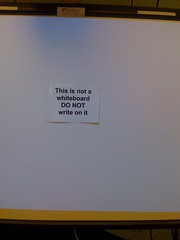

---
categories:
- elearning
date: 2011-09-23 10:10:31+10:00
next:
  text: A hassle map for Year 10 mathematics? You can't focus on the negatives?
  url: /blog/2011/09/25/a-hassle-map-for-year-10-mathematics-you-cant-focus-on-the-negatives/
previous:
  text: A course outline to increase relevance of IPT
  url: /blog/2011/09/22/a-course-outline-to-increase-relevance-of-ipt/
title: Can e-learning tools be more like Plants vs Zombies?
type: post
template: blog-post.html
comments:
    []
    
pingbacks:
    - approved: '1'
      author: Using the NetSpot Innovation fund to enhance bim &laquo; The Weblog of (a)
        David Jones
      author_email: null
      author_ip: 216.151.210.18
      author_url: https://djon.es/blog/2012/08/07/using-the-netspot-innovation-fund-to-enhance-bim/
      content: '[...] interface. Not gamification itself (that will get a mention later)
        but rather something more like I talked about here. Designing a good BIM activity
        is hard. The current interface doesn&#8217;t really help. [...]'
      date: '2012-08-07 09:24:07'
      date_gmt: '2012-08-06 23:24:07'
      id: '133'
      parent: '0'
      type: pingback
      user_id: '0'
    
---
I've just had a visit from my 6 year-old son. He was jumping out of his skin with excitement and a sense of achievement. Apparently he's just won a "chilli that blows up a whole row of zombies" in [Plants vs Zombies](http://www.popcap.com/games/pvz/web). A game he's been playing on and off for a couple of days without any instruction or reading any documentation. Plants vs Zombies, like most good games, is designed to help a new player learn about the game by playing the game.

Compare this with a couple of experiences/observations with Interactive Whiteboards (IWBs) and Mahara over the last week.

### IWBs

First I saw this [tweet from @sthcrft](http://twitter.com/#!/sthcrft/status/113806409136734208) (and some followups) about folk writing on IWBs.

!!! warning "Broken image link"

Then at a residential school this week at [CQU](http://www.cqu.edu.au/) I heard a story that goes a step further. Apparently one teacher thought the IWB was equivalent to a cork board and pinned up a few posters.

That story arose when I took the following photo of how someone at CQU has taken to prevent this sort of misunderstanding.

I can like this approach, it's a fairly simple modification of the environment to help novices understand the tool. It is an approach that is somewhat approximate to the approach taken by games designers. Don't expect people to understand how to achieve something with the tool, provide hints/scaffolding into the tool that guides them.

### Mahara

One of the tasks during the residential school was for the group of 60 pre-service teachers I was apart of to learn how to use Mahara to create a professional portfolio. One of the requirements of our program.

One of the part-time students had already done this, so she was tasked to talk about her portfolio, what she put in it and how she did it. One of the techniques she used was to create tabs across the top of her portfolio site, one for each of the teacher standards we have to address. Most of us wanted to take that approach, so she was asked how she did it. After about 10/15 minutes it was obvious she couldn't remember and no-one could find directions how. We moved on.

Now, being an IT person I wasn't satisfied. I thought, "How hard can it be?". Well it wasn't straight forward. After about an hour of tinkering and experimentation I stumbled onto a solution. Now this wasn't an uninterrupted hour of disciplined investigation, there were other things going on, but it just wasn't obvious. And it wasn't something that could be solved with a simple Google search, at least not without knowing the exact terminology Mahara uses. (A google search for "Mahara add tab navigation" or similar reveals user documentation about how to use the tab navigation in Mahara).

The metaphors/terminology used by Mahara aren't straight forward. For example, there's an object in Mahara called a view. To me that suggests a way for a reader to see my portfolio. Add to this the assumption that the automatic creation of a tabs for navigation is an interface/view type of operation, that's where I looked. As it turns out, a Mahara view is probably more like a page within a view and the view is called a collection. i.e. a collection of pages/views, where the collection can be shown to people. It's in the collections where the tab creation lives.

Once you know, it's easy. But trying to determine the model/metaphor used by software designers can be difficult.

I'm sure the few folk that have used [BIM](/blog/research/bam-blog-aggregation-management/) - the Moodle module I wrote - have often thought the same thing. In fact, having observed my wife use BIM in a course she's teaching, I know it's difficult.

### Learning from games, can it be done?

The obvious question is why can't the designers of e-learning systems learn something from game designers and embed learning how to use the tool into the tool itself? It might be possible, but I wonder if there might be difficulties, including:

- "Real" world tasks bring mental model baggage.  
    I'm pretty sure that my son and I didn't bring any existing understandings of "Plants vs Zombies" when we started the game. Well, I might have brought a bit of "zombie lore" from prior media consumption. But in terms of how to play a game called "Plants vs Zombies" I didn't have any preset expectations.
    
    When I started using Mahara, however, I brought a range of existing mental models/assumptions about how this should work. I interpreted the labels used by Mahara using those mental models and that sent me down the wrong path. Some of the assumptions I built into BIM to make it more flexible worked fine at the original university, because it matched mental models there. But when folk at some other institutions have seen it, they've often been a bit confused.
    
    I think these existing mental models and the diversity of those models would make learning from game design a bit more difficult (not impossible).
    
- Increasing flexibility increase entry paths.  
    Plants vs Zombies has a fairly limited game play. There really is only one way to play it. This makes it easier to help people to learn it. Minecraft is a different type of game altogether. It is much more flexible, it's also not totally developed. I found when getting into Minecraft I had to rely on external sources of information. Minecraft didn't help as much (to some extent this is due to the somewhat incomplete status of the game, it's being actively worked on). But the flexibility of Minecraft also makes it more difficult to induct players. What they want to get out of or do with the game will be vastly different. Suggesting that different induction paths for different purposes.
    
    A tool like BIM is much more limited than Mahara. It would be easier to induct folk into BIM, a bit more difficult for Mahara. A very interesting challenge if you move to the Moodle level.
    
- Games don't "teach" the difficult stuff.  
    My son is currently hitting the wall of frustration with Plants vs Zombies. He's getting up to the levels where you have to be smart about your strategy. Developing the winning strategy is part of the fun of the game, so the game doesn't "teach" the strategy (though it does provide some pointers). A few suggestions and my son is moving on.
    
    With e-learning, learning which buttons to press on a tool is the easy stuff. Using the tool in a pedagogically appropriate way is somewhat equivalent to the strategy in a game, and its something you might want an e-learning to scaffold more directly. (this links to the next point).
    
- End-oriented users limit learning as you go.  
    When he started play Plants vs Zombies my son, like most game players, was looking for something he was going to spend hours having fun with. He was prepared and wanted to engage in a bit of learning as you go. I wonder if a time-poor academic working in an institution where research is valued more than teaching would bring the same outlook. I can almost hear the complaints, "Just do it for me now.".