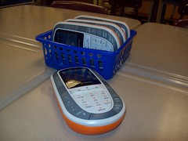

See also: [[blog-home | Home]]

Apart from [starting the hassle map exercise](/blog2/2011/10/09/results-of-the-year-10-math-hassle-map/) my last lesson in 10 Mathematics also included my first use of the [Active Expression "student learner learner response system"](http://www.prometheanworld.com/server.php?show=nav.15997). While a bit disorganised, I can see some benefits. But I still feel a bit dirty.

### What are they?

The [following photo](http://www.flickr.com/photos/lgb06/4606470438/) gives you an idea of what the he ActivExpression "clickers" look like. Basically an oversized calculator with a mobile phone-like keyboard, some extra buttons, and a small LCD screen. It goes with a little dongle that plugs into the back of a (usually teacher) computer to receive the student responses and that works with the Promethean Interactive WhiteBoard (IWB) software.

### Why?

Mainly because they are there. The classroom I teach in has an IWB and a computer and there are 30-odd of these devices laying around not being used. But also because they might provide some additional insight into how the students are progressing. Then there is the observation that being on my internship with a mentor teacher hanging around is probably the best chance I have to do some experimentation, at least experimentation that sticks within the "grammar of school".

The final reason was that this was the last lesson on a Friday afternoon for these students. A lesson that typically doesn't find them focusing much on the mathematics. Playing with some toys might generate some interest.

### What?

The plan was to spent 15/20 minutes getting the students using the devices to answer a couple of stand alone questions (quick polls) and then do a self-paced test.

There was probably a good 10 minutes spent getting the devices set up and ready. And about the same spent doing the questions.

Most of the students seemed to handle the devices okay. Their use generated some engagement/interest out of some students who are generally more disengaged. No real learning about mathematics happened, but they became familiar with the devices so the next time might be a bit easier.

### Reflection

I'm a bit conflicted about the experience.

On the positive side it engaged the students and could provide some useful insights into just how well the students are "getting" the mathematics I'm trying to teach them.

Of course, the very words I'm using in that paragraph reveal some of the drawbacks. The use on Friday was very traditional. It assumes it's my job to teach, there's to learn and the clickers are there to check how well the transaction occurred. I'm using tech to improve the existing processes. Evolution, not revolution.

That's the bit I feel dirty about.

I like the quote from Martin Davis used by Lasry (2008) when comparing clickers and flash cards

> As men get older, the toys get more expensive.

But given that the expense has already been spent, I may as well use it. And this is but a stepping stone.

### What's next?

I've been aware of Mazur's work on [peer instruction](http://en.wikipedia.org/wiki/Peer_Instruction) for awhile as one approach to effectively using clickers, without really knowing the details. A possible way forward would be to modify the class approach to use peer instruction.

Only now do I realise that one of the assumptions about peer instruction is that it is associated with the "flipped" classroom. i.e. students are expected to do some pre-reading. I can probably modify this a bit, though I should read some more about peer instruction.

I am interested by the possibility of whether or not peer instruction would address some of the issues students have with the boring nature of the class (as revealed in the [hassle map results](/blog2/2011/10/09/results-of-the-year-10-math-hassle-map/)). I wonder if regularly pausing to talk with a peer would be counted as a "fun activity".

Associated with this, I also wonder how engaging the clickers would be for the students if all we did for them was answer the standard mathematics questions. Might the novelty wear off?

In the shorter-term, I need to analyse some of the results from Friday's experience. The Promethean software records student responses. Some of the value of the clickers is the ability to become aware of student progress.

### References

Lasry, N. (2008). Clickers or Flashcards: Is There Really a Difference? The Physics Teacher, 46(4), 242. doi:10.1119/1.2895678