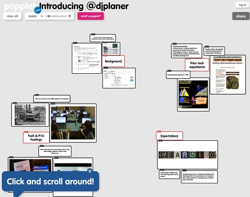
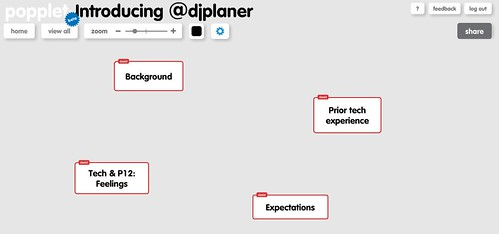

The following tells the story of how and why I designed the following "Web 2.0" (and yes, I am very reluctant to use that term for a [range of reasons](http://www.computerweekly.com/feature/Web-20-What-does-it-constitute) but will for a range of other reasons) introduction of myself.

The following image (click on the image to see a large photo) shows the final state. You can also [view it here](http://popplet.com/app/#/196113).

The above was produced using [Popplet](http://popplet.com/). A fairly simple site to use. Popplet is essentially a slightly easier to use, not quite as functional, slightly different version of [Prezi](http://prezi.com/). Popplet doesn't really focus on being a presentation tool (it can sort of act like that) it is likely to be much more powerful as way to collaborate on the above, rather than simply disseminate information.

### Why?

The design of the [course I'm teaching](http://www.usq.edu.au/course/synopses/2012/EDC3100.html) this term asks the students to create a "Web 2.0" introduction of themselves as their first task. The design also calls for the teaching staff to create their own introduction for the dual purpose of providing an example and also to allow the students to know a bit more about the teaching staff.

I'm blogging about the process because it allows the students (if they so desire) to have some insight into my thought process. Which is typically seen [as a good thing](http://chronicle.com/blognetwork/castingoutnines/2012/02/13/four-things-lecture-is-good-for/).

### What?

After a few iterations, we've decided to copy/borrow/lift the introduction used the [ECMP355, Computers in the Classroom course](http://chronicle.com/blognetwork/castingoutnines/2012/02/13/four-things-lecture-is-good-for/) taught by [Alec Couros](http://education.uregina.ca/technology/ecmp355/instructor.html) at the University of Regina. The introduction should include (the following is taken from the ECMP355 site):

> - A brief description of your own personal background (school, family, career, etc.).  
>     Of course, only provide information which you feel comfortable with sharing.
> - Some information regarding your attitudes of or previous experience with technology in your own personal, school or work experience.
> - Insight into how you currently feel towards computing technology in the K-12 classroom.  
>     For example, what are the potential benefits or limitations of technology in the classroom? How do you feel that technology should or should not be used in K-12 learning environments?
> - A description of your expectations for this class and from your instructor. What do you hope to learn or accomplish in this class? Is there anything that the instructor should know about your previous experience or lack of experience with technology?

### Which tool?

Given I know what I have to produce, which tool will I use?

On suggestion was to use a concept mapping tool to map out the introduction, or perhaps something like Prezi.

These are fairly well known. I'm wondering whether the Web 2.0 environment has thrown up anything a bit different and out there.

This [Top 35 list](http://edudemic.com/2010/07/the-35-best-web-2-0-classroom-tools-chosen-by-you/) is form 2010 and includes many of the well-known options. The "added from Twitter and comments" addendum has some options I wasn't aware of, including

- [Popplet](http://popplet.com/) - "see what you think together".

That list was going to be quite large, but Popplet looks interesting enough to stop (plus time is getting away from me). The following video is the Popplet preview video that sucked me in.

\[youtube=http://www.youtube.com/watch?v=DU5q7ms4LfI\]

### What's the model/sweet spot for the tool?

All technology is designed to achieve a certain purpose (of course most technology can also be used for unexpected things - [exaptation](http://en.wikipedia.org/wiki/Exaptation)) a certain way. To use a tool well, you need to understand what the purpose is and the model it uses to achieve it.

From the video, Popplet seems to be based on the idea of boards - which contain just about anything: audio, video etc - and that these boards (as in cork boards perhaps) can be linked in various ways and then displayed. There also seems to be support for people to comment on the boards.

This [example Popplet](http://popplet.com/app/#/489) is on the history of Napoleon. Almost a poster but on a grander scale. [This one](http://popplet.com/app/#/334) is a flowchart around playing Street Fighter.

From looking at these, it appears that a Popplet is made up of popples. The small chunks of text, graphics and other resources. I imagine you can re-arrange these into useful structures.

This seems well suited to a four part introduction and is somewhat related to a concept map.

### Using it

So time to start using it. I will learn more about the tool as I go.

Creating an account seems all fine. Don't like the fact that the standard practice of tabbing between fields in a form doesn't work.

And onto the introduction:

- So, "Popplet is the best app for visual ideas"
- You can create galleries, record thoughts, explore ideas, collaborate together.

And we're ready to "make new popplet". As is typically the case with these types of tools, Popplet walks you through the process, providing advice as you need it. A strategy adopted/adapted from games.

So, that's the four main "structuring" poppies created.

Now to add some multimedia around it.

Oh that's nice, can search Flickr for photos to include.

Mmm, adding comments works, but not sure how that is integrated into viewing the Popplet. Looks like I'll be adding some textual descriptions. There doesn't seem to be an easy way to add an audio narration to a poppie.

The model for Popplet certainly seems to be to drag in content from other locations. Trying to save their resources I guess. This means that creating a Popplet does assume you make use of other online services.

This model probably creates some problems for the use of Popplet within schools where sites like Flickr and YouTube may be blocked. Certainly the search Flickr images feature of Popplet could create the problematic (for some) situation where students see images they probably shouldn't.

It also creates problems when you're trying to attach recent images.

Oh, there is a presentation mode, a bit like Prezi. Can't seem to get it to work for anyone but me (the author) on the web. How there is a [desktop application](http://www.popplet.com/poppletpresenter/poppletpresenter.air) (both Mac and Windows) to show Popplets and I got presentation mode working with that.

And there is [Popplet blog](http://blog.popplet.com/)