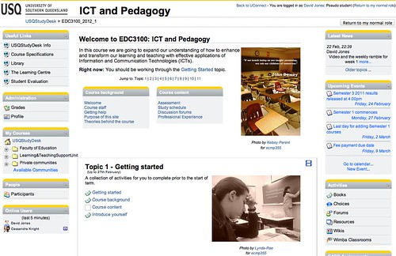

---
categories:
- edc3100
- teaching
date: 2012-02-22 23:10:36+10:00
next:
  text: Does school ruin learning?
  url: /blog2/2012/02/25/does-school-ruin-learning/
previous:
  text: Faculty-centered, peer-reviewed online course development models
  url: /blog2/2012/02/19/faculty-centered-peer-reviewed-online-course-development-models/
title: '"One Moodle course design: approach and trade-offs"'
type: post
template: blog-post.html
comments:
    - approved: '1'
      author: Frankie Kam
      author_email: frankie@stamford.edu.my
      author_ip: 203.82.90.15
      author_url: http://www.facebook.com/kam.frankie
      content: Nice design, and I really like your method of beating the "Scroll Of Death".
        As for the migration to Moodle 2.x, all the best with that!
      date: '2012-02-26 03:08:59'
      date_gmt: '2012-02-25 17:08:59'
      id: '232'
      parent: '0'
      type: comment
      user_id: '0'
    - approved: '1'
      author: VRBones
      author_email: vrbones@hotmail.com
      author_ip: 118.208.156.238
      author_url: http://www.vrbones.com
      content: 'I like the "Right Now:" topic above the jump. Is this automatically going
        to move through the topics, or require a manual edit?
    
    
        At my schoool I''m going through a similar process of designing a framework for
        courses using Google Sites (we''ve abandoned moodle as I was the only one using
        it effectively). The home page has been left intentionally simple, but I''m considering
        adding the last announcement and a "Right now:" jump to smooth out the navigation.
        Manual changes for relied upon navigation is going to be fraught with danger though.'
      date: '2012-02-26 08:56:34'
      date_gmt: '2012-02-25 22:56:34'
      id: '233'
      parent: '0'
      type: comment
      user_id: '0'
    - approved: '1'
      author: David Jones
      author_email: davidthomjones@gmail.com
      author_ip: 139.168.177.155
      author_url: https://djon.es/blog/
      content: Thanks. Will be interesting to see what the students think.
      date: '2012-02-26 08:56:53'
      date_gmt: '2012-02-25 22:56:53'
      id: '234'
      parent: '232'
      type: comment
      user_id: '1'
    - approved: '1'
      author: David Jones
      author_email: davidthomjones@gmail.com
      author_ip: 139.168.177.155
      author_url: https://djon.es/blog/
      content: 'Sadly, the "Right now" will involve a manual edit.  It''s not that much
        of a hassle and it is connected into part of my process, but....
    
    
        The major problem with this design is that it involves numerous work arounds to
        Moodle''s operation. This means that when we roll over into next term, there is
        going to have to be a lot of manual editing.
    
    
        It''s interesting that the students have already set up a facebook page for the
        course, still wondering what, if anything, my role will be with that. That has
        some interesting implications going forward.'
      date: '2012-02-26 09:08:37'
      date_gmt: '2012-02-25 23:08:37'
      id: '235'
      parent: '233'
      type: comment
      user_id: '1'
    
pingbacks:
    - approved: '1'
      author: 'One Moodle course design: approach and&nbsp;tra...'
      author_email: null
      author_ip: 89.30.105.121
      author_url: http://www.scoop.it/t/moodleuk/p/4014598466/2014/01/22/one-moodle-course-design-approach-and-trade-offs
      content: '[&#8230;] Almost 20 days ago I started thinking about the design of the
        Moodle (1.9.x) site (called a StudyDesk at my institution) for my course. As O-Week
        draws to a close, the following describes the curre...&nbsp; [&#8230;]'
      date: '2014-01-22 18:59:49'
      date_gmt: '2014-01-22 08:59:49'
      id: '236'
      parent: '0'
      type: pingback
      user_id: '0'
    
---
Almost 20 days ago I started [thinking about](/blog2/2012/02/03/thinking-about-moodle-course-design/) the design of the Moodle (1.9.x) site (called a StudyDesk at my institution) for my course. As O-Week draws to a close, the following describes the current final product.

_Note:_ The focus here is on the (pragmatic) physical design and layout of the site with just a bit of pedagogy/learning design.

### What does it look like?

The following photo (click on the photo to see it larger) is what it looks like.

 by David T Jones, on Flickr")

### Non-topic based resources

I've stuck with the topic course format, mostly because that was what the prior offering used and given the absence of an ability to back the course site up, I wasn't game enough to play with that.

The trouble is that there are some resources/activities that are not really topic based. For example, the specification for the two assignments doesn't really belong to a single week/topic. Discussion forums, getting help etc are all examples. Students don't I wouldn't want to go searching through topics to find them.

Hence the "Course background" and "Course content" navigation blocks in the welcome area of the course site. Implemented with a bit of CSS to look appropriately institutional.

### Avoiding the scroll of death

I've used the "Jump to: Topic" navigation bar to allow folk to jump to a particular topic. I've also ensured that the HTML is such that tooltips work (i.e. hover over "1" for topic one and the tooltip will show the topics name).

A number of staff here have used graphical icons/buttons instead of the numbers. Frankly I don't have the skill/resources to create meaningful, good looking icons and frankly they take up too much screen space.

I've also made significant use of the Moodle book module. Rather than having a long list of labels and activities under each topic, this is mostly hidden away within Moodle books. e.g. the "Getting started", "Course background" etc links under Topic 1.

### The photos

Each of the topics in the course site will have a specially selected photo taken from the [ECMP355 photo stream](http://www.flickr.com/photos/ecmp355/). Each photo is produced by one of the students in the course taken by [Alec Couros'](https://twitter.com/#!/courosa). My thanks to the students and Alec.

Two main reasons for including the photos

- Inject some visual interest.  
    Most moodle sites are text heavy, boring and if no care is taken, ugly. A bit of visual excitement was called for.
- Illustrate "Explore, Create, Share".  
    I'm trying to encourage the students to become digital residents. I want them to be exploring, creating and sharing with the broader community. I'm hoping that the example of the ECMP355 students will be somewhat inspiring.

### The weekly ramble

I've implemented the [weekly ramble idea](/blog2/2012/02/19/designing-the-weekly-ramble/) for the first week using the Moodle book module. It's ugly and doesn't provide a lot of the extra functionality that I'd like, but it's there.

### Future tweaks

I think the next explorations will be around bringing the outside world into the course site. I'm trying to make the course site the course portal, i.e. a path to all of the course related resources and activities. Increasingly I'm hoping all of the course participants will help construct those through social networking tools.

### Reflections

The real reflections will start next week and for the next 15 weeks or so as students interact with the site and tell me what works and what doesn't.

In the meantime, here are some of my reflections:

- The amount of HTML/CSS I needed to implement to workaround missing or ugly defaults in both Moodle and the institutional CSS was not exactly surprising, but "interesting".
- Editing a Moodle site when response times are long is an exercise in frustration.
- Most of the links I've put into this site are going to be broken when it is copied into the next term.
- All this extra work seems just a little bit wasteful.
- Apparently the institution is going Moodle 2.x next semester, so it probably really is all wasted.