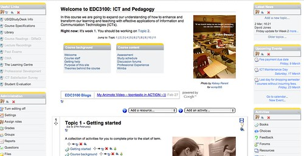

Time to tweak the [course site](/blog2/2012/02/22/one-moodle-course-design-approach-ad-trade-offs/) again. I attempting to encourage the students to engage with technology, to become digital residents. The assumption is that they will really only be able to design great teaching with ICTs, if the use of ICTs is part of their everyday life. One aspect I'm attempting to encourage is blogging.

To make the blogging process a bit more obvious, I wanted to include some aggregated view of the students' blogs on the course site to increase the visibility and hopefully the prevalence of blogging. Here's how I did it with the Google feed API.

### What does it look like?

The following image (click on it to see a bigger version) shows what the site looks like now. The new bit is labelled **EDC3100 blogs**. Every five seconds the link (e.g. "My Animoto video") scrolls onto the next one. The links are chosen from the 8 most recent blog posts aggregated by [this Yahoo pipe](http://pipes.yahoo.com/pipes/pipe.info?_id=e8cf6c93c932300cde6541842c8fc3fc).

If you move the mouse over the scrolling blog links, the scrolling pauses. Click on the blog title and you will be taken to the original blog.

### How does it work?

The process goes something like this

1. I created [this Yahoo pipe](http://pipes.yahoo.com/pipes/pipe.info?_id=e8cf6c93c932300cde6541842c8fc3fc) to aggregate the feeds.  
    Currently the pipe is hard-coded with the feeds of the student blogs. In the future I need to connect this with [diigo bookmarks the student blogs](http://groups.diigo.com/group/icts-and-pedagogy/rss/tag/3100studentBlog) so I (or anyone in the group) can add their blog.
2. Eventually found [this explanation](http://code.google.com/apis/ajax/playground/#dynamic_feed_control_-_horizontal) of Google's feed API.  
    It transforms the RSS feed into some nice HTML that can be placed on a web page.
3. Stuck an _iframe_ in a Moodle label.  
    It appears that Google feed API wants to change the head of the HTML, something you can't easily do in Moodle. So I had to upload a separate web page onto the Moodle service and then use an iframe to include it on the site page.

### Reflections and work to do

Time to stop playing with the tech and design some prompts to encourage the students to participate.

Should probably look at putting a "help" or "about" link near the object so students can scratch their itch about what it is.

Need to get the Yahoo pipe interacting with the Diigo group bookmarks.

This was a useful respite from some other work, but in the end the technical aspect won't be enough with additional work. The work around with the iframe was a bit kludgy. Including the object at the top of the page, does increase scrolling. So I wonder about the value.

I'm also wondering how much of this should be talked about with the students? If feel that an understanding that this form of manipulation of existing systems is important to teachers if they are looking to integrate ICTs into teaching. A bit of the whole Rushkoff, Program or be Programmed ethos.