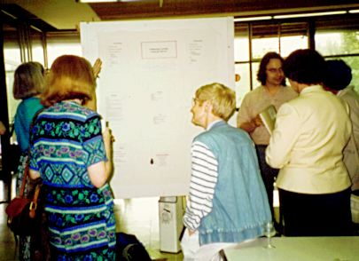

---
categories:
- innovation
- react
date: 2012-03-16 11:46:21+10:00
next:
  text: My on-going concerns with ePortfolios
  url: /blog/2012/03/21/my-on-going-concerns-with-eportfolios/
previous:
  text: 'Some challenges for #pstn'
  url: /blog/2012/03/09/some-challenges-for-pstn/
title: Eduhacking - a better use for (part of) academic conferences?
type: post
template: blog-post.html
comments:
    - approved: '1'
      author: deidre07 (@deidre07)
      author_email: deidre07@twitter.example.com
      author_ip: 124.171.219.207
      author_url: http://twitter.com/deidre07
      content: Hmmmm, might be enough to draw me to the conference
      date: '2012-03-17 09:42:42'
      date_gmt: '2012-03-16 23:42:42'
      id: '264'
      parent: '0'
      type: comment
      user_id: '0'
    - approved: '1'
      author: easegill
      author_email: easegill@gmail.com
      author_ip: 118.90.22.99
      author_url: http://easegill.edublogs.org
      content: 'The premise is good and your description of conferences and the potential
        waste of resource sounds familiar! Planning on going to Ascilite12 so I''m up
        for an extra day of give &amp; take.  Are you contacting the organisers to get
        it added to the programme?
    
        Cheers, Nigel'
      date: '2012-03-18 18:31:38'
      date_gmt: '2012-03-18 08:31:38'
      id: '265'
      parent: '0'
      type: comment
      user_id: '0'
    - approved: '1'
      author: David Jones
      author_email: davidthomjones@gmail.com
      author_ip: 58.165.86.4
      author_url: https://djon.es/blog/
      content: That's the eventual plan.  Get a group organised that will submit a workshop
        proposal.  Probably aim to knock around ideas a bit before that submission and
        probably some more before the actual conference. I think that nature of a Eduhack
        style event lends itself to a more collaborative approach. Having someone with
        local knowledge would be a help.  More to come.
      date: '2012-03-18 20:19:53'
      date_gmt: '2012-03-18 10:19:53'
      id: '266'
      parent: '265'
      type: comment
      user_id: '1'
    - approved: '1'
      author: Peter Albion (@palbion)
      author_email: palbion@twitter.example.com
      author_ip: 139.86.2.14
      author_url: http://twitter.com/palbion
      content: 'It''s an interesting idea and would have value for a variety of potential
        participants. The <a href="http://www.educ.utas.edu.au/users/afluck/ifipwg3-3/Activities/Nashville11/Nashville11.htm"
        rel="nofollow">IFIP WG3.3 workshop</a> that I attended ahead of SITE 2011 in Nashville
        had some similarities. Papers were submitted ahead of time and assigned for reading.
        Comments were then available for discussion at the workshop.
    
    
        The <a href="http://ausweb.scu.edu.au/" rel="nofollow">AusWeb conference</a> I
        attended in 2004 had a somewhat similar approach to the whole conference. Papers
        were submitted and reviewed, final copies were placed on the web, and authors
        were advised to make their presentations related to but different from the papers.
        Presentations were in groups of related papers with all short presentations in
        a session completed first and followed by questions and discussions across all
        3 papers in a session.'
      date: '2012-03-19 09:15:23'
      date_gmt: '2012-03-18 23:15:23'
      id: '267'
      parent: '0'
      type: comment
      user_id: '0'
    - approved: '1'
      author: David Jones
      author_email: davidthomjones@gmail.com
      author_ip: 139.86.2.15
      author_url: https://djon.es/blog/
      content: 'G''day Peter,
    
    
        I remember the Ausweb format, did it once in ''99.
    
    
        I guess this approach tries to push the collaboration a little further back down
        the timeline. Rather than having papers describing work already done, the groups
        would get together to address specific problems, perhaps generating a poster for
        later in the conference and then perhaps growing into an actual paper for another
        conference (e.g. ASCILITE''13?).
    
    
        Don''t think it would be easy.  Have some concerns about how it might work, that
        will be another post.
    
    
        David.'
      date: '2012-03-19 09:22:24'
      date_gmt: '2012-03-18 23:22:24'
      id: '268'
      parent: '267'
      type: comment
      user_id: '1'
    
pingbacks:
    - approved: '1'
      author: Questions and insights on (education) hack days/hackathons &laquo; The Weblog
        of (a) David Jones
      author_email: null
      author_ip: 72.233.2.39
      author_url: https://djon.es/blog/2012/04/25/questions-and-insights-on-edhackathons/
      content: '[...] few weeks ago, inspired by @sthcrft, I speculated around the idea
        of having a eduhack session at ASCILITE&#8217;2012. There was some interest and
        I had other tasks, [...]'
      date: '2012-04-25 22:26:10'
      date_gmt: '2012-04-25 12:26:10'
      id: '269'
      parent: '0'
      type: pingback
      user_id: '0'
    
---
In short, can we get an Eduhack style event running at ASCILITE'12? Want to help? If you want, skip to the point

Possibly the most productive conference I've ever been on was the 1996 [ITiCSE Conference](http://www.cs.utexas.edu/users/csed/iticse/) in Barcelona. (It seems the conferences have evolved from "Integrating Technology into CS Education" to "Innovation and Technology in CS Education"). Apart from my first trip to Spain, the conference introduced me to something different in terms of conferences, the working groups.

We were the first set of working groups and at that stage it worked a bit like this:

- Someone came up with a topic - in our case "World Wide Web as an Interactive Teaching Resource".
- They called for participants.
- We started collaborating ahead of the conference.
- During the conference we (based on my vague recollection of 16 years ago)
    - Worked for a day or two before the conference proper started.
    - Did some work during the conference, including presenting a "poster" on our current progress. (apparently shown in the image below)
    - Did some final work at the end/after of the conference.
- Produces a [final document](http://dl.acm.org/citation.cfm?id=237649&CFID=70751024&CFTOKEN=82986724)

### The benefit

The biggest benefit that flowed from that event was meeting the co-author of the [book we wrote](http://www.wiley.com/legacy/compbooks/catalog/19162-0.htm), which (even with its limitations) remains the most cited of my publications. Without being a member of the working group with my co-author, the book would never have been written.

Having to work with folk at a conference on a specific project, rather than sit and listen or sit and drink network, provides additional insights and connections. It can also be a bit more challenging, but nothing in life is free.

### The wasted opportunity

This type of approach seems to address the wasted opportunity that is most conferences. You have all these talented, diverse and skilled folk in the one location, but limit their interaction to presentations, panels and socialising. Nothing, at least in my experience, works to bring those diverse perspectives together to produce something.

For a long time, I've been wondering if something different is possible.

### Looking for alternatives

The ITiCSE working group approach was okay, but fairly traditional. It aimed to produce an academic paper. I was involved with the first one, it would be interesting to see how they've evolved and changed based on the experience.

The [REACT project](http://sleid.cqu.edu.au/REACT/) tried to ensure that planned innovations in L&T benefited from diverse perspectives before implementation. But like the working group idea used an academic paper as the main artifact. REACT never really went anywhere.

And then there is Eduhacking in the style used by [@sthcrft and @stuffy65 at UNE](http://sarahthorneycroft.com/blog/2011/12/20/eduhacking/) and in particular @sthcrft 's call

> do we need a cross-institution eduhack event? From my point of view, anything that’s about collaborating on ideas and possibilities has got to be better than yet another show and tell event. Who’s in?

I'm thinking: Yes and me. The question is where to now?

### How might it work?

[Education Hack Day](http://educationhackday.org/) describes the aim this way

> The mission was simple: listen to problems sourced by teachers from around the world, pick a dozen or so to tackle, and form teams around those problems that would each come up with and execute a creative solution to solve them.

This seems to have been based on the older/broader idea of from the developer world of [a hackathon](http://en.wikipedia.org/wiki/Hackathon). As with the UNE experiment, the focus here wouldn't necessarily be on software developers, but a broader cross-section of people.

So a process might be:

- Pick a conference, one that has a good cross section of educational technology type folk.  
    For example, [ASCILITE'12](http://www.ascilite.org.au/index.php?p=815).
- Run an Eduhack day just before the conference proper starts, probably as a workshop.
- Actively encourage a diverse collection of folk to come along.
- Distribute a call for problems prior to the conference.
- Ensure that the setting for the Eduhack is appropriate (i.e. not the normal conference breakout room).
- Have a loose process to select the problems to be worked on and let folk go.
- Have some of the outcomes presented as posters during the conference.
- Encourage/enable groups to keep working on the problems post-conference, perhaps for presentation as traditional papers at the next conference?

I'm sure there are improvements to be made. Who's interested?