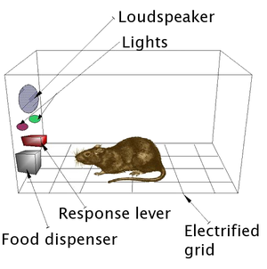

---
categories:
- indicators
date: 2012-03-28 14:02:22+10:00
next:
  text: Explorations of narrative research
  url: /blog/2012/03/29/explorations-of-narrative-research/
previous:
  text: 'Learning analytics and study behaviour: A pilot study'
  url: /blog/2012/03/27/learning-analytics-and-study-behaviour-a-pilot-study/
title: '"Here I stand" - Campbell''s concerns on analytics and other stuff'
type: post
template: blog-post.html
comments:
    - approved: '1'
      author: Sheila MacNeill (@sheilmcn)
      author_email: sheilmcn@twitter.example.com
      author_ip: 130.159.138.165
      author_url: http://twitter.com/sheilmcn
      content: 'Hi David
    
    
        Thanks for reading and quoting my post.  I''m going to explore your Indicators
        project now, and will be interested to follow it''s progress as it starts up again.
    
    
        Sheila'
      date: '2012-03-28 18:03:00'
      date_gmt: '2012-03-28 08:03:00'
      id: '279'
      parent: '0'
      type: comment
      user_id: '0'
    - approved: '1'
      author: David Jones
      author_email: davidthomjones@gmail.com
      author_ip: 60.231.64.154
      author_url: https://djon.es/blog/
      content: Thanks for posting it Shelia.  Has helped a lot. Keen to follow what's
        happening in the UK as well.  Seems to be a bit going on around analytics all
        over the place.
      date: '2012-03-28 21:51:33'
      date_gmt: '2012-03-28 11:51:33'
      id: '281'
      parent: '279'
      type: comment
      user_id: '1'
    
pingbacks:
    - approved: '1'
      author: LAK11 | Pearltrees
      author_email: null
      author_ip: 93.184.35.43
      author_url: http://www.pearltrees.com/sheilmcn/lak11/id2311759#pearl39161593&show=reveal,6
      content: "[...] \u201CHere I stand\u201D \u2013 Campbell\u2019s concerns on analytics\
        \ and other stuff \xAB The Weblog of (a) David...  Gardner talks about four strong\
        \ cautions for analytics He connects this view of analytics with the LMS approach\
        \ to e-learning and the traditional nature of curriculum that are all in the simple\
        \ domain. Learning analytics just continues this. Lots of imagery with school\
        \ as a feedlot or a Skinner box . Four strong cautions [...]"
      date: '2012-03-28 18:07:20'
      date_gmt: '2012-03-28 08:07:20'
      id: '280'
      parent: '0'
      type: pingback
      user_id: '0'
    
---
Continuing a [re-engagement with analytics](/blog/2012/03/27/learning-analytics-and-study-behaviour-a-pilot-study/) I spent some time listening to [Gardner Campbell's](http://www.gardnercampbell.net/) talk to the LAK'12 MOOC - [Here I Stand](http://lak12.wikispaces.com/Recordings) and from there followed various links.

Gardner captures one of my major concerns with how analytics may proceed, especially within institutions that are increasingly driven by accountability, efficiency and other concerns. Concerns that they are responding to with top-down management. Gardner's uses the metaphor of the human mind/learning being as [complex as M-Theory](http://en.wikipedia.org/wiki/M-theory) (actually more complex) and that learning analytics as commonly thought of is equivalent to measuring M-Theory using a simple cartesian graph.

The end result is that it simplifies learning and how we treat to an extent that is meaningless.

He connects this view of analytics with the LMS approach to e-learning and the traditional nature of curriculum that are all in the simple domain. Learning analytics just continues this. Lots of imagery with school as a feedlot or a [Skinner box](http://en.wikipedia.org/wiki/Operant_conditioning_chamber).

Gardner talks about four strong cautions for analytics Four strong cautions

1. "Student success"  
    Typically defined within analytics as the student passing doesn't mean the same as succeeding in life. e.g. given of high performing high school student with no idea of what to do next.
2. Complexity  
    A lot on this that resonates, more below.
3. Points of "Intervention"  
    Just one idea is that of an analytics system that, rather than intervening just before the student fails (as most current analytics projects are trying to achieve), intervenes just as the students begins to understand.
4. The "Third wave"

Draws on John Naughton - From Gutenberg to Zuckerberg: What you really need to know about the Internet (2012) - to illustrate "Complexity is the new Reality"

1. Non-linear
2. Feedback matters - a lot
3. Systems demonstrate self-organisation
4. EMERGENCE - synergies - new phenomena

Naughton also talks about double loop learning where "success means more than positive outcomes "relative to pre-established targets" - Which sounds very much like learning objectives - Instead it means that learners "need to reflect on the appropriateness, in the light of unfolding events, of the assumptions (the mental model) used to set up those actions and targets"

Gardner's quote (or close to it somewhere in here) is "A real learning analytics system must be able to learn."

Also mention of the [Pardox of the Active User](http://www.useit.com/alertbox/activeuserparadox.html)

### Other links

Shelia MacNeil offers [another summary of Gardner's talk](http://blogs.cetis.ac.uk/sheilamacneill/2012/03/09/learning-analytics-where-do-you-stand/) and points to other work. It was from Shelia's post that I came across [Exploiting activity data in the academic environment](http://www.activitydata.org/index.html) which is a somewhat broader example of analytics including some useful insights into privacy etc issues around the data.

Shelia identifies some very useful questions

> What are the really useful "analytics" which can help me as a learner, teacher, administrator, etc? Which systems provide that data just now ? How can/do these stakeholders access and share the data in meaningful ways? How can we improve and build on these systems in ways which take into account the complexity of learning? Or as Gardner said, how can we start framing systems and questions around wisdom?

An [earlier blog post](http://www.gardnercampbell.net/blog1/?p=1499) from Gardner that arose out of reading [this book](http://www.amazon.com/An-Elusive-Science-Troubling-Education/dp/0226467732/ref=sr_1_3?ie=UTF8&qid=1332906615&sr=8-3) (really learning to dislike book's that aren't available on Kindle).

### Implications for the indicators project

The types of questions identified are exactly the areas which the [Indicators Project](http://indicatorsproject.wordpress.com/) was (and is about to start again) attempting to explore. The point about complexity is also timely, as that is the perspective that will underpin our work. Consequently I will be reading a bit more of Naughton.

I especially like the point about double loop learning. For three main reasons

1. It captures one important distinction between traditional business intelligence approaches and what we hope to do with the indicators project.
2. It highlights how we'd like to use analytics, i.e. to help university academics engage in double loop learning about how and why they teach.
3. It frames a concern I have out the outcomes focus of much university education, i.e. we're measuring students against outcomes we think are important and we've established ahead of time, rather than asking them to reflect on their assumptions and mindsets.  
    In particular, I'm thinking this might be an interesting point of departure for thinking about how courses I'm responsible for might evolve.