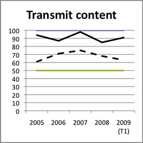
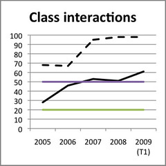
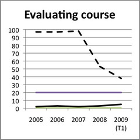
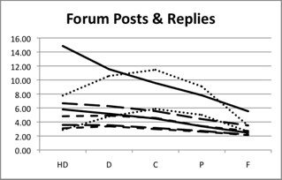
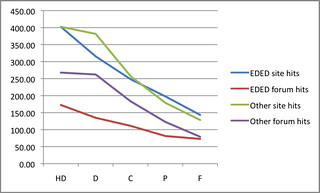
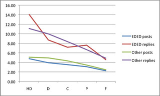
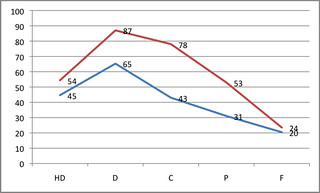
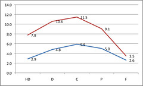
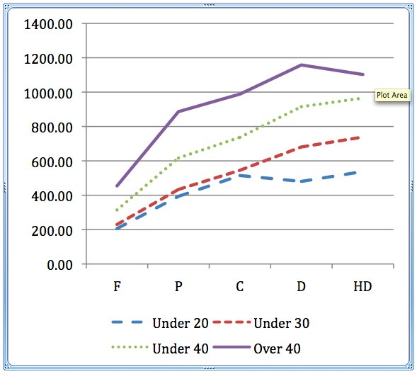

---
categories:
- indicators
date: 2012-03-29 12:31:53+10:00
next:
  text: Curriculum innovation as an educational technology trend
  url: /blog2/2012/03/30/curriculum-innovation-as-an-educational-technology-trend/
previous:
  text: Explorations of narrative research
  url: /blog2/2012/03/29/explorations-of-narrative-research/
title: What are the really useful analytics?
type: post
template: blog-post.html
comments:
    []
    
pingbacks:
    - approved: '1'
      author: What are the really useful&nbsp;analytics? | Digital Delights | Scoop.it
      author_email: null
      author_ip: 89.30.105.121
      author_url: http://www.scoop.it/t/digital-delights/p/1524074760/what-are-the-really-useful-analytics
      content: '[...] background-position: 50% 0px; background-color:#222222; background-repeat
        : repeat; }           davidtjones.wordpress.com  - Today, 1:03 [...]'
      date: '2012-04-02 04:03:14'
      date_gmt: '2012-04-01 18:03:14'
      id: '284'
      parent: '0'
      type: pingback
      user_id: '0'
    - approved: '1'
      author: What are the really useful&nbsp;analytics? | Utbildning p&aring; n&auml;tet
        | Scoop.it
      author_email: null
      author_ip: 89.30.105.121
      author_url: http://www.scoop.it/t/utbildning-pa-natet/p/1524493729/what-are-the-really-useful-analytics
      content: '[...] background-position: 50% 0px; background-color:#222222; background-repeat
        : repeat; }           davidtjones.wordpress.com  - Today, 2:31 [...]'
      date: '2012-04-02 05:31:59'
      date_gmt: '2012-04-01 19:31:59'
      id: '285'
      parent: '0'
      type: pingback
      user_id: '0'
    - approved: '1'
      author: What are the really useful&nbsp;analytics? | E-Learning and Online Teaching
        | Scoop.it
      author_email: null
      author_ip: 89.30.105.121
      author_url: http://www.scoop.it/t/e-learning-and-online-teaching/p/1525540504/what-are-the-really-useful-analytics
      content: '[...] } #themeHeader #titleAndDescription * { color: black; }           davidtjones.wordpress.com  -
        Today, 7:09 [...]'
      date: '2012-04-02 10:09:35'
      date_gmt: '2012-04-02 00:09:35'
      id: '286'
      parent: '0'
      type: pingback
      user_id: '0'
    - approved: '1'
      author: "What are the really useful\_analytics? | E-Learning and Online Teaching\
        \ Today"
      author_email: null
      author_ip: 69.170.134.34
      author_url: http://onlineteachingtoday.wordpress.com/2012/04/02/what-are-the-really-useful-analytics/
      content: '[...] Via davidtjones.wordpress.com Share this:TwitterFacebookLike this:LikeBe
        the first to like this post. [...]'
      date: '2012-04-02 10:09:42'
      date_gmt: '2012-04-02 00:09:42'
      id: '287'
      parent: '0'
      type: pingback
      user_id: '0'
    - approved: '1'
      author: What are the really useful&nbsp;analytics? | Digital Knowmads | Scoop.it
      author_email: null
      author_ip: 89.30.105.121
      author_url: http://www.scoop.it/t/digital-knowmads/p/1530113228/what-are-the-really-useful-analytics
      content: '[...] background-position: 50% 0px; background-color:#222222; background-repeat
        : no-repeat; }           davidtjones.wordpress.com  - Today, 12:58 [...]'
      date: '2012-04-03 03:58:46'
      date_gmt: '2012-04-02 17:58:46'
      id: '288'
      parent: '0'
      type: pingback
      user_id: '0'
    
---
Following on from [recent posts](/blog2/2012/03/28/here-i-stand-campbells-concerns-on-analytics-and-other-stuff/) around learning analytics, this post is going to try and drill down a bit further on one of the useful questions around analytics identified by Shelia MacNeil's [summary of a Gardner Campbell talk](http://blogs.cetis.ac.uk/sheilamacneill/2012/03/09/learning-analytics-where-do-you-stand/). The questions

> **What are the really useful “analytics” which can help me as a learner, teacher, administrator, etc?** Which systems provide that data just now ? How can/do these stakeholders access and share the data in meaningful ways? How can we improve and build on these systems in ways which take into account the complexity of learning? Or as Gardner said, how can we start framing systems and questions around wisdom?

I'm going to focus on "What are the really useful “analytics” which can help me as a learner, teacher, administrator, etc?" and in particular on the "useful analytics" - I'll call them patterns - that the [Indicators project](http://indicatorsproject.wordpress.com/) has identified so far.

So far, the Indicators project has really only looked for these useful patterns within one institution, though with a fairly large sample. The definition of useful here is something like "potentially of interest to learners, teachers or administrators". In the short term, I'm hoping we can extend both the sample and also the number of institutions.

### A side step into purpose

Before getting into that, a few words about the purpose of learning analytics. Barneveld et al (2012) suggest that there are some common business reasons behind analytics

> : increasing financial/operational efficiency; expanding local and global impact; establishing new funding models during a changing economic climate; and responding to the demands for greater accountability

which appears to be taken from an [IBM white paper](http://www.techrepublic.com/whitepapers/managing-thebusiness-of-education-uniting-the-mission-of-education-with-the-mission-of-the-marketplace/1689899)

There follows an argument and some references that suggest analytics can help management a great deal to "cut costs and improve teaching and learning". So much so that the following sentence repeats the mantra "improving efficiencies to saving money to enhancing student achievement"

While that's certainly a potential application of analytics, like others I find this a limiting perspective. It almost automatically entails the sort of simplification that [Gardner Campbell](/blog2/2012/03/28/here-i-stand-campbells-concerns-on-analytics-and-other-stuff/) was arguing against.

Instead, I'm starting to lean more toward the idea of analytics being yet another "blind man" available to people to discover what is going on around e-learning/learning. Like the other blind men of e-learning research (I'll use that term for want of a better label) - surveys, interviews etc. - it has its limitations (Gardner expressed a big picture limitation) but perhaps combined they can help.

Perhaps the indicators project is more about helping combine the perspectives blind men in order to better understand what is going on. At this stage, just maybe the managers can get their hands on it. But not until we've tested the "sight" of the analytics blind man. Which leads nicely into the next section.

### The patterns

Much of the initial work of the indicators project has simply been to investigate what the analytics blind man can actually see. What were the patterns in the usage data? Some of this exploration was inspired by the work of others. We were asking, "Does that same pattern hold here?". We were particularly interested in seeing if what patterns emerged from cross-LMS, cross-institutional, and longitudinal data. Here's a quick list of what we've looked at so far, more explanation following.

First, the list

- Does LMS feature adoption change over time and between systems?
- Is there a link between LMS activity and student grades?
- Is there a link between LMS activity and external factors (e.g. staff participation, staf background, instructional design involvement, student age)?
- Investigating critical success factors.
- Differences between LMSs.

### Feature adoption

An LMS comes with a host of features. Which features are used? Does feature adoption change over time? Based on the work of Malikowski et al (2006, 2007, 2008) we initially examined feature adoption within a locally grown LMS, Blackboard use at the same institution, and eventually Moodle feature adoption.

Malikowski et al identified five categories of LMS features. Our initial exploration of four predominant features at the one institution from 2005-2009 revealed some widely different results as summarised in the following graphs. Some explanation of the graphs

- The green and purple lines represent the top and bottom ranges found by Malikowski et al.
- The black continuous line represents feature adoption with this institution's version of the Blackboard LMS.
- The black dashed line represents feature adoption with a locally produced "LMS".

The transmit content usage for Wf (locally produced LMS) only includes optional content distribution. Wf automatically produced course websites with a range of information. Academics could optionally add more material.

Use of class interaction features were significantly higher in Wf than Blackboard and what was found by Malikowski et al.

### Student activity and grades

Dawson et al (2008) found significant differences between low and high performing students in the quantity of online sessions times, total time online and the amount of active participation in discussion forums. i.e. the more usage of the LMS, the better the grade for students.

We found that this generally applied for our students whether "usage" was measured by visits to the LMS, posts to discussion forums, or replies to discussion forums. However, it didn't apply to all groups of students. The institution had three types of students. The following graph shows how one group (the dotted line) don't show this pattern. With this group of students, students who got high distinctions and distinctions had less LMS usage than the students with a Credit.

### Impact of external factors

We then explored whether other factors influenced this link between student usage and grade.

For example, would online courses taught by the education academics (teacher education) be any different than the other courses. The following graph shows somewhat similar trends, but it also shows that education (EDED) courses have discussion forums that are, on average, visited less than other courses.

And when looking at the average number of posts/replies by students the expected pattern breaks down. Especially for replies.

We found that staff involvement with course sites made a difference. The following graphs show the usage/grade pattern for courses where staff accessed the course website less than 100 times during the course.

We also found that age changed the pattern and level of usage. Older students used the LMS more. Younger students less.

### Critical success factors

The choice of external factors was informed by Fresen's (2007) work, which identified a "taxonomy of factors to promote quality web-supported learning".

### Differences between LMSs

[Beer et al (2010)](http://ascilite.org.au/conferences/sydney10/procs/Beer-full.pdf) compared various patterns between Blackboard (pre-2010) and Moodle (2009 and beyond). Findings included

- Number of clicks on Moodle course sites somewhat lower than on Blackboard.
- Average time on site was about the same between the two LMS.
- The average number of pages per visit on Moodle was less than for Blackboard (11.37 versus 24.51).

### References

Barneveld, A. V., Arnold, K., & Campbell, J. P. (2012). Analytics in Higher Education: Establishing a Common Language. Business (pp. 1-11). Retrieved from http://net.educause.edu/ir/library/pdf/ELI3026.pdf

Beer, C., Clark, K., & Jones, D. (2010). Indicators of engagement. Curriculum, technology and transformation for an unknown future. Proceedings of ASCILITE Sydney 2010 (pp. 75-86). Sydney. Retrieved from http://ascilite.org.au/conferences/sydney10/procs/Beer-full.pdf

Dawson, S., McWilliam, E., & Tan, J. P. L. (2008). Teaching smarter: How mining ICT data can inform and improve learning and teaching practice. Melbourne. Retrieved from http://www.ascilite.org.au/conferences/melbourne08/procs/dawson.pdf

Fresen, J. (2007). A taxonomy of factors to promote quality web-supported learning. International Journal on E-Learning, 6(3), 351-362.

Malikowski, S. (2008). Factors related to breadth of use in course management systems. Internet and Higher Education, 11(2), 81-86.

Malikowski, S., Thompson, M., & Theis, J. (2006). External factors associated with adopting a CMS in resident college courses. Internet and Higher Education, 9(3), 163-174.

Malikowski, S., Thompson, M., & Theis, J. (2007). A model for research into course management systems: bridging technology and learning theory. Journal of Educational Computing Research, 36(2), 149-173.