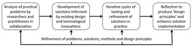

---
categories:
- indicators
- learninganalytics-elearning
date: 2012-05-04 16:43:15+10:00
next:
  text: On the inertia of systems
  url: /blog2/2012/05/05/on-the-inertia-of-systems/
previous:
  text: Questions and insights on (education) hack days/hackathons
  url: /blog2/2012/04/25/questions-and-insights-on-edhackathons/
title: '"Enabling and analysing cross-institutional patterns in learning analytics:
  A foundation for research and action"'
type: post
template: blog-post.html
comments:
    []
    
pingbacks:
    - approved: '1'
      author: Harnessing learning analytics to inform/improve learning and teaching &laquo;
        The Weblog of (a) David Jones
      author_email: null
      author_ip: 216.151.210.18
      author_url: https://djon.es/blog/2012/05/20/harnessing-learning-analytics-to-informimprove-learning-and-teaching/
      content: '[...] of student learning performance (Dawson and McWilliam, 2008).This
        project will be based on work that is doing exactly this (which is in turn based
        on the work of others). The nature of this project, however, [...]'
      date: '2012-05-20 15:09:58'
      date_gmt: '2012-05-20 05:09:58'
      id: '346'
      parent: '0'
      type: pingback
      user_id: '0'
    
---
The following is a slightly edited version of a internal grant application that has just been funded. It is a small step towards actually moving the [Indicators project](http://indicatorsproject.wordpress.com/) a little further toward the targets we talked about so many years ago.  My co-investigators on this grant are: [Colin Beer](http://beerc.wordpress.com/) and [Professor Patrick Danaher](http://apps.usq.edu.au/StaffSearch/default.aspx?staffsearchaction=showdetails&staffsearchrecordid=1134).

One of the big first steps will be to locate this project within all the [work on show at LAK12](http://dougclow.wordpress.com/2012/05/03/lak12-summary/).

### Summary of the project

The widespread adoption of Learning Management Systems (LMS) within universities is generating large collections of data. Few institutions, however, are actively using these data to inform either research into what is happening around e-learning or action to improve e-learning. This design-based research project aims to lay a foundation that will enable cross-institutional use of learning analytics by both researchers and teaching staff. It will use this foundation to analyse and compare patterns within these data sets across two universities and demonstrate how these patterns can generate both sustainable research and action, thereby filling a significant gap in the current literature.

### Objectives

The project aims to build upon initial learning analytics work at CQUniversity (Beer, Clark, & Jones, 2010; Beer, Jones, & Clark, 2009; Clark, Beer, & Jones, 2010) and the related joint CQU-USQ DEHub funded project (Rossi et al., 2011-2012). The specific objectives of this project are to:

1. Develop design principles that contribute to the on-going theorisation of learning analytics and the task of enabling effective inter-institutional projects using learning analytics to inform both research and action in order to improve learning and teaching.
2. Analyse USQ learning analytics to identify unique patterns and to test for the presence at USQ of patterns identified at other institutions.

Through these aims it is intended that the project will lay the groundwork for a range of additional research projects – including competitive external grant applications – aimed at improving learning and teaching at USQ. It is intended that such work would not be limited to those directly involved with this grant application.

### Background

The adoption and implementation of a Learning Management System (LMS) have become the almost universal approach to e-learning at universities (Jones & Muldoon, 2007). Kolowich (2012) reports on survey data from the USA that suggest more than 90% of colleges and universities, regardless of type, have adopted an institutional LMS. While these technologies have become pervasive, there is little evidence of their effectiveness in improving learning outcomes (Phillips et al., 2011). One possible solution to this problem is learning analytics.

Learning analytics has been described (Johnson, Smith, Willis, Levine, & Haywood, 2011, p. 6) as:

> …a variety of data-gathering tools and analytic techniques to study student engagement, performance, and progress in practice, with the goal of using what is learned to revise curricula, teaching, and assessment in real time…. Learning analytics aims to mobilize the power of data-mining tools in the service of learning, and embracing the complexity, diversity, and abundance of information that dynamic learning environments can generate.

Learning analytics has been established as especially useful for institutional management as an enabler of data-driven decision-making, responding to pressures for accountability and student success (Campbell et al., 2007). It can, however, also be used by researchers, teaching and teaching support staff, and students. Siemens and Long (2011) propose that a particular strength of learning analytics is its ability to bridge the research/practice divide. One opportunity for bridging this divide is offered by research that identifies the existence of patterns and correlations (Objective 2) within usage data. For example, the graph in Figure 1 shows one pattern found by this project. It shows the average number of hits on a course website by over 38,000 distance education student/courses. The hits are grouped by age and plotted against the final grade in the course. It shows that students who pass the course and are older than 31 use the LMS significantly more than younger students. This pattern does not meet typical expectations and thereby opens up opportunities for research and new insights that can influence teaching practice. Such work is starting to help universities address the learning analytics challenge identified by Dawson et al (2008, p. 222):

> no longer simply to generate data and make it available, but rather to readily and accurately interpret data and translate such findings to practice

Figure 1. LMS usage by age.  
(n=38,000+ student/courses)

While there is increasing interest in and activity around learning analytics, Siemens and Long (2011) argue that learning analytics “is still in the early stages of implementation and experimentation”. The 2011 Horizon report describes work around learning analytics as still being in the very early stages of development, with much of the work being conceptual, and being four to five years away from widespread adoption (Johnson et al., 2011). This early work in learning analytics has identified a range of problems facing the effective use of learning analytics, including: the ephemerality of the data maintained by LMSs (Greenland, 2011); challenges to institutional processes around data ownership (Arnold, 2010); privacy and profiling (Campbell et al., 2007); failure to capture the true messiness of learning (Campbell, 2012; Siemens & Long, 2011); and, other problems around sharing data within and between universities. Effective cross-institutional use of learning analytics requires a foundation that is able to solve these and other associated problems (Objective 1).

Figure 2 represents one conceptual view of this project and its aims. The enabling task (Objective 1) aims to overcome the barriers – institutional, technical, privacy, diversity in the data, etc. – confronting learning analytics work to provide a foundation for further work. In particular, this work seeks to make theoretical contributions that can be used by ourselves and others to address these problems. With this foundation it is then possible to analyse, compare, and contrast available data to identify a range of patterns (Objective 2) that can be used by various stakeholders to develop a range of research projects and teaching interventions. The neatness of the diagram (e.g., a single foundation and all stakeholders drawing on the same patterns) hides the complexity inherent in learning analytics, the diversity of stakeholder requirements and the ongoing, emergent and collaborative nature of using learning analytics to inform both research and action.

Figure 2. Representation of project aims.

### Significance of the research

While there is significant and growing interest in learning analytics there has been limited work that is cross-institutional. In particular, there has been little work – beyond that proclaiming the existence of difficulties – that actively seeks to develop explicit guidance (Objective 1) for enacting cross-institutional learning analytics. In addition, much of the work around learning analytics has emphasised data mining and the production of reports for management. This research project focuses explicitly on providing patterns and insights (Objective 2) intended to serve the requirements of researchers, teachers, and teaching support staff and to contribute strongly to the applicants’ research agenda.

### Research method

This project arises from the dual observations of:

1. the potential of learning analytics to offer new tools, methods and insight for both research and action around learning and teaching; and,
2. the ongoing uncertainty about how best to navigate the complex issues and relationships surrounding the organisational and inter-organisational implementation and use of learning analytics.

Given these observations, this project will use a design-based research (DBR) methodology to achieve the two stated objectives. Wang and Hannafin (2005, p. 6) define design-based research as:

> … a systematic but flexible methodology aimed to improve educational practices through iterative analysis, design, development, and implementation, based on collaboration among researchers and practitioners in real-world settings, and leading to contextually sensitive design principles and theories.

Design-based research offers the means for this project to target both research and action through collaboration and engagement with a real-world setting. Design-based research is built upon a pragmatic paradigm of inquiry to deal with the complexity inherent in e-learning research (Phillips, McNaught, & Kennedy, 2012). Design-based research often uses the iterative process represented Figure 3.

Figure 3. Design-based research process (adapted from Reeves, 2006, p. 59).

Drawing on a combination of methods (interviews, collaborations, data mining and statistical analysis) this project will iterate through a DBR process generating insights, solutions and theoretical principles required to provide an enabling learning analytics foundation for cross-institutional, collaborative research and action.

### Anticipated outcomes

1. Creation of a learning analytics foundation at USQ that will facilitate additional projects around research and action into understanding and improving learning and teaching at USQ.
2. Development of design principles informing the creation and use of such a foundation.
3. At least two research papers – one based on further statistics analysis of CQUni data, one based on the comparison of patterns between the institutions, and potential for others.
4. Preparation of external research grant applications (e.g., ARC Linkage scheme).

### References

Arnold, K. E. (2010). [Signals: Applying Academic Analytics](http://www.educause.edu/EDUCAUSE+Quarterly/EDUCAUSEQuarterlyMagazineVolum/SignalsApplyingAcademicAnalyti/199385). Educause Quarterly, 33(1).

Beer, C., Clark, K., & Jones, D. (2010). Indicators of engagement. Curriculum, technology and transformation for an unknown future. Proceedings of ASCILITE Sydney 2010 (pp. 75-86). Sydney. Retrieved from http://ascilite.org.au/conferences/sydney10/procs/Beer-full.pdf

Beer, C., Jones, D., & Clark, K. (2009). The indicators project identifying effective learning, adoption, activity, grades and external factors. Same places, different spaces. Proceedings ASCILITE Auckland 2009. Auckland, New Zealand. Retrieved from http://www.ascilite.org.au/conferences/auckland09/procs/beer.pdf

Campbell, G. (2012). Here I Stand. Retrieved April 2, 2012, from https://sas.elluminate.com/site/external/jwsdetect/playback.jnlp?psid=2012-03-01.1231.M.0728C08DFE8BF0EB7323E19A1BC114.vcr&sid=2008104

Campbell, J., DeBlois, P., & Oblinger, D. (2007). Academic analytics: A new tool for a new era. EDCAUSE Review, 42(4), 40-42.

Clark, K., Beer, C., & Jones, D. (2010). Academic involvement with the LMS : An exploratory study. In C. Steel, M. Keppell, P. Gerbic, & S. Housego (Eds.), Curriculum, technology & transformation for an unknown future. Proceedings ascilite Sydney 2010 (pp. 487-496). Retrieved from http://ascilite.org.au/conferences/sydney10/procs/Kenclark-full.pdf

Dawson, S., McWilliam, E., & Tan, J. P. L. (2008). Teaching smarter: How mining ICT data can inform and improve learning and teaching practice. Melbourne. Retrieved from http://www.ascilite.org.au/conferences/melbourne08/procs/dawson.pdf

Greenland, S. (2011). Using log data to investigate the impact of (a) synchronous learning tools on LMS interaction. In G. Williams, P. Statham, N. Brown, & B. Cleland (Eds.), ASCILITE 2011 (pp. 469-474). Hobart, Australia. Retrieved from http://www.leishman-associates.com.au/ascilite2011/downloads/papers/Greenland-concise.pdf

Johnson, L., Smith, R., Willis, H., Levine, A., & Haywood, K. (2011). The 2011 Horizon Report. Media (p. 29). Austin, Texas: The New Media Consortium. Retrieved from http://csn.edu/PDFFiles/OTS/Website documents/getconnected/HR2011.pdf

Jones, D., & Muldoon, N. (2007). The teleological reason why ICTs limit choice for university learners and learning. In R. J. Atkinson, C. McBeath, S. K. A. Soong, & C. Cheers (Eds.), (pp. 450-459). Singapore. Retrieved from http://www.ascilite.org.au/conferences/singapore07/procs/jones-d.pdf

Kolowich, S. (2012). Traditional colleges aim to boost LMS usage. Inside Higher Ed. Retrieved April 1, 2012, from http://www.insidehighered.com/news/2012/03/21/traditional-colleges-aim-boost-lms-usage

Phillips, R., Maor, D., Cumming-Potvin, W., Roberts, P., Herrington, J., Preston, G., Moore, E., et al. (2011). Learning analytics and study behaviour: A pilot study. In G. Williams, P. Statham, N. Brown, & B. Cleland (Eds.), ASCILITE 2011 (pp. 997-1007). Hobart, Tasmania.

Phillips, R., McNaught, C., & Kennedy, G. (2012). Evaluating e-learning: Guiding research and practice. Milton Park, UK: Routledge.

Reeves, T. (2006). Design research from a technology perspective. In J. van den Akker, K. Gravemeijer, S. McKenney, & N. Nieveen (Eds.), Educational Design Research (pp. 52-66). Milton Park, UK: Routledge.

Rossi, D., Beer, C., Janse van Rensburg, H. M., Harreveld, R. E., Danaher, P. A., & Singh, M. J. G. (2011-2012). Learning interactions: A cross-institutional multi-disciplinary analysis of learner-learner and learner-teacher and learner-content interactions in online learning contexts.

Siemens, G., & Long, P. (2011). [Penetrating the Fog: Analytics in Learning and Education](http://www.educause.edu/EDUCAUSE+Review/EDUCAUSEReviewMagazineVolume46/PenetratingtheFogAnalyticsinLe/235017). EDUCAUSE Review, 46(5). Retrieved from

Wang, F., & Hannafin, M. (2005). Design-Based Research and Technology-Enhanced Learning Environments. Educational Technology Research and Development, 53(4), 5-23.