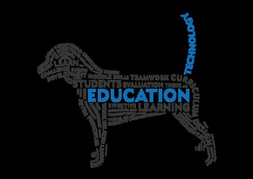

See also: [[blog-home | Home]]

I'm slowly recovering from a week at conferences. First, [ASCILITE'2012 (#ascilite2012)](http://www.ascilite2012.org/home) and second the [SoLAR Southern Flare Conference (#FlareAus)](http://epress.lib.uts.edu.au/conferences/index.php/SoLAR/SSFC12). I was going to spend the week before preparing, but marking and other tasks intervened. This meant I spent much of the week preparing presentations which meant a couple of late nights and limited social collaboration. Add in a couple of early flights and I'm a little tired and frustrated. This may come through in the following.

Perhaps the biggest frustration this week was the audio-visual support at #ascilite2012. This is summed up nicely by the following quote from the ["Information for Presenters" page](http://www.ascilite2012.org/information-for-presenters) from the conference website

> All authors are required to email their final PowerPoint presentation (with all embedded images and videos in the same folder) by no later than 20 November 2012.

Just to be clear on the point, the conference started on the 25th of November. That's right, the expectation was that we'd have our presentations completed 5 days before the conference started.

This probably wasn't going to happen for most people. So a follow up option was provided (from the same page)

> We would prefer that presenters use the equipment we provide in the venue as each venue will have mac and pc capability, therefore we ask for your presentation before hand, or at least 5 hours before your presentation at the event.

According to an overhead comment from one of the people organising the presentation support, this is how all conferences work.

Sorry, but no.

### Tail wagging the dog

To me this is a perfect example of the tail represented by technology and the technologists wagging the dog.

For at least the last 10 years I've been taking laptops to conferences. For me - and many others I know - our process is to work on the presentations until the very last minute due to two main factors. First, we're busy. I didn't get a chance to work directly on my presentation for #ascilite2012 until I left home to travel to Wellington. I didn't really get into my #FlareAus presentation until the night before. Second, we like to incorporate insights, comments and events from the conference. In the hour or so before my #ascilite the conference chair introduced the idea of [FOMO](http://www.statravel.com.au/fomo-guide.htm) to describe MOOCs and other hypes and Neil Selwyn decried the absence of a focus on the present in educational technology research. Both points that resonated strongly with my presentation. I had to work these into the presentation.

Theoretically, this necessary change was not possible.

Which is somewhat ironic given that the aim of the [presentation](/blog2/2012/11/26/the-life-and-death-of-webfuse-whats-wrong-with-industrial-e-learning-and-how-to-fix-it/), the [paper](/blog2/the-life-and-death-of-webfuse-principles-for-learning-and-leading-into-the-future/) and my [thesis](/blog2/research/phd-thesis/) was to argue that university e-learning suffers from exactly the same problem.

Especially when the #ascilite2012 call for papers is talking about

> Recent waves of global uncertainty coupled with local crises and government reforms are reshaping the tertiary education landscape.

### Doing it with academics not possible

An extension to this proposition is that since the people, process and product of university e-learning is inflexible, then university e-learning by definition is either done "to" or "for" the academics. i.e. the tail wags the dog. The practice of e-learning is constrained by the people, process and product. This prevents university being done "with" the academics. i.e. as a learning process. This was the theme picked up in our [#FlareAus presentation](/blog2/2012/11/29/moving-beyond-a-fashion-likely-paths-and-pitfalls-for-learning-analytics-2/).

The proposal being that learning analytics within universities will largely be done "to" and "for" academics, rather than "with". Subsequent to this will be a whole range of pitfalls and eventually the likely end result that learning analytics will become yet another fashion, fad or band-wagon.

### Evidence of workarounds

Just like I chose to ignore the requirements of the audio-visual folk at #ascilite2012. There was evidence at #FlareAus of people working around the requirements/constraints of university e-learning.

[The presentation](http://www.slideshare.net/abelardo_pardo/flip-with-care) from [Abelardo Pardo](https://twitter.com/abelardopardo) used the client-side (browser) approach to working around the inflexibility of the LMS (Moodle). i.e. staff install a browser plugin that identifies when a particular LMS web page arrives in the browser and adds something useful to the page.

Susan Tull presented on the University of Cantebury's LearnTrak system (more detail [in this EDUCAUSE Review article](http://www.educause.edu/ero/article/trak-first-steps-learning-analytics)). LearnTrak is a customised version of [GISMO](http://gismo.sourceforge.net/) which is a "Graphical Interactive Student Monitoring Tool for Moodle". Susan's presentation was before mine at #FlareAus. I liked the idea because they were working with their academics to provide a system that worked for them. That responded to local needs. At least that was the impression.

GISMO apparently takes the Moodle plugin approach but it appears that it does breakaway from Moodle's interface fairly quickly in order to present a fairly detailed collection of reports, mostly charts.

Both these approaches have their limitations. But I am now wondering if there is a vein (rich or otherwise) of research opportunities in developing better and different approaches to breaking the inflexibility of the product and the process of university e-learning. This might become a theme.