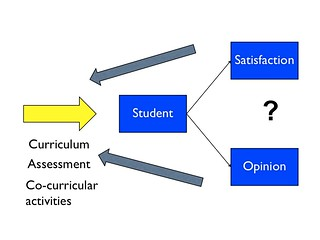
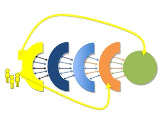
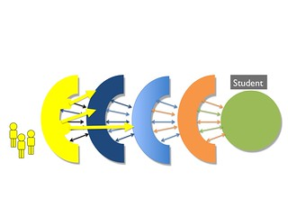
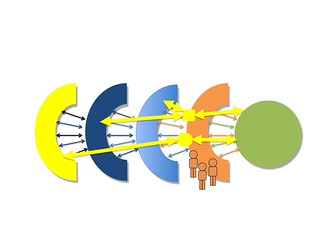

---
categories:
- thesis
date: 2012-12-11 11:31:12+10:00
next:
  text: Understanding management students' reflective practice through blogging
  url: /blog/2012/12/12/understanding-management-students-reflective-practice-through-blogging/
previous:
  text: Tertiary course design is very poor, and we solve it by &quot;blame the teacher&quot;
  url: /blog/2012/12/05/tertiary-course-design-is-very-poor-and-we-solve-it-by-blame-the-teacher/
title: Can/will learning analytics challenge the current QA mentality of university
  teaching
type: post
template: blog-post.html
comments:
    []
    
pingbacks:
    - approved: '1'
      author: Can/will learning analytics challenge the current QA mentality of university&nbsp;teaching
        | Analyse This | Scoop.it
      author_email: null
      author_ip: 89.30.105.121
      author_url: http://www.scoop.it/t/analyse-this/p/3678959506/can-will-learning-analytics-challenge-the-current-qa-mentality-of-university-teaching
      content: '[...] Ensuring the quality of the student learning experience has become
        an increasingly important task for Australian universities. Experience over the
        last 10 years and some recent reading suggests the...&nbsp; [...]'
      date: '2012-12-11 11:54:25'
      date_gmt: '2012-12-11 01:54:25'
      id: '524'
      parent: '0'
      type: pingback
      user_id: '0'
    
---
Ensuring the quality of the student learning experience has become an increasingly important task for Australian universities. Experience over the last 10 years and some recent reading suggests there are some limitations to how this is currently being done. New innovations/fashions like learning analytics appear likely to reinforce these limitations, rather than actually make significant progress. I'm wondering whether the current paradigm/mindset that underpins university quality assurance (QA) processes can be challenged by learning analytics.

## The black box approach to QA

In their presentation at ascilite'2012, Melinda Lewis and Jason Lodge included the following slide.

The point I took from this image and the associated discussion was that the Quality Assurance approach used by universities treats the students as a black box. I'd go a step further and suggest that it is the course (or unit, or subject) as the aggregation of student opinion, satisfaction and results that is treated as the black box.

For example, I know of an academic organisational unit (faculty, school, department, not sure what it's currently called) that provides additional funding to the teaching staff of a course if they achieve a certain minimum response rate on end of term course evaluations and exceed a particular mean level of response on 3 Likert scale questions. The quality of the course, and subsequent reward, is being based on a hugely flawed measure of the quality. A measure of quality that doesn't care or know what happens within a course, just what students say at the end of the course. Grade distribution (i.e. you don't have too many fails or too many top results) is the other black box measure.

If you perform particularly badly on these indicators then you and your course will be scheduled for revision. A situation where a bunch of experts work with you to redesign the course curriculum, learning experiences etc. To help you produce the brand new, perfect black course box. These experts will have no knowledge of what went on in prior offerings of the course and they will disappear long before the course is offered again.

Increasingly institutions are expected to be able to demonstrate that they are paying attention to the quality of the student learning experience. This pressure has led to the creation of organisational structures, institutional leaders and experts, policies and processes that all enshrine this black box approach to QA. It creates a paradigm, a certain way of looking at the world that de-values alternatives. It creates inertia.

## Learning analytics reinforcing the black box

Lodge and Lewis (2012, pp 561) suggest

> The real power and potential of learning analytics is not just to save "at risk" students but also to lead to tangible improvements in the quality of the student learning experience.

.

The problem is that almost every university in Australia is currently embarking on a Learning Analytics project. Almost without exception most of those projects have as their focus, "at risk" students. Attrition and retention is the focus. Some of these projects are multi-million dollar budgets. Given changing funding models and the Australian Government's push to increase the diversity and percentage of Australians with higher education qualifications, this focus is not surprising.

It's also not surprising that many of these projects appear to be reinforcing the current black box approach to quality assurance. Data warehouses are being built to enable people and divisions not directly involved with actually teaching the courses to identify "at risk" students and implement policies and processes that keep them around.

At it's best these projects will not impact on the actual learning experience. The interventions will occur outside of the course context. At worse, these projects will negatively impact the learning experience as already overworked teaching staff are made to jump through additional hoops to respond to the insights gained by the "at risk" learning analytics.

## How to change this?

The argument we put forward in a [recent presentation](/blog/2012/11/29/moving-beyond-a-fashion-likely-paths-and-pitfalls-for-learning-analytics-2/) was that the institutional implementation of learning analytics needs to focus on "doing it with academics/students" rather than on doing it "for" and "to" academics/students. The argument here is that the "for" and "to" paths for learning analytics continues the tradition of treating the course as a black box. On the other hand, the "with" path requires direct engagement with academics within the course context to explore and learn how and with what impacts learning analytics can help improve the quality of the student learning experience.

In the [presentation](/blog/2012/11/29/moving-beyond-a-fashion-likely-paths-and-pitfalls-for-learning-analytics-2/) Trigwell's (2001) model of factors that impact upon the learning of a student was used to illustrate the difference. The following is a representation of that model.

### Do it to the academics/students

In terms of learning analytics, this path will involve some people within the institution developing some systems, processes and policies that identify problems and define how those problems are to be addressed. For example, a data warehouse and its dashboards will highlight those students at risk. Another group at the institution will contact the students or perhaps their teachers. i.e. there will be changes to the institutional context level that will essentially by pass the thinking and planning of the teacher and go direct to the teaching context. It's done to them.

The course level is largely ignored and if it is considered then courses are treated as black boxes.

### Do it for the academics/students

In this model a group - perhaps the IT division of the central L&T folk - will make changes to the context by selecting some tools for the LMS, some dashboards in the data warehouse etc that are deemed to be useful for the academics and students. They might even run some professional development activities, perhaps even invite a big name in the field to come and give a talk about learning analytics and learning design. i.e the changes are done for the academics/students in the hope that this will change their thinking and the planning.

The trouble is that this approach is typically informed by a rose-coloured view of how teaching/learning occurs in a course (e.g. very, very few academics actively engage in learning design in developing their courses); ignores the diversity of academics, students and learning; and forgets that we don't really know how learning analytics can be used to understand student learning and how we might intervene.

The course is still treated as a black box.

### Do it with the academics/students

In this model, a group of people (including academics/students) work together to explore and learn how learning analytics can be applied. It starts with the situated context and looks for ways in which what we know can be harnessed effectively by academics within that context. It assumes that we don't currently know how to do this and that by working within the specifics of the course context we can learn how and identify interesting directions.

The course is treated as an open box.

This is the approach which our [failed OLT application](/blog/2012/12/01/enabling-academics-to-apply-learning-analytics-to-individual-pedagogical-practice-how-and-with-what-impacts-2/) was trying to engage in. We're thinking about going around again, if you're interested then let me know.

## The challenge of analytics to strategy

This post was actually sparked today by reading [this article](http://www.forbes.com/sites/sap/2012/12/06/does-analytics-make-us-smart-or-stupid/) titled "Does analytics make us smart or stupid?" in which someone from an analytics vendor uses McLuhan's Tetrad to analyse the possible changes that arise from analytics. In particular, it was this proposition

> With access to comprehensive data sets and an ability to leave no stone unturned, execution becomes the most troublesome business uncertainty. Successful adaptation to changing conditions will drive competitive advantage more than superior planning. While not disappearing altogether, strategy is likely to combine with execution to become a single business function.

This seems to resonate with the idea that perhaps the black box approach to the course might be challenged by learning analytics. The "to" and "for" paths are much more closely tied with traditional views of QA which are in turn largely based on the idea of strategy and top-down management practices. Perhaps learning analytics can be the spark that turns this QA approach away from the black box approach toward on focused more on execution, on what happens within the course.

I'm not holding my breath.

### References

Lodge, J., & Lewis, M. (2012). Pigeon pecks and mouse clicks : Putting the learning back into learning analytics. In M. Brown, M. Hartnett, & T. Stewart (Eds.), Future challenges, sustainable futures. Proceedings ascilite Wellington 2012 (pp. 560–564). Wellington, NZ.

Trigwell, K. (2001). Judging university teaching. The International Journal for Academic Development, 6(1), 65–73.