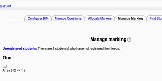

---
categories:
- bim
date: 2012-12-28 11:20:43+10:00
next:
  text: Major (Moodle) requirements for BIM 2.0
  url: /blog/2012/12/29/major-moodle-requirements-for-bim-2-0/
previous:
  text: 'BIM: another restart?'
  url: /blog/2012/12/19/bim-another-restart/
title: Bug fix and to do for BIM
type: post
template: blog-post.html
---
After a short Xmas break it's time to continue work on getting [BIM 2.0](/blog/research/bam-blog-aggregation-management/) up and going. In this post I'm trying to continue the work from [a week or so ago](/blog/2012/12/19/bim-another-restart/). The main aim is to fix a bug with the manage marking page.

**Status:** The manage marking bug has been fixed. Mostly related to further migration work from Moodle 1.9 to Moodle 2.x

## The manage marking bug

The bug is summarised nicely by the following screen short from the last post.

There appears to be a problem with one of the data structures that results in the BIM crashing and burning. There's some evidence of an earlier attempt to investigate this, so time to revisit prior posts on BIM development. [This post](/blog/2012/04/11/bim2-working-on-coordinator-part-1/) identifies the location of the problem.

The problems are all related to the changes in the database API from 1.9 to 2.x

These are fixed. get\_all\_marker\_stats is working, however, the displaying of the data also needs to be fixed. Replacing flexible table with HTML table.

To do

- Table of unregistered students is showing some number (student id?) that shouldn't be there.
- It isn't showing the left hand column.  
    A broken div

### Unregistered students

A few of the pages display a table of students who have not registered their blogs. This needs to be updated to html\_table.

1. Find where it is shown.  
    Done using the bim\_setup\_details\_table with the last parameter being unregistered. Once with the marker code and twice in the coordinator code.
2. Identify the fix
    - replace add keyed data with similar to \[code lang="php"\]$table->data\[\] = array( $row\['username'\], $row\['name'\], $row\['email'\], $row\['register'\] );\[/code\]
    - replace table..print\_html with \[code lang="php"\]echo html\_writer::table( $table );\[/code\]
3. Fix each of those.  
    Fixed.

### Help text for Manage Marking

The problem with manage marking seems to have delayed the provision of the help text. Need to add that in.

Only the one, but there does appear to be some scope to provide more detailed help messages throughout.

## To do list

[This post](/blog/2012/04/05/bim2-whats-working-for-coordinator/) has a list of what was working and not with the coordinator interface and [a later post](/blog/2012/04/11/bim2-working-on-coordinator-part-1/) updates some of this. Need to revisit these and start a list in basecamp.

Misc to do

- Manage marking
    - view students with the missing status appears to be showing a student who has 1 question that has been marked. _What is the meaning of the MISSING status?_
- Re-visit the use of tables and how implemented.
- Help messages
    - Check out other help icons in coordinator views.
    - Think about provide more detailed help via sprinkling help icons throughout all of the views.
    - Look into how some of the older help text can be reused.