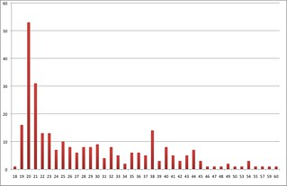
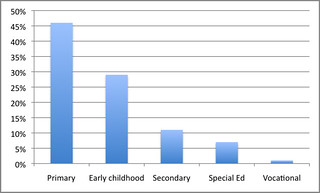

---
categories:
- edc3100
- elearning
- teaching
date: 2013-01-11 15:20:13+10:00
next:
  text: '"Engaging with #etmooc - how and what perspective"'
  url: /blog/2013/01/15/engaging-with-etmooc-how-and-what-perspective/
previous:
  text: 'Translating Learning into Numbers: A Generic Framework for Learning Analytics'
  url: /blog/2013/01/09/translating-learning-into-numbers-a-generic-framework-for-learning-analytics/
title: Making some "3100" thinking explicit
type: post
template: blog-post.html
comments:
    - approved: '1'
      author: elketeaches
      author_email: elkeclarissa@hotmail.com
      author_ip: 124.189.216.206
      author_url: http://elketeaches.wordpress.com
      content: "Fun stuff!  The xkcd comic strip \u201CTech support cheat sheet\u201D\
        \ is great, I must remember to use that in the future. I like that you are working\
        \ hard to improve 3100, I wish other subjects were re-worked with so much passion!\
        \  You've got 2 really good things going for you &amp; 3100: your own passion\
        \ for change/learning AND your communication style with students (which I have\
        \ learned is a very rare gift/skill in the online professor/instructor world).\
        \  Badges are a great idea although unfortunately students still need a grade.\
        \  The idea behind MOOC is a good way to proceed. I enjoy your posts."
      date: '2013-01-11 15:45:47'
      date_gmt: '2013-01-11 05:45:47'
      id: '557'
      parent: '0'
      type: comment
      user_id: '0'
    - approved: '1'
      author: David Jones
      author_email: davidthomjones@gmail.com
      author_ip: 139.86.2.15
      author_url: https://djon.es/blog/
      content: 'My situation is a little different form most. 3100 in 2012 was not what
        I would have taught. My first year, so I taught what was handed to me. I certainly
        interpreted it, but it''s not where I would have started. 2013 is a chance to
        make it mine and then learn from it.  Am hoping the design will make it naturally
        grow and evolve.  Time will tell.
    
    
        Appreciate your comments on these ideas.
    
    
        Your post on gamemaker has me intrigued. Will try to find some time to play with
        it.'
      date: '2013-01-11 17:09:23'
      date_gmt: '2013-01-11 07:09:23'
      id: '558'
      parent: '557'
      type: comment
      user_id: '1'
    - approved: '1'
      author: Maurice A. Barry
      author_email: maurice.a.barry@gmail.com
      author_ip: 47.54.195.7
      author_url: http://mauriceabarry.wordpress.com
      content: Might me worthwhile to explore some synchronous activities too. I work
        in eLearning (k-12) and find that regular--required--synchronous activities are
        essential to maintain student engagement. It's different for post secondary, of
        course, where there is much more ownership.
      date: '2013-01-14 00:47:11'
      date_gmt: '2013-01-13 14:47:11'
      id: '560'
      parent: '0'
      type: comment
      user_id: '0'
    - approved: '1'
      author: Maurice A. Barry
      author_email: maurice.a.barry@gmail.com
      author_ip: 47.54.195.7
      author_url: http://mauriceabarry.wordpress.com
      content: Oh--and I thoroughly enjoyed reading this post. VERY insightful.
      date: '2013-01-14 00:47:48'
      date_gmt: '2013-01-13 14:47:48'
      id: '561'
      parent: '0'
      type: comment
      user_id: '0'
    - approved: '1'
      author: David Jones
      author_email: davidthomjones@gmail.com
      author_ip: 139.86.80.28
      author_url: https://djon.es/blog/
      content: 'I agree, there seems to be something to synchronous events that many folk
        like/expect. So, there will be synchronous activities.
    
    
        At the least because around half the students are on-campus students and by law
        have traditional, synchronous face-to-face sessions. We''ll mix these up, I think.
    
    
        Also looking at replicating the common MOOC/open course practice of invited speakers
        on selected topics. Hopefully going to nut that out over the next couple of weeks.'
      date: '2013-01-14 08:29:01'
      date_gmt: '2013-01-13 22:29:01'
      id: '562'
      parent: '560'
      type: comment
      user_id: '1'
    - approved: '1'
      author: Maurice A. Barry
      author_email: maurice.a.barry@gmail.com
      author_ip: 47.54.195.7
      author_url: http://mauriceabarry.wordpress.com
      content: 'Here we use a combination of blackboard collaborate (used to be elluminate
        live) and Desire2Learn to provide distance education opportunities to students
        in over 100 rural communities. We''re 100% funded by the provincial government
        so there''s no fees, etc. The achievement and completion rates are the same as
        face to face. A lot of that credit goes to the synchronous--it''s not that ''lecturing''
        over the Internet is effective. Rather it''s the case that the synchronous classes
        bring the students and teacher together and create a community devoted to learning.
        It also ensures that we can give the students the required ''nagging'' when needed.
        If your interested, we''re here: www.cdli.ca'
      date: '2013-01-14 08:58:53'
      date_gmt: '2013-01-13 22:58:53'
      id: '563'
      parent: '562'
      type: comment
      user_id: '0'
    - approved: '1'
      author: David Jones
      author_email: davidthomjones@gmail.com
      author_ip: 139.86.2.15
      author_url: https://djon.es/blog/
      content: 'Jesse Stommel''s piece <a href="http://www.hybridpedagogy.com/Journal/files/Forking_Education.html"
        rel="nofollow">Online Learning: A user''s guides to forking education</a> captures
        a lot of what EDC3100 could/should perhaps become. Will be interesting to see
        how much I''m willing to push the organisational constraints and perhaps more
        importantly my own conceptual constraints.'
      date: '2013-01-14 09:07:17'
      date_gmt: '2013-01-13 23:07:17'
      id: '564'
      parent: '0'
      type: comment
      user_id: '1'
    
pingbacks:
    - approved: '1'
      author: Making some &ldquo;3100&Prime; thinking explicit | Personal e-Learning Environments
        | Scoop.it
      author_email: null
      author_ip: 89.30.105.121
      author_url: http://www.scoop.it/t/educational-landscapes/p/3994851288/making-some-3100-thinking-explicit
      content: '[...] In around two months a couple of hundred pre-service teachers will
        be wanting/required to start engaging with the course EDC3100, ICTs and Pedagogy.
        For the last 3 or 4 months I&rsquo;ve been readi...&nbsp; [...]'
      date: '2013-01-11 17:47:32'
      date_gmt: '2013-01-11 07:47:32'
      id: '559'
      parent: '0'
      type: pingback
      user_id: '0'
    - approved: '1'
      author: 'Engaging with #etmooc &#8211; how and what perspective &laquo; The Weblog
        of (a) David Jones'
      author_email: null
      author_ip: 72.232.113.86
      author_url: https://djon.es/blog/2013/01/15/engaging-with-etmooc-how-and-what-perspective/
      content: '[...] model the type of practice I&#8217;m hoping to see from the students
        in the course I&#8217;ll be teaching [...]'
      date: '2013-01-15 09:33:04'
      date_gmt: '2013-01-14 23:33:04'
      id: '565'
      parent: '0'
      type: pingback
      user_id: '0'
    
---
In around two months a couple of hundred pre-service teachers will be wanting/required to start engaging with the course EDC3100, ICTs and Pedagogy. For the last 3 or 4 months I've been [reading a bit](/blog/2012/12/14/4668/) and generally mulling over what I'll do and how far to go. Back in July I started off [with this initial post](/blog/2012/07/20/starting-the-re-design-of-edc3100/). It's now (past) time to make some of this explicit, make some design decisions and implement it. This is the start. Littered through the following will be questions and reminders to myself for further consideration.

If you have thoughts and criticisms, now would be a good time to contribute. Any and all feedback is very much appreciated. Littered through the following are **Questions** I've left myself. Feel free to make suggestions.

This post has been an on-going development process over a week or so. It's a somewhat organised collection of thoughts, but it is time I stopped following leads, posted it and started seriously thinking about the implementation specifics. That will be next week's task.

## The rationale

Lisa Lane writes [in this post](http://lisahistory.net/wordpress/2012/11/five-short-years-to-mooc-corruption/) about what she sees as the purpose of MOOCs

> the opportunity to exploit the opportunities of the web, to form learning communities, to blow apart top-down teaching models, and to create something meaningful and valuable to participants.

While EDC3100 will not be a MOOC, Lisa's description resonates strongly with what I'm trying to do and what's influencing my current thinking. Here's a bit more of the rationale.

### Transformation

[EDC3100](http://www.usq.edu.au/course/synopses/2012/EDC3100.html) aims to help pre-service teachers figure out how to design learning and teaching in "ICT enriched environments". Larkin et al (2012) suggest that how academics model the use of ICTs in learning and teaching is an important factor in developing the ICT competence of students. Our experiences shape us. The use of ICT in the courses taken by pre-service teachers are shaping their knowledge of ICTs and Pedagogy. This begs the question about the types of experiences with ICTs for learning that students gain from EDC3100 and whether it be better?

How do you evaluate "better"? Well one approach is to use something like the SAMR model (see the following image). There are similar frameworks/models, including: [the RAT Framework](http://sdexter.net/courses/589/downloads/RAT.pdf) and the [Computer Practice Framework](http://www.med8.info/cpf/twining/index.htm). But the story is just about the same. Using SAMR most of the use of ICTs in prior offerings of EDC3100 site within the enhancement stage.

!!! warning "Broken image link"

Is there any wonder then that much of the use of ICTs we see when our students head out to teach also appear at that same level? Certainly what they see in 3100 is not the only, or even the major, reason the students struggle to be transformative (3 weeks in a new school in someone else's class working to their plans isn't a great context for transformation) in their use of ICT and pedagogy. However, it would seem important for a course like 3100 to provide them with an opportunity to observe and participate in some examples of transformation.

**Question:** How do we provide students with the preparation and opportunity to demonstrate/experience the design of transformation with ICTs?

**Question:** A model like SAMR might solve a problem observed last year where pre-service teachers weren't aware that there was more to ICTs and pedagogy than using an Interactive White Board to show a YouTube video. Or that having the students use [Popplet](http://popplet.com/) to create a mindmap perhaps wasn't a great advance over butchers papers and pens. Are there better alternatives to SAMR? The [Computer Practice Framework](http://www.med8.info/cpf/twining/index.htm) adds a few extra considerations linked to common mistakes.

### Building confidence and experience

Hammond et al (2009) identifies personal experience of using ICT as an important contextual factor explaining why a pre-service teacher will use ICTs. This experience (Hammond et al, 2009, pp 70-71)

> gave student teachers the confidence to use ICT, allowed them to develop effective strategies for learning new skills and gave them an awareess of the value of ICT based on its application in their own learning

Given this, it would appear important for EDC3100 to provide a space for the pre-service teachers to expand their experience with ICTs and develop their confidence with them. To provide them with a foundation.

Hopefully we can help them develop their tech support skills and perhaps build on the advice from [xkcd](http://xkcd.com/).

xkcd comic strip "Tech support cheat sheet"

Barton and Haydn (2006) found that the sheer volume of information about using ICT and pedagogy can overwhelm students. The volume of information, or its rate of increase, is not likely to have significantly reduced since 2006. Consequently the course has to help students develop the confidence and experience in dealing with this volume. We have start their journey towards becoming, as @palbion describes it, [expert learners](http://www.pama.net.au/dralb/?p=3445).

**Question:** Where are the good insights, models, theories etc around designing and scaffolding people's development of these skills? Information literacy?

### Reflection and feedback

Hammond et al (2009) quote a range of authors to identify structured reflection on the use of ICT as a powerful technique in developing pedagogic understanding. Similarly, "assignments which relate ICT to developing practice can be influential" (Hammond et al, 2009, p. 60). In the version of EDC3100 that I taught last year, there wasn't a lot of opportunity for students to engage in reflection. Even less opportunity to receive feedback on those reflections. Hopefully in 2013 we can change this. Increasing the levels of reflection and feedback will hopefully improve learning. [Feedback](http://www.learningandteaching.info/teaching/what_works.htm#Feedback) must be good since [Hattie](http://www.learningandteaching.info/teaching/what_works.htm) identifies it as what works best for improving learning.

**Question:** What are the good insights/models/theories etc around designing activities that encourage reflection?

### Learning to be

EDC3100 is a professional course. It's in the 3rd year of a four year degree program that is hopefully producing effective teaching professionals by the end. This is why I'm interested in how EDC3100 can help the pre-service teachers taking the course "learning to be" a teacher. Seeley Brown (2008, p. xii)

> perhaps even more signifi cant, aspect of social learning, involves not only “learning about” the subject matter but also “learning to be” a full participant in the field. This involves acquiring the practices and norms of established practitioners in that field or acculturating into a community of practice.

I'm hoping EDC3100 can encourage/enable the students to engage in social learning with other students and join in broader teacher networks. To really engage with the task of "learning to be" a teacher.

### Diversity, personalisation and pedagogies

During 2013 there are likely to be 300+ students take the course. They will be a very diverse student cohort on a number of criteria. For example, in terms of technical skill last year's cohort included everything from an ex-IT development professional through to technophobes. As the graph below shows students' ages ranged from 18 through 60. Though over 50% of the students were traditional 3rd year students straight from high school - aged 20 years old.

There was also significant diversity in the type of teacher they were preparing to be. EDC3100 last year included "pre-service teachers" training to teach everyone from pre-school, primary school, high school and vocational education. Not to mention the different disciplines and knowledge areas these pre-service teachers will cover. Barton and Haydn (2006, pp 267) suggest that

> Training needs to be differentiated to take into account the differing ways in which ICT helps teachers of different subjects to improve teaching and learning

As it happens the university that employs me to teach EDC3100 has adopted "Personalised learning" as [one of its four overarching themes for its 2022 Vision](http://www.usq.edu.au/about-usq/about-us/plans-reports). Some of the institutional words around this theme include

> We promise to partner with learners in the pursuit of their study objectives regardless of their background, location or stage in life.
> 
> Through innovation USQ harnesses emerging technologies to enable collaborative teaching and individualised learning for its students regardless of their location or lifestyle.
> 
> We understand our remarkably diverse and global student population. USQ seeks to accommodate individual learning styles and to provide students with personalised adaptive learning support. We are known for our capacity to research and anticipate technological advances and to capitalise on these.

**Question:** How does this type of sentiment match some of the broader ideas of personalised learning (e.g. [this one](http://www.personalizelearning.com/2012/05/stages-of-personalized-learning.html))? **Question:** How far can you take personalised learning within an institutional context with a significant focus on consistency and quality assurance (where consistency and quality are often equated)?

While perhaps not going quite as far as [suggested by this high school student](http://coopcatalyst.wordpress.com/2012/12/28/good-education-best-of-2012-the-five-most-extraordinary-things-to-happen-in-education/). There's a lot to be said for aiming EDC3100 toward this goal

> Let’s bring learning back to the learners. Why are we disregarding the brilliant work of progressive educators like John Dewey, Maria Montessori, Jean Piaget, and Paulo Freire? We need to allow students to craft their own learning experiences through projects, apprenticeships, and hands-on engagement. ..... My advice: Let’s get over the fads and understand that learning is best done through doing, creating, and exploring.

### The dead viola player?

In [critiquing xMOOCs and Learning Analytics](http://mfeldstein.com/where-xmoocs-and-adaptive-analytics-both-fail-for-now/) Michael Feldstein identifies another reason driving the changes in EDC3100. Feldstein breaks the class experience into three parts and talks about how well they scale with technology. The parts are

1. Content transmission;  
    Which scales well. Feldstein gives Khan Academy as an example. Given that content is free and abundant, I'm hoping the teaching staff in EDC3100 can avoid duplicative content creation. e.g. we won't be giving lectures in the traditional sense.
    
    **Questions:** What (if any) content required for EDC3100 is not free and abundant?  
    How do we scaffold students' engagement with the abundant content?
    
2. Assessment;  
    Which xMOOCs are scaling with MCQs and perhaps somewhat with peer assessment. But which doesn't necessarily scale well if you're trying to assess in areas that don't come with "cut-and-dry answers".
3. Remediation.  
    i.e. responding helpfully to students when they are stuck. The ability to identify "not only what a student is getting wrong on an assessment but why she is getting it wrong".

It's remediation that Feldstein identifies as what both learning analytics and xMOOCs don't do well. He also suggests it's been dead long before xMOOCs

> My guess is that college professor productivity has risen in the last decade, if all you mean by “productivity” is number of butts in classroom seats per teacher. The cost has been less time to respond to individual student needs.

I'm hoping EDC3100 can revive the viola player a touch. There will be limit to how much the EDC3100 teaching staff can do this due to institutional workload and funding models and simply the sheer number of students. This is where [Stephen Downes' comment](http://mfeldstein.com/where-xmoocs-and-adaptive-analytics-both-fail-for-now/#comment-93422) on Feldstein's post comes in. In talking about how the cMOOCs addressed the problem the dead viola player

> You don’t need an expert for this – you just needs someone who knows the answer to the problem. So we have attempted to scale by connecting people with many other students. Instructors are still there, for the tough and difficult problems. But students can help each other out, and are expected to do so.

Perhaps the crux of the problem for me with EDC3100 is framed by Stephen as

> we need to structure learning in such a way as to make asking questions easier, and as necessary, to provide more incentives to people to answer them.

There are numerous barriers to this. Cousin and Deepwell (2005) identify the learner problem, in that they "arrive in the networked setting with 'congealed practices' from more didactic educational contexts". Shifting the students out of their congealment can be hard and unsuccessful work. Not the least because the institutional context has its own problems with congealment that can create a fair bit of cognitive dissonance. Not to mention that the teaching staff bring a level of congealment. When I am thinking about what I will be doing as this course is happening, I find myself slipping back into my own set of congealed practices. Finally, there is just the question of discovering and evaluating what are the practices that will effectively replace the congealed practices.

This is where I'm hoping to benefit from the work of others such as [Kop, Fournie and Sui Fai Mak (2011)](http://www.irrodl.org/index.php/irrodl/article/view/1041/2025) and [Weller (2011)](http://oro.open.ac.uk/28774/).

**Question:** What are some of the other useful sources of design insight? **Question:** When am I going to stop navel gazing and start actually designing?

In arguing that [MOOCs fundamentally misperceive how teaching works](http://computinged.wordpress.com/2013/01/04/moocs-are-a-fundamental-misperception-of-how-learning-works/) Mark Guzdial suggests that "the main activity of a teach is to orchestrate learning opportunities, to get students to do and think. A teacher does this most effectively by responding to the individuals". How can we do this effectively in the context of EDC3100?

## Synchronicity

As it happens there is currently a great deal of activity in this area. Other folk are putting together MOOCs and open courses and sharing the whys, wherefores and what. These offer some possibilities for learning/borrowings. Here's an initial summary.

### #etmooc

Alec Couros - one of the [inspirations](/blog/2012/12/14/4668/) for much of what's happening with EDC3100 - is involved with [#etmooc](http://etmooc.org/) - Educational Technology & Media. Given this connection and the topic of #etmooc being very closely related to the topic of EDC3100 I'm aiming to engage with it in a number of ways.

Alec, as is his wont, appears to have been very open in gathering input for the design of #etmooc. The evidence of this can be seen in posts from [Lisa Lane](http://lisahistory.net/wordpress/2012/12/organizing-etmooc/), [Alan Levine](http://cogdogblog.com/2012/12/10/openness-beyond-the-course-container/) and others. Lisa's post summarises some of the resources (including a [Google community](https://plus.google.com/u/0/communities/116789514116083331517) from which I've drawn a couple of ideas in one quick skim and [the planning Google doc](https://docs.google.com/folder/d/0B9N9E-8eecBAcV9hcHU0azBRMjg/edit?docId=1w0uirKvMYtU2iLdk1aGqmTkcTyVgXFJwxnM1qxEyH1U)) and questions considered by the #etmooc designers. It's interesting in terms of my lack of connections in certain areas to note that I'm only now becoming aware of some of [Alec's much earlier posts](http://educationaltechnology.ca/couros/2238) about #etmooc.

Unlike the typical weekly course (and cMOOC) schedule, Lisa and Alan suggest something more open. Topics that have a launch date, a basic introduction and then a community development process where the aims and resources for the topic are developed by the community. There's much to like to this idea, but it probably falls to far outside the constraints of EDC3100. Not sure how the institution might take this approach and I think the students may have some queries about exactly what my role is in the course. EDC3100 will need to keep a bit more of the traditional schedule, but how much can we open it up from there?

**Question:** How much can I push the content of the course out of the institutional Moodle instance and into more open technologies?

Some insights/ideas from all of the above #etmooc related resources

- If a course is successful in getting students engaged with networks, then the course doesn't have an end date.
- Large synchronous presentations have value for "introducing/advancing ideas and for tool demonstrations".
- With a distributed approach the effective use of tagging is necessary for aggregating networked conversations.
- Designing interactions is key or as one of the comments put clustering opportunities. Helping people orient themselves by providing tasks/opportunities to find "people who you want to learn with".
- Entry to Twitter and this type of approach in general is difficult.
- The idea of using [git projects](https://github.com/features/projects) as a platform.
- The influence of [23 things](http://neflins23things.blogspot.com.au/2009/01/what-are-23-things.html) as a design aid or something like [100 ideas](http://www.kerismith.com/popular-posts/100-ideas/).
- The importance of a central course space for orientation and perhaps community?  
    It would also match students expectations. **Question:** If I create a central course space in both the institutional Moodle instance and in a Wordpress (or some other open site) blog with the same information, which would students use the most?

### OLDS-MOOC

Will be interesting to compare the [Learning Design for a 21st Century Curriculum MOOC](https://sites.google.com/a/olds.ac.uk/oldsmooc/about/olds-mooc-how-it-works) with #etmooc. Both are starting about the same time.

### Emerging Learning Technologies

Curtis Bonk has released the [syllabus for his "R685, Emerging Learning Technologies" course which is also closely related to the purpose of EDC3100. (It is interesting to see the evolution of the course from the](http://php.indiana.edu/~cjbonk/Syllabus_R685_Spring_of_2013.htm) [2012 version](http://php.indiana.edu/~cjbonk/Syllabus_R685_Fall_of_2012.htm), especially in the objectives. One of the assessment options was to evaluate changes in syllabi from the course since 1990 ) But one difference is that EDC3100 tends to spend more time explicitly on pedagogy. Both #etcmoos and R685 don't, at least as indicated by the course topics.

Some insights/ideas from R685

- The grading scheme.  
    Interesting in the flexibility that it gives the students. Six set tasks which each give points up to a total of 360 points. Your grade is based on the number of points you achieve. Perhaps a step to far here.
- Tidbit reflections.  
    A large collection of small online articles are provided. Students are asked to read 3-4 a week. The assessment is to submit a list of the top 20 (and the top 2-3 videos) and reflection on what was learned from them. The list of resources might be useful.
- Discussion moderator.  
    Students sign up to take on the role of discussion starter based on the week's readings.
- Participation is marked both for synchronous sessions and posts etc.
- The qualitative criteria for posts.
    
    > 1. Diversity (some variety in ideas posted, and some breadth to exploration);
    > 2. Perspective taking (values other perspectives, ideas, cultures, etc.);
    > 3. Creativity (original, unique, and novel ideas);
    > 4. Insightful (makes interesting, astute, and sagacious observations).
    > 5. Relevancy (topics selected are connected to course content); and
    > 6. Learning Depth/Growth (shows some depth to thinking and elaboration of ideas);
    
- Criteria for the reflective paper grading are also interesting
    
    > 1. Relevancy to class: meaningful examples, relationships drawn, interlinkages, connecting weekly ideas.
    > 2. Insightful, Interesting, Reflective, Emotional: honest, self-awareness, interesting observations
    > 3. Learning Depth/Growth: takes thoughts along to new heights, exploration, breadth & depth, growth.
    > 4. Completeness: thorough comments, detailed reflection, fulfills assignment, informative.
    
- The collection of weekly resources.  
    Useful because of the list of resources to pick over, but also as an example of the "MOOC-like" approach I'm thinking for EDC3100. Provide a collection of useful resources and have the students read and reflect. Perhaps search for some more. Interesting division into Readings and Tidbits. **Question:** How much and what learning activities should be set each week?

Should remember that R685 is a graduate course, 3100 is undergraduate. There is a large written component (as in formal report) in R685, will aim to avoid that.

### Educators as Social Networked Learners

In [Educators as Social Networked Learners](http://usergeneratededucation.wordpress.com/2012/12/29/developing-a-mooc-inspired-course/) Jackie Gerstein describes here graduate course - Social Networked Learning. Some thoughts/inspirations from this post include

- Use of alternate media (e.g. Glog) for assessment/to capture learning.  
    Certainly something I wish to explore in 3100. Part of the students learning what they do. They need to use the ICT tools we're talking about to show and share their learning.
- The Twitter assignment has some suggestions to be made for both how 3100 might use Twitter, but also some of the other tools
- The PLE assignment's use of Mindmap might be another way to balance broadening awareness of different tools.

### Social media literacies syllabus

Via Jackie Gerstein's post I come to Howard Rheingold's [Syllabus for Social Media Literacies](https://docs.google.com/document/d/1whawicjQdSDh1ohWF4-CDnSrrpkjfFtnpc6632vGBvg/edit?pli=1). Like this

> Literate populations are becoming the driving force that shape new media, just as they were the eras following the invention of the alphabet and printing press,. What broad populations know now, and the ways they put that knowledge into action, will shape the ways people use and misuse social media for decades to come.

and the five social media literacies

1. attention;
2. crap detection;
3. participation;
4. collaboration; and,
5. network awareness.

**Reminder:** revisit this work to explore it's applicability to 3100 and observe what comes out of #etmooc

Importantly, the following succinctly captures important aspects of the "design principles" I'd like to use

> chose texts that can offer analytic tools, explanatory frameworks, and competing perspectives -- the basic building blocks for teachers and learners to use.

and he makes the important point and likely problem with this type of approach i.e.

> College students have been strongly socialized to do the homework for each class the night before it is due -- a method that doesn’t work when discourse, not a discrete product like a term paper, is the goal. The necessity for more frequent informal discourse through forums, blogs, comments, usually needs to be repeated and reinforced.

Some other important points/ideas etc.

- The criteria and resources on [this introduction to forums](http://socialmediaclassroom.com/community/wiki/introduction-forums) could be useful (though I've seen similar elsewhere)
    
    > 4 Points - The posting(s) integrates multiple viewpoints and weaves both class readings and other participants' postings into their discussion of the subject. 3 Points - The posting(s) builds upon the ideas of another participant or two, and digs deeper into the question(s) posed by the instructor. 2 Points - A single posting that does not interact with or incorporate the ideas of other participants' comments. 1 Point - A simple "me too" comment that neither expands the conversation nor demonstrates any degree of reflection by the student. 0 Points - No comment.
    
- The idea of students pre-submitting a substantial question that they are prepared to address in a f-t-f session.
- Teams of (2) students creating mindmaps from key readings for the week.
- I wonder how well the [instructors introduction](http://socialmediaclassroom.com/host/vircom/lockedwiki/welcome-instructor) would match current requirements of my institution?

## Introduction to openness

And then there is [David WIley's course "Introduction to Openness in Education](https://learn.canvas.net/courses/4/) being run on Canvas. Interesting insights and ideas include

- The use of badges rather than grades.  
    It's not a graded course, but interesting to see the badge implementation. It's one of the considerations for 3100 and the use of blog posts to "submit" the evidence. The course itself has a module dedicated to open assessment and open badges which could prove useful perhaps as an example of transformation for the 3100 students.
    
    **Question:** How would the awarding of badges work with BIM and by extension Moodle?
    
- [Explicitly makes the point](https://learn.canvas.net/courses/4/wiki/course-philosophy?module_item_id=52477) that the learning artifacts are the students and are stored outside the LMS.  
    Links this to a constructionist type quote from Terry Anderson.
- The Anderson quote is from a post ["Connectivying" your course](http://terrya.edublogs.org/2012/12/18/connectivy-your-course/). It draws on the work by Anderson and Dron in two papers, including [this one](http://www.eurodl.org/?p=current&article=523.)  
    Describes two defining characteristics of connectivism
    - Construction, annotation and maintenance of learning artifacts that are open and contribute to knowledge beyond the course.
    - Student be given the opportunity, incentive and support to form networks with others, including outside the course.
- The [technology requirements](https://learn.canvas.net/courses/4/wiki/course-technology-requirements) are likely to be very similar to 3100, though perhaps not the YouTube account? But perhaps that's my textual prejudice showing through.
- The structure of the course in Canvas looks very much like something you could do in Moodle.  
    Though much of it seems to resemble the "ramble" approach from last year. i.e. it appears Wiley has provided much of the content. Not something I'd like to replicate.

A blog post on new pedagogy that includes pointers to lots of examples http://www.contactnorth.ca/trends-directions/evolving-pedagogy-0/new-pedagogy-emergingand-online-learning-key-contributing

So what shape should this course take?

\*the aim should be to keep it open and flexible, engage the students in innovative applications of technology, with the world outside, be reflective....??

## Finding the pedagogy

From Rheingold comes a link to the [Instructor's guide to process-oriented guided-inquiry learning](http://pogil.org/uploads/media_items/pogil-instructor-s-guide-1.original.pdf). Much of this is known stuff, but I'm repeating it hear to remind myself.

Near the start it quotes 5 key ideas about learning from current research in the cognitive sciences, that people learn by

- constructing their own understanding based on their prior knowledge, experiences, skills, attitudes, and beliefs.
- following a learning cycle of exploration, concept formation, and application.
- connecting and visualizing concepts and multiple representations.
- discussing and interacting with others.
- reflecting on progress and assessing performance.

Ahh, that comes from Bransford et al (2000). That resonates with earlier thoughts. The POGIL document talks about a three stage learning cycle

1. Exploration;  
    Provide students a model (very broadly defined) to examine or a set of tasks to follow that embody what is to be learned. **"The intent is to have the students encounter questions or complexities that they cannot resolve with their accustomed way of thinking"** Guided by critical-thinking or key questions.
    
    Talks about three types of questions
    
    1. Directed questions - point to obvious discoveries about the model .
    2. Convergent questions - require synthesis of relationships from new discoveries and prior knowledge to develop new concepts or deeper conceptual understanding.
    3. Divergent questions - open-ended, without unique answers.
2. Concept invention/formation;  
    Also called introduction, the idea is that the learners develop insights into a construct that helps understanding develop.
3. Application.  
    i.e. do something with that new understanding.

Then come some implications for teaching

- Organising knowledge in long-term memory  
    Pattern recognition is enhanced by ask for comparions and contrasts with problems in different contexts; identify patterns in concepts/problems/solutions; classify problems in terms of concepts.
    
    Have students identify relevant issues and concepts, discuss why relevant and plan solutions. Brainstorming.
    
    Give time to develop deep understanding.
    
- Overcome limitations of working memory.  
    Help chunk and develop knowledge schemata. Encourage them to draw diagrams.
- Analysing problems and planning solutions.  
    Use an explicit problem-solving methodology. Instruct them in how to use it. Ask them to explain what was done. Compare their approaches with that of the expert.
- Benefiting from meta-cognition.  
    Assessing the approaches of others and identifying strengths, areas for improvement and insights is useful.
- Transfer knowledge for use in new contexts.  
    Have students talk about the relevance and usefulness of what they have learned. Figure out when and where it can be used.

Four roles for the teacher

1. Leader - creating the environment, explaining th elesson etc.
2. Monitor/assessor - touches on the dead viola player/remediation section above.
3. Facilitator - interventions, asking questions etc.
4. Evaluator

And a table

| Steps in the process | 7E equivalent | Component of the activity |
| --- | --- | --- |
| Identify a need to learn | Engage | An issue that excites and interests is presented   An answer to the question _Why?_ is given.   Learning objectives and success criteria are defined |
| Connect to prior understandings | Elicit | A question or issue is raised, and student explanations or predictions are sought. Pre-requisite material is identified |
| Explore | Explore | A model or task is provided and resource material identified. Students explore the model or task in response to critical-thinking questions. |
| Concept invention, introduction and formation | Explain | Critical-thinking questions lead to the identification of concepts and understanding is developed |
| Practice applying knowledge |  | Skill exercises involve straightforward application of the knowledge |
| Apply knowledge in new contexts | Elaborate and extend | Problems and extended problems require synthesis and transference of concepts |
| Reflect on the process | Evaluate | Problem solutions and answers to questions are validated and integrated with concepts. Learning and performance are assessed. |

**Question:** What changes would be required to this table to better encourage the formation of the community and culture aspects mentioned by Gardner and the other features I've talked about above? Not to mention some other differences.

[Casey and Evans (2011)](http://www.irrodl.org/index.php/irrodl/article/view/1011/2021) cite/describe Nuthall's (2007, p. 36) four premises for learning

1. Students learn what they do, and what they are learning is what you see them doing: writing notes, coping with the boredom without complaining, and later, memorizing headings and details they only partially understand. What they do in the classroom, day after day, is what they become experts at.
2. Social relationships determine learning. It’s very important to remember that much of what students do in the classroom is determined by their social relationships. Even in the teacher’s own territory, the classroom, the student’s primary audience is his or her peers. More communication goes on within the peer culture than within the school and classroom culture.
3. Effective activities are built around big questions. If we want to design effective learning activities, we must carefully monitor what students are gaining as they engage in focused learning. We have to spend a considerable amount of time and resources monitoring what they are understanding and learning as well as designing and carrying out these activities. Taking the time and providing the resources needed to design effective learning activities means covering much less of the formal curriculum. To justify doing this, we must make sure that the outcomes of these learning activities are significant not only in the official curriculum but also in the lives and interests of the students.
4. Effective activities are managed by the students themselves. The ideal learning activity, in line with the previous three premises, has the following characteristics:
    - It focuses on the solution of a major question or problem that is significant in both the discipline and the lives and culture of the students;
    - It engages the students continuously in intellectual work that is appropriate in the discipline;
    - It provides teachers with opportunities, as the class engages in solving the smaller problems, to monitor individual students’ evolving understanding of the content and procedures.

There's some useful insights there.

Gardner Campbell's [Narrate, Curate, Share piece](http://campustechnology.com/Articles/2011/08/10/How-Blogging-Can-Catalyze-Learning.aspx?Page=1) also captures some of the aim. The aim is for students to be engaging in telling and creating their stories of exploration and learning. Not to be blithely fulfilling requirements. [This blog post from Gardner](http://www.gardnercampbell.net/blog1/?p=620) further explores his perspective on this which breaks down into (though he does express his fear of the dangers of being too analytical about this)

1. Distinguish between a requirement and an assignment.  
    Blogging is required, but not assigned. Specify how much blogs/comments required (he talks about the dangers and need for a number) but not talk about why or about what. This warns against some of my ideas about being quite specific about marking criteria and purpose. Which has the danger of becoming "new wine in old bottles".
2. Encourage/make visible the community-culture continuum, make it accessible to thought.  
    In Gardner's words
    
    > So when I talk to my students about blogging, I try very hard to emphasize how they’re likely to experience both community (tighter bonds with their fellow learners in the course of study) and culture (participation in the greater blogosphere, with unpredictable and often lovely results).
    
    When I read this, I'm thinking about how I can encourage recognition of and the opportunity to engage in this for these students.
    
    The culture aspect connects with the "learning-to-be" point above.
    
3. Be the change you wish/relate that change.  
    Use your own personal experience and example of blogging.

Oh I like this from Gardner's post

> Blogs are hydroponic farms for heuristics, hypothesis-generation, metacognition that continually moves out to other metacognizers and back to one’s own reflection.

which is part of a response to the fear that student blog posts will show the ignorance

## To do

read

> Kirschner, P., Strijbos, J., Kreijns, K., & Beers, P. J. (2004). Designing electronic collaborative learning environments. Educational Technology Research and Development, 52(3), 47-66.
> 
> Doering, A., Miller, C., & Scharber, C. (2012). No such thing as failure, only feedback: Designing innovative opportunities for e-assessment and technology-mediated feedback. Journal of Interactive Learning Research, 21(1), 65–92.

## References

Bransford, J., Brown, A., & Cocking, R. (2000). How people learn: brain, mind, experience, and school. Washington, D.C.: National Academy Press.

Larkin, K., Jamieson-Proctor, R., & Finger, G. (2012). TPACK and Pre-Service Teacher Mathematics Education: Defining a Signature Pedagogy for Mathematics Education Using ICT and Based on the Metaphor “Mathematics Is a Language”. Computers in the Schools, 29(1-2), 207–226. doi:10.1080/07380569.2012.651424