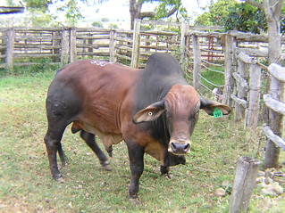
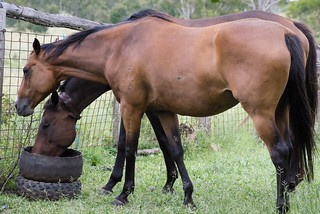
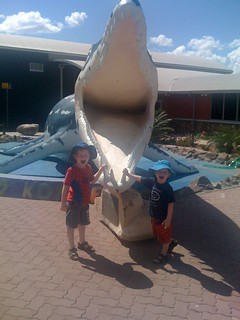
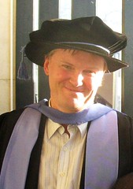

---
categories:
- research
- teaching
date: 2013-01-24 15:04:54+10:00
next:
  text: Exploring connected versus/and networked learning
  url: /blog2/2013/01/27/exploring-connected-versusand-networked-learning/
previous:
  text: Taking a look at the &quot;Decoding Learning&quot; report
  url: /blog2/2013/01/23/taking-a-look-at-the-decoding-learning-report/
title: 1000 blog posts - a time to look back
type: post
template: blog-post.html
---
According to the Wordpress dashboard for this blog this is the 1000th published post (I have 100 odd drafts that I never finished or thought better of posting). Given I'm about to mark first year in a new job in a new institution in a new region, undergo my annual performance review and commence a new academic year, it would seem time to reflect and think about the future.

But first, thanks to those folk who have read and contributed to the blog over the years. Much of the good from blogging has arisen from those connections.

## Reflections on this process

A few reflections from writing the summary below.

### The staying power of bad ideas

Many of the problems I see with institutional attempts to support quality learning and teaching remain. Mainly, I would propose, because it's easier to accept the simple practice everyone else uses than try and address the known problems. Examples of this include strategic management of universities (perhaps the fundamental cause of the rest), attempts to make teaching conform to a standard (quality through consistency), the reliance on end of semester student evaluation to determine quality of teaching and the teachers.

### Purgatory was the best time to blog

2008 through 2010 was the best time for blogging. There was more engagement with and reflection upon the literature. Need to get back to that.

Perhaps the workload associated with life as a contemporary university academic, lots of centralised hoops, poor systems etc.

Still think the quality of my blogging - in terms of the writing, the referencing, the depth, the contribution, the connections - could stand for some improvement.

### Workload implications

My blogging last year wasn't great. Certainly less (quantity and quality) than in 2008-2010. One reason for that is workload. The workload of a contemporary Australian academic in a regional university is high. In terms of the workload and the nature of the work there are certainly much worse jobs (but to some extent that evaluation is fairly subjective). But the problem with academia in this context is that the workload is increasingly be increased due to management mandates at the expense of research/thinking time. Subsequently academics are getting in trouble for not producing research outputs. To make it worse, some of that workload is being created by the poor quality of the institutional systems being put in place to help meet those mandates.

### What to do

I'm not going to bother with grand plans. To some extent it's wasted effort. You can't predict what is going to happen, at best you can only create the capability to respond.

I need to blog more and to think about different approaches to improving the blogging. I need to focus more and stop retreating to some of the same topics. I need to start producing some work that moves some of these forward a bit. I need to connect and comment more, get out of my shell.

Perhaps I need to do more work to address the workload implications. Give myself some space by exploring solutions to the workload problem, especially around learning and teaching.

## Origins

The [first blog post](/blog2/2006/03/02/getting-started-with-the-blog/) was written in March 2006 when the blog was on a self-hosted version of Wordpress (most of the links to blog posts within those early blog posts won't work, they still point to the old host). So it's taken almost seven years to clock up 1000 published posts.

At that stage I was thinking about using blogs in the teaching of C++ to first year Information Technology students. The first few posts are little more than experiments trying to find out how Wordpress worked and what it felt as an author/commenter.

It's not until the 4th and 5th posts (in August 2006 suggesting the initial plan died) that I start storing away a bit of knowledge. [The 5th post](/blog2/2006/07/14/drucker-on-adaptive-vs-plan-driven/) has a couple of Drucker quotes which still resonate strongly with me and perhaps should inform the "thinking about the future" part of this post. e.g.

> Planning’ as the term is commonly understood is actually incompatible with an entrepreneurial society and economy….innovation , almost by definition, has to be decentralized, ad hoc, autonomous, specific and microeconomic.

Not long after that is the first [post about BAM](/blog2/2006/07/23/bam-progress-1/) (which I've just edited to point to the [new home for BAM/BIM](/blog2/research/bam-blog-aggregation-management/). It was actually being used at this stage by a Masters-level course in Information Systems, some of that story is told in [this paper](/blog2/publications/blog-aggregation-management-reducing-the-aggravation-of-managing-student-blogging/).

That experience led to the first mention of [Web 2.0 course sites](/blog2/2006/09/17/web-20-course-sites/) in September 2006. Given [this 2013 post](/blog2/2013/01/21/a-sign-of-limitations-of-institution-hosted-e-portfolios-and-cost-as-the-ultimate-driver/) this appears an issue that remains open. Somewhat surprisingly a [similar post](/blog2/2006/09/18/quote-to-support-the-webfuse-approach/) from that time shows I was reading [Steve Wheeler's (@timbuckteeth)](https://twitter.com/timbuckteeth) years ago.

It would seem that late 2006 saw me on quite the kick around this idea.

It's also when I started work on the ["The missing Ps"](/blog2/2006/10/12/the-missing-ps-in-lms-adoption-decisions/) an attempt to develop a framework for thinking about technology adoption (and what was missing) in universities. This ended up with my first presentation of the idea which is also my first Slideshare presentation. That eventually morphed into the Ps Framework and became the lens for the analysis done in the literature review of [my thesis](/blog2/research/phd-thesis/).

!!! warning "Outdated content no longer available"

    Presentation from Slideshare no long available

## The move to middle management

In February 2007 I [started a new job](/blog2/2007/02/03/new-job-new-start-new-challenges/). For various reasons this was not a long term role, nor was it from a number of perspectives a successful one. But it did commence my move away from being an Information Systems/Technology academic, which given shrinkage in those disciplines over recent years is probably a positive.

The group did some interesting things. I got my chance to help implement a [Web 2.0 course site](/blog2/2007/06/12/cqus-first-web-20-course-site/) and I blogged a bit more. Time in that job reinforced the silliness of much of what central L&T organisations/management do to encourage quality learning and teaching. I also participated in the ASCILITE mentoring scheme in 2007.

I did propose the idea of [extreme learning](/blog2/2007/11/21/extreme-learning-and-teaching/) during 2007. We also got involved in [PLEs](/blog2/2007/10/28/personal-learning-environments-cqu/). Both ideas never really went far at the institution.

We also engaged in a bit of an exploration of [what students find useful](/blog2/2008/07/12/what-do-students-find-useful/).

## Purgatory and the PhD

By the end of 2008 the writing was on the wall. It appeared likely I'd be made redundant and for other reasons decided it was time [to move my website](/blog2/2008/10/16/the-great-website-move-of-2008/) into a Wordpress blog. The [self-hosted website](http://web.archive.org/web/19970117134331/http://cq-pan.cqu.edu.au/david-jones/) I'd started 14 years previously had to go away.

What perhaps irked me most about that move was the Google ranking. In 2008, the website was 7th on a Google for "david jones". Given the commonality of the name, this was quite nice. I wonder where it sites now? (I realise that Google's search algorithm etc has changed considerably over time). After 16 pages of Google results I won't go any further. The "David Jones" chain of stores consumes most of those. "david jones -store" removes most of those, but still no me. Of course, the blog is hosted in the US and it's hostname is davidtjones etc. A google of "david jones blog" returns my blog as the 3rd result.

Late 2008 saw us purchase a new bull.

By the end of 2008 I did get to visit Paris with my wife. She presented a paper and I [got an award](/blog2/2008/12/22/it-is-official-a-best-publication-for-is-in-2007/) which had more to do with my esteemed PhD supervisor (as it happens I'll meet up with her again today) than me.

During the Paris trip I found out that I was getting a redundancy, but it wasn't entirely clear what I would be employed as.

It was during this time that I first [posted about the silliness of L&T evaluations](/blog2/2009/01/25/somethings-that-are-broken-with-evaluation-of-university-teaching/), [academic staff development](/blog2/2009/01/29/good-teaching-is-not-innate-it-can-be-learned-and-whats-wrong-with-academic-staff-development/), and [minimum standards for course websites](/blog2/2009/06/19/why-minimium-standards-probably-wont-work-and-will-probably-become-maximum-standards/). Somethings which four/five years later has changed little.

During this time I did finally start working fairly [consistently on the PhD](/blog2/2009/02/27/phd-update-1-the-start-of-a-tradition/) which did eventually get finished. I also worked and thought more about BAM and BIM. Must get back to the idea of [cooked feeds](/blog2/2009/03/02/some-potential-updates-to-bam-a-step-towards-breaking-the-lmscms-orthodoxy/) for BIM. Other vague ideas and interests from that time include: [reflective alignment](/blog2/2009/02/26/improving-university-teaching-learning-from-constructive-alignment-by-not-mandating-it/), [task corruption](/blog2/2009/03/04/task-corruption-in-teaching-university-negative-impact-of-place/), the myth of rationality, the [fad cycle](/blog2/2009/04/02/the-fad-cycle-in-learning-teaching-a-historical-perspective/) and management fashions, the [grammar of school](/blog2/2009/04/24/models-of-growth-responding-to-the-grammar-of-school/), [nudging](/blog2/2009/08/18/nudging-as-paternalism/), [the Chasm](/blog2/2009/08/09/the-chasm/),

Early 2009 saw us become the breeder of race horses!!

July of 2009 also saw commencement of work on [BIM](/blog2/2009/07/16/bam-into-moodle-approved-starting-the-process/)

More importantly it was this period that really saw the growth of my PLN. e.g. [this post](/blog2/2009/08/04/how-will-universities-change-over-ten-years/) which mentions [Mark Smithers (@marksmithers)](https://twitter.com/marksmithers) and [Claire Brookes (@clairebrooks)](https://twitter.com/clairebrooks)

It also saw the start of the [Indicators project](/blog2/2009/10/12/the-indicators-project-and-what-it-means-for-me/) our little foray into "learning analytics".

By the end of [July 2010](/blog2/2010/07/28/first-the-fridge-dies-and-then/) I was finally made redundant.

## Student life

Initially I became a full-time PhD student and [a Dad](/blog2/2010/08/20/off-to-see-the-dinosaurs/).

By the end of 2010 I'd just about finished the PhD and enrolled to become a [high school teacher](/blog2/2010/11/12/a-turning-point/). By January 2011 the [thesis was finished](/blog2/2011/01/31/my-god-is-it-done/), by [May it was accepted](/blog2/2011/05/27/and-the-thesis-is-complete-whats-next/) and graduation was July.

While I kept blogging about educational technology stuff, most of the blog for 2011 was spent reflecting on what I was doing in the Graduate Diploma of Learning and Teaching. The experience as a student of institutional e-learning was interesting.

And then in November [I had the opportunity](/blog2/2011/11/10/turning-point-2-0/) to return to "life" as a University academic.

### Academia redux

So almost a year ago today I started life as an education academic. Still feel like an immigrant, which is probably a good thing. A year of teaching other people's courses will be redressed somewhat this year.

The blog posts last year focused on understanding the courses I was teaching, grappling with the current state of institutional e-learning, a bit of work on BIM, and sharing a bit of research thinking and writing.

### Some statistics

- 2012 - Visits: ~83,000; 92 posts
- 2011 - Visits: ~70,000; 142 posts
- 2010 - Visits: 59,880
- 2009 - Visits: 48,482
- 2008 - Visits: 3,181  
    Moved to Wordpress.com in October 2008.