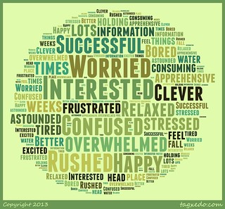
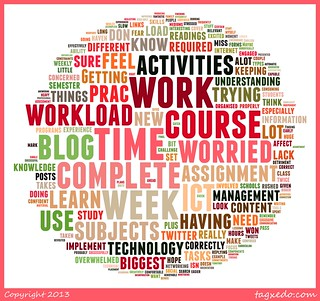
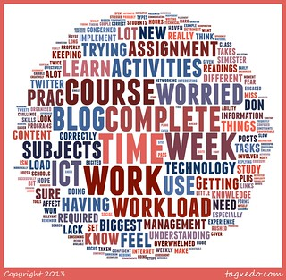

---
categories:
- edc3100
date: 2013-03-04 13:33:55+10:00
next:
  text: How much of a cage should I build?
  url: /blog2/2013/03/06/how-much-of-a-cage-should-i-build/
previous:
  text: BIM2 and disable_form_change_checker
  url: /blog2/2013/03/03/bim2-and-disable_form_change_checker/
title: How are they going?
type: post
template: blog-post.html
comments:
    - approved: '1'
      author: Gen Burke-Sly (@gensly17)
      author_email: gensly17@twitter.example.com
      author_ip: 115.187.242.38
      author_url: http://twitter.com/gensly17
      content: Thanks David for this blog. I love the word clouds. This is a great addition
        to this course and would be a great idea for use as a teacher. I am waiting to
        see the fruits of my labour from week one!
      date: '2013-03-04 15:32:12'
      date_gmt: '2013-03-04 05:32:12'
      id: '643'
      parent: '0'
      type: comment
      user_id: '0'
    - approved: '1'
      author: David Jones
      author_email: davidthomjones@gmail.com
      author_ip: 123.211.52.248
      author_url: https://djon.es/blog/
      content: 'G''day Gen, Beyond my own need to hear what folk are experiencing, one
        of the reasons for doing the barometer (and this post) is to show some of the
        possibilities that ICTs offer. Spark some ideas for your own practice.
    
    
        What are you hoping to reap from week 1?
    
    
        david.'
      date: '2013-03-04 16:17:45'
      date_gmt: '2013-03-04 06:17:45'
      id: '644'
      parent: '643'
      type: comment
      user_id: '1'
    - approved: '1'
      author: Shane Hopkinson
      author_email: swhopkinson@gmail.com
      author_ip: 58.169.166.153
      author_url: http://www.facebook.com/shane.hopkinson
      content: 'Looks great.
    
    
        I am teaching in SOCL11055 this term and wonder if I couldn''t replicate it. You
        say the responses are open except for No 4 but No 3 seems to imply they have a
        list to choose from? And does No 4 as well?
    
    
        Cheer'
      date: '2013-03-04 18:51:11'
      date_gmt: '2013-03-04 08:51:11'
      id: '645'
      parent: '0'
      type: comment
      user_id: '0'
    - approved: '1'
      author: David Jones
      author_email: davidthomjones@gmail.com
      author_ip: 123.211.52.248
      author_url: https://djon.es/blog/
      content: 'Sorry Shane.  I should have done this earlier. I''ve made a copy of the
        Google form I use to implement this (removed all the content).  You can find the
        spreadsheet underpinning it <a href="https://docs.google.com/spreadsheet/ccc?key=0Ah9aZ7LiPYTxdGV5NUV4WTBuaEh3QkZYTnFPWVhkcnc&amp;usp=sharing"
        rel="nofollow">here</a> and can have a look at the <a href="https://docs.google.com/spreadsheet/viewform?formkey=dGV5NUV4WTBuaEh3QkZYTnFPWVhkcnc6MA#gid=0"
        rel="nofollow">student view here</a>.  This should answer your question.
    
    
        I believe you may be able to make a copy of it.  The look and feel of the form
        can be changed using one of a huge number of existing templates Google provides.'
      date: '2013-03-04 19:00:04'
      date_gmt: '2013-03-04 09:00:04'
      id: '646'
      parent: '645'
      type: comment
      user_id: '1'
    - approved: '1'
      author: Fiona Thrift (@FionaThrift)
      author_email: FionaThrift@twitter.example.com
      author_ip: 124.187.19.81
      author_url: http://twitter.com/FionaThrift
      content: Hi David, I for one think the barometer was a great way for us to let you
        know our feelings, certainly, it means additional time out of your schedule, but
        I think it shows us just how with dedication we can be there for our students.  So
        from one of your students...thank you, even though I was one of the ones who clicked
        on TIME! :)
      date: '2013-03-07 13:59:39'
      date_gmt: '2013-03-07 03:59:39'
      id: '647'
      parent: '0'
      type: comment
      user_id: '0'
    - approved: '1'
      author: David Jones
      author_email: davidthomjones@gmail.com
      author_ip: 139.86.2.14
      author_url: https://djon.es/blog/
      content: :) I'm pretty sure you weren't the only one clicking on TIME (and for good
        reason).
      date: '2013-03-07 14:06:09'
      date_gmt: '2013-03-07 04:06:09'
      id: '648'
      parent: '647'
      type: comment
      user_id: '1'
    
pingbacks:
    - approved: '1'
      author: How are they going? | Performance Consulting | Scoop.it
      author_email: null
      author_ip: 89.30.105.121
      author_url: http://www.scoop.it/t/performance-technologies/p/3997796989/how-are-they-going
      content: '[...] The lack of interaction/feedback between student and teacher in
        large, contemporary, Australian university courses has always frustrated me. With
        350+ students currently enrolled in the course I&#039;m ...&nbsp; [...]'
      date: '2013-03-04 14:35:12'
      date_gmt: '2013-03-04 04:35:12'
      id: '642'
      parent: '0'
      type: pingback
      user_id: '0'
    - approved: '1'
      author: How are they feeling &#8211; Semester 2 &#8211; Part 1 | The Weblog of (a)
        David Jones
      author_email: null
      author_ip: 207.198.101.70
      author_url: https://djon.es/blog/2013/07/18/how-are-they-feeling-semester-2-part-1/
      content: '[&#8230;] following is a repeat of this post for a different offering
        of the same course. It&#8217;s also a quick how to primarily intended for [&#8230;]'
      date: '2013-07-18 10:55:35'
      date_gmt: '2013-07-18 00:55:35'
      id: '649'
      parent: '0'
      type: pingback
      user_id: '0'
    
---
The lack of interaction/feedback between student and teacher in large, contemporary, Australian university courses has always frustrated me. With 350+ students currently enrolled in the course I'm teaching, I'm keen to address this problem. Enter the weekly "course barometer", a simple practice I'm hoping we can keep up for the current semester. The following is a quick summary of the results for the first week and a description of how it works.

## How it works

In summary,

- I ask the students to complete a Google form at the end of their learning for a week.
- Their responses get put into a Google spreadsheet.
- The responses are examined, analysed and inform what we're doing in the course over coming weeks.

The questions/tasks in the Google form are (all except #4 are free response)

1. Write down the two most important things you have learnt in EDC3100 this week.
2. What would you most like more help with?
3. How do you feel about EDC3100 at the moment? (Select all the words that apply to you)
4. What is the biggest worry affecting your work in EDC3100 at the moment?
5. How could we improve EDC3100?

A process similar to this has been widely used. This particular set of questions arise from the following

> The IMPACT procedure (Clarke, 1987 cited in Goos et al., 2007, p. 411) is one method for discovering the concerns and opinions of students. It involves the regular completion of the following simple questionnaire during class (for this unit during the Friday “Reality and Reflection” lessons) and the retention of responses over the period of the class. Goos et al (2007, p. 411) suggest that the success of this process “depends on respecting the confidentiality of student responses and acting on these responses where appropriate to improve students’ experiences of learning mathematics.”

taken from [here](/blog2/2011/09/21/the-final-plan-khan-academy-gamification-and-the-flipped-classroom/#impact)

Due to the point about "confidentiality" and the novelty of this approach, I've decided (for now) not to open up access to the Google spreadsheet with the data to anyone except the teaching staff in the course.

## First weeks responses

The following images (click on them to see a bigger version) are word clouds generated by sending the raw responses for each question through [Tagxedo](http://tagxedo.com). I still need to look more closely at the feedback, but some initial thoughts.

### How are you feeling?

Was happy and a little surprised to see some of the more positive feelings be visible. Had worried it was all negative. Week 1 was very challenging and time consuming.

Given students are given a fixed set of words and are able to add a few words of their own, this is perhaps the best question to analyse using a Word cloud. A word cloud is not so useful for the free text questions.

### Two most important things

### Help

Need to look at these responses in more detail. Interesting at some level that "assignment" is not the biggest. Arguably having "learning" and "understanding" being more of a focus is potentially a good thing. But closer examination is needed.

There is the "how to use the tool" presence (blog, twitter and diigo)

### Biggest worry

Time and workload have been the big worry, at least via other communication mechanisms, and that appears to have come through in this.

### Improve

Time and workload would appear to be a major area for improvement. Future weeks will see this improve and we'll need to revisit the design of the course a bit. As it stands, week 1 is probably too much of an ask.

However, I'm going to be interested to see how this evolves over coming weeks. Much of the work in week 1 was setting up new tools and developing some foundational insights that should really help in subsequent weeks.