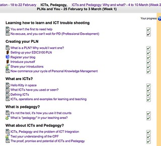

See also: [[blog-home | Home]]

Just how much of a cage should I make my course into? How far should I take the constraints? The following sets the scene and asks the questions. Would love to hear alternate views.

  
  by  [geezaweezer](http://www.flickr.com/people/geezaweezer/) 

### The course

The [course I teach](http://www.usq.edu.au/course/synopses/2013/EDC3100.html) has 300+ students spread throughout much of Australian, parts of Asia and perhaps other parts of the world. Studying both on-campus and online. It has folk who will be teaching everything from Early Childhood through to TAFE/VET, and everything in-between.

The course website is a Moodle site. Each week the students have a list (perhaps too long a list) of activities to complete (see the image). To help them keep track of what they have and haven't done the Moodle activity completion functionality was used. That's what produces the nice ticked boxes indicating activity completion.

Building on this, part of the assessment of the course is tied to how many of these activities they complete. Activity completion is actually linked to keeping a [learning journal](/blog2/2013/02/25/the-assessment-of-learning-journals-ideas-for-bim/) and contributes 15% of the total course mark (5% for each of the 3 assignments).

### Task corruption

Given the pragmatic nature of students today and especially given the perceived large amount of work in the first week. It was not surprising that a bit of [task corruption"](/blog2/2009/03/04/task-corruption-in-teaching-university-negative-impact-of-place/) is creeping in. I assumed that some students would figure out that for the activities that are "web pages" with exercises, simply visiting the page would tick the box.

But there are other activities that require students to post to a discussion forum with some form of artefact. For example, a description of a resource found on Scootle and a description of how it links to their curriculum. These are posts that I see and try to keep a track of. So a bit of a deterrent?

Turns out perhaps no. I'm starting to see the odd post that either purposely (or not) does address the task, but is sufficient to be recorded as an activity completion.

The question is whether or not I should be actively policing this?

### The trade-off

I don't want to set myself the task of being a policeman. But perhaps I need to implement some penalties here, some options might include:

- A gentle warning, at least initially.
- Warn the student and delete their activity completion for the given activity (i.e. do it again).
- Deduct marks for task corruption.
    
    Of course, there will always be the "but I misunderstood the task sir" excuse.
    

.

A purely pragmatic reason against doing this is that it will take a lot of work to police this. For another, I've [already expressed some reservations](/blog2/2013/02/08/the-missing-perspectives-on-moocs/) about what it means to impose new learning strategies on a group of learners. That's certainly something the course is currently doing.

We're also talking about 3rd year University students, shouldn't they live with their choices? If the don't engage in these activities I do believe they will learn less and perform worse on the other assessment.

Then there's the question of the students who are engaging with the activities and may potentially be receiving the same marks as those who have engaged in task corruption. I'm sure there would be a view amongst both sets of students.

Perhaps I should just mention this to the students to discourage (though not prevent) this practice?

Thoughts? Suggestions?