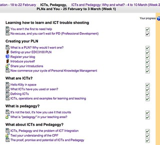

---
categories:
- edc3100
- moodle
- teaching
date: 2013-03-07 13:03:42+10:00
next:
  text: Many of our students are neither digital natives nor digitally literate
  url: /blog2/2013/03/13/many-of-our-students-are-neither-digital-natives-nor-digitally-literate/
previous:
  text: How much of a cage should I build?
  url: /blog2/2013/03/06/how-much-of-a-cage-should-i-build/
title: The absence of a search function - my current big problem with a Moodle installation
type: post
template: blog-post.html
comments:
    - approved: '1'
      author: cj13
      author_email: cbigum@deakin.edu.au
      author_ip: 58.110.51.243
      author_url: http://cj13.wordpress.com/
      content: 'It''s difficult with such a large class. In one sense you need some kind
        of mapping/tracking functionality for the weekly stuff which is what Moodle is
        giving you. You probably need some kind of secure distribution mechanism for copywrite-protected
        documents and maybe an announcement/broadcast facility: message to class, now
        hear this! :)  All the other stuff is way better "on the web". I have a much smaller
        class running. I have the required stuff on the awful but inevitable BlackBoard
        site. I''ve shuffled them over to a G+ community site and we use a Wiki for the
        content/links. I know it sounds messy and there are the overheads associated with
        learning your way around each bit. The Wiki has a nice search function. Easy to
        edit/set up pages and have students do simple tasks on/in it. My sense is that
        offering students "cotton wool" experiences (i.e. single interface with all the
        bits and pieces to hand) is not a good preparation for the "real" online world
        which will continue to evolve, shift etc much quicker than Moodle or BB or their
        offspring will ever manage. Just a thought. I put my own reflections/learnings
        on the Wiki somewhat similar to the stuff you put on here, that learning in public
        notion. Early days but so far so good.'
      date: '2013-03-07 13:41:20'
      date_gmt: '2013-03-07 03:41:20'
      id: '656'
      parent: '0'
      type: comment
      user_id: '0'
    - approved: '1'
      author: "Eduardo D\xEDaz- AER (@ediazsan)"
      author_email: ediazsan@twitter.example.com
      author_ip: 79.109.90.165
      author_url: http://twitter.com/ediazsan
      content: What about Google custom search engine?
      date: '2013-03-14 08:19:21'
      date_gmt: '2013-03-13 22:19:21'
      id: '657'
      parent: '0'
      type: comment
      user_id: '0'
    - approved: '1'
      author: David Jones
      author_email: davidthomjones@gmail.com
      author_ip: 139.86.69.32
      author_url: https://djon.es/blog/
      content: My understanding (correct me if I'm wrong) is that Google still needs to
        be able to access the course site in order to generate its search database.  As
        an individual academic at the University, I don't have the access or permission
        to grant Google this access.  And convincing the institution and the other academics
        that we should allow this, might be somewhat problematic.  I will check on this
        though.  Thanks.
      date: '2013-03-14 08:29:03'
      date_gmt: '2013-03-13 22:29:03'
      id: '658'
      parent: '657'
      type: comment
      user_id: '1'
    
pingbacks:
    - approved: '1'
      author: 'Evernote as a &#8220;solution&#8221; to a #moodle &#8220;problem&#8221;
        | The Weblog of (a) David Jones'
      author_email: null
      author_ip: 66.155.38.24
      author_url: https://djon.es/blog/2014/02/25/evernote-as-a-solution-to-a-moodle-problem/
      content: '[&#8230;] has been implemented at this institution (and probably not unique
        to this institution) is the absence of a search engine. Mostly because the students
        &#8220;inability to find anything&#8221; is being blamed on poor [&#8230;]'
      date: '2014-02-25 13:59:31'
      date_gmt: '2014-02-25 03:59:31'
      id: '659'
      parent: '0'
      type: pingback
      user_id: '0'
    - approved: '1'
      author: 'Joining the &#8220;swarm&#8221;: what a course might be? | The Weblog of
        (a) David Jones'
      author_email: null
      author_ip: 66.155.9.41
      author_url: https://djon.es/blog/2014/08/15/joining-the-swarm-what-a-course-might-be/
      content: '[&#8230;] and wanted to use it. On the plus side, he still had access
        to course material but because of the big flaw (the absence of a search engine)
        in our institution&#8217;s Moodle implementation he has to [&#8230;]'
      date: '2014-08-15 11:24:46'
      date_gmt: '2014-08-15 01:24:46'
      id: '660'
      parent: '0'
      type: pingback
      user_id: '0'
    - approved: '1'
      author: Tweaking Moodle book search | The Weblog of (a) David Jones
      author_email: null
      author_ip: 192.0.99.95
      author_url: https://davidtjones.wordpress.com/2015/12/15/tweaking-moodle-book-search/
      content: '[&#8230;] gasp indicated just how much teachers and students desire this
        feature. A feature I&#8217;ve been calling out for quite some [&#8230;]'
      date: '2015-12-15 16:43:43'
      date_gmt: '2015-12-15 06:43:43'
      id: '661'
      parent: '0'
      type: pingback
      user_id: '0'
    
---
Consider this a plea for suggestions. In particular, consider it a plea for workarounds that I can implement quickly (and painlessly).

### The problem

I have a Moodle course site. It has a range of activities, many with a page or two of text that sets the context and explains the task. The image below shows what the activities for one week look like.

Now this works fine if a student works sequentially through the activities. It tracks what they've completed etc.

It fails miserably when they want to revisit the page about "X". They have to remember in which week "X" was talked about, under which activity "X" was addressed.

I have problems doing this and I wrote the stuff.

### The "web way" solution

If this was any other website, we'd follow the [advice](http://www.nngroup.com/articles/search-and-you-may-find/) of Jakob Nielsen

> Search is one of the most important user interface elements in any large website. As a rule of thumb, sites with more than about 200 pages should offer search.

The "web way" solution would be to have a search engine. But the Moodle installation of the University I teach the course for doesn't appear to provide this functionality. I believe the only way this can occur is to allow Google to have access to all courses on the site. While there may be reasons for this, it's not a solution I'm pushing just to solve my problem.

How can I provide my students with a search function? How can I make my course site ["of the web" and not "on the web"](/blog2/2012/09/07/one-example-of-industrial-e-learning-as-on-the-web-not-of-the-web/)?

I have heard mention made of being saved by repositories. i.e. Moodle is not a content hosting platform and doesn't try to be. If you want searchable content, place it in a repository. The trouble is we're not talking here about large documentation. Just a lot of small pages that are closely wrapped around specific learning activities in Moodle. I'm yet to see an information repository integration that works as seamlessly as I'd expect.

### My interim solution

In the absence of any brilliant ideas, it appears that the only way to do this is to create a duplicate website that is actually "of the web". i.e. one that is indexed by Google. I'm thinking probably a blog with pages set up to match the weeks and other components.

Some have suggested providing the pages as a PDF document (or three). The problem with this is that there is web content (videos, animations etc) embedded throughout. Producing a print document would allow folk to search, but then they wouldn't have access to the web content (unless they clicked on a link etc).

Producing a second website is by no means a perfect solution, some of its limitations include

- Extra workload for me.
- Large potential to create confusion amongst the students  
    e.g. which website do I visit? Which website has the correct content? Do I need to check both websites?
- Loss of some Moodle functionality.  
    The course currently uses the Moodle activity completion functionality to allow students to track their completion, but also as part of the assessment. If students start working through the blog version of the website it will lead to "But I already did that activity!" problems.

Surely there has to be a better solution?