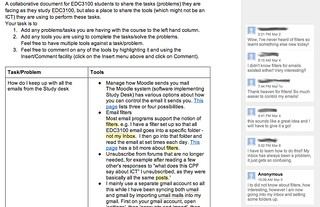

Yesterday I attended a session with three different presentations focused around "student voices and their current use of technologies at USQ". There was some very interesting information presented. However, I have a few reservations with aspects of the research and especially with some of the conclusions that have been drawn. I'm hoping to reflect upon and post more about this when I have some time. But an experience just now reinforced one of my reservations and is worth a short sidetrack.

A largish survey of students found that all of the students had some form of access to the Internet. Given that it was an online survey, this is perhaps not surprising. But that's not the problem I particularly want to address here.

The big reservation I have is that one of the conclusions drawn from this work was that our students are "Digitally literate and agile". My experience suggests that this is not the case.

### My experience

The course I'm [currently teaching](http://www.usq.edu.au/course/synopses/2013/EDC3100.html) has 300+ students, mostly 3rd year Bachelor of Education students, spread throughout Australia and the world. 200+ of these students are online students. i.e. they generally don't set foot on a campus. The course itself is titled "ICTs and Pedagogy" and as you might expect we're pushing some boundaries with the use of ICTs. Attempting to model what we espouse. Some examples of that include, amongst others

- Students are required to set up their own blog and use it as a [reflective journal](/blog2/2013/02/25/the-assessment-of-learning-journals-ideas-for-bim/).
- They are required/asked to sign up for [Diigo](http://diigo.com/) and join a [course Diigo group](https://groups.diigo.com/group/icts-and-pedagogy)
- We're using Diigo's annotation facility to mark up online readings and the assignment pages.
- They are encouraged (but not required) to join Twitter.
- We use Google docs for shared content creation.
- The course Moodle site is heavily used including the discussion forums leading to a lot of email traffic (this is picked up below).
- We use a range of ad hoc activities to demonstrate different ICTs.  
    e.g. a version of the ["weather Flickr" activity](http://www.flickr.com/photos/ictspedagogy/) of @courosa

Many of the students, especially the online students, have been studying online for 3+ years. Some of the earlier courses these students have completed encourage them to engage with different ICTs e.g. developing a webquest or creating digital stories.

So, obviously these students are "digitally literate and agile"?

### Some gaps in digital literacy

Here's a quick list of some of the questions/problems students have asked/had in the first three weeks of semester

- Not knowing what their university provided email address is.
- Not knowing to look in the junk folder for a confirmation email.
- Not knowing how to add a link using one of the WYSIWYG editors provided on web-based services such as Moodle, Wordpress etc.
- Not knowing that you have to "right/ctrl" click on a link to download a file rather than display it in the web browser.
- Not knowing about email filters.

The last point is a big one. It's fairly common for students taking four online courses to get a lot of email from the discussion forums for those courses. This flood of email messages take over the Inbox and lead to confusion and missed information. Many of these students have been experiencing this for 3+ years. Yet, almost none of them knew about email filters.

Perhaps one of the most successful learning activities in the course was a Google doc that was created for the students to list the problems they were having with the course and any suggestions they might have for tools or practices that might help solve those problems. The following image is a screen shot of a section of that document about email filters. Click on it to see it bigger.

This particular activity was combined with reading about [Toolbelt theory](http://speedchange.blogspot.com.au/p/blog-page_2046.html) and encouraging the students to start building their toolbelt. To have them start taking control of their problems and identifying how they can solve them.

### Not digital natives

Perhaps the major mistake (one of many) I made in the design of the first few weeks of this course was that I assumed that the students were far more digitally literate than they appear to be. Not only that, as someone who is fairly "digitally literate", I assumed that they would have the experience/knowledge to be able to implement the "Tech support cheat sheet" without much prompting.

### Lessons

When we are designing our learning experiences we (i.e. I) cannot assume that they are "digitally literate and agile". I need to give more thought to scaffolding these experiences and perhaps exploring ways to better help them develop what @irasocol describes as an essential survival skill

> knowing how to pick the right tool for the job and moment, how to use that tool well, and how to find new tools

I also think there's a lesson here about research methodologies. Research methodologies - e.g. surveys and focus groups - that capture insights from people divorced from the actual activity (e.g. the "current use of technologies at USQ") - are going to overlook important insights. That limitation has to be kept in mind when drawing conclusions and recommendations for action.