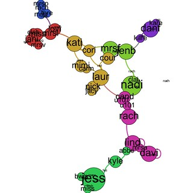
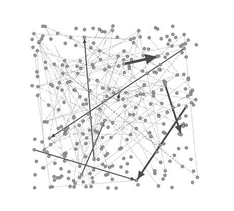

The following describes the process and results of using Gephi to generate some visualisations of the inter-connections between the blogs of students in the course I'm teaching. The process is heavily informed by [the work](http://blog.ouseful.info/2011/07/07/visualising-twitter-friend-connections-using-gephi-an-example-using-wireduk-friends-network/) of [Tony Hirst](http://blog.ouseful.info/).

## The result

The following represents the student blogs that have connected with each other. Size of the node is weighted towards the number of connections coming in. You can see a couple in the bottom right hand corner who have linked to themselves. The figure also suggests that there are 6 or 7 communities within these.

There are actually 300+ blogs in the data set. However, a significant number of those are not yet connected to another blog. Hence the small number in the above image. Two possible explanations for this

1. Many of the students haven't yet taken seriously the need to connect with each other.
2. There's a bug in the code producing the file.

Will need to follow up on this. Will also need to spend a bit more time exploring what Gephi is able to do. Not to mention exploring why 0.8.2 of Gephi wouldn't run for me.

## The process

The process essentially seems to be

1. Generate a data file summarising the network you want to visualise.
2. Manipulate that data file in Gephi.

The rest contains a bit of a working diary of implementing the above two steps.

## Generating the file

The format of the "GDF" file used in [Tony's post](http://blog.ouseful.info/2011/07/07/visualising-twitter-friend-connections-using-gephi-an-example-using-wireduk-friends-network/) appears to be

- A text file.
- Two main sections
    1. Define some user/node information.
        
        The format is shown below. The key seems to be the "name" which is a unique identified used in the next section.
        
        \[code lang="bash"\] nodedef> name VARCHAR,label VARCHAR, totFriends INT,totFollowers INT, location VARCHAR, description VARCHAR 67332054,jimhillwrites,105,282,"Herne Hill, London","WIRED UK Product Editor." \[/code\]
    2. Define the connections
        
        Essentially a long list of id pairs representing a user and their friends. I'm assuming this means the use connects to the friend.
        
        \[code lang="bash"\] edgedef> user VARCHAR,friend VARCHAR 67332054,137703483 \[/code\]

More on the GDF format [available here](https://gephi.org/users/supported-graph-formats/gdf-format/). It mentions a minimal GDF file and also mentions that the edge thickness can be specified. This seems useful for this experiment i.e. edge thickness == number of links from one student blog to another.

So the file format I'll use will come straight from the minimal spec, i.e. \[code lang="bash"\] nodedef>name VARCHAR,label VARCHAR s1,Site number 1 s2,Site number 2 s3,Site number 3 edgedef>node1 VARCHAR,node2 VARCHAR, weight DOUBLE s1,s2,1.2341 s2,s3,0.453 s3,s2, 2.34 s3,s1, 0.871 \[/code\]

Thinking I'll use the "hostname" for the student's blog as the "site number". Maybe just the first four letters of it. Just to keep student anonymity.

Questions for later

1. Can I modify the file format to include with each "friend" connection a date?
    
    The idea is that the date will represent when the post was made. Using this I might be able to generate a visualisation of the connections over time.
    
2. Is there value in also mapping the connections to the other links within the students' posts?
    
    Could provide some idea of what they are linking to and help identify any interesting clusters.
    

### The data

The database I'm maintaining contains

- All the URLs for the students' blogs.
- All the posts to the students' blogs.

I already have a script that is extracting links from each of the student blogs, I just need to modify this to count the number of connections between student blogs.....a bit easier than I thought it might be.

Now a quick script to generate the GDF file. Done.

## Using Gephi

This is where I'm helping [Tony Hirst's instructions](http://blog.ouseful.info/2011/07/07/visualising-twitter-friend-connections-using-gephi-an-example-using-wireduk-friends-network/) work with a minimum of hassle.

That's a bugger. Empty menus on Gephi. It's not working. Is it wrong of me to suspect Java issues?

Going back to older version. That's worked, but I haven't installed it yet into Applications. 0.8.2 seemed to have worked previously as well. Get this done and figure it out later.

File opened. We have a network.

Tony Hirst then removes the unconnected nodes. I'd like to leave them in as it will illustrate the point that the students need to connect with others.

The Modularity algorithm doesn't seem to be working as I'd expect (on my very quick read). It's finding 200+ communities. Perhaps that is to be expected given that most blogs are connected by one or two links and that I haven't removed the unconnected nodes. Yes works much better if you do that.

A bit more playing produces the final result above.