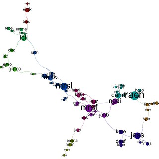

See also: [[blog-home | Home]]

The course I'm teaching requires each student to create and user an individual blog. The blog should be created on an external blogging platform of their choice and used to reflect on their learning in whatever way they see fit. There are a couple of constraints around regularity (at least 2/3 posts a week), length (average of 100 words), links to resources (60% with links to online resources), and links to other student blogs (2 of all posts over a 3 week period). All this is meant to be automatically marked.

The following is the story of putting in place the code to check, track and mark the student blogs. Much of it has been written over the last few weeks. I'm adding the last extra touch today as the assignment has been submitted and the automated assessment needs to be completed.

As it happens, I've also just read Lisa M Lane's ["The illusion of the LMS/cloud-based/self-hosted solution"](http://lisahistory.net/wordpress/2013/03/2474/) and am finding that it resonates strongly. If I didn't have the technical background I have, none of the following would have been possible. I'd be constrained by the tools available in the LMS and any manual workarounds I could come up with. As it is, I could have done without the additional work required by the following.

At the moment, the message I'm taking from both Lisa's and my own experience is that the use of technology in learning and teaching is messy. Especially when you're trying to do something different. Being an explorer is always going to be difficult. The institutional systems and support processes are not set up for exploration, they are set up for exploitation. This is why they are constraining. If you want to be an explorer, it's going to be hard, but it can also bring benefit. [Alen Levine's comment](http://lisahistory.net/wordpress/2013/03/2474/comment-page-1/#comment-53628) on Lisa's post perhaps contains the main solution to this problem

> the way to do this on the open/free/public end is to leverage the connections of others. I rely on this all the time. The “solving” is in our human networking.

## No BIM

I haven't [completed BIM2](/blog2/research/bam-blog-aggregation-management/) in time for the organisational processes to consider installing it into the institutional version of Moodle ([this post](/blog2/2013/03/18/bim-why-and-what/) details one step in the process). So the plan is

1. Students register their blog via a Moodle database activity.
2. That is exported, checked and stuck into a local version of Moodle (with BIM) on my laptop.
3. Marking of the blogs will be done via some additional code, either in BIM or in Perl.  
    At this stage Perl has been used because I have a large collection of infrastructure and experience with a Perl code base that was developed as part of my [PhD work](/blog2/research/phd-thesis/). i.e. I'm a native Perl speaker, PHP and the Moodle code remains a second language to me. Eventually this work will need to be brought into BIM in some ways.

## Registration, reassurance and the perils of meaningless freedom

Way back in the late 1990s experience with the design and use of online assignment submission systems led to this observation [(Jones, 1999)](/blog2/publications/solving-some-problems-with-university-education-part-ii/)

> An important lesson from the on-going development of online assignment submission is to reduce the amount of “meaningless freedom” available to students. Early systems relied on students submitting assignments via email attachments. The freedom to choose file formats, mail programs and types of attachments significantly increased the amount of work required to mark assignments. Moving to a Web-based system where student freedom is reduced to choosing which file to upload was a significant improvement.

Having the students register their blogs with a Moodle database activity meant that the students had to correctly

- Enter their student number. USQ has two types of student number that it users interchangeably.
- Copy the URL of their blog.

Here's a list of what I've found in the registered data tonight, out of 275 registered blogs

- 105 students used one form of number, 170 the other sort (roughly).
- 10 student numbers were incorrect. Some were just minor typos, but others were more major.
- 37 URLs were incorrect  
    Missing the http://, typos (edublog.org not edublogs.org etc.), copying the dashboard URL not the home page.

This is not to suggest that the students are stupid. It's to show how badly designed systems (i.e. the stuff I've cobbled together) allow mistakes to happen. If BIM had have been available none of these errors would have been possible and I would have saved quite a few hours of work.

Not only would BIM have provided immediate feedback on registration, it would have allowed the students to be reassured what what was known about their blog. With BIM the just visit the activity and its there. In this semester, I've had to send bulk emails out letting students know what the system knows about their blog.

## Statistics

Time now to finish off the script that will generate statistics about the students' blogs and generate their mark. As shown [in this prior post](/blog2/2013/03/18/visualising-the-blog-network-of-edc3100-students/) I'm also using this facility to generate some visualisations of the interconnections, but that's another post.

The statistics being used for marking include

1. Number of blog posts per week.
    
    Currently being calculated by dividing the number of existing posts on the student blog by the number of weeks.
    
2. Average length of blog posts.
3. % of posts that contain links to external resources.
4. number of posts that link to other student blogs.
5. % of the learning path activities completed.
    
    This isn't a blog statistic. It's from the activity completion report on Moodle. Each week has a collection of activities/resources (the learning path) and students are expected to complete them.
    

Each of these is currently being generated. But I need to

1. Double check the links to other student blogs, not sure it's counting blog posts.
2. Exclude links to their own blog.

This is all done. So some statistics. With 330 students mostly still enrolled in the course

- Average word count per post - 184.9
- Average posts per student - 11.5
- Average posts with links - 7.7
- Average posts with links to another student blog - 1.7
- Average completion of Moodle activities - 89.8%

The last one is a bit disappointing. Need to explore it more.

## Missing students

I have a script that automatically "marks" the students blogs and also their completion of activities on the Moodle study desk. Trouble is it appears that at least one student is missing from that list. Why?

Some possibilities

- The student has dropped the course? - NO, still there
- The student didn't register their blog? - YES, that's the problem

If there's one, I wonder how many others there are? Even after we did a dry run a couple of weeks ago to identify folks in this situation there appear to be a few. In theory, there are 327 students still enrolled in the course. Of those, 20 students haven't successfully registered their blog.

Question is whether this is a problem with my kludges, or the students haven't registered their blog. I'll let them figure that out.

## A visualisation

The following is the latest Gephi visualisation of the links between student blogs. A bit more complex than the last one, but obviously connections aren't a priority.

