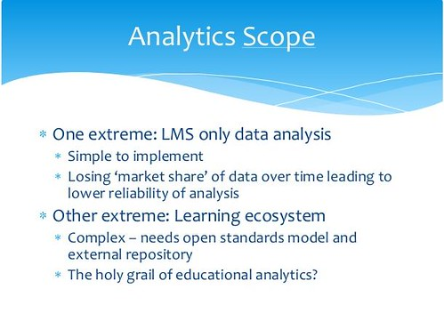

Was skimming through Mark Drechsler's [slide deck from THETA 2013](http://www.slideshare.net/mark.drechsler/theta-presentation-drechsler) when I came across the following slide.

It's part 3 of a model of learning analytics (Target, Consumer, Scope, Automation) Mark used in his talk and got me thinking and hence the following. Still early days on this.

The slide above describes two of the extremes of the data being used in learning analytics. Just the stuff from the LMS at one end through to the entire learning ecosystem. As the slide points out, the former is increasingly becoming limited and the latter is just a bit pie in the sky.

I'm wondering if there is another part of the scope that might be a bit more fruitful, or at least of more interest to me. i.e. learning analytics at the application - or to use Moodle speak, the module/plugin level.

Tweeting from the [Learning Analytics and Knowledge 2013 Conference](http://lakconference2013.wordpress.com/) @shaned07 suggests

https://twitter.com/shaned07/status/321161897573498880

This resonates a bit with the point @beerc made in [Beer et al (2012)](http://www.ascilite2012.org/images/custom/beer,colin_-_analytics_and_complexity.pdf)

> The inherent unpredictability of agents within a CAS (complex adaptive system) suggest that the most appropriate place to situate learning analytics tools and resources designed to inform and improve online learning and teaching, would be within the micro-level context.

One interpretation of this "micro-level context" could be the individual application. i.e. the scope is a specific application being used for learning. Perhaps the best example of this is the discussion forum and [the SNAPP tool](http://www.snappvis.org/) (as it happens an output from @shaned07 and friends).

It's within the application as it is applied within a particular learning context where the deepest knowledge about what is happening may reside. Analytics that help the student or the teacher understand what is (or isn't) happening would seem to have the best potential of improving outcomes.

It may be helpful to have information from other sources, but I wonder if more specific analytics about the specific learning process as embodied in a particular tool can be more useful.

Of course, this raises the question about how such tools are used. For example, I'm pretty sure that many discussion forums aren't used in a "pedagogical" way.

I'm wondering whether the origins/connections of learning analytics with data warehouses and business intelligence units (not to mention the nature of big data toward collating information into "big data") drives this interest in the broader scope at the expense of the specific? Wondering just how useful "application analytics" might be as it would likely lose the "big" in big data?

Much more to think about here, but I have to get back to other work.

### References

Colin Beer, David Jones, Damien Clark (2012) Analytics and complexity: Learning and leading for the future. In M. Brown, M. Hartnett, & T. Stewart (Eds.), Future Challenges, Sustainable Futures. Proceedings of ascilite Wellington 2012 (pp. 78–87). Wellington, NZ.