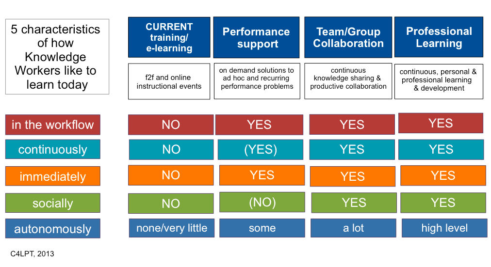

---
categories:
- bim
date: 2013-04-28 09:45:20+10:00
next:
  text: How to capture the "full benefits of the creative, original and imaginative
    efforts of" teaching staff
  url: /blog2/2013/04/30/how-to-capture-the-full-benefits-of-the-creative-original-and-imaginative-efforts-of-teaching-staff/
previous:
  text: Making e-learning tools that are more supportive - BIM, TPACK and truncated
    feeds
  url: /blog2/2013/04/19/making-e-learning-tools-that-are-more-supportive-bim-tpack-and-truncated-feeds/
title: How Knowledge Workers like to learn and implications for BIM and LMS design
type: post
template: blog-post.html
comments:
    - approved: '1'
      author: cj13
      author_email: cbigum@deakin.edu.au
      author_ip: 58.106.132.46
      author_url: http://cj13.wordpress.com/
      content: Couple of quick thoughts. Universities are necessary infrastructure for
        an LMS. The LMS was (as I vaguely recall) an attempt to deal with mass - i.e.
        large numbers of students. This urge goes back a long way ..PLATO etc.  Hart's
        intent is good but does not go anywhere near enough. All we have done with IT
        and Ed thus far has been old wine, new bottles. Which to me is maybe rather than
        investing a lot of eggs in one big basket with largely predictable upside why
        not put a few little eggs (skunkworks-style) in radically different baskets (here
        in am channeling Taleb) - lots of little experiments- and you could get the kiddies
        to do some with/for you.  Eddison built something like 1,000 light bulbs before
        he hit on it. I'm not sure looking for more effective candles will be that satisfying
        in the long run. :)
      date: '2013-04-28 10:02:36'
      date_gmt: '2013-04-28 00:02:36'
      id: '743'
      parent: '0'
      type: comment
      user_id: '0'
    - approved: '1'
      author: David Jones
      author_email: davidthomjones@gmail.com
      author_ip: 60.228.201.94
      author_url: https://djon.es/blog/
      content: "It's the numbers that are in part driving this line of interest. Numbers\
        \ matter and make a difference. When you're teaching a course with 300+ students\
        \ there is a need for \"administrative\" support.  Without it - much like my experience\
        \ this semester - the workload is much worse than it should be.   At the moment,\
        \ the LMS is really the only institutionally available tool that can provide that\
        \ type of support. So in short, I need to fix aspects of the LMS so I can make\
        \ my life easier. But in doing so I also hope to help others.\n\nBut I also think\
        \ that by doing this there's a chance of highlighting the limitations of current\
        \ practices in concepts that are currently understood by these folk.  Hence the\
        \ connection with the acknowledged problems of the sector - poor quality, high\
        \ workload etc. Almost a case of having to hit the Zone of Proximal Development\
        \ for the higher ed community in order to help them learn.  Move beyond the ZPD\
        \ and there's no chance of them getting it.\n\nBeyond making my life easier, BIM\
        \ is also a chance to move beyond the LMS.  It's based on the idea of the <a href=\"\
        http://www.jonmott.com/blog/2009/06/connectedness-and-the-open-learning-network/\"\
        \ rel=\"nofollow\">loosely coupled gradebook</a> idea from Jon Mott.  The LMS\
        \ provides the admin staff (which student is which, and recording grades) while\
        \ we do the interesting stuff out on the broader web. As such, BIM becomes as\
        \ the enabler for more interesting things.  For moving beyond old wine in new\
        \ bottles to enable the exploration of entirely new beverages.\n\nMy hope/plan\
        \ is that once the administrative foundation is in place, BIM can be used to explore,\
        \ amongst other ideas I haven't thought about yet, ideas similar to those behind\
        \ Stephen Downes' <a href=\"http://grsshopper.downes.ca/\" rel=\"nofollow\">grsshopper</a>\
        \ and <a href=\"http://www.edufeedr.org/\" rel=\"nofollow\">edufeedr</a>. More\
        \ importantly, how can I learn from other people who are using BIM and have interesting\
        \ ideas and make changes to BIM quickly?\n\nBut it's more than the tool, it's\
        \ also the \"how\" around it. More to the point, solving some of the problems\
        \ around the \"how\" as currently practicsed. Two particular problems I'm interested\
        \ in are\n<ol>\n  <li> How to work around the enterprise IT processes of an institutional\
        \ LMS so that BIM development can be more emergent. 
And perhaps in answer this\
        \ figure out some ways to enable a more \"little eggs\" approach.  e.g. I started\
        \ the process for having BIM installed on the institutional Moodle instance 2\
        \ or 3 months ago.  Still not there and there's a question of whether or not it\
        \ will get installed prior to Semester 2.  When it does get installed, I'm unlikely\
        \ to be able to get it changed during semester. This prevents learning.
\n\
        \   </li>\n  <li> How to gather and share ideas with a potential BIM user community\
        \ spread across institutions.
e.g. If good learning arises from a CoP/network\
        \ of people, but only when the participants are actively engaged. How can I create\
        \ a CoP of BIM users so we can learn more about where BIM should go in the future?\
        \ </li>\n</ol>\n\nActually, this reminds me of an <a href=\"https://djon.es/blog/2010/04/25/inside-out-outside-in-or-both/\"\
        \ rel=\"nofollow\">earlier post</a> about changing teaching from inside-out or\
        \ outside-in. I think the following quote from that post links somewhat with Taleb's\
        \ \"skin-in-the-game\" thoughts and part of why I'm interested in developing BIM\
        \ as part of the LMS<blockquote>As I said above, this problem is a complex one.\
        \ Based on the above diagram, the best type of solution arises from immersion\
        \ in the problem. The problem is that most universities are attempting to solve\
        \ this problem by analysis.</blockquote> which in turns draws on a quote from\
        \ from Donald Clark about Rittel<blockquote>This is because as Rittel (1972) discovered\
        \ \u2014 the best experts within these types of environments are those affected\
        \ by the solution \u2014 since they are the only ones to have experienced the\
        \ complexity of the problem, they are the best experts for helping to improve\
        \ that environment.</blockquote>\n\nThanks for the comment Chris.  This has forced\
        \ me to think a little bit ahead of myself and re-find some earlier thinking that\
        \ will help inform the presentation."
      date: '2013-04-28 12:11:41'
      date_gmt: '2013-04-28 02:11:41'
      id: '744'
      parent: '743'
      type: comment
      user_id: '1'
    - approved: '1'
      author: cj13
      author_email: cbigum@deakin.edu.au
      author_ip: 58.106.132.46
      author_url: http://cj13.wordpress.com/
      content: 'Thank you for the gracious and detailed reply. I do get the point about
        the institution paying your salary etc. but in reality I''d be surprised if anyone
        (of the managerial colour) in "the institution" actually appreciates/understands
        what it is you are doing. It''s easy to sit outside and not have to worry about
        300+ students but I''d still want to argue that working inside out is a bit like
        running a marathon towing a tractor. Hence the little eggs line, the genuine importance
        of thinking skunk works. I''ll email a piece I''m trying with a class who are
        designing a professional resource. They have the classic education mindset - just
        build the thing and that is it, don''t worry about the audience too much etc.
        The one off approach to teaching anything that largely informs the way things
        get done in formal ed settings. The piece is from May, M. E. (2009). In Pursuit
        of Elegance. Why the best ideas have something missing. New York: Broadway Books.
        To me (yes safely remote) the Blackall question is still inside out. There is
        nothing wrong with that but you end up still mired in the same mindset of the
        problem.'
      date: '2013-04-28 15:06:55'
      date_gmt: '2013-04-28 05:06:55'
      id: '745'
      parent: '0'
      type: comment
      user_id: '0'
    
pingbacks:
    - approved: '1'
      author: Which Moodle (or other LMS) tool is best at support and training? | The
        Weblog of (a) David Jones
      author_email: null
      author_ip: 76.74.254.89
      author_url: https://djon.es/blog/2013/05/23/which-moodle-or-other-lms-tool-is-best-at-support-and-training/
      content: '[&#8230;] Improving the support BIM provides out of the box has long been
        an aim. Mostly because I think most of the tools I use don&#8217;t do a particularly
        good job and most of the additional supports (e.g. separate training sessions
        or separate websites) provided by institutions are also not as good as they could
        be. [&#8230;]'
      date: '2013-05-23 14:09:25'
      date_gmt: '2013-05-23 04:09:25'
      id: '746'
      parent: '0'
      type: pingback
      user_id: '0'
    
---
I found out last week that [the abstract](http://moodlemoot.org.au/mod/book/view.php?id=24&chapterid=56) I submitted to [Moodlemoot AU 2013](http://moodlemoot.org.au/) had been accepted. The talk will attempt to outline what I'm hoping will be my primary line of research over the next couple of years, which is probably going to be something like

- How can the design of institutional e-learning tools be improved to support teachers and students to learn?
- If this is done effectively, what happens?

The focus on institutional e-learning tools is mainly one of self-interest. I have to work with these tools in my current position and I want better tools. If my research can help my teaching, then it's two birds and one stone.

In [an earlier post](/blog2/2013/03/22/does-institutional-e-learning-have-a-tpack-problem/) I gave an initial idea of the "knowledge" problem that is one area with potential for improvement. i.e. most of the existing e-learning tools do less than a stellar job of helping teachers and students develop/access the sort of knowledge needed to get the most out of e-learning.

This morning, first [Stephen Downes](http://www.downes.ca/post/60349) and then [Steve Wheeler](http://steve-wheeler.blogspot.ca/2013/04/turning-over-new-leaf.html) took me over to Jane Hart's [5 characteristics of how Knowledge Workers like to learn at work](http://www.c4lpt.co.uk/blog/2013/04/25/5-characteristics/). A post that describes findings from [a 2013 "Learning in the Workplace" survey](http://www.c4lpt.co.uk/blog/2013/04/22/company-training-of-little-value/) with 600 respondents from 46 countries. The image below summarises the 5 characteristics.

These characteristics may offer suggestions about how e-learning tools can be better designed to help teachers and students.

### In the flow of work and other characteristics

The first characteristic is "**In the flow of work**" which Hart describes as

> Workers don’t want to leave the workflow unless it is absolutely necessary for them to do. This means EITHER physically to go to a classroom OR virtually to work on an online course for an extended period of time (i.e more than about 10-15 mins) and/or which is more than a couple of mouseclicks away. (Taking a course at your desk, doesn’t mean it’s in the workflow!) Workers prefer to learn as an integral (NOT an extra) part of their daily job and not separately from it, either.

This resonates with me. For better or for worse, when I'm currently teaching "in the flow of work" means within my Moodle course site. The Moodle course site is the learning environment I work most in. If I want to learn - be it something about the students in my course or some new pedagogical strategy or technological technique - I would prefer it to be in the flow of work. i.e. in the Moodle environment. When I'm using [BIM](/blog2/research/bam-blog-aggregation-management/) (or any other tool) I want it to be able to help me learn about my students, their learning and how I can improve it. I don't want to book a session with an instructional designer or attend a scheduled training session. Raising the questions of what shape might this take and how might you do it?

The remaining characteristics offer similar suggestions. In particular, **Immediately**

> Workers want to be able to find answers to their learning and performance problems as soon as they encounter them

which has some overlap with the above.

**Socially** suggests knowledge workers want to learn from others, as they work both internally and with external networks and communities. Are there any e-learning tools (within an LMS) that allow teaching staff to connect with a network of other people using the tool? To compare and contrast how others are using the tool and learn new ideas about how the tool might be used.