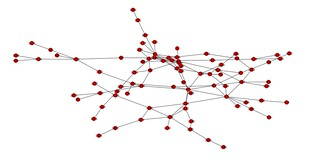
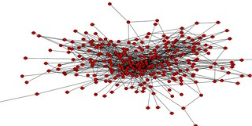

---
categories:
- bim2
- edc3100
date: 2013-05-31 10:16:10+10:00
next:
  text: '"Schools and computers: Tales of a digital romance"'
  url: /blog2/2013/06/03/schools-and-computers-tales-of-a-digital-romance/
previous:
  text: One-size-fits-all formulas
  url: /blog2/2013/05/29/one-size-fits-all-formulas/
title: Changes in links between student posts
type: post
template: blog-post.html
comments:
    []
    
pingbacks:
    - approved: '1'
      author: Linking with others | ICT Learning and Teaching
      author_email: null
      author_ip: 72.232.114.13
      author_url: http://ictlearningandteaching.wordpress.com/2013/06/02/linking-with-others/
      content: '[&#8230;] learning networks both online and in the &#8216;real&#8217;
        world. Hopefully my PLN now looks like this in both virtual and traditional [&#8230;]'
      date: '2013-06-02 15:38:59'
      date_gmt: '2013-06-02 05:38:59'
      id: '774'
      parent: '0'
      type: pingback
      user_id: '0'
    - approved: '1'
      author: Animation over time of links between student posts | The Weblog of (a) David
        Jones
      author_email: null
      author_ip: 66.155.8.249
      author_url: https://djon.es/blog/2013/06/04/animation-over-time-of-links-between-student-posts/
      content: '[&#8230;] seeing a previous post sharing some of his visualisations of
        the links between blog posts of EDC3100 students, Nick [&#8230;]'
      date: '2013-06-04 10:03:30'
      date_gmt: '2013-06-04 00:03:30'
      id: '775'
      parent: '0'
      type: pingback
      user_id: '0'
    
---
**Update:** Video now available showing evolution of links between student blogs over the course of the semester (HT: Nick Kelly) - see YouTube embed at the end of the post

The following is a quick update on the visualisation of links between student blog posts in a course I'm currently teaching. As part of the course the students are expected to write blog posts reflecting on the learning (in the broadest possible sense) and also to link with other student posts.

I did [an initial visualisation](/blog2/2013/03/18/visualising-the-blog-network-of-edc3100-students/) on March 18 using Gephi. This was early in the semester and it appeared that students hadn't really gotten the hang of linking (a significant part of this was how they were introduced to the task). The question was whether they would engage more fully as the semester progresses.

As there's one more week to go in the course it's a good time to explore and I've been luck to make a connection with [Nick Kelly](http://www.usq.edu.au/adfi/team/nick) a new staff member at [ADFI](http://www.usq.edu.au/adfi/) at USQ. His background includes work around analytics and complex data sets. The following images are part of his early work with the data.

First, a file from March 12 showing connections between student blogs. Roughly equivalent to my first image. (Click on the images below to see larger versions)

Then another image from the last week or so.

Certainly appears that the students got the hang of linking. Not surprisingly, the motivation of marks has overcome any reluctance or difficulty with the technology.

Much more to explore. An animated gif/video of the temporal evolution of the links would be good. But I'm also hoping that Nick can provide some pointers on algorithms and approaches that can be incorporated into BIM to help encourage students to make more connections. i.e. my feel at the moment is that many of the links start with who they know, not necessarily with who has the best insights to share. Increasing the chance of benefiting from the serendipity of connections is something I'm keen to explore.

https://www.youtube.com/watch?v=7RBqcf7zz14