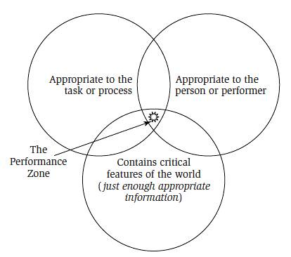

See also: [[blog-home | Home]]

It seems to be the day for a backlash against learning analytics or its parent big data. This morning my PLN has filtered to the top [Taleb's "Beware the big errors of 'big data'"](http://www.wired.com/opinion/2013/02/big-data-means-big-errors-people/) and [Why big data is not truth](http://mobile.nytimes.com/blogs/bits/2013/06/01/why-big-data-is-not-truth/). Not that surprising to me given that [I've argued](/blog2/2012/11/01/moving-beyond-a-fashion-likely-paths-and-pitfalls-for-learning-analytics/) that learning analytics in Universities has all hallmarks of yet another fad.

As I mentioned [in this presentation](/blog2/2012/11/01/moving-beyond-a-fashion-likely-paths-and-pitfalls-for-learning-analytics/) my argument isn't that "Learning analytics == crap". My argument is that "How universities (and most organisations) for that matter implement learning analytics == crap". After all - to paraphrase some Sir Ken Robinson schtick about lifting standards - no-one is arguing against data-driven decision making (which is a main claim of big data). All decisions should be based on data. The problem is the reality of most implementations will be that the data provided by learning analytics is likely to be horribly flawed, provided to the wrong people, and used to make decisions very badly.

As it happens, [Damien](http://damosworld.wordpress.com/), [Col](http://beerc.wordpress.com/) and I are all working on various related projects that are trying to figure out how to implement learning analytics within universities in a way that doesn't equate to animal waste product. The following summarises some thinking out loud and the following of some initial ideas and will hopefully inform what I'll be [talking about](/blog2/2013/05/12/moodle-bim-reflective-journals-and-tpack-suggestions-for-moving-beyond/) at Moodlemoot'AU 2013 in a couple of weeks.

In the end, this is more just an early exploration of Performance Support Systems literature that has shown some level of support for a direction we're exploring, i.e. embedding learning analytics into the LMS and other tools currently being used to better enable action.

### Performance support systems

A common refrain heard when institutional folk get together and chat about learning analytics goes something like this

> But we already have all this data, why don't we use it?  
> Because it's all in separate systems.  
> So we'll give lots of money to Vendor X to implement another piece of technology that will bring all this data together and provide dashboards for people to look at the data.

The only winner out of this approach is the vendor who chalks up another sale. The data could have been brought together via any number of technical means, probably at much less cost, and in a way that doesn't tie the organisation to accessing the data through the reporting tool provided by the vendor. Dashboards are generally a waste of time because people don't use them. Especially teaching staff. Even if the dashboards can provide the sort of contextual information that will help a teacher intervene with a student, the information is provided in a system that is a million miles away from the system where the teacher will intervene.

I've long through that the obvious lens for looking at this is the long quoted idea of "Performance Support". The following is an initial exploration of some of the literature.

Raybould (1995, p. 11) offers the following definition with some added emphasis from me

> - Encompasses **all the software** needed to **support the work of individuals** (not just one or two specific software applications).
> - **Integrates knowledge assets into the interface of the software tools**, rather than separating them as add-on components. For example, company policy information may be presented in a dialog box message rather than in a separate online document.
> - Looks at the **complete cycle** including the capture process as well as the distribution process.
> - Includes the management of nonelectronic as well as electronic assets.

While not without flaw, the definition does get at some of what I'm interested in, including

- Integrating all of the knowledge required to complete a task into the tool I use to complete the task.
- Consider the complete cycle.
    
    i.e. just don't build the data warehouse and expect it to be used. Think about how people can be supported in using the data. After all the EDUCAUSE definition of learning analytics is (my emphasis added)
    
    > the use of data, statistical analysis, and explanatory and predictive models to gain insights and **act** on complex issues.
    
- All brought together with a focus on the "work of individuals".
    
    i.e. don't provide generic dashboards and leave it to the teachers to figure out what to do. Figure out what tools can be built to help teachers perform their work better.
    

### Can't see the trees for the forest

Which brings up the biggest barrier. The processes, systems, structures and people set up to implement "enterprise" systems like learning analytics focus on the forest. Or if they have any conception of the trees in the forest, the trees are all pine trees of identical size, shape and requirements. Being able to see the trees, to focus on the work of the individuals, is not easy. But that's not the point. The point is that enterprise systems and processes can never effectively focus on the "work of individuals". They don't even try.

And it's important, at least for this argument. Villachica et al (2006, p. 540) argue that the purpose of PSS is "expert-like performance from day 1 with little or no training" and that this can only occur within an appropriate zone - the "performance zone".

Oh and here's a good quote that reinforces my point above

> There is also widespread agreement that maintaining performance within this zone requires users to be able to learn, use, and reference necessary information within a single context and without breaks in the natural flow of performing their jobs. (Villachica et al, 2006, p. 540)

I can see myself using that a few times.

Kert and Kurt (2012, p. 486) cite Sleight (1998) to identify the following requirements (amongst others) of an EPSS

- computer assisted.
- accessible exactly at the time the task is realised.
- in the study environment.
- controllable by the user
- ability to easily bring it up to date and fast access to information.

### References

Kert, S. B., & Kurt, A. A. (2012). The effect of electronic performance support systems on self-regulated learning skills. Interactive Learning Environments, 20(6), 485–500.

Raybould, B. (1995). Performance Support Engineering : An Emerging Development Methodology for Enabling Organizational Learning. Performance improvement quarterly, 8(1), 7–22.

Villachica, S., Stone, D., & Endicott, J. (2006). Performance Suport Systems. In J. Pershing (Ed.), Handbook of Human Performance Technology (Third Edit., pp. 539–566). San Francisco, CA: John Wiley & Sons.