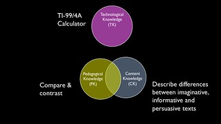

The following post started over the weekend. I'm adding this little preface as a result of the wasted hours I spent yesterday battling badly designed systems and the subsequent stories I've heard from others today. One of those stories revolved around how the shortening available time and the poorly designed systems is driving one academic to make a change to her course that she knows is pedagogically inappropriate, but which is necessary due to the constraints of these systems.

And today (after a comment from Mark Brown in his Moodlemoot'AU 2013 keynote last week) I came across [this blog post](http://larrycuban.wordpress.com/2010/12/19/blaming-doctors-and-teachers-for-underuse-of-high-tech-tools/) from Larry Cuban titled "Blaming Doctors and Teachers for Underuse of High-tech tools". It includes the following quote

> For many doctors, IT-designed digital record-keeping is a Rube Goldberg designed system.

which sums up nicely my perspective of the systems I've just had to deal with.

Cuban's post finishes with three suggested reasons why he thinks doctors and teachers get blamed for resisting technology. Personally, I think he's missed the impact of "enterprise" IT projects, including

- Can't make the boss look bad.
    
    Increasingly IT projects around e-learning have become "enterprise", i.e. big. As big projects, the best practice manual requires that the project be visibly led by someone in the upper echelons of senior management. When large IT projects fail to deliver the goods, you can't make this senior leader look bad. So someone has to be blamed.
    
- The upgrade boat.
    
    When you implement a large IT project, it has to evolve and change. Most large systems - including open source systems like Moodle - do this by having a vendor driven upgrade process. So every year or so the system will be upgraded. An organisational can't fall behind versions of a system, because eventually they are no longer supported. So, significant resources have to be invested in regularly upgrading the system. Those resources contribute to the intertia of change. You can't change the system to suit local requirements as all the resources are invested in the upgrade boat. Plus, if you did make a change, then you'd miss the boat.
    
- The technology dip.
    
    The upgrade boat creates another problem, the technology dip. Underwood and Dillon (2011) talk about the technology dip as dip in educational outcomes that arises after the introduction of technological change. As the teachers and students grapple with the changes in technology they have less time and energy to expend on learning and teaching. When you have an upgrade boat coming every 12 months, then the technology dip becomes a regular part of life.
    

### The weekend start to this post

Back from Moodlemoot'AU 2013 and time to finalise results and prepare course sites for next semester. Both are due by Monday. The argument from [my presentation at the Moot](/blog2/2013/05/12/moodle-bim-reflective-journals-and-tpack-suggestions-for-moving-beyond/) was that the presence of "TPACK holes" (or misalignment) causes problems. The following is a slide from the talk which illustrates the point.

I'd be surprised if anyone thought this was an earth breaking insight. It's kind of obvious. If this was the case then I wouldn't expect institutional e-learning to be replete with examples of this. The following is an attempt to document some of the TPACK holes I'm experiencing in the tasks I have to complete this weekend. It's also an example of recording the gap outlined [in this post](/blog2/2013/06/20/documenting-the-gap-between-start-of-art-and-state-of-the-actual/).

### Those who haven't submitted

Of the 300+ students in my course there are some that have had extension, but haven't submitted their final assignment. Most likely failing the course. I'd like to contact them and double check that all is ok. I'm not alone in this, I know most people do it. All of my assignments are submitted via an online submission system, but there is no direct support in this system for this task.

The assignment system will give me a spreadsheet of those who haven't submitted. But it doesn't provide an email address for those students, nor does it connect with other information about the students. For example, those who have dropped the course or have failed other core requirements. Focusing on those students with extensions works around that requirement. But I do have to get the email addresses.

### Warning markers about late submissions

The markers for the course have done a stellar job. But there are still a few late assignments to arrive. In thanking the markers I want to warn them of the assignments still to come, but even with only less than 10 assignments to come this is more difficult than it sounds due to the following reasons

- The online assignment submission treats "not yet submitted" assignments as different from submitted assignments and submitted assignments is the only place you can allocate students to markers. You can't allocate before submission.
- The online assignment submission system doesn't know about all the different types of students. e.g. overseas students studying with a university partner are listed as "Toowoomba, web" by the system. I have to go check the student records system (or some other system) to determine the answer.
- The single sign-on for the student records system doesn't work with the Chrome browser (at least in my context) and I have to open up Safari to get into the student records system.

### Contacting students in a course

I'd like to send a welcome message to students in a course prior to the Moodle site being made available.

The institution's version of Peoplesoft provides such a notify method (working in Chrome, not Safari) but doesn't allow the attachement of any files to the notification.

I can copy the email addresses of students from that Peoplesoft system, but Peoplesoft uses commas to separate the email addresses meaning I can't copy and paste the list into the Outlook client (it expects semi-colons as the separator).

### Changing dates in a study schedule

Paint me as old school, but personally, I believe there remains a value to students of having a study schedule that maps out the semester. A Moodle site home page doesn't cut it. I've got a reasonable one set up for the course from last semester, but new semester means new dates. So I'm having to manually change the dates, something that could be automated.

## Processing final results

As someone in charge of a course, part of my responsibilities is to check the overall results for students, ensure that it's all okay as per [formal policy](https://policy.usq.edu.au/policy/files/assessment.htm) and then put them through the formal approval processes. The trouble is that none of the systems provided by the institution support this. I can't see all student results in a single system in a form that allows my to examine and analyse the results.

All the results will eventually end up in a Peoplesoft gradebook system. In which the results are broken up based on the students "mode" of learning i.e. one category for each of the 3 different campuses and another for online students. But from which I cannot actually get any information out of in a usable form. It is only available in a range of different web pages. If the Peoplesoft web interface was halfway decent this wouldn't be such a problem, but dealing with it is incredibly time consuming. Especially in a course with 300+ students.

I need to get all the information into a spreadsheet so that I can examine, compare etc. I think I'm going to need

- Student name, number and email address (just in case contact is needed), campus/online.
    
    Traditionally, this will come from Peoplesoft. Might be some of it in EASE (online assignment submission).
    
- Mark for each assignment and their Professional Experience.
    
    The assignment marks are in EASE. The PE mark is in the Moodle gradebook.
    
    There is a question as to whether or not the Moodle gradebook will have an indication of whether they have an exemption for PE.
    

EASE provides the following spreadsheets, and you're not the only one to wonder why these two spreadsheets weren't combined into one.

1. name, number, submission details, grades, marker.
2. name, number, campus, mode, extension date, status.

Moodle gradebook will provide a spreadsheet with

- firstname, surname, number.....email address, Professional Experience result

Looks like the process will have to be

1. Download Moodle gradebook spreadsheet.
2. Download EASE spreadsheet #1 and #2 (see above) for Assignment 1.
3. Download EASE spreadsheet #1 and #2 (see above) for Assignment 2.
4. Download EASE spreadsheet #1 and #2 (see above) for Assignment 3.
5. Bring these together into a spreadsheet.
    
    One option would be to use Excel. Another simpler method (for me) might be to use Perl. I know Perl much better than Excel and frankly it will be more automated with Perl than it would be with Excel (I believe).
    
    Perl script to extract data from the CSV files, stick it in a database for safe keeping and then generate an Excel spreadsheet with all the information? Perhaps.
    

Final spreadsheet might be

- Student number, name, email address, campus/mode,
- marker would be good, but there'll be different markers for each assignment.
- a1 mark, a2 mark, a3 mark, PE mark, total, grade

An obvious extension would be to highlight students who are in situations that I need to look more closely at.

A further extension would be to have the Perl script do comparisons of marking between markers, results between campuses, generate statistics etc.

Also, probably better to have the Perl script download the spreadsheets directly, rather than do it manually. But that's a process I have't tried yet. Actually, over the last week I did try this, but the institution uses a single sign on method that involves Javascript which breaks the traditional Perl approaches. There is a potential method involving [Selenium](http://docs.seleniumhq.org/), but that's apparently a little flaky - [a task for later](http://extract-web-data.com/selenium-ide-and-web-scraping/).

### Slumming it with Peoplesoft

I got the spreadsheet process working. It helped a lot. But in the end I still had to deal with the Peoplesoft gradebook and the kludged connection between it and the online assignment submission system. Even though the spreadsheet helped reduce a bit of work, it didn't cover all of the significant cracks. In the absence of better systems, these are cracks that have to be covered over by human beings completing tasks for which evolution has poorly equipped them. Lots of repetitive, manual copying of information from one computer application to another. Not a process destined to be completed without human error.