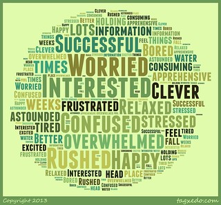
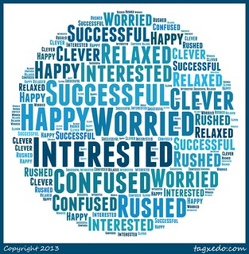

---
categories:
- edc3100
- teaching
date: 2013-07-18 10:55:30+10:00
next:
  text: BIM, Moodle, Simplepie, curl and HTTP proxy issue
  url: /blog/2013/07/26/bim-moodle-simplepie-curl-and-http-proxy-issue/
previous:
  text: IRAC - Four questions for learning analytics interventions
  url: /blog/2013/07/14/irac-four-questions-for-learning-analytics-interventions/
title: How are they feeling - Semester 2 - Part 1
type: post
template: blog-post.html
comments:
    - approved: '1'
      author: beerc
      author_email: c.beer@cqu.edu.au
      author_ip: 138.77.10.107
      author_url: null
      content: 'We''ve been using the IBM wordcloud generator to create wordclouds from
        student survey comments. While not as pretty as Tagxedo, it does allow for some
        nice automation. http://www.softpedia.com/progDownload/IBM-Word-Cloud-Generator-Download-160283.html
    
    
        Col.'
      date: '2013-07-18 11:16:32'
      date_gmt: '2013-07-18 01:16:32'
      id: '811'
      parent: '0'
      type: comment
      user_id: '0'
    
pingbacks:
    []
    
---
The following is a [repeat of this post](/blog/2013/03/04/how-are-they-going/) for a different offering of the same course. It's also a quick how to primarily intended for the students in [the course](http://www.usq.edu.au/course/specification/2013/EDC3100-S1-2013-WEB-TWMBA.html). Summary and comparison first, then the how to.

Doing this now mainly in preparation for a session with the students tonight.

## Summary

I'll focus here on answers to "How do you feel about the course". A question from which the students can select from a provided list of words (Interested, relaxed, worried, successful, confused, clever, happy, bored, rushed) and add their own.

A word cloud based on the students responses at the end of the first week of the Semester 1 offering of the course looked like this.

The word cloud for the semester 2 responses near the end of week 1 (a much smaller sample - semester 1 = 121 students, semester 2 - 17, so far) looked like this.

Looks like there's some improvement. Stressed and overwhelmed aren't present and these were optional words folk could add. Confusion and worry - provided choices - are still present. As is a feeling of being rushed. So, still a challenge, but perhaps a bit better?

Of course, these conclusions are based on a much smaller sample and there are some significant sources of bias. I'll mention just two of those. First, this represents the 17 early starters, those who are keen and got started quickly and potentially had fewer problems. It's possible that the 90 or so students still to complete the tasks may be feeling very different. It's probably a biased sample. Second, my conclusion is based very much on my own beliefs about the course. I've redesigned the week's activities to be more manageable, so I'm looking for that to be reflected in the data.

For these reasons, will be interested in hearing what others - especially the students - perceive from the above (if anything).

## How to

I wouldn't go into a hug amount of detail. A quick search online will reveal a good collection of tutorials on most of the following.

The process for this was

1. Set up the Google form.
    
    Google forms provide the interface students use to respond to the "survey". It helps gather the data.
    
2. Extract the responses from the Google spreadsheet.
    
    A simple copy and paste into a text document.
    
3. Feed them into [Tagxedo](http://tagxedo.com/).
    
    In this case, a simple copy and paste into tagxedo. Choose a circle shape, horizontal orientation. All good.
    
4. Export the Word cloud and upload to Flickr.