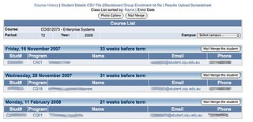

See also: [[blog-home | Home]]

In a a [prior post](/blog2/2013/08/02/learning-analytics-what-is-the-end-in-mind/) I wondered about the "end in mind" for university analytics projects. What follows outlines why I'm skeptical of such projects.

Starting about 15 years ago, most Australian Universities started spending tens of millions of dollars on Enterprise Resource Planning systems. These were systems intended to solve the information problems of universities. I remember the great promises proposed by Vice Chancellors about how much time and money would be saved through the adoption of these systems. How much easier it would be to get access to correct information and consequently improve university operations.

I'm especially interested in hearing whether there are other universities that have solved these problems and/or that this same problem exists elsewhere.

### Student list by date enrolled

This morning I'd like to get a list of students in my course sorted by the date they enrolled. I need to modify my actions based on how late they enrolled. I can't get this information at my current institution.

At my previous institution, I could not only get this information, I could also then contact students based on the date they enrolled. As per the following image.

Of course, this wasn't provided by the ERP system (my previous institution and my current institution have the same ERP). It was a "shadow system" I implemented.

### Other missing information

The class list I can access from the current ERP doesn't include the following information: email address, GPA, campus and a few others.

In terms of the courses I teach, it doesn't appear that I can query the historical data and see what the distribution of grades were in previous offerings. This is somewhat problematic because the institutional processes require me to compare the current course results with the historical performance as part of the results moderation process. Just to make the point again

> The organisation expects me to carry out a task, but doesn't provide the information necessary to perform it

I'm sure I could go on. What about your institution? What information do you want/need, but can't get through institutional provided systems?

Actually, if you're interested, add your list of information to [this Google doc](https://docs.google.com/document/d/1_dn8xFzN9JC8020N3eQqYIWiP0P7kkeJmDXiIFQqeFg/edit?usp=sharing).

Note: I'm not even going to comment on how difficult it is to get the information it does provide out of the enterprise system.

### Analytics as a repeat of the ERP mistakes?

I wonder if the analytics push is simply the next phase in the ERP fashion process? Are Universities destined to make the same mistakes with analytics that they made with the ERP?

How can this be avoided? Is any institution likely to even be aware of this problem, let alone do something about it?

Which brings me back to the [prior post](/blog2/2013/08/02/learning-analytics-what-is-the-end-in-mind/). If the "end in mind" with learning analytics is the provision of useful information to students and teachers in ways that action can be taken, then it might be okay. But if the "end in mind" becomes installing Vendor Tool X because everyone else is doing it.....

What's especially troubling is that I know of at least one Australian University that is explicitly heading down the "install tool X" approach since it is seen as saving money. i.e. if you implement the tool as vanilla and then focus on changing practices to suite the tool, it's better and cheaper. Good luck with that.