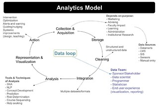

---
categories:
- learninganalytics-elearning
date: 2013-09-04 09:09:56+10:00
next:
  text: The importance of "We don't know what we're doing"
  url: /blog2/2013/09/04/the-importance-of-we-dont-know-what-were-doing/
previous:
  text: An overview of learning analytics
  url: /blog2/2013/08/31/an-overview-of-learning-analytics/
title: '"Learning Analytics: The Emergence of a Discipline"'
type: post
template: blog-post.html
comments:
    []
    
pingbacks:
    - approved: '1'
      author: 'Learning Analytics: The emergence of a discipli...'
      author_email: null
      author_ip: 89.30.105.121
      author_url: http://www.scoop.it/t/edumorfosis/p/4007085092/learning-analytics-the-emergence-of-a-discipline
      content: '[&#8230;] Continuing my reading of some recent learning analytics journal
        articles, the following is a summary and some thoughts onSiemens, G. (2013). Learning
        Analytics: The Emergence of a Discipline. Ameri...&nbsp; [&#8230;]'
      date: '2013-09-05 03:26:44'
      date_gmt: '2013-09-04 17:26:44'
      id: '841'
      parent: '0'
      type: pingback
      user_id: '0'
    - approved: '1'
      author: 'Learning Analytics: The Emergence of a Discipline | E-TeachUK'
      author_email: null
      author_ip: 66.155.38.10
      author_url: http://muppetmasteruk.wordpress.com/2013/09/04/learning-analytics-the-emergence-of-a-discipline/
      content: '[&#8230;] See on Scoop.it &#8211; E-Learning and TechnologyContinuing
        my reading of some recent learning analytics journal articles, the following is
        a summary and some thoughts onSiemens, G. (2013). Learning Analytics: The Emergence
        of a Discipline. Ameri&#8230;See on davidtjones.wordpress.com [&#8230;]'
      date: '2013-09-05 03:37:26'
      date_gmt: '2013-09-04 17:37:26'
      id: '842'
      parent: '0'
      type: pingback
      user_id: '0'
    - approved: '1'
      author: 'Learning Analytics: The Emergence of a Discipli...'
      author_email: null
      author_ip: 89.30.105.121
      author_url: http://www.scoop.it/t/higher-education-by-alma-vega/p/4007355604/learning-analytics-the-emergence-of-a-discipline
      content: '[&#8230;] &ldquo; Continuing my reading of some recent learning analytics
        journal articles, the following is a summary and some thoughts onSiemens, G. (2013).
        Learning Analytics: The Emergence of a Discipline. Ameri...&rdquo;&nbsp; [&#8230;]'
      date: '2013-09-10 11:44:22'
      date_gmt: '2013-09-10 01:44:22'
      id: '843'
      parent: '0'
      type: pingback
      user_id: '0'
    - approved: '1'
      author: 'Sensemaking: A structure for intelligence revolution - Analyst One'
      author_email: null
      author_ip: 72.47.224.18
      author_url: http://analystone.com/sensemaking-structure-intelligence-revolution/
      content: '[&#8230;] Learning Analytics: The Emergence of a Discipline (davidtjones.wordpress.com)
        [&#8230;]'
      date: '2013-10-12 22:15:28'
      date_gmt: '2013-10-12 12:15:28'
      id: '845'
      parent: '0'
      type: pingback
      user_id: '0'
    
---
Continuing my reading of some recent learning analytics journal articles, the following is a summary and some thoughts on

> Siemens, G. (2013). Learning Analytics: The Emergence of a Discipline. American Behavioral Scientist, (August). doi:10.1177/0002764213498851

### Thoughts

A really good, detailed overview of learning analytics as an "emerging discipline". Even some good coverage of the institutional adoption of learning analytics.

But I have some niggles which I'm still trying to express. Here's the first go and then into the summary of the paper.

The biggest niggle I have after reading this is trying to marry up a discipline like learning analytics that arises from and perhaps even revels from the complexity and variability of big data with a very traditional teleological/enterprise conception of organisational implementation.

If the ultimate goal of learning analytics is to reject the sort of rationalist/modernist decomposition of knowledge into programs and courses into a network of knowledge where computational methods guide the learner through this complex network, then why must the enterprise implementation of learning analytics depend on rationalist/modernist implementation approaches that break the process down into separate components?

Related or perhaps a re-phrasing. If the organisational context within which learning analytics is applied (e.g. a university) is a complex adaptive system then why is implementation positioned as a heavyweight, teleological exercise in project management with complete ignorance of the best way to explore, encourage and discover appropriate change in such a system - [safe-fail probes](http://cognitive-edge.com/blog/entry/4090/safe-fail-probes/). Now, this paper doesn't actually suggest a heavyweight, teleological exercise in project management, but I can see most management looking at the "learning analytics model" proposed (see image below) and the identified importance of institutional support within the paper and making the leap to a heavyweight, teleological exercise in project management.

George actually argues for the need to keep human and social processes central in LA activities and yet the focus of the field still seems to be on the techniques and applications rather than whether or not these will be used, or used effectively by learners and teachers. Wrapped up in that, is the whole idea of learning analytics focusing on some ideal future embodied in its applications and techniques or whether it is directly addressing the current problems and needs.

### Abstract

The paper's abstract follows with my emphasis added on what I'm interested in reading about

> Recently, learning analytics (LA) has drawn the attention of academics, researchers, and administrators. This interest is motivated by the need to better understand teaching, learning, “intelligent content,” and personalization and adaptation. While still in the early stages of research and implementation, several organizations (Society for Learning Analytics Research and the International Educational Data Mining Society) have formed to foster a research community around the role of data analytics in education. This article considers the research fields that have contributed technologies and methodologies to the development of learning analytics, analytics models, the importance of increasing analytics capabilities in organizations, and **models for deploying analytics in educational settings**. The **challenges facing LA** as a field are also reviewed, particularly regarding the need to increase the scope of data capture so that the complexity of the learning process can be more accurately reflected in analysis. Privacy and data ownership will become increasingly important for all participants in analytics projects. The current legal system is immature in relation to privacy and ethics concerns in analytics. The article concludes by arguing that LA has sufficiently developed, through conferences, journals, summer institutes, and research labs, to be considered an emerging research field.

## Introduction

Starts with [Phillip W Anderson's](http://en.wikipedia.org/wiki/Philip_Warren_Anderson) poitn about ["more is different"](http://www.sciencemag.org/content/177/4047/393.full.pdf) which as Wikipedia summarises

> in which he emphasized the limitations of reductionism and the existence of hierarchical levels of science, each of which requires its own fundamental principles for advancement.

. In this case the point is that "that quantity of an entity influences how researchers engage with it". This is what is happening with "big data" leading to the view it can "transform economies and increase organisational productivity and increase competitiveness. But education is lagging behind but the explosion of interest is happening.

_Aside:_ I've heard of Anderson's "more is different". In fact, I've heard George use it before. I've just skimmed a bit of Anderson's article. I find the notion of "quantity influences how you engage with it" interesting/troubling on a couple of fronts. Need to think more on this. But does/should the presence of more data alone fundamentally change what's happening? If yes, then is there any University using learning analytics to fundamentally change what they are doing - beyond adding new systems and another range of support staff to perform tasks that the teaching staff aren't doing?

Brings in Kuhn to talk about the evolution of science, knowledge etc. The idea of a "network of theory" and the importance of connections between entities as representative of knowledge is pushed.

Analytics is positioned then as "another approach, or cognitive aid" that can assist folk "to make sense of the connective structures that underpin their field of knowledge". Large data sets have changed the method of science and the question investigated. Transition from Yahoo (hierarchical classification) to Google (big data and algorithms) mentioned.

_Aside:_ so how long and how will the hierarchical classification of education (programs and courses) last before transforming into a "big data and algorithms" (or something else) approach.

With the increasing use of e-learning, comes more and more data - which may be imperfect on any number of fronts - that "offer an opportunity to explore learning from new and multiple angles".

This view of "a new mode of thinking and a new model of discovery" is traced back (in part) to AI and machine learning and has some good quotes from authors in those fields about the "unreasonable effectiveness of data" (Halevy, Norvig, and Pereira, 2009) and "the emergence of a new approach to science" (Hey, Tansley and Tolle, 2009).

## Defining learning analytics and tracing historical roots

Starts with the SOLAR definition of learning analytics

> Learning analytics is the measurement, collection, analysis, and reporting of data about learners and their contexts, for the purposes of understanding and optimizing learning and the environments in which it occurs.

Adds another from a business intelligence perspective aimed "developing actionable insights"

Differentiates LA from Educational Data Mining (EDM) by suggesting that EDM has a "more specific focus on reductionist analysis" but that there will be overlap.

Identifies layers of analytics drawing on Buckingham-Shum's (2012) three layers

| micro- | meso- | macro- |
| --- | --- | --- |
| Process-level | Institutional | Cross-institutional |
| Mostly learner, but perhaps teacher. | department, university | region, state, international |
| Social network analysis, NLP, assessing individual engagement levels | Risk detection, intervention and support services | Optimising and external comparison |

The point of the above is that "as the organisational scale changes, so too do the tools and techniques used for analysing learner data alongside the types of organisational challenges that analytics can potentially address".

_Aside:_ I wonder/believe that the further you go up the organisational scale the greater the tendency there is for normative approaches which along with other factors limit change. i.e. to get "good" measures across all courses in a department, you have to be measuring similar (or even the same) stuff. Assuming a level of commonality that isn't and perhaps shouldn't be present.

### Historical contributions

Mentions broader influences as: AI, statistical analysis, machine learning and business intelligence. But aims to talk about fields/research within education that contribute to Learning Analytics, including

- citation analysis
- Social network analysis
- User modeling
- Education/cognitive modeling
- Intelligent tutoring systems
    
    Mentions Burns' 1989 description of three levels of "intelligence" for these systems: domain knowledge, learner knowledge evaluation, and pedagogical intervention.
    
- Knowledge discovery in databases
- Adaptive hypermedia
- e-learning

_Aside:_ I get the feel that as learning analytics develops that there will be decisions/work that ignore some of the findings that arose in these historical influences. e.g. the finding from Decision Support Systems that DSS should be built with evolutionary methods.

_Aside:_ The absence of [Decision Support Systems](http://en.wikipedia.org/wiki/Decision_support_system) suggests a few possibilities, including:

- The DSS field has failed to give itself a profile outside of research, even though it covers data warehouses etc..
- Learning analytics is still focused on the information and how to analyse and represent it, rather than how to actually use it to make decisions.
- Or perhaps the focus on LA is to automate decisions, rather than support human decision makers.

## LA tools, techniques and applications

### Tools

Commercial tools

- Statistical software packages - SPSS, NVivo etc.
- Tools added to existing LMS type systems - S3, Course Signals
- Web analytics tools
- Tableau Software, Infochimps, also Many Eyes is mentioned
    
    Positioned as tools explicitly written to reduce the complexity of analytic tasks.
    
    Proposes that as these tools improve in ease of use, affordability etc. adoption will increase.
    
    Aren't these just improved BI systems? But Tableau is [pushing into education](http://www.tableausoftware.com/academic), giving it away to full-time students and [instructors](http://www.tableausoftware.com/academic/teaching), only downside is that it's a Windows application. But they also have [Tableau online](http://www.tableausoftware.com/products/online).
    

Research/open - "not as developed as commercial offerings and typically do not target systems-level adoption"

- [R](http://www.r-project.org/) and [Weka](http://www.cs.waikato.ac.nz/ml/weka/) - focused on individual analytics tasks.
- [SNAPP](http://www.snappvis.org/) or [Netlytic](http://netlytic.org/)
    
    Tools you can use if you don't have the ability to integrate into your system, but can be unreliable. Had problems with Netlytic authentication myself.
    
- Via [Shane Dawson](http://www.slideshare.net/shaned07/shane-dawson-herdsaworkshop-24359804) - [Jigsaw - visual analytics for exploring and understanding documents](http://www.cc.gatech.edu/gvu/ii/jigsaw/)

_Aside:_ Fairly limited number of research/open tools listed. Wonder if that indicates something about the quality of the research tools or just the list the author had?

### Techniques and applications

Proposes that these are two overlapping components:

- Technique - specific algorithms and models for conducting analytics.
    
    An area of basic research "where discovery occurs through models and algorithms". Then leading to application.
    
- Applications - "ways in which techniques are used to impact and improve teaching and learning.
    
    Influence curriculum, social network analysis and discourse analysis
    
    Much arising from source disciplines, but some arising from LA researchers now.
    

A distinction that "is not absolute but instead reflects the focus of researchers".

The table below summarises LA/EDM literature drawn upon to identify the relevant areas of each. Technique focuses on the type of analysis a researcher conducts. This distinction indicates the difficulty of definitions and taxonomies of analytics. The lack of maturity around this refelcts the youth of the emerging field/discipline.

| Technique | Application |
| --- | --- |
| ([Baker and Yacef, 2009](http://www.educationaldatamining.org/JEDM/images/articles/vol1/issue1/JEDMVol1Issue1_BakerYacef.pdf)) | ([Bienkowski et al, 2012](http://ctl2.sri.com/eframe/wp-content/uploads/2012/04/EDM-LA-Brief-Draft_4_10_12c.pdf)) |
| Prediction | Modeling user knowledge, behaviour and experience |
| Clustering | Creating profiles of users |
| Relationship mining | Modeling knowledge domains |
| Distallation of data for human judgement | Trend analysis |
| Discovery with models | Personalisation and adaptation |

_Aside:_ I wonder what it says about me when I can't - without a bit of reflection and perhaps further reading - see the connection between the list of applications and my need as a teacher?

- Am I simply dumb/read enough/not thinking at the right level of abstraction?
    
    Should read Bienkowski et al (2012).
    
- Is there a gap between the research and practice?
- Wondering if I see myself more as a teacher than a LA researcher, hence the difficulty here?

Of course, the following table offers the missing translation

Learning analytics (LA) Techniques and Applications (adapted from Siemens, 2013, p. 9)
| LA Approach | Examples |
| --- | --- |
| Techniques |  |
| Modeling | Attention metadata   Learner modeling   Behavior modeling   User profile development    |
| Relationship mining | Discourse analysis   Sentiment analysis   A/B testing   Neural networks    |
| Knowledge domain modeling | Natural language processing   Ontology development   Assessment (matching user knowledge with knowledge domain)    |
| Applications |  |
| Trend analysis and prediction | Early warning, risk identification   Measuring impact of interventions   Changes in learner behavior, course discussions, identification of error propagation    |
| Personalization/adaptive learning | Recommendations: Content and social connections   Adaptive content provision to learners   Attention metadata    |
| Structural analysis | Social network analysis   Latent semantic analysis   Information flow analysis    |

## Scope of data capture

> "quality" data are required

"quality" == "captured as learners are engaged in authentic learning, where collection is unobtrusive

two obvious sources - Student Information Systems and LMS. Wearable computer devices - pedometers - and the quantified self get a mention.

Criticises existing projects

- rely on data automatically collected
- often incomplete and mere static snapshots in time

Suggests that to be effective, future projects "must afford the capacity to include additional data through observation and human manipulation of the existing data sets".

_Aside:_ Now that is interesting.

Makes the point that lecture hall data are limited to a few variables: who attended, seating patterns SRS data, observational data. Where as video lecture data is richer: frequence of access, playback, pauses and so on. The EdX type MOOC stuff adds to this by allowing linkages with the errors students make on questions.

"A single data source or analytics method is insufficient when considering learning as a holistic and social process" Calls for multiple analytic approaches to provide more information to educators and students. uses example of network analysis

> researchers are using multiple methods to evaluate activity within a network, including detailing different node types, direction of interaction, and human and computer nodes

## Knowledge domain modeling

Picks up on the argument for more "community-centric and multidisciplinary approaches" for the complex problems to be faced. This can be helped by mapping and defining knowledge areas. Linked to the need for "data structures and computational techniques". [Google's Knowledge Graph](http://www.google.com.au/insidesearch/features/search/knowledge.html) is mentioned.

Having a knowledge domain mapped then enables further analysis through the use of learner data, profile information, curricular data etc. Perhaps enabling prediction, intervention, personalisation and adaptation. Adaptation may not be automated. Enabling sensemaking and wayfinding has some value.

_Aside:_ a potential link to curriculum mapping, outcomes, AITSL standards and eportfolios.

## Organisational Capacity

Rare to have people with the right mix of skills. Analytics project requires: accessing, cleaning, integrating, analysing and visualising data - before sensemaking. Needing programming, statistical knowledge, familiarity with the data and the domain before being able to ask relevant questions

Requires organisational support, outlines the requirements for an "intervention" system. Any initiative requires faculty support. Greller and Drachsler (2012, p43) and their six dimensions to be considered "to ensure appropriate exploitation of LA in an educational beneficial way":

- Stakeholders
- Objectives
- Data
- Instruments
- External limitations
- Internal limitations

_Aside:_ I prefer [IRAC](/blog2/2013/07/14/irac-four-questions-for-learning-analytics-interventions/), but then I'm biased

This perhaps the most difficult and under appreciated point

> The effective process and operation of learning analytics require institutional change that does not just address the technical challenges linked to data mining, data models, server load, and computation but also addresses the social complexities of application, sensemaking, privacy, and ethics alongside the development of a shared organizational culture framed in analytics.

### LA Model

LA Model (see image below) is a systemwide approach to analytics. Resources are systematized. Points out that interventions and predictive models aren't possible without top-down support.

Does suggest that "bottom-up approach" has always gone on. i.e. teaching staff using available tools to gather insights.

 Learning Analytics Model by David T Jones, on Flickr")

_Aside:_ I can see the value in this model. It matches the typical enterprise, rational approach. But I also fear that it will suffer exactly the same sort of problems every enterprise approach has followed before. Personally, I think the relative amount of space taken up by the "information" component of IRAC speaks volumes. Would be good to overlay IRAC on this. The "Action" stuff is too small to capture the complexity and the variety of what goes on there.

## Challenges

> The most significant challenges facing analytics in education are not technical.

Amongst the significant concerns are

- Data quality
- Enough data to accurately reflect the learning experience.
- Privacy
- Ethics

_Aside:_ My own personal barrow has me asking why adoption and effective use are not included in the challenges. I mean it's not as if educational technology has a long list of successful adoption stories about new technologies to share.

### Data quality and scope

Scope - scope of capture of data from alternative sources - wearable computing and mobile devices.

Data interoperability posts a problem because of: privacy concerns, diversity of data sets and sources, lack of standard representation which makes sharing difficult.

Distributed and fragmented data are a problem. Data trails cover different systems. Good quote from Suthers and Rosen (2011) used

> since interaction is distributed across space, time, and media, and the data comes in a variety of formats, there is no single transcript to inspect and share, and the available data representations may not make interaction and its consequences apparent (p. 65).

Leads into discussion of gRSShopper and the idea of "recipes" for capturing and evaluating distributed data citing (Hawksey, 2012; Hirst 2013)

_Aside:_ An obvious avenue here for work around [BIM](/blog2/research/bam-blog-aggregation-management/).

### Privacy

> With interactions online reflecting a borderless and global world for information flow, any approach to data exchange and data privacy requires a global view (World Economic Forum, 2011, p. 33).

New opportunities arising from technology yet to be fully adressed by the legal system - e.g. copyright and IP. A low level of legal maturity (Kay et al 2012) around privacy, copyright, IP and data ownership. Privacy laws differ form nation to nation. Rising interesting questions with cross-border education.

Learner control is important. [MyData Button](http://www.ed.gov/edblogs/technology/mydata/) is an initiative allowing learners to download their data. Includes the following list of questions

- Who has access to analytics?
- Should a student be able to see what an institution sees?
- Should educators be able to see the analytics from other courses?
- Should analytics be available to prospective employees?
- What happens when a learner transfers to a different institution?
- How long is the data kept and can it be shared with other institutions?

Raises the transaction idea. i.e. students may choose to share their data in return for enhanced services.

### The dark side

_Aside:_ Ahh, now this is interesting and likely to be overlooked by most. It even forms just one paragraph in a long paper.

Draws on Ellul's argument that technique and technical processes strive for the "mechanisation of everything it encounters". Argues for the need to keep human and social processes central in LA activities. Learning is essentially social. Learning is creative requiring the generation of new ideas, approaches and concepts. Analytics only identifies what has happened. And this

> The tension between innovation (generating something new) and analytics (evaluating what exists in data) is one that will continue to exist in the foreseeable future.

### A personal reflection

Covers the emergence of the LA field.

### Conclusions

Questions how the field will emerge. Recaps back to Anderson's "more is different" and how educators deal with this will encourage the emergence of the field and related tools/approaches.

## References

Anderson, P. (1972). More is Different. Science, 177(4047), 393–396.

Baker, R., & Yacef, K. (2009). The state of educational data mining in 2009: A review and future visions. Journal of Educational Data Mining, 1(1), 3–17.

Bienkowski, M., Feng, M., & Means, B. (2012). Enhancing teaching and learning through educational data mining and learning analytics.

Buckingham Shum, S. (2012). Learning analytics. UNESCO policy brief. Retrieved from http://iite.unesco.org/pics/publications/en/files/3214711.pdf

Siemens, G. (2013). Learning Analytics: The Emergence of a Discipline. American Behavioral Scientist, (August). doi:10.1177/0002764213498851