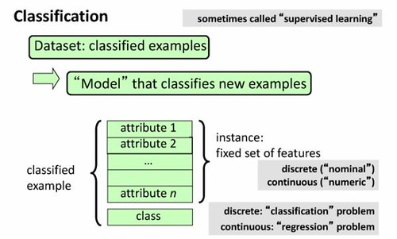

See also: [[blog-home | Home]]

And now for the second MOOC of the year - [Data Mining with Weka](https://weka.waikato.ac.nz/dataminingwithweka/course) from the University of Waikato. Weka is an open source data mining application. Time to find out a bit more about one of the technical aspects of learning analytics. Hoping this might be useful in terms of research with [The Indicators Project](http://indicatorsproject.wordpress.com/) (we should really update that site).

First up is "Class 1 - Getting started with Weka"

### Introduction

[YouTube video](https://www.youtube.com/watch?v=Exe4Dc8FmiM#t=21) introduction - 9 minutes. Powerpoint slides with talking head in the corner. Some of it devolves to reading the slides.

Data mining is a mature technology. The course is trying to take the mystery out of it. Look at some common algorithms and see what practical use they might be.

Data mining is about going from raw data to information that can be useful for predictions.

Shopping, royalty cards and artificial insemination as examples.

Data mining uses machine learning algorithms for the data mining application

Weka - the software used here - is a data mining workbench. Algorithms for a range of necessary purposes.

5 classes in the course, 6 lessons in each class, with an activity - fairly standard xMOOC format

1. Getting started with Weka
2. Evaluation
3. Simple classifiers
4. More classifiers
5. Putting it all together

There's a signed certificate from the University if you get 70% or more.

The instructor has a published book. Used in the course with parts being made available with permission from publisher.

Typical NZ flipped world map.

And now the activity. A simple true/false quiz which is more about recognising that data mining is applicable in a wide array of applications. Promoting the book a bit.

### Data mining with Weka

Almost 5 minutes of the video downloading and installing the Weka software, which I'd done. So a bit of skipping.

Weka has four applications

1. Explorer - the focus of this course
2. Experimenter - performance comparisons, of machine learning algorithms on different data sets
3. KnowledgeFlow - graphical interface
4. Simple CLI - yea, the command line.

So, the play data set about the weather

- instances - 14 rows associated with a particular day.
- attributes - 5 columns, 4 of which is weather, 1 is whether or not play occurs. The aim is we're looking at predicting the play variable.

Of course the bit about the standard data sets was hidden in the installation process that I skipped. But usefully they have the transcript, download that and a quick search found the solution.

All very simple and accessible and just a bit slow for anyone with a modicum of technical/CS experience.

The activity is also simple, but it does test what was covered in the video.

### Exploring datasets

Classification or supervised learning problem - trying to predict the class problem - i.e. play in the weather data. The standard is the last is the class value.

"Good to get down and dirty with your data" - checking the reasonable value for the data. The preprocess stage of the Weka explorer is useful way of doing this.

Would be interesting to get the data set for the MCQs in the activities. I have a feeling that doing some data mining on that might reveal B to be a good random choice.

The questions in this MCQ do involve using and demonstrating your understanding of the concepts and the software. Also take a bit more time. This is better than the "stats" MOOC I started a little while ago.

### Building a classifier

Using a J48 classifier to analyse.

Run it on the Glass data set and generates a success rate of 68%. Also a confusion matrix that gives some idea of where the errors are.

### Using a filter

Introduction to part of the pre-processing part of the process. Manipulating the data set to get it ready for classification etc.

### Visualising your data

More useful methods for examining the data.

Java/Weka doesn't seem to handle the "right-click" problem for a Mac consistently.

And that's class 1 finished. Found this a better designed experience, or perhaps that's just my prejudices showing through.