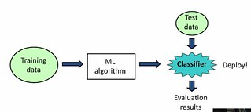

---
categories:
- learninganalytics-elearning
date: 2013-09-22 17:13:36+10:00
next:
  text: '"The IRAC framework: Locating the performance zone for learning analytics"'
  url: /blog2/2013/10/03/the-irac-framework-locating-the-performance-zone-for-learning-analytics/
previous:
  text: 'Moving beyond a fashion: Likely paths and pitfalls for learning analytics'
  url: /blog2/2013/09/22/moving-beyond-a-fashion-likely-paths-and-pitfalls-for-learning-analytics-3/
title: Data mining with Weka - Class 2 - Evaluation
type: post
template: blog-post.html
---
Now onto class 2 with the [Data Mining with Weka](https://weka.waikato.ac.nz/dataminingwithweka/) MOOC.

### Be a classifier

Interesting, Weka has a feature to visually build a decision tree by selecting regions of the instance space. Much nicer than the decision tree process I taught a couple of years ago about in IPT.

The idea is that this tree still yet needs be tested - which is coming up.

### Training and testing

Basic machine learning situation.

We're developing a classifer on the basis of machine learning algorithm.

The test and training data needs to be different. But if there is one data set, then you need to divide - one suggestion 2/3 data for training, 1/3 for testing. Weka has the ability to do this randomly.

Basic assumption is that both sets are produced from independent sampling from an infinite population.

### More training and testing

Using Weka's percentage split to train/test the classifier multiple times.

After doing this calculate the sample mean, variance and standard deviation for each of the runs.

Interestingly the quiz questions assume some knowledge of statistics and actually require it to be used.

### Baseline accuracy

Ahh, is it good to get 76% correct. A way to answer this is to look at the class (outcome) data and identify what you would get if you simply guessed. In this case, 500 of the 768 outcomes are positive (yes). So if you simply guessed yes, then you would be correct 65% of the time.

There is a classifier that does this. zeroR classifier. Establishing the base line.

### Cross validation

The standard way of testing the performance.

Data set is divided into x segments. Run x times the idea of holding one segment for testing and use the rest for training. Called x-fold (where x is number) cross validation.

Stratified cross-validation - tries to hold the proportion of each class value.

Lots of data - use percentage split. Otherwise stratified 10-fold cross-validation - rule of thumb.

How big is lots? Hard to say, depends on the number of classes (2 class data set with 100-1000 samples, is probably good enough). Meaning 1000 data points.

100 number of classes needs more - looking for fair representation of each class.

### Cross-validation results

Not much to write about their.

9/10 on the mid-course assessment. 10 MCQs. That'll do.