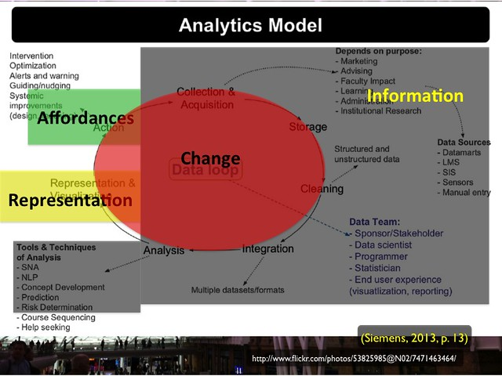

See also: [[blog-home | Home]]

With the vague idea of the [IRAC framework done](/blog2/2013/10/03/the-irac-framework-locating-the-performance-zone-for-learning-analytics/), it's time to take the next step, i.e. "to use the framework to analyse the extant learning analytics literature". The following is some initial thinking behind why, what and how we're thinking of doing.

The main question we have here is "how?". Trying to figure out the best tools and process to help do this analysis. I've come up with two possibilities below, any better ones?

Wondering if Evernote and similar applications might offer a possibility? Chance are that [NVIVO](http://anujacabraal.wordpress.com/2012/08/01/why-use-nvivo-for-your-literature-review/) might be an option, or some other for of [qualitiative analysis software](http://provalisresearch.com/products/qualitative-data-analysis-software/freeware/) might be the go.

## Why?

We have a feeling that the learning analytics literature is over focusing on certain areas and ignoring some others. We want to find out if this is the case. This is important because we argue that this possible problem is going to make it harder for learning analytics to be integrated into the learning and teaching process and actually improve learning and teaching.

## What?

The plan is to analyse the learning analytics literature - initially we'll probably focus on the proceedings from the 2013 LAK conference - for two main aims

1. Identify the relative frequency with which the literature talks about the four components of the IRAC framework, i.e. Information, Representation, Affordance and Change.
2. Identify what aspects of each of the four components are covered in the literature.

We think this is sensible because of the theory/principles we've [built the IRAC framework on](/blog2/2013/10/03/the-irac-framework-locating-the-performance-zone-for-learning-analytics/) and some suggestion from the learning analytics literature that the IRAC components apply to learning analytics.

The foundation of the following image is Siemens (2013) analytics model. Over the top of that model we've applied the IRAC framework components. Not only does this suggest that the IRAC components aren't entirely divorced from learning analytics, it also suggests the potential over emphasis that we're worried about. The image shows how the Information component - gathering the information and analysing it - takes up more than three-quarters of the model. While this is an essential component of learning analytics, our argument is that the Affordances and Change components need significantly greater consideration if learning analytics is to be integrated into learning and teaching processes.

## How?

The basic process is likely to be that each of the co-authors will read each article in the list of papers we select and highlight and annotate sections of the papers that discuss one or more of the four components of the IRAC framework.

For each paper, maintain some sort of database that tracks for each paper and each co-author

- The number of times each framework components is mentioned.
- The text associated with each component.
- Some potential labels for the attribute of each component that the text might represent.

Some possible solutions follow.

### Mendeley

1. Each of us import the list of papers into Mendeley.
2. Read the papers in Mendeley's reader.
3. Use the highlight and annotate tools to indicate appropriate quotes.
    
    The annotation could include the name of the IRAC component.
    
4. When finished a paper, export the annotations as a PDF.
5. Use the PDFs as input to the database.

PDFs are not great for this type of manipulation. Can see some manual work arising there.

### Diigo

1. Convert the list of papers to separate HTML files.
    
    Diigo won't let you annotate PDF files.
    
2. Upload them to a secure web server.
    
    So that only the authors can see them, protecting copyright etc.
    
3. Create a Diigo group for the authors.
4. Use Diigo to tag and annotate the HTML versions of the papers.
5. Extract the information via the Diigo RSS feeds.

Almost a nice solution, however, Diigo doesn't include the annotations in the RSS feed.

### References

Siemens, G. (2013). Learning Analytics: The Emergence of a Discipline. American Behavioral Scientist, 57(10), 1371–1379. doi:10.1177/0002764213498851