The following is a draft version of the presentation I'll be giving at ASCILITE tomorrow. Hopefully this will go close to fitting within the 12 minute time frame.

### Other resources

[The paper](/blog2/2013/10/03/the-irac-framework-locating-the-performance-zone-for-learning-analytics/) on which this presentation is based is available. As is @cfellows insightful and interesting [annotated response](https://www.dropbox.com/s/k9ierfqzuyitkhg/The%20IRAC%20Framework.pdf) (an accessory every #ascilite paper should come with).

The slides are also available on Slideshare.

!!! warning "Outdated content no longer available"

    Presentation from Slideshare no long available

## The presentation

Click on the images below to see a larger version.

[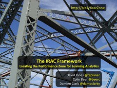](http://www.flickr.com/photos/david_jones/11186341106 "Slide01 by David Jones, on Flickr")

The aim of this talk is to give an introduction and rationale to the IRAC framework. In short, the rationale is that use of the IRAC framework – especially when its more complete – provides a useful lens to improve the likelihood that learning analytics interventions will actually be used of learners, teachers and others and subsequently be more likely to improve learning.

[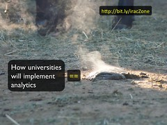](http://www.flickr.com/photos/david_jones/11186339784 "Slide02 by David Jones, on Flickr")

The motivation for this work is our observation that most of what universities are doing to implement learning analytics relates metaphorically to the steaming pile in this image. It’s also based on our beliefs and observations that the literature around learning analytics has some areas of over and under emphasis.

[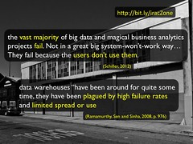](http://www.flickr.com/photos/david_jones/11186297625 "Slide03 by David Jones, on Flickr")

We’ve been especially annoyed/frustrated with the influx of business intelligence folk and vendors into the learning analytics area. In no small part because they haven’t really been able to get business intelligence working in the much simpler and older uses of business intelligence. If they couldn’t get it to work effectively there, they certainly won’t be able to get it to work in an area as complex and different as learning and teaching.

But I wouldn’t want to limit my criticism to these folk. I don’t think that many of the folk responsible for the transformational improvements to the quality of learning and teaching from the wildly successful application of technologies such as the LMS, lecture capture and copy detection within universities are likely to do significantly better with learning analytics.

And finally, I have some significant cognitive limitations. I need some help thinking about how to design learning analytics interventions.

[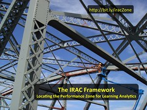](http://www.flickr.com/photos/david_jones/11186339974 "Slide04 by David Jones, on Flickr")

Which leads to the question of how we can help do this better? How do you do it better?

This is where the IRAC framework comes in. We think that there is value in having a framework that can be used to scaffold the analysis, evaluation and design of learning analytics interventions. In fact, we found ourselves wanting and needing such a framework. Especially one which didn’t necessarily suffer some of the limitations of existing frameworks.

The IRAC framework is our early attempt to achieve this.

Because it is still early days, we are still questioning much of the IRAC framework and hope to hear from you what your questions might be about it.

[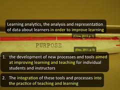](http://www.flickr.com/photos/david_jones/11186337214 "Slide06 by David Jones, on Flickr")

So, rather than define learning analytics. I’m going to start by defining what we think the purpose of learning analytics is.

For us learning analytics is yet another tool in our arsenal to help improve learning. There is no point in learning analytics unless it can help improve learning.

In order for this to happen, the learning analytics interventions we design have to be integrated into the practice of learning and teaching. If the students, teachers and others involved aren’t using these learning analytics interventions, then there is no way the interventions can help improve learning.

To be clear, like much of institutional e-learning we don’t think most institutional learning analytics interventions are destined to be used to an great level of quantity or quality.

[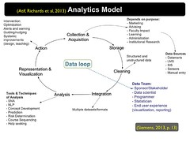](http://www.flickr.com/photos/david_jones/11186337036 "Slide07 by David Jones, on Flickr")

There are already a range of models looking at various aspects of learning analytics. In fact, the Atif paper at this conference adds a nifty little conceptual analysis of one part.

The model we’re going to use here is one by George Siemens from his journal article earlier in the year. Throughout the presentation as we introduce the IRAC framework we’ll show how it relates to the Siemens model. This will help make one of our points about the apparently over-emphasis on certain topics that perhaps aren’t as important as others.

[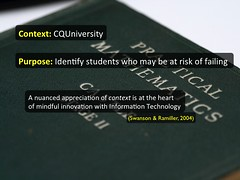](http://www.flickr.com/photos/david_jones/11186335284 "Slide08 by David Jones, on Flickr")

To illustrate the value of the IRAC framework we’re going to use it to analyse an example learning analytics intervention.

In applying the IRAC framework we currently think it’s always done by starting with thinking of it applied to a particular context – a nuanced appreciation of context is the main defence against adoption of faddish IT innovations – and with a particular purpose.

The context we’re going to consider is CQUniversity and the purpose is identifying at risk students. A purpose that is close to the consideration of most current institutions.

[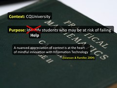](http://www.flickr.com/photos/david_jones/11186291815 "Slide09 by David Jones, on Flickr")

Of course, in keeping with my identified purpose of learning analytics, I think the purpose should be rephrased as helping at risk students. Identifying them is pointless if nothing is done to help them.

This is the SSI system. This particular view is what the course coordinator – the person in charge of a single course or unit – would see. It lists all of the students in their course ranked from lowest to highest on the basis of an “Estimation of Success” indicator.

I imagine your institution has or is developing something that will fulfill a similar purpose. The Atif paper also at this conference actually looked at three such tools ECU’s C4S, UNE’s AWE and OUA’s PASS. Everyone is doing it.

So how do we use IRAC to analysis and think about SSI?

[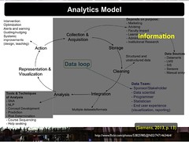](http://www.flickr.com/photos/david_jones/11186518813 "Slide11 by David Jones, on Flickr")

Let’s start at the beginning. IRAC is an acronym. The first part of the acronym is I for information. What is the information you are drawing on, how are you analysing it, and what considerations around ethics/privacy etc exist.

As you can see from this representation at least three-quarters of the Siemens’ model is focused on Information. No great surprise that we think that this is not helpful. It’s a necessary first step but it is by no means a sufficient step if your purpose for learning analytics is to improve learning.

In fact, given that most of the people involved in the origins of learning analytics come from a data mining, business intelligence, computer science background this emphasis on information is no great surprise. It’s a perfect example of Kaplan’s law of instrument. i.e. if all you have is a business intelligence system, then every task looks like…..

[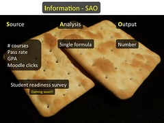](http://www.flickr.com/photos/david_jones/11186288555 "Slide13 by David Jones, on Flickr")

The IRAC framework is still very much under development and this is the first public run of the “Information – SAO” model. The idea is that when you’re pondering the Information component of a learning analytics intervention a useful way of thinking about this might be the combination of Source, Analysis and Output – SAO. Let’s demonstrate with SSI.

The source information from which the EOS is calculated includes demographic and enrolment information about the student (e.g. # of courses enrolled, # passed, their GPA etc) and their activity in the LMS. This is a fairly standard combination of basic data used in most similar systems.

The Analysis – how the raw information is transformed into the output – is by way of a formula. Essentially, points are “awarded” based on the value for each of the bits of information. i.e. if you’ve failed 100% of courses and are enrolled in 8 courses you are going to get a very large negative number in terms of points.

The output is a single number. Which eventually is represented (the second component of IRAC) as a traffic light.

[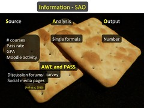](http://www.flickr.com/photos/david_jones/11186439703 "Slide14 by David Jones, on Flickr")

The idea here is that you can start to compare other systems. So drawing on the Atif paper from yesterday it’s possible to say that the AWE and PASS systems (similar to SSI) draw on discussion forum and social media pages as additional sources of information. Similar comparisons can be done with the other parts of the SAO model and of the IRAC framework.

[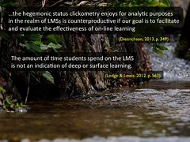](http://www.flickr.com/photos/david_jones/11186288565 "Slide15 by David Jones, on Flickr")

It’s possible to make other observations about SSI. The proxy it uses for learner behaviour/activity is clickstream data. How many times they’ve clicked on the course website. This focus on the clicksteam as the source of information about the learner is problematic for a number of reasons that have been explained in the literature.

[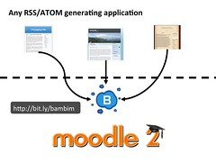](http://www.flickr.com/photos/david_jones/11186328264 "Slide16 by David Jones, on Flickr")

We are doing work that extends beyond the clickstream but due to the constraints of a 12 minute presentation, I’m not getting into details here. So very quickly. I’m the author of a Moodle module called BIM – find out more at the [URL on the slide](http://bit.ly/bambim). BIM aggregates, mirrors and manages students blogging. The data BIM focuses on is not clickstreams, but what students are writing. The students’ blog posts. It is through this that BIM allows moving away from simple behaviour – which is all you can get from the clickstream – into information that has some cognitive component.

[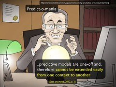](http://www.flickr.com/photos/david_jones/11186330826 "Slide17 by David Jones, on Flickr")

In Sunday’s keynote at the A-LASI workshop [Dragan Gasevic used the term “predict-o-mania”](http://www.slideshare.net/dgasevic/learning-analytics-are-about-learning) to label the practice of using the same predictive model for all situations with a complete ignorance of context. He also then showed a range of research to show just how silly such a practice is.

This is a significant weakness of SSI. The Estimation of Success is calculated using the same formula for all courses regardless of the context. The formula has been tested with past data at the institution and is somewhat generalisable, but this is still a significant limit.

This limitation has been identified by the Desire2Learn folk and their system – alongside other tools like the Moodle engagement block - provides support for more context-specific variety in the models being used.

[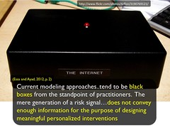](http://www.flickr.com/photos/david_jones/11186327546 "Slide18 by David Jones, on Flickr")

Another observation from the Desire2Learn folk that identifies a limitation with the EOS calculation. i.e. that it is a black box or in the words of Judy Kay from Sunday, it’s not scrutable. In fact, Colin reports that there have been academics using SSI that first asked to see the detail of the EOS analysis/formula so that they could understand what it is telling them.

[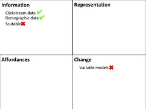](http://www.flickr.com/photos/david_jones/11186435173 "Slide19 by David Jones, on Flickr")

From this we can start populating the IRAC framework for SSI. The idea being is that if you did this for different learning analytics interventions you could start making some judgements about how well the intervention may suit your context and where you might like to make improvements if you’re the developer of such a system. You could also use this type of analysis to compare different learning analytics interventions and draw conclusions about the appropriateness for your context and purpose.

[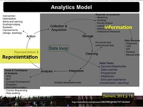](http://www.flickr.com/photos/david_jones/11186326176 "Slide20 by David Jones, on Flickr")

The R in IRAC is representation. You’ve gathered your information and analysed, now you have to represent it so that people can understand and act upon it. The trouble is that most institutional implementation of learning analytics often pays too little attention to representation. Though the research literature does have some people doing some interesting things.

This is perhaps the first adoption barrier for learning analytics. If the representation is hard to understand or hard to access (or inappropriate) it won’t be used.

[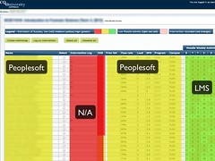](http://www.flickr.com/photos/david_jones/11186284625 "Slide21 by David Jones, on Flickr")

One of the advantages SSI provides is that the representation of the data does effectively integrate a range of information that was previously not available in one place. Too often the information silos are a result of different institutional systems (and their support and control processes) that never talk to each other. The value of bringing this information together in a form that is easily accessible to teaching staff is not to be under-estimated.

The representation in this case is tabular. It hasn’t made significant use of advanced visualisation techniques. This might be seen as a problem

[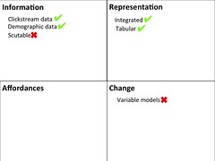](http://www.flickr.com/photos/david_jones/11186323426 "Slide22 by David Jones, on Flickr")

So that adds integrated and tabular to the IRAC framework for SSI. A tick here indicates presence in the tool not that the particular feature is good or bad.

A good time to mention my opinion that “dashboard suck”.

Dashboards are the other focus for institutional learning analytics projects and they suck. But they also illustrate the other limitation of much of the learning analytics work. It stops at representation.

i.e. a dashboard represents the finding. A dashboard doesn’t help you do anything. They tend to have little or no affordances for action.

[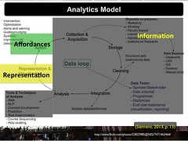](http://www.flickr.com/photos/david_jones/11186518463 "Slide24 by David Jones, on Flickr")

As mentioned above, we believe that learning analytics is only useful if it leads to changes in learning and teaching. It has to lead to action. The A in RAC is affordances. Or what sort of actions does the learning analytics application afford? What does it help people do in response to the the insight it represents?

[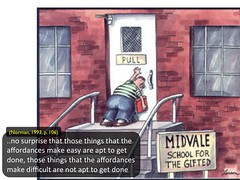](http://www.flickr.com/photos/david_jones/11186323014 "Slide25 by David Jones, on Flickr")

Just quickly the theoretical foundations of the IRAC framework arise from Don Norman’s work around cognitive artefacts. In particular, how the literature around Electronic Performance Support Systems (EPSS) has used these principles to develop the idea of the performance zone. This is talked about more in the paper, if you’re interested.

Affordances are not a new topic for the ASCILITE crowd. In short, the idea here is that a learning analytics tool should help or make easy certain actions on the part of the appropriate individuals. If action isn’t afforded, then it is likely that nothing will get done. If nothing gets done, then how does learning improve?

With recent literature highlighting the increasing workload associated with online/blended delivery in university learning and teaching the idea of systems that make the right tasks easier sounds good. Though it does raise a range of questions about what is right and many, many more.

So what affordances for action does SSI provide? One is the idea of interventions. There’s an intervention log that allows course coordinators to record details of various types of interventions and to show when those interventions occurred in relation to the students involved. It also provides a mail merge facility that makes it easier to provide apparently personal messages to groups of students.

[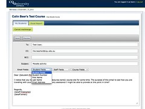](http://www.flickr.com/photos/david_jones/11186320446 "Slide27 by David Jones, on Flickr")

After selecting students from the SSI interface the mail merge allows the course coordinator to frame an email message. The message can include variables – picked from several provided lists - that will be replaced with student specific values when the email is sent. Experience shows that many students currently see these emails as personal.

[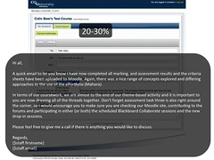](http://www.flickr.com/photos/david_jones/11186320286 "Slide28 by David Jones, on Flickr")

Affordances are not a given. What is afforded by an artifact depends on the people doing the perceiving. In addition, exaptation – the use of the artefact for unintended purposes – may play a role.

For example, experience has shown that up to 30% of the messages being sent through the SSI mail merge are not related to at risk students. Instead course coordinators are using to distribute information to students. Obviously, there is something about the affordance offered by the SSI email merge tool that is missing from the range of other available tools.

[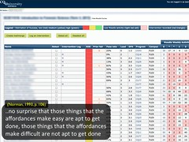](http://www.flickr.com/photos/david_jones/11186320784 "Slide29 by David Jones, on Flickr")

There are other less obvious affordances built into SSI. The most obvious is the default presentation of the information. The students that are the top of the table are those at risk. And we know that those at the bottom of the list are less likely to receive attention. SSI affords a focus on those students at risk. This may be a good thing, but it also means that those students in the middle or those who are doing very well are likely to receive less attention, if any at all.

[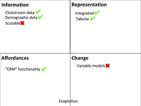](http://www.flickr.com/photos/david_jones/11186275965 "Slide30 by David Jones, on Flickr")

SSI’s email merge facility is arguably an example of an important type of affordance for these systems that I’ve labeled “CRM”. CRM as in Customer Relationship Management. It’s not a great name but links with the closest common functionality that many in higher education are currently familiar with. The idea of something that scaffolds appropriate communication.

The idea of affordances for action is somewhat under-represented in work around learning analytics, but it’s coming. There’s much work to be done identifying what affordances might be useful in a range of contexts and explore what might make sense within something called “CRM” functionality.

[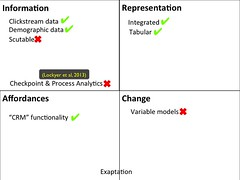](http://www.flickr.com/photos/david_jones/11186426953 "Slide31 by David Jones, on Flickr")

Arguably related to the idea of affordances is the proposal from Lockyer et al (2013) of checkpoint and process analytics. Analytics that are specific to specific learning designs. Obviously something that a system like SSI does not provide. But which when integrated into tools that support specific types of learning designs it opens up the possibility of specific affordances. I’m particularly, interested in the affordances learning analytics offers to a tool like BIM and its intent to encourage students to engage in reflection and also to construct a PLN.

[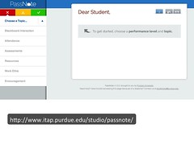](http://www.flickr.com/photos/david_jones/11186317614 "Slide32 by David Jones, on Flickr")

The PassNote app is another example of what “CRM” affordances might include. PassNote is from the folk at Purdue University who produce Course Signals. Course Signals is perhaps the most famous SSI-like learning analytics intervention – especially in recent times for perhaps not the best of reasons.

Course Signals uses a formula to identify students as being “red”, “yellow” or “green” based on their level of “at-riskness”. Pass Note is designed to help the teacher frame the messages to send to the student(s).

[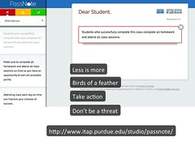](http://www.flickr.com/photos/david_jones/11186517893 "Slide33 by David Jones, on Flickr")

PassNote provides a range of potential messages that can be chosen on the basis of the students’ “colour” and the topic of the message. The content of these messages has apparently been designed on the basis of research findings.

This page shows the range of possible messages that a teacher might select for a student showing up as “read” if the topic of concern is “Attendance”. It appears at this stage, the teacher must copy and paste the suggested message content into whatever communication mechanism they are using. It would appear that a merger between this functionality and the email functionality of SSI might be useful.

The four labels added to this page are summaries of some of the principles underpinning the content of these messages and are taken from the Pass Note page.

[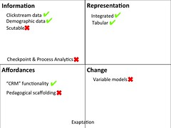](http://www.flickr.com/photos/david_jones/11186316624 "Slide34 by David Jones, on Flickr")

Perhaps stretching a bit, but PassNote is encroaching onto the idea of “pedagogic scaffolding”. i.e. the system – like Passnote – draws on a range of theories or research findings to improve and scaffold any action the person might take. SSI doesn’t do provide this affordance.

[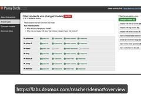](http://www.flickr.com/photos/david_jones/11186273985 "Slide35 by David Jones, on Flickr")

Just quickly as another example of “pedagogic advice”. This is a screen shot from a project led by Dan Meyer to help students use mathematics to model a situation and make predictions. All of the activity takes place within this environment and based on what the student does, the system offers some pedagogical scaffolding to the teacher in the form of questions they may wish to ask particular students.

[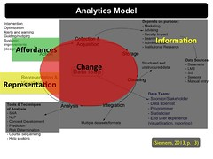](http://www.flickr.com/photos/david_jones/11186425673 "Slide36 by David Jones, on Flickr")

The C in IRAC stands for change and the loop in George’s model captures this nicely. However, in my experience, the people involved with university e-learning pay almost no attention whatsoever to the need to respond productively to on-going change – even with all the rhetoric within the university sector about the constancy of change. In fact, my ASCILITE paper from last year argues that the conceptions of product (e.g. the LMS as an enterprise system) and process (big up-front design) that is endemic to university e-learning is completely and utterly unsuitable for the nature of the task.

For us, it is fundamental that any learning analytics intervention have built into the ability to change and to change everything. The information it collects, the analysis methods it uses, how it represents the insight and the affordances it provides. It’s also important how quickly it can change, how fine-grained that change can be and who can change it.

[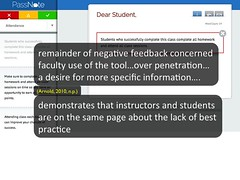](http://www.flickr.com/photos/david_jones/11186316114 "Slide37 by David Jones, on Flickr")

PassNote also offers an example of one of the main rationales for change.

The PassNote app wasn’t originally part of the Course Signals project. PassNote arose out of the experience with Course Signals. Especially the observation that the actions being taken by teaching staff in response to the Course Signals information was less than optimum.

The experience of using Course Signals generated new requirements that had to be addressed.

[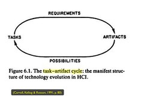](http://www.flickr.com/photos/david_jones/11186314936 "Slide38 by David Jones, on Flickr")

This is not a new trend. HCI research even has a name for this type of situation. It’s called the task-artifact cycle.

The task of identifying at risk students generated some requirements that led to the development of the Course Signals artifact. The use of Course Signals created some new possibilities and tasks. i.e. the need to communicate effective with the at risk students to ensure something helpful was done. This in turn generated a new set of requirements that led to the development of PassNote.

The important point here is that the cycle doesn’t end with PassNote.

What happens when 30%, 50% or 100% of the teaching staff at a University start using Course Signals and PassNote? What possibilities might this create? What new tasks? What new requirements?

[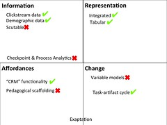](http://www.flickr.com/photos/david_jones/11186423433 "Slide39 by David Jones, on Flickr")

So the task-artifact cycle gets added under change.

One of the strengths of SSI is that the designers are very much aware of this need. SSI is not a traditional Information Systems project where the assumption is that the smart people running the project can predict what will be needed before the project is underway. The “identification of at risk students” initial purpose was mostly a label to get buy in from senior management because everyone else is doing it. The actual intent of the project is much more ambitious.

For this reason, the project is not implemented within a heavy-weight, enterprise level IT infrastructure because such infrastructures may be reliable, but they are also incredibly static. They can’t respond to change.

i.e. the SSI Project has rejected the conceptions of process and product that infect institutional e-learning.

[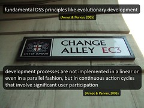](http://www.flickr.com/photos/david_jones/11186272095 "Slide40 by David Jones, on Flickr")

The need for change is further supported by 30 odd years of research into Decision Support Systems (DSS) – of which data warehouses are a part, and I assume that learning analytics has a close relationship. That research has established some fundamental design principles including evolutionary development.

Arguably the ability to change is more important than all of the other components of the IRAC framework. After all, how can you learn if you are unable to change?

[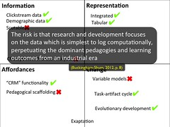](http://www.flickr.com/photos/david_jones/11186421443 "Slide41 by David Jones, on Flickr")

The need for change has also been identified in the learning analytics literature.

One of the big dangers of an inability to change brings to learning analytics is that much of what learning analytics is based on – e.g. the clickstream - data that is simple to log. Data that is coming from the systems and the pedagogical practices that we currently have. Pedagogical practices that are perhaps not all that they should be now or into the future. If we are not to be caught in the morass of historical and crappy processes then evolutionary development of learning analytics – and all of e-learning – is essential and for us is not present.

What I think will be most interesting about what Colin and Damien are doing at CQUniversity is that they have embraced – and for now are being allowed somewhat by the institution – to engage in evolutionary development. They technologies and approaches they are adopting allow them to evolve SSI, MAV and other systems they are working on much more quickly and more in step with the needs of the students and teachers at CQUniversity than other approaches I’ve seen. It’s this that is going to give them a much greater chance of getting their learning analytics interventions integrated into practice.

It’s not a question of how badly (or how well) you start, it’s a question of how quickly you can get better.

[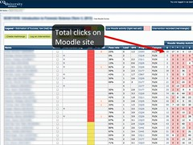](http://www.flickr.com/photos/david_jones/11186270815 "Slide42 by David Jones, on Flickr")

One illustration of this ability to change is a recent addition to SSI. This column in the SSI output summarises the total number clicks the student has made on the Moodle course site for this course for the entire semester. This total has always been there, but what hasn’t been there is the link. Each number is a link.

[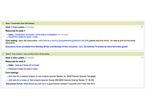](http://www.flickr.com/photos/david_jones/11186310206 "Slide43 by David Jones, on Flickr")

If you click on that link you get taken to the Moodle course site for the course. But not the standard Moodle course site like what you see here.

Instead, SSI uses another system under development at CQU (MAV – Moodle Activity Viewer) that modifies the entire Moodle course site to generate a heat map of clicks. In this case, the heat map MAV generates shows where a particular student has clicked and how many times. This particular students hasn’t clicked many times so you can’t actually see much difference in the heat map, i.e. there are no red areas indicating large numbers of clicks.

Now this still relies on the clickstream. i.e. behavioural and not cognitive data. However, it is a representation that can help the teacher make some more informed decisions than simply just having the number of clicks. An example of learning analytics helping by augmenting human decision making rather than replacing it. In this case, helping the teacher draw on their knowledge about the course structure and what is happening to leverage the limited value of the click stream.

[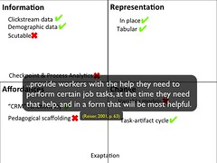](http://www.flickr.com/photos/david_jones/11186265835 "Slide45 by David Jones, on Flickr")

This adds the idea of "In place" representation. This also provides a link back to the Electronic Performance Support Systems literature that underpins IRAC and the idea that we should be providing help to folk at the point they need it most. Not separate to the learning environment, but embedded within it. Not a dashboard implemented in some data warehouse that means I need another application to access it, but embedded into the learning environment. By providing the information as part of the learning environment – rather than somewhere else – the cognitive load is reduced and the existing knowledge of the student/teacher can be more easily leveraged.

[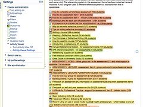](http://www.flickr.com/photos/david_jones/11186415753 "Slide46 by David Jones, on Flickr")

MAV was actually developed separately from SSI. It’s original purpose was to allow teaching staff to generate a heat map of the clicks for their course site for all students, groups of students or individual students. This particular representation is of MAV working for all students on a different course site. In this case, showing the number of students.

Since the work at CQUni recognises the importance of change, it was possible for them to quickly combine these two systems.

[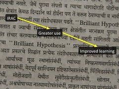](http://www.flickr.com/photos/david_jones/11186307276 "Slide47 by David Jones, on Flickr")

Time to finish – perhaps past time. Our hypothesis here is that the IRAC framework – especially in its completed state – offers insights that can help in the analysis, design and implementation of learning analytics interventions. We think that this analysis, done with a particular context and purpose in mind, will lead to learning analytics interventions that are more likely to be used and thus more likely to actually improve learning.

[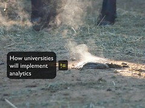](http://www.flickr.com/photos/david_jones/11186417163 "Slide48 by David Jones, on Flickr")

And in short, provide a way in which university learning analytics interventions a less like a stinking pile of …..

[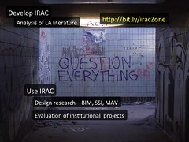](http://www.flickr.com/photos/david_jones/11186311444 "Slide49 by David Jones, on Flickr")

Still very early days. We’ve got lots of work still to do and lots of questions to ask. It would be great to start with your questions, questions?

Some of the short-term work we have planned includes to do an analysis of the learning analytics literature for two reasons.

1. Identify a range of topic lists, frameworks, models and examples that fit under each of the IRAC components, and
2. Explore what, if any, components of the IRAC framework are under-represented in the literature.

We’re also keen to undertake some design-based research using the IRAC framework to design modifications to a range of learning analytics interventions.

Of course, this doesn’t capture the full scope of the potential questions of interest in all of the above.

[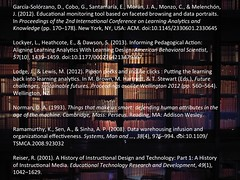](http://www.flickr.com/photos/david_jones/11186304456 "Slide51 by David Jones, on Flickr")

### Image attribution

Slide 5, 49: "Question Everything / Nullius in verba / Take nobody's word for it" by Duncan Hull available at http://flickr.com/photos/dullhunk/202872717 under Attribution License http://creativecommons.org/licenses/by/2.0/

Slide 53: "University of Michigan Library Card Catalog" by David Fulmer available at http://flickr.com/photos/dfulmer/4350629792 under Attribution License http://creativecommons.org/licenses/by/2.0/

Slide 3: "Warehouse" by Michele Ursino available at http://flickr.com/photos/micurs/6118627854 under Attribution-ShareAlike License http://creativecommons.org/licenses/by-sa/2.0/

Slide 15: "Stream" by coniferconifer available at http://flickr.com/photos/coniferconifer/9535872266 under Attribution License http://creativecommons.org/licenses/by/2.0/

Slide 50, 51, 52: "The British Library" by Steve Cadman available at http://flickr.com/photos/stevecadman/486263551 under Attribution-ShareAlike License http://creativecommons.org/licenses/by-sa/2.0/

Slide 17: "Lawyer Crystal Ball" by CALI - Center for Computer-Assisted Legal Instruction available at http://flickr.com/photos/cali.org/6150105185 under Attribution-NonCommercial-ShareAlike License http://creativecommons.org/licenses/by-nc-sa/2.0/

Slide 23: "Dashboard" by Marko Vallius available at http://flickr.com/photos/markvall/3892112410 under Attribution-NonCommercial-ShareAlike License http://creativecommons.org/licenses/by-nc-sa/2.0/

Slide 4: "framework" by kaz k available at http://flickr.com/photos/kazk/198640938 under Attribution License http://creativecommons.org/licenses/by/2.0/

Slide 47: "25.365" by romana klee available at http://flickr.com/photos/romanaklee/5391995939 under Attribution-ShareAlike License http://creativecommons.org/licenses/by-sa/2.0/

Slide 18: "The Internet" by Martin Deutsch available at http://flickr.com/photos/MartinDeutsch/3190769121 under Attribution-NonCommercial-NoDerivs License http://creativecommons.org/licenses/by-nc-nd/2.0/

Slide 8, 9: "day 140" by mjtmail (tiggy) available at http://flickr.com/photos/mjtmail(tiggy)/2518317362 under Attribution License http://creativecommons.org/licenses/by/2.0/

Slide 6: "Purpose" by Seth Sawyers available at http://flickr.com/photos/sidewalkflying/3534131757 under Attribution License http://creativecommons.org/licenses/by/2.0/

Slide 12: "Making Omelettes" by PhotoGraham available at http://flickr.com/photos/PhotoGraham/260939952 under Attribution-NonCommercial-ShareAlike License http://creativecommons.org/licenses/by-nc-sa/2.0/

Slide 2, 48: "Smoking pile of sh\*t" by David Jones available at http://flickr.com/photos/DavidTJones/3626888438 under Attribution-NonCommercial-ShareAlike License http://creativecommons.org/licenses/by-nc-sa/2.0/

Slide 40: "Change Allley sign" by Matt Brown available at http://flickr.com/photos/MattFromLondon/3163571645 under Attribution License http://creativecommons.org/licenses/by/2.0/